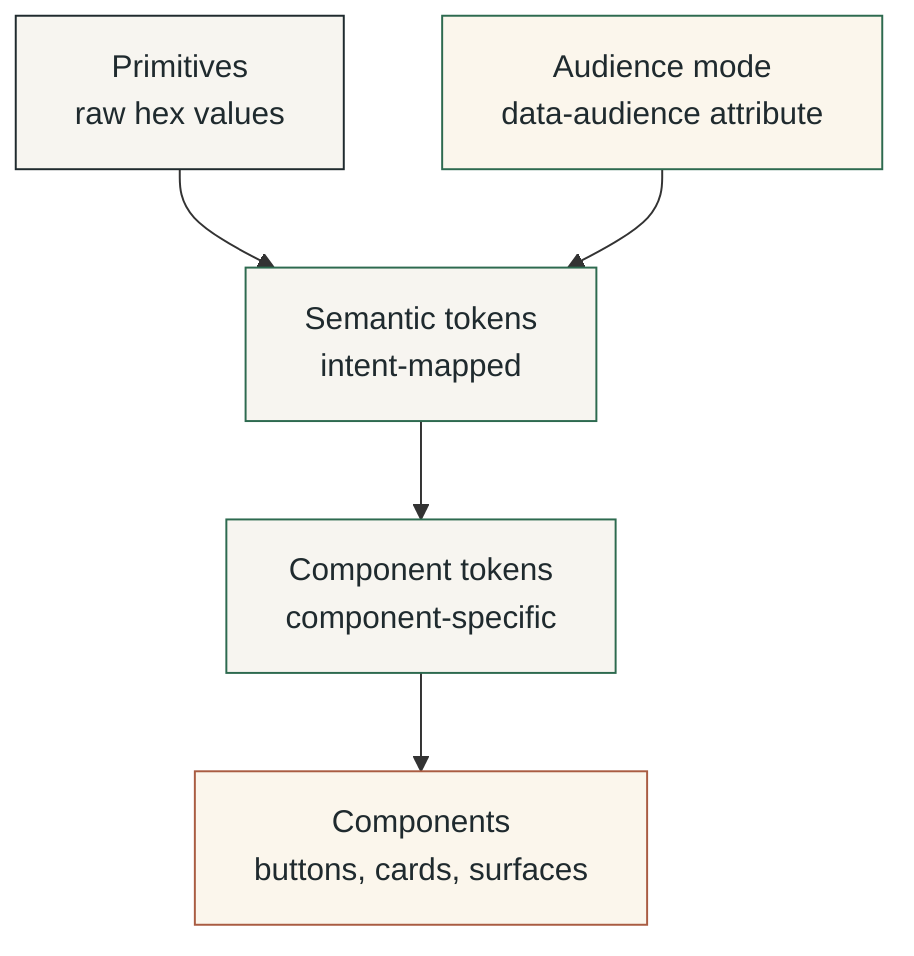
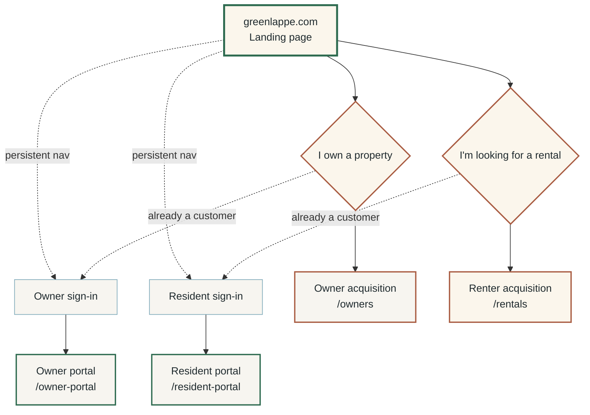
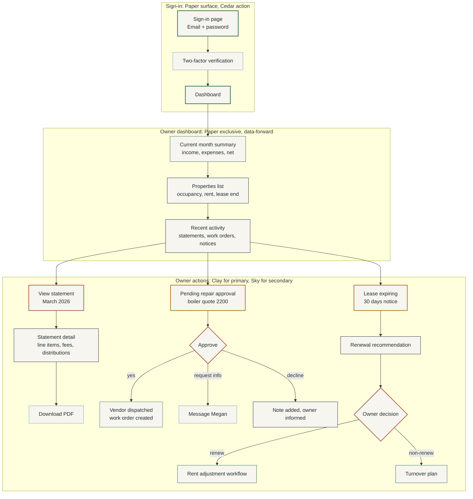
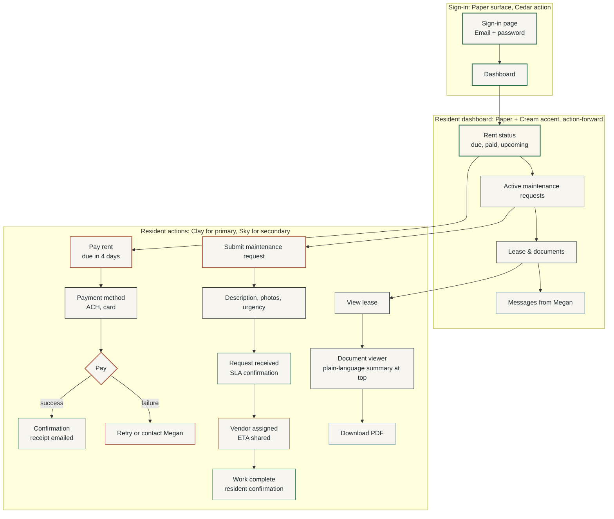

# green-lappe-style-guide

Canonical brand and design system documentation for Green Lappe Properties. Covers tokens, palette, typography, audience modes, routing architecture, component grammar, and accessibility floors. This document supersedes prior color exploration files (`alder-palette-*`, `nordic-pnw-palette`, `conversion-palette`).

Companion file: [[green-lappe-tokens-css|green-lappe-tokens.css]] (machine-readable export, regenerated from this document).

## 1. Strategic Positioning

### 1.1 What Green Lappe is

A property management company for small landlords (1-to-20-door portfolios) in King and Snohomish counties, Washington. Megan Green, designated broker, is the named operator. 9% of collected rent. 60% of one month for leasing fee, billed on placement only. No setup fees, no maintenance markup.

### 1.2 What the Brand Has to Do

Convert two skeptical audiences into customers, then serve them reliably:

1. Small landlords who have been burned by national chains, REIT-style property managers, or unreliable solo operators
2. Renters scanning fifty Zillow listings in an hour, looking for a place that doesn't feel like a Greystar apartment complex or a Craigslist scam

Once converted, both audiences need operational surfaces that feel reliable and frictionless, not seductive.

### 1.3 What the Brand is Not

Not corporate. Not "luxury." Not a tech startup. Not a national franchise. Not pretending to be bigger than it is. Not signaling institutional-asset-operator gravitas.

### 1.4 Competitive Whitespace

| Archetype | Visual signature | Weakness |
|---|---|---|
| Legacy PM (Bell-Anderson, Cornell, Brink) | Navy, serif, corporate | Cold, outdated, interchangeable |
| Apartment REITs | Grayscale, sterile | Institutional, generic |
| Boutique lifestyle PM | Sage, beige, sans-serif | Unserious operationally |
| SaaS proptech | Gradient, geometric, "AI-powered" | Impersonal, scale-signaling |
| **Green Lappe** | **Cedar + Cream/Paper + Clay, named operator** | **High-trust regional operator with modern systems** |

## 2. Voice and Terminology

### 2.1 Voice Principles

| Principle | Means | Does not mean |
|---|---|---|
| Direct | Short sentences, plain words, answer first | Blunt or cold |
| Specific | Numbers, names, dates, addresses | Jargon or legalese |
| Accountable | First person singular when Megan speaks | Self-deprecating |
| Local | Says Bothell, not "the Puget Sound region" | Folksy or twee |
| Calm | No manufactured urgency | Slow or evasive |

### 2.2 Terminology Discipline

| State | Label | Why |
|---|---|---|
| Pre-customer renter | renter | Shopping/discovery state |
| Authenticated tenant | resident | Implies relationship and responsibility |
| Pre-customer owner | owner | Acquisition state |
| Authenticated owner | owner | Same word; relationship is implicit in authentication |

Routing labels:

- "Looking for a rental?" (renter acquisition)
- "Resident sign-in" (authenticated tenant)
- "I own a property" (owner acquisition)
- "Owner sign-in" (authenticated owner)

Never: "current renter portal," "tenant login," "client portal."

### 2.3 Forbidden Words

`solutions`, `passionate`, `dedicated`, `trusted`, `boutique`, `concierge`, `white-glove`, `journey`, `stakeholder`, `leverage`, `synergy`, `bespoke`, `curated`, `unlock`, `empower`, `family of brands`, `world-class`, `value-add`, `unbeatable`.

## 3. Color System

### 3.1 Token Architecture

Three layers. Production CSS consumes the bottom two. Brand-guide prose references the audience mode characteristics (action density, imagery style, copy emphasis) as written guidance, not as CSS tokens.



### 3.2 Primitive Palette

Seven primitives. No additions without explicit governance review.

| Name | Hex | Role | Material reference |
|---|---|---|---|
| Cedar | `#2D6A4F` | Primary brand | Pacific Northwest evergreen, painted shutter green |
| Ink | `#1F2A2E` | Text, deep contrast | Slate, near-black with cool undertone |
| Cream | `#FBF6EC` | Marketing surface | Printed brochure paper, warm off-white |
| Paper | `#F7F5F0` | Product surface | Bank statement paper, cooler off-white |
| Stone | `#D4D1CA` | Neutral mid-tone | Dividers, borders, decorative shapes |
| Clay | `#A95C42` | Action accent | Oxidized terracotta, weathered cedar stain |
| Sky | `#7BA7B8` | Secondary accent | Hydrangea blue-grey, calm informational |

### 3.3 Derived Neutrals

For UI hierarchy on Cream and Paper surfaces.

| Token | Hex | On Cream/Paper ratio | Use |
|---|---|---|---|
| `ink-80` | `#3D4A4E` | 9.6:1 | Body emphasis, secondary headings |
| `ink-60` | `#5C6A6E` | 5.7:1 | Metadata, captions (passes AA body) |
| `ink-40` | `#8A9498` | 3.0:1 | Disabled text (large only), decorative |
| `ink-20` | `#C2C8CA` | 1.4:1 | Dividers, borders (non-text) |

### 3.4 System Colors

State communication uses dedicated tokens, never brand colors. Brand colors are for brand expression; state colors are for information.

| Token | Hex | On Cream ratio | Use |
|---|---|---|---|
| Success | `#3E7A55` | 5.0:1 | Confirmation, paid, completed |
| Warning | `#A8741A` | 4.6:1 | Caution, expiring, pending review |
| Error | `#9C2D1F` | 6.2:1 | Failed, overdue, requires action |
| Info | `#3A6480` | 5.7:1 | Neutral information, hints |

### 3.5 Contrast Matrix, WCAG 2.1

Text pairings on canonical surfaces.

| Foreground | Background | Ratio | Body AA | Body AAA | Large AA |
|---|---|---|---|---|---|
| Ink | Cream | 13.8:1 | pass | pass | pass |
| Ink | Paper | 13.4:1 | pass | pass | pass |
| Cedar | Cream | 5.4:1 | pass | fail | pass |
| Cedar | Paper | 5.3:1 | pass | fail | pass |
| Cream | Cedar | 5.4:1 | pass | fail | pass |
| Cream | Ink | 13.8:1 | pass | pass | pass |
| Cream | Clay | 4.5:1 | pass | fail | pass |
| Clay | Cream | 4.5:1 | pass | fail | pass |
| Clay | Ink | 4.6:1 | pass | fail | pass |
| Sky | Ink | 5.2:1 | pass | fail | pass |
| Sky | Cream | 2.6:1 | fail | fail | fail |

Clay at the revised `#A95C42` value clears AA body text on Cream at 4.5:1. The earlier size-constraint rule (16px+ semibold) is removed; Clay is now natively accessible at any text size. This is the token-level fix recommended in prior audits.

### 3.6 Usage Ratios by Audience Mode

See §5 for full audience-mode treatment. Color ratios per mode:

| Color | Marketing-neutral | Owner acquisition | Owner portal | Renter acquisition | Resident portal |
|---|---|---|---|---|---|
| Cream | 45-55% | 15-20% | 0% | 50-60% | 5-10% |
| Paper | 15-20% | 50-60% | 70-80% | 10-15% | 60-70% |
| Cedar | 15-20% | 10-15% | 5-10% | 10-15% | 5-10% |
| Ink | 10-15% | 15-20% | 15-20% | 8-12% | 15-20% |
| Stone | 3-5% | 3-5% | 5-8% | 2-4% | 5-8% |
| Clay | 3-5% | 3-5% | 2-4% | 4-6% | 2-4% |
| Sky | 1-2% | 1-2% | 2-3% | 1-2% | 2-3% |

## 4. CSS Tokens

```css
:root {
  /* ---------- 1. primitives ---------- */
  --color-cedar:  #2D6A4F;
  --color-ink:    #1F2A2E;
  --color-cream:  #FBF6EC;
  --color-paper:  #F7F5F0;
  --color-stone:  #D4D1CA;
  --color-clay:   #A95C42;
  --color-sky:    #7BA7B8;

  /* derived neutrals */
  --color-ink-80: #3D4A4E;
  --color-ink-60: #5C6A6E;
  --color-ink-40: #8A9498;
  --color-ink-20: #C2C8CA;

  /* system colors */
  --color-success: #3E7A55;
  --color-warning: #A8741A;
  --color-error:   #9C2D1F;
  --color-info:    #3A6480;

  /* ---------- 2. semantic tokens (mode-agnostic) ---------- */
  --color-brand:       var(--color-cedar);
  --color-brand-deep:  var(--color-ink);
  --color-action:      var(--color-clay);
  --color-accent-cool: var(--color-sky);
  --color-neutral:     var(--color-stone);
  --color-text:        var(--color-ink);
  --color-text-muted:  var(--color-ink-60);
  --color-divider:     var(--color-ink-20);

  /* focus ring */
  --focus-ring-color:  var(--color-cedar);
  --focus-ring-width:  2px;
  --focus-ring-offset: 2px;

  /* ---------- 3. typography ---------- */
  --font-display: "Fraunces", Georgia, "Times New Roman", serif;
  --font-body:    "Inter", -apple-system, BlinkMacSystemFont, "Segoe UI", system-ui, sans-serif;

  --text-xs:      0.75rem;
  --text-sm:      0.875rem;
  --text-base:    1rem;
  --text-md:      1.25rem;
  --text-lg:      1.5rem;
  --text-xl:      1.875rem;
  --text-2xl:     2.5rem;
  --text-3xl:     3.5rem;
  --text-display: 5rem;

  --weight-regular:  400;
  --weight-medium:   500;
  --weight-semibold: 600;
  --weight-bold:     700;

  --tracking-tight:  -0.02em;
  --tracking-normal: 0;
  --tracking-wide:   0.08em;

  --leading-tight:  1.15;
  --leading-snug:   1.35;
  --leading-normal: 1.55;

  /* ---------- 4. spacing, radius, elevation ---------- */
  --space-1:  4px;
  --space-2:  8px;
  --space-3:  12px;
  --space-4:  16px;
  --space-6:  24px;
  --space-8:  32px;
  --space-12: 48px;
  --space-16: 64px;
  --space-24: 96px;

  --radius-sm:   4px;
  --radius-md:   8px;
  --radius-lg:   16px;
  --radius-pill: 999px;

  --shadow-1: 0 1px 2px  rgba(31, 42, 46, 0.06);
  --shadow-2: 0 4px 12px rgba(31, 42, 46, 0.08);
  --shadow-3: 0 12px 32px rgba(31, 42, 46, 0.12);
}

/* ---------- audience mode overrides ---------- */

[data-audience="neutral-acquisition"] {
  --surface-primary:   var(--color-cream);
  --surface-secondary: var(--color-paper);
}

[data-audience="owner-acquisition"] {
  --surface-primary:   var(--color-paper);
  --surface-secondary: var(--color-cream);
}

[data-audience="owner-product"] {
  --surface-primary:   var(--color-paper);
  --surface-secondary: var(--color-paper);
}

[data-audience="renter-acquisition"] {
  --surface-primary:   var(--color-cream);
  --surface-secondary: var(--color-paper);
}

[data-audience="renter-product"] {
  --surface-primary:   var(--color-paper);
  --surface-secondary: var(--color-cream);
}

/* ---------- base ---------- */

body {
  background: var(--surface-primary);
  color: var(--color-text);
  font-family: var(--font-body);
  font-size: var(--text-base);
  line-height: var(--leading-normal);
}

h1, h2, h3, h4 {
  font-family: var(--font-display);
  color: var(--color-brand-deep);
  line-height: var(--leading-snug);
  letter-spacing: var(--tracking-tight);
  font-weight: var(--weight-semibold);
}

a {
  color: var(--color-brand);
  text-decoration: underline;
  text-underline-offset: 0.15em;
}

:focus-visible {
  outline: var(--focus-ring-width) solid var(--focus-ring-color);
  outline-offset: var(--focus-ring-offset);
}
```

Note: `--copy-emphasis`, `--imagery-style`, and `--action-density` are documented in §5 as brand-guide characteristics, not as CSS tokens. They guide designers and content authors; they do not appear in production stylesheets.

## 5. Audience Modes

Four modes, defined by two axes: audience (owner vs renter) and relationship state (acquisition vs operational). One additional mode for the disambiguation landing page.

### 5.1 The Two-axis Model

| | Pre-customer (acquisition) | Customer (operational) |
|---|---|---|
| Owner | Owner acquisition | Owner portal |
| Renter | Renter acquisition | Resident portal |

The horizontal axis determines content focus and emotional emphasis. The vertical axis determines surface mood and action density.

### 5.2 Mode Characteristics

| Mode | Surface | Imagery | Copy emphasis | Density | Tone |
|---|---|---|---|---|---|
| Neutral acquisition (landing) | Cream | Operator portrait | Brand statement | Low | Welcoming, direct |
| Owner acquisition | Paper | Operational (statement, kitchen-table meeting) | Numbers-forward | High | Procedural confidence |
| Owner product (portal) | Paper exclusive | None | Data-forward | High | Frictionless operation |
| Renter acquisition | Cream | Property photography, full-bleed | Property-forward | Low | Aspirational, direct |
| Resident product (portal) | Paper + Cream accent | None | Action-forward | Medium | Reliable, human |

### 5.3 Mode-by-mode Treatment

#### Neutral Acquisition (`greenlappe.com` landing)

`data-audience="neutral-acquisition"`

The only page that has to serve both audiences. Two equal-weight Clay CTAs route to owner or renter acquisition. Sign-in links live quietly in the top-right of global nav.

- Surface: Cream-led
- Hero: One sentence positioning Green Lappe + Megan Green, designated broker
- Two CTAs at equal weight: "I own a property" / "I'm looking for a rental"
- Sign-in links: "Owner sign-in" / "Resident sign-in" (small, top-right)
- No photography on landing; or one operator portrait at modest size

#### Owner Acquisition (`/owners` and subpages)

`data-audience="owner-acquisition"`

- Surface: Paper-led, Cream accent on hero only
- Hero imagery: Megan at kitchen table with an owner; or sample statement; or managed property exterior in PNW weather
- Headlines: "9% of collected rent. 14-day average vacancy. 1 to 20 doors."
- Body density: High. Pricing breakdowns, fee comparisons, sample statements, FAQ, compliance language
- Primary CTA: Clay. "Schedule a property review" or "Request a proposal"
- Secondary CTA: Cedar outlined. "See a sample monthly statement"
- Evidence surfaces: anonymized P&Ls, vacancy timelines, maintenance workflow diagrams, inspection checklists

#### Owner Portal (`/owner-portal` and Authenticated routes)

`data-audience="owner-product"`

- Surface: Paper exclusively
- No marketing imagery
- Headlines: "March statement. $4,200 net. Click for detail."
- Body density: High. Tables, line items, statements, work orders, lease documents
- Primary CTA: Clay. "Approve repair" or "View statement"
- Secondary CTA: Sky link. "Download PDF"

#### Renter Acquisition (`/rentals` and subpages)

`data-audience="renter-acquisition"`

- Surface: Cream-led. Warmest mood in the system.
- Hero imagery: Property photography, full-bleed. Real listings, real PNW homes.
- Headlines: "2BR in Ballard. $2,400. Available June 15."
- Body density: Low. Photo-driven, one property per card, mobile-first
- Primary CTA: Clay. "Inquire" or "Schedule a tour"
- Secondary CTA: Cedar outlined. "Save listing" or "View map"

#### Resident Portal (`/resident-portal` and Authenticated routes)

`data-audience="renter-product"`

- Surface: Paper, with one Cream accent panel for community/lease information
- No marketing imagery on dashboard
- Headlines: "Rent due in 4 days." "Maintenance request: in progress."
- Body density: Medium
- Primary CTA: Clay. "Pay rent" or "Submit maintenance request"
- Secondary CTA: Sky link. "View lease" or "Message Megan"

## 6. Routing Architecture

### 6.1 Top-level Routing Flow

Shared landing page disambiguates to four destinations via two top-level paths and a sub-decision per path.



Node colors apply the surface palette of the destination mode. Cream-filled nodes are renter-acquisition or neutral-landing surfaces. Paper-filled nodes are owner-acquisition or operational portal surfaces. Border colors signal Clay (action surfaces) versus Sky (sign-in affordances) versus Cedar (operational portals).

### 6.2 Owner Acquisition Path

From landing through proposal request and onboarding.

```mermaid
flowchart TD
    subgraph LANDING ["Neutral landing: Cream surface, Clay CTAs"]
        A1[greenlappe.com] --> A2[I own a property]
    end

    subgraph OWNER_ACQ ["Owner acquisition: Paper surface, numbers-forward, evidence-rich"]
        B1[/owners<br/>Hero: 9% flat fee, named broker] --> B2[Pricing detail<br/>Sample statement<br/>Compliance fluency]
        B2 --> B3[FAQ<br/>HB 1217, Just Cause<br/>180-day notice]
        B3 --> B4[Evidence surfaces<br/>P&L examples<br/>Maintenance workflows<br/>Inspection checklists]
        B4 --> B5[CTA: Schedule a property review]
        B5 --> B6[CTA: Request a proposal]
    end

    subgraph CONVERSION ["Conversion handoff: Clay action, Cedar confirmation"]
        C1[Form: property details<br/>doors, address, current rent] --> C2[Email confirmation<br/>Megan personally responds]
        C2 --> C3[Property review call<br/>scheduled]
        C3 --> C4[Proposal delivered<br/>9% management fee<br/>60% leasing fee<br/>contract attached]
        C4 --> C5{Owner decides}
        C5 -->|yes| C6[Onboarding<br/>handoff to owner portal]
        C5 -->|no| C7[Quarterly check-in<br/>no pressure follow-up]
    end

    A2 --> B1
    B5 --> C1
    B6 --> C1
    C6 -.->|becomes customer| D1[Owner portal<br/>/owner-portal]

    style A1 fill:#FBF6EC,stroke:#2D6A4F,stroke-width:3px,color:#1F2A2E
    style A2 fill:#FBF6EC,stroke:#A95C42,stroke-width:2px,color:#1F2A2E

    style B1 fill:#F7F5F0,stroke:#2D6A4F,stroke-width:2px,color:#1F2A2E
    style B2 fill:#F7F5F0,stroke:#1F2A2E,color:#1F2A2E
    style B3 fill:#F7F5F0,stroke:#1F2A2E,color:#1F2A2E
    style B4 fill:#F7F5F0,stroke:#7BA7B8,stroke-width:2px,color:#1F2A2E
    style B5 fill:#F7F5F0,stroke:#A95C42,stroke-width:2px,color:#1F2A2E
    style B6 fill:#F7F5F0,stroke:#A95C42,stroke-width:2px,color:#1F2A2E

    style C1 fill:#F7F5F0,stroke:#A95C42,stroke-width:2px,color:#1F2A2E
    style C2 fill:#F7F5F0,stroke:#2D6A4F,color:#1F2A2E
    style C3 fill:#F7F5F0,stroke:#2D6A4F,color:#1F2A2E
    style C4 fill:#F7F5F0,stroke:#2D6A4F,stroke-width:2px,color:#1F2A2E
    style C5 fill:#F7F5F0,stroke:#A8741A,color:#1F2A2E
    style C6 fill:#F7F5F0,stroke:#3E7A55,stroke-width:2px,color:#1F2A2E
    style C7 fill:#F7F5F0,stroke:#7BA7B8,color:#1F2A2E

    style D1 fill:#F7F5F0,stroke:#2D6A4F,stroke-width:3px,color:#1F2A2E
```

### 6.3 Renter Acquisition Path

From landing through listing browse, inquiry, and tour.

```mermaid
flowchart TD
    subgraph LANDING2 ["Neutral landing: Cream surface, Clay CTAs"]
        A1[greenlappe.com] --> A2[I'm looking for a rental]
    end

    subgraph RENTER_ACQ ["Renter acquisition: Cream surface, property-forward, photo-driven"]
        B1[/rentals<br/>Listings grid<br/>Property photography] --> B2[Filter: bedrooms, neighborhood, price]
        B2 --> B3[Listing detail<br/>Full-bleed photos<br/>Neighborhood context]
        B3 --> B4[Property facts<br/>rent, deposit, available date<br/>lease terms, pet policy]
        B4 --> B5[CTA: Inquire]
        B4 --> B6[CTA: Schedule a tour]
        B4 -.->|secondary| B7[Save listing<br/>View on map]
    end

    subgraph CONVERSION2 ["Inquiry handoff: Clay action, named operator response"]
        C1[Form: name, contact, move date<br/>employment, household size] --> C2[Auto-confirmation<br/>Megan responds within 24h]
        C2 --> C3[Tour scheduled<br/>or application invited]
        C3 --> C4[Application submitted<br/>screening process]
        C4 --> C5{Approved}
        C5 -->|yes| C6[Lease signed<br/>handoff to resident portal]
        C5 -->|no| C7[Declined<br/>plain-language reason<br/>compliance with fair housing]
    end

    A2 --> B1
    B5 --> C1
    B6 --> C1
    C6 -.->|becomes resident| D1[Resident portal<br/>/resident-portal]

    style A1 fill:#FBF6EC,stroke:#2D6A4F,stroke-width:3px,color:#1F2A2E
    style A2 fill:#FBF6EC,stroke:#A95C42,stroke-width:2px,color:#1F2A2E

    style B1 fill:#FBF6EC,stroke:#2D6A4F,stroke-width:2px,color:#1F2A2E
    style B2 fill:#FBF6EC,stroke:#1F2A2E,color:#1F2A2E
    style B3 fill:#FBF6EC,stroke:#2D6A4F,color:#1F2A2E
    style B4 fill:#FBF6EC,stroke:#1F2A2E,color:#1F2A2E
    style B5 fill:#FBF6EC,stroke:#A95C42,stroke-width:2px,color:#1F2A2E
    style B6 fill:#FBF6EC,stroke:#A95C42,stroke-width:2px,color:#1F2A2E
    style B7 fill:#FBF6EC,stroke:#7BA7B8,color:#1F2A2E

    style C1 fill:#FBF6EC,stroke:#A95C42,stroke-width:2px,color:#1F2A2E
    style C2 fill:#FBF6EC,stroke:#2D6A4F,color:#1F2A2E
    style C3 fill:#FBF6EC,stroke:#2D6A4F,color:#1F2A2E
    style C4 fill:#FBF6EC,stroke:#2D6A4F,stroke-width:2px,color:#1F2A2E
    style C5 fill:#FBF6EC,stroke:#A8741A,color:#1F2A2E
    style C6 fill:#FBF6EC,stroke:#3E7A55,stroke-width:2px,color:#1F2A2E
    style C7 fill:#FBF6EC,stroke:#9C2D1F,color:#1F2A2E

    style D1 fill:#F7F5F0,stroke:#2D6A4F,stroke-width:3px,color:#1F2A2E
```

### 6.4 Owner Portal Path

Authenticated owner operational flow.



### 6.5 Resident Portal Path

Authenticated tenant operational flow.



### 6.6 Reading the Diagrams

Color discipline in every diagram:

| Element | Color signal | Meaning |
|---|---|---|
| Cream node fill | `#FBF6EC` | Marketing/acquisition surface; warmer mood |
| Paper node fill | `#F7F5F0` | Operational/product surface; cooler mood |
| Cedar border | `#2D6A4F` | Brand/identity element; trust signal |
| Clay border (thick) | `#A95C42` | Conversion or primary action node |
| Sky border | `#7BA7B8` | Secondary affordance, sign-in, informational |
| Success border | `#3E7A55` | Confirmed/approved state |
| Warning border | `#A8741A` | Pending/decision required |
| Error border | `#9C2D1F` | Failed/declined state |
| Thick border (3px) | weighted edge | Top-level entry or terminal node |

## 7. Typography

### 7.1 Type Families

| Role | Typeface | Fallback |
|---|---|---|
| Display (headlines, wordmark) | Fraunces | Georgia, "Times New Roman", serif |
| Body, UI, financial figures | Inter (tabular figures enabled) | system-ui, sans-serif |

Fraunces signals "named human writing this." Inter handles financial tables with tabular figures (`font-feature-settings: "tnum"`).

### 7.2 Type Scale

Base 16px, ratio 1.250.

| Token | Size | Use |
|---|---|---|
| `--text-xs` | 0.75rem | Captions, legal |
| `--text-sm` | 0.875rem | Metadata, table cells |
| `--text-base` | 1rem | Body |
| `--text-md` | 1.25rem | Lead paragraphs |
| `--text-lg` | 1.5rem | H4, card titles |
| `--text-xl` | 1.875rem | H3 |
| `--text-2xl` | 2.5rem | H2 |
| `--text-3xl` | 3.5rem | H1 |
| `--text-display` | 5rem | Hero, wordmark |

### 7.3 Weight, Tracking, Leading

| Token | Value |
|---|---|
| `--weight-regular` | 400 |
| `--weight-medium` | 500 |
| `--weight-semibold` | 600 |
| `--weight-bold` | 700 |
| `--tracking-tight` | -0.02em (display) |
| `--tracking-normal` | 0 (body) |
| `--tracking-wide` | 0.08em (small caps labels) |
| `--leading-tight` | 1.15 (display) |
| `--leading-snug` | 1.35 (headings) |
| `--leading-normal` | 1.55 (body) |

### 7.4 Typographic Signatures

Two recurring patterns mark a Green Lappe artifact at a glance:

- **Tracked-out label above heading.** Small, uppercased, `--tracking-wide`, in `--color-text-muted`. Categorizes the heading below. Example: `MAINTENANCE` over `Boiler replacement, 18th Ave NE`.
- **Signature line.** Italicized first name in display face, set 1.5x scale below body, in `--color-brand`. Closes letters, proposals, notices. `Megan` in Fraunces Italic.

## 8. Spacing, Layout, Elevation

### 8.1 Spacing Scale

4px base. All spacing tokens are multiples.

| Token | Value |
|---|---|
| `--space-1` | 4px |
| `--space-2` | 8px |
| `--space-3` | 12px |
| `--space-4` | 16px |
| `--space-6` | 24px |
| `--space-8` | 32px |
| `--space-12` | 48px |
| `--space-16` | 64px |
| `--space-24` | 96px |

### 8.2 Radius

| Token | Value | Use |
|---|---|---|
| `--radius-sm` | 4px | Inputs, tags |
| `--radius-md` | 8px | Buttons, cards |
| `--radius-lg` | 16px | Hero panels, modals |
| `--radius-pill` | 999px | Status chips only |

### 8.3 Elevation

Shadows are soft, cool-tinted, low opacity.

| Token | Value |
|---|---|
| `--shadow-1` | `0 1px 2px rgba(31, 42, 46, 0.06)` |
| `--shadow-2` | `0 4px 12px rgba(31, 42, 46, 0.08)` |
| `--shadow-3` | `0 12px 32px rgba(31, 42, 46, 0.12)` |

## 9. Component Grammar

Components are consistent across all four audience modes. Surface and content shift; component form does not.

### 9.1 Button

```css
.button {
  background: var(--color-action);
  color: var(--color-cream);
  font-family: var(--font-body);
  font-weight: var(--weight-semibold);
  font-size: var(--text-base);
  padding: var(--space-3) var(--space-6);
  border-radius: var(--radius-md);
  border: none;
}

.button--secondary {
  background: transparent;
  color: var(--color-brand);
  border: 1px solid var(--color-brand);
}

.button--quiet {
  background: transparent;
  color: var(--color-brand);
  padding: var(--space-2) var(--space-3);
  text-decoration: underline;
}
```

Three variants. Primary (Clay) for conversion and operational actions. Secondary (Cedar outlined) for adjacent options. Quiet (underlined link) for tertiary navigation.

### 9.2 Statement Card

```css
.statement-card {
  background: var(--surface-primary);
  border: 1px solid var(--color-divider);
  border-left: 4px solid var(--color-brand);
  border-radius: var(--radius-md);
  padding: var(--space-6);
  box-shadow: var(--shadow-1);
}
```

The Cedar left border is the brand signature on data surfaces. Carried across owner statements, work orders, and inspection reports.

### 9.3 Listing Card

```css
.listing-card {
  background: var(--color-cream);
  border-radius: var(--radius-md);
  overflow: hidden;
  box-shadow: var(--shadow-1);
}

.listing-card__photo {
  aspect-ratio: 4 / 3;
  object-fit: cover;
}

.listing-card__cta {
  background: var(--color-action);
  color: var(--color-cream);
}
```

Listing cards always live on Cream surfaces. Photo is the hero. Clay CTA is the only action on each card.

### 9.4 Form Input

```css
.input {
  background: var(--surface-primary);
  border: 1px solid var(--color-divider);
  border-radius: var(--radius-sm);
  padding: var(--space-3) var(--space-4);
  font-family: var(--font-body);
  color: var(--color-text);
}

.input:focus-visible {
  border-color: var(--color-brand);
  outline: var(--focus-ring-width) solid var(--focus-ring-color);
  outline-offset: var(--focus-ring-offset);
}
```

### 9.5 Callout

```css
.callout {
  background: var(--color-cream);
  border-left: 4px solid var(--color-brand);
  border-radius: var(--radius-sm);
  padding: var(--space-4) var(--space-6);
}

.callout--warning { border-left-color: var(--color-warning); }
.callout--error   { border-left-color: var(--color-error); }
.callout--success { border-left-color: var(--color-success); }
.callout--info    { border-left-color: var(--color-info); }
```

State callouts use system colors, never Clay. Clay is reserved for action.

### 9.6 Signature Block

```css
.signature {
  font-family: var(--font-display);
  font-style: italic;
  font-size: var(--text-lg);
  color: var(--color-brand);
  margin-top: var(--space-8);
}

.signature__name {
  font-family: var(--font-body);
  font-style: normal;
  font-size: var(--text-sm);
  color: var(--color-text-muted);
  letter-spacing: var(--tracking-wide);
  text-transform: uppercase;
}
```

Renders a handwritten-feeling `Megan` followed by `MEGAN GREEN, DESIGNATED BROKER` in tracked small caps. Used to close letters, proposals, and notices.

## 10. Pairings and Forbidden Combinations

### 10.1 Best Pairings

| Foreground | Background | Where |
|---|---|---|
| Ink | Cream | Marketing body text |
| Ink | Paper | Product body text |
| Cedar | Cream | Marketing headlines, links |
| Cedar | Paper | Product headlines, navigation |
| Cream | Clay | Primary CTA buttons |
| Cream | Cedar | Inverted hero sections |
| Cream | Ink | Footer, dark sections |
| Sky | Ink | Inverted info state, dark-mode link |

### 10.2 Forbidden Combinations

- Clay for anything that isn't action or signal (no decorative Clay, no Clay text in prose, no Clay backgrounds for non-action content)
- Sky for body text on Cream or Paper (fails contrast)
- Stone for any text (fails contrast)
- Cedar and Success in close proximity (similar hue, confuses brand and state)
- Clay and Error red in adjacent UI elements without icons (color-only state risk)
- Two saturated colors competing in one composition (Clay + Sky + saturated illustration)
- Gradients of any kind
- Drop shadows beyond defined `--shadow-*` tokens
- Border radius above 16px on UI elements

## 11. Iconography and Illustration

### 11.1 Icon Style

Single-weight line, 1.5px stroke, square caps, rounded joins. 24px grid. Color inherits from `--color-text`. No fills, no two-tone, no gradients.

Reference family: `lucide-react`, customized stroke weight. Keeps prototyping fast.

### 11.2 Illustration

Photography first. When illustration is used:

- Hand-drawn ink texture over flat color blocks
- Limited to brand palette
- Real PNW subject matter: cedar-shake duplex, wet sidewalk in November, basement with sump pump, key on kitchen counter
- Not abstract houses, stylized cityscapes, or geometric "home" icons

### 11.3 Photography Direction

The brand has a face. Use it.

- **Operator portraits.** Megan outdoors, in front of an actual managed property. Natural light. No glamour retouching. Three-quarter or full body, eye contact, working clothes that match the climate.
- **Process photography.** Megan at a kitchen table with an owner. Megan on a roof with a contractor. Megan reading a lease. Photography earns the brand promise of named accountability.
- **Property photography.** Wide, level, daylight. No fisheye. No HDR. Show the actual building, including the imperfect parts.

### 11.4 Photography Forbidden List

- Stock photos of handshakes
- Suited-couple-receiving-keys
- Skyline of Seattle
- Drone-over-Mount-Rainier hero
- Diverse-team-laughing-at-laptop
- Houses-with-sunbeams-and-perfect-lawns
- Anything that looks like it came from a Bell-Anderson website

The category is saturated with these. Refusing them is the brand.

## 12. Accessibility Floors

### 12.1 Minimum Contrast Requirements

| Surface | FG contrast minimum | Tokens that pass |
|---|---|---|
| Cream | 4.5:1 for body, 3:1 for 18pt+/14pt-bold | Ink, Cedar, Clay, all system colors |
| Paper | 4.5:1 for body, 3:1 for 18pt+/14pt-bold | Ink, Cedar, Clay, all system colors |
| Cedar | 4.5:1 for body | Cream, Paper only |
| Ink | 4.5:1 for body | Cream, Paper, Cedar, Sky, Lime-equivalent |
| Clay | 4.5:1 for body | Cream, Ink |

All text-bearing tokens pass WCAG AA body text on canonical light surfaces at the revised Clay value. No size-constraint workarounds.

### 12.2 Non-text and Decorative

Stone, Sky on light, ink-40 and ink-20 are non-text tokens. They do not need to meet text contrast thresholds because they do not carry information as text. They must meet 3:1 against adjacent UI components per WCAG 1.4.11 when they convey UI boundaries or state.

### 12.3 Focus Indicators

```css
:focus-visible {
  outline: 2px solid var(--color-cedar);
  outline-offset: 2px;
}
```

Cedar focus ring at 2px width with 2px offset. Cedar on Cream is 5.4:1, comfortably above the 3:1 non-text threshold. Works on all canonical surfaces.

### 12.4 Color-plus-icon Rule

State communication never relies on color alone. WCAG 1.4.1.

| State | Color | Icon | Label |
|---|---|---|---|
| Success | `#3E7A55` | checkmark | "Paid" / "Approved" |
| Warning | `#A8741A` | exclamation | "Pending" / "Due soon" |
| Error | `#9C2D1F` | x or alert | "Failed" / "Overdue" |
| Info | `#3A6480` | i in circle | "Note" / "Hint" |

Every state-conveying surface pairs color with an icon and a text label. Users with color vision deficiency or on grayscale displays still receive the information.

### 12.5 Hard Blockers: None

All accessibility risks from earlier palette iterations resolved:

- Clay at `#A95C42` passes AA body on Cream at 4.5:1, no size constraint required
- System colors scoped outside brand prevents state-color overload
- Focus ring defined and tested across surfaces
- Color-only state communication forbidden by rule
- Token-level accessibility (not usage-level) is the enforcement layer

## 13. Governance and Evolution

### 13.1 Token Immutability

Primitives never change without governance review. Semantic tokens can be remapped (e.g., shift `--color-action` from Clay to a different primitive) but only with full audit of downstream component impact.

### 13.2 Adding Tokens

The system has seven primitives plus four system colors plus four derived neutrals. No additions without:

- Documented use case that existing tokens cannot serve
- Accessibility audit on all relevant pairings
- Brand-fit review against the strategic positioning in §1
- Update to this document and the companion CSS file

### 13.3 Mode Evolution

Five audience modes today (neutral, owner-acq, owner-product, renter-acq, renter-product). Future modes (vendor, HOA, institutional) get added through the same `[data-audience="..."]` mechanism with documented surface and ratio guidance.

### 13.4 Vendor Handoff

Outside designers, printers, and contractors receive:

- This document
- `green-lappe-tokens.css`
- §2 voice principles
- Photography direction §11.3

Not the freedom to introduce new colors, typefaces, or component shapes.

### 13.5 Ownership

Megan Green owns the brand. Final approval on tokens, voice exceptions, and new audience modes. Quarterly review of: what got published, what broke the rules, what should become a token.

## 14. Quick Reference

### 14.1 The Seven Primitives

```
Cedar   #2D6A4F   primary brand
Ink     #1F2A2E   text, deep contrast
Cream   #FBF6EC   marketing surface
Paper   #F7F5F0   product surface
Stone   #D4D1CA   neutral mid-tone
Clay    #A95C42   action accent
Sky     #7BA7B8   secondary accent
```

### 14.2 The Four Audience Modes

```
owner-acquisition   Paper-led, numbers-forward, evidence-rich
owner-product       Paper exclusive, data-forward, frictionless
renter-acquisition  Cream-led, property-forward, photo-driven
renter-product      Paper + Cream accent, action-forward, reliable
```

Plus `neutral-acquisition` for the landing page only.

### 14.3 The One Action Color Rule

Clay = click. Nowhere else. No decorative Clay, no Clay text in prose, no Clay backgrounds for non-action content.

### 14.4 The Terminology Rule

```
renter      → shopping/discovery state
resident    → authenticated tenant
owner       → both states (relationship implicit in authentication)
```

### 14.5 The Named Operator Rule

Megan Green appears across all four modes. Owner acquisition: "I'll manage your property." Renter acquisition: "Reach me directly." Owner portal: "Message Megan." Resident portal: "Message Megan." Same person, same accountability, expressed in language native to each audience.

## 15. Related Files

- [[green-lappe-tokens-css|green-lappe-tokens.css]]—machine-readable token export, regenerated from this document
- [[green-lappe-brand-system|green-lappe-brand-system.md]]—earlier exploration, superseded by this document
- [[green-lappe-two-sided-marketplace|two-sided marketplace strategy]]
- [[king-county-pm-fact-checked-report|market sizing and competitive context]]
