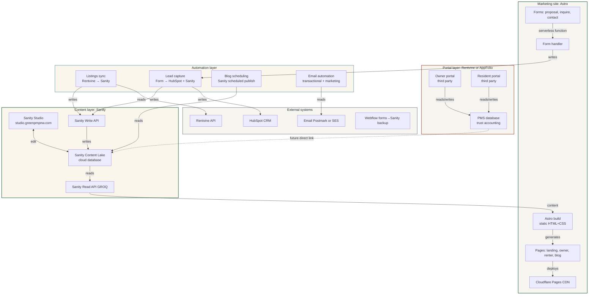
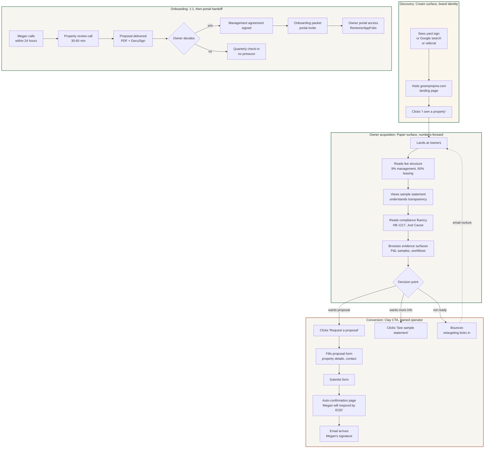
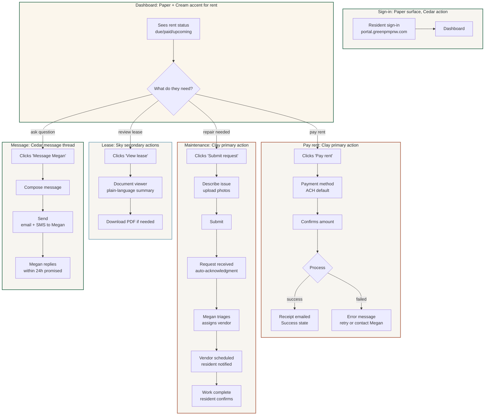
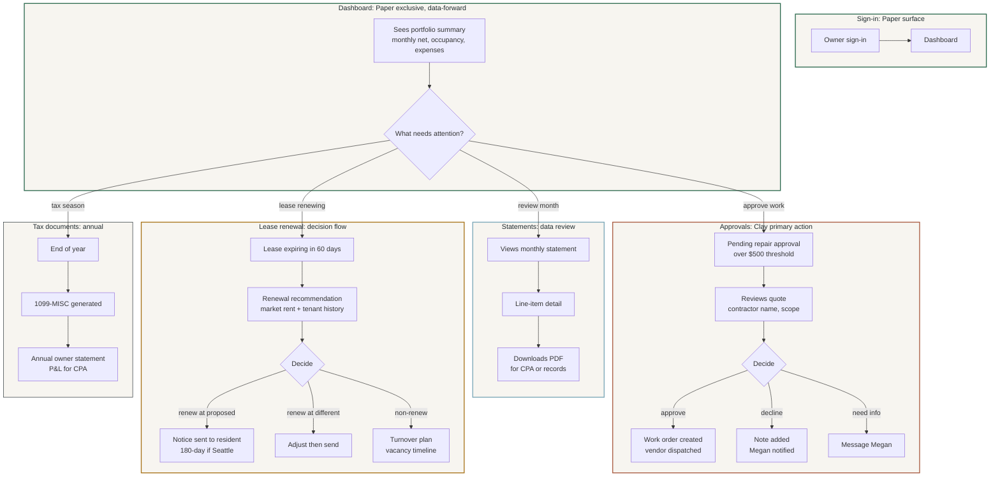
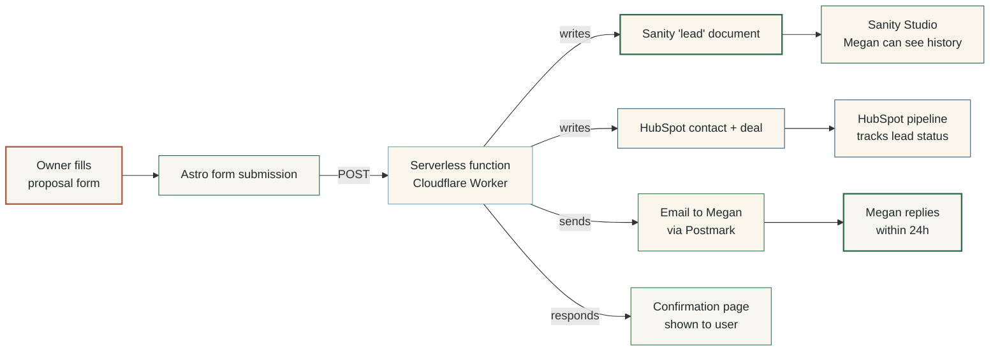
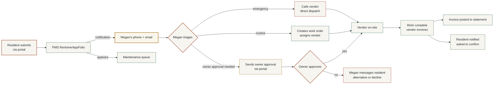

# green-pm-style-guide

Comprehensive brand and design system documentation for Green Property Management. Production-ready reference for designers, engineers, vendors, and content authors. Mobile-first throughout. Supersedes the v1 style guide.

**Locked technical stack:**

- **Marketing site:** Astro with Tailwind CSS, deployed to Cloudflare Pages or Netlify
- **Content layer:** Sanity (headless CMS) with Sanity Studio for Megan, write API for automation
- **Portal layer:** Rentvine (under 50 doors) or AppFolio (50+ doors). Brand tokens applied where the PMS allows custom CSS
- **Code ownership:** Kevin owns the Astro repo. Megan edits content through Sanity Studio
- **Domain:** `greenpmpnw.com`

## Table of contents

1. Strategic positioning
2. Brand identity and naming
3. Voice
4. Microcopy and content patterns
5. Color system
6. CSS tokens and Tailwind configuration
7. Audience modes
8. System architecture
9. User flows
10. Data flows
11. Routing architecture
12. Typography
13. Responsive breakpoints
14. Spacing rhythm and layout
15. Form components
16. Navigation patterns
17. Component grammar
18. Component state matrix
19. Empty, loading, and error states
20. Iconography
21. Photography rules
22. Illustration direction
23. Motion and interaction
24. Data display
25. Status indicators
26. Document templates
27. Email and notification design
28. Print specifications
29. Social media presence
30. File and code naming conventions
31. Accessibility
32. Dark mode (deferred)
33. Z-index scale
34. Pairings and forbidden combinations
35. PMS integration and theming limits
36. Sanity content schema overview
37. Governance and evolution
38. Quick reference

---

## 1. Strategic positioning

### 1.1 What Green PM is

A property management company for small landlords (1-to-20-door portfolios) in King and Snohomish counties, Washington. Megan Green, designated broker, is the named operator. 9% of collected rent. 60% of one month for leasing fee, billed on placement only. No setup fees, no maintenance markup.

### 1.2 What the brand has to do

Convert two skeptical audiences into customers, then serve them reliably:

1. Small landlords burned by national chains, REIT-style PM, or unreliable solo operators
2. Renters scanning fifty Zillow listings looking for something that doesn't feel like Greystar or Craigslist

Once converted, both audiences need operational surfaces that feel reliable and frictionless, not seductive.

### 1.3 What the brand is not

Not corporate. Not luxury. Not a tech startup. Not a national franchise. Not pretending to be bigger than it is. Not signaling institutional-asset-operator gravitas.

### 1.4 Competitive whitespace

| Archetype | Visual signature | Weakness |
|---|---|---|
| Legacy PM (Bell-Anderson, Cornell, Brink) | Navy, serif, corporate | Cold, outdated, interchangeable |
| Apartment REITs | Grayscale, sterile | Institutional, generic |
| Boutique lifestyle PM | Sage, beige, sans-serif | Unserious operationally |
| SaaS proptech | Gradient, geometric, "AI-powered" | Impersonal, scale-signaling |
| Green PM | Cedar + Cream/Paper + Clay, named operator | High-trust regional operator with modern systems |

---

## 2. Brand identity and naming

### 2.1 Name forms

| Form | Use |
|---|---|
| Green Property Management | Full legal name. Contracts, broker filings, footer legal text, first formal reference |
| Green PM | Short form. Body copy second-reference, social handles, email signatures, conversational copy |
| Green | Portal mark. Authenticated portal headers, favicon caption, app icon contexts |

Domain: `greenpmpnw.com`. The `pnw` qualifier reinforces regional identity and protects against generic-name collision.

### 2.2 Wordmark

Set in Geist until a commissioned mark exists:

- **Full lockup:** `Green` in semibold (600), `Property Management` at 70% size in medium (500). Two-tier hierarchy.
- **Short lockup:** `Green PM`, both words at semibold (600), single tier.
- **Portal mark:** `Green` alone, semibold (600).
- **Color:** Cedar on light backgrounds, Cream on dark.

### 2.3 Operator signature

The person comes before the brand. In email signatures and proposal covers:

```
Megan Green
Designated Broker · WA #XXXXXX
Green Property Management
(425) XXX-XXXX
megan@greenpmpnw.com
greenpmpnw.com
```

Megan's name appears in larger weight than the company name. The brand is the operator.

### 2.4 Pronunciation

`Green P-M` for "Green PM." `Green Property Management` always spelled out, never `GPM` in customer-facing copy (internal acronym fine).

---

## 3. Voice

### 3.1 Voice principles

| Principle | Means | Does not mean |
|---|---|---|
| Direct | Short sentences, plain words, answer first | Blunt or cold |
| Specific | Numbers, names, dates, addresses | Jargon or legalese |
| Accountable | First person singular when Megan speaks | Self-deprecating |
| Local | Says Bothell, not "the Puget Sound region" | Folksy or twee |
| Calm | No manufactured urgency | Slow or evasive |

### 3.2 Voice in three contexts

**Sales (landlord-facing):**

> I manage rentals in King and Snohomish counties. I work with owners of 1 to 20 doors. The fee is 9% of collected rent. The leasing fee is 60% of one month, billed only on placement. No setup fee, no maintenance markup. Megan Green, designated broker.

**Operations (resident-facing):**

> Rent is due the 1st. Late on the 6th. Pay through the portal at portal.greenpmpnw.com. Maintenance requests go through the same portal. After-hours emergencies: (425) XXX-XXXX. That number reaches me, not a service.

**Compliance (legal-facing):**

> This notice is provided in accordance with RCW 59.18.140 and Seattle Municipal Code 22.206. Effective date: [date]. Tenant response window: [days]. Questions: Megan Green, designated broker, (425) XXX-XXXX.

### 3.3 Do / do not

Do: "I'll have an answer Friday." Do not: "We strive to provide timely responses."

Do: "The boiler is 22 years old. Replace it this winter or budget for emergency replacement." Do not: "Mechanical systems may benefit from proactive evaluation."

Do: "Rent went up $75. Here is why." Do not: "Market adjustments reflect current conditions."

Do: "I do not manage commercial buildings. Try X or Y." Do not: "Let us see what we can do!" when the answer is no.

### 3.4 Forbidden words

`solutions`, `passionate`, `dedicated`, `trusted`, `boutique`, `concierge`, `white-glove`, `journey`, `stakeholder`, `leverage`, `synergy`, `bespoke`, `curated`, `unlock`, `empower`, `family of brands`, `world-class`, `value-add`, `unbeatable`, `premier`, `luxury`.

### 3.5 Terminology discipline

| State | Label | Why |
|---|---|---|
| Pre-customer renter | renter | Shopping/discovery state |
| Authenticated tenant | resident | Implies relationship and responsibility |
| Pre-customer owner | owner | Acquisition state |
| Authenticated owner | owner | Same word; relationship implicit in authentication |

Never: "current renter portal," "tenant login," "client portal."

---

## 4. Microcopy and content patterns

### 4.1 Button label patterns

| Context | Pattern | Example |
|---|---|---|
| Primary action with object | `[Verb] [object]` | `Pay rent`, `Submit request`, `Approve repair` |
| Primary action, no clear object | `[Verb]` | `Inquire`, `Sign in` |
| Confirmation in dialog | Restate the action | `Pay $2,400` (not `Confirm`) |
| Cancellation | `Cancel` or specific opt-out | `Keep editing`, `Discard changes` |
| Destructive | Plain-English consequence | `Delete property` (not `Remove`) |
| Next step | `[Verb] →` or `Continue to [step]` | `Continue to application` |
| Disabled | Same label, never explanatory | Use helper text for explanation |

### 4.2 Confirmation dialogs

Specific consequence wording. No generic "Are you sure?"

| Generic | Specific |
|---|---|
| Are you sure? | Approve $2,200 boiler replacement? |
| Cancel? | Discard this maintenance request? |
| Delete this? | Delete property 1823 NW 65th St? |
| Continue? | Send rent increase notice to M. Torres? |

Always: affected object + one-sentence consequence + two buttons (primary confirms, secondary cancels).

### 4.3 Success messages

Lead with the fact, then detail. No "Success!" or "Yay!"

| Generic | Specific |
|---|---|
| Payment successful! | Rent paid. $2,400 charged to account ending 4421. Receipt emailed. |
| Saved! | Property added. 22340 5th Ave SE is now in your portfolio. |
| Request submitted! | Maintenance request received. Megan will respond by 5 PM tomorrow. |

### 4.4 Error messages

State what failed, why if actionable, what to do next. Never exclamation marks. Never blame the user.

| Generic | Specific |
|---|---|
| Something went wrong. | Card declined. Try a different card or contact your bank. |
| Invalid input. | Phone number should be 10 digits. |
| Error 500. | Something failed on our end. Try again, or email megan@greenpmpnw.com. |

### 4.5 Empty state copy

Explain what's there and what the user does next.

| Surface | Empty copy |
|---|---|
| Owner portal, no properties | No properties yet. Once you sign a management agreement, your properties show up here. |
| Owner portal, no statements | First statement available May 1. Statements post on the 1st of each month. |
| Resident portal, no maintenance requests | No active maintenance requests. Submit one if you need something fixed. |
| Renter listings, no filter matches | No rentals match those filters right now. Clear filters to see all 6 available rentals. |
| Search, no results | No properties match "[query]". Try a different neighborhood or remove filters. |

### 4.6 Input placeholders

Describe the format, not the action. Label says what; placeholder hints at format.

| Label | Placeholder |
|---|---|
| Phone number | (425) 555-1234 |
| Email | name@example.com |
| Property address | 1823 NW 65th St, Seattle, WA |
| Monthly rent | 2400 |
| Move-in date | mm/dd/yyyy |
| Message | Tell me about your property |

### 4.7 Helper text

Below the input, smaller, muted. One line. Explains what's needed or hints at format. No more than 60 characters.

```
Phone number
[ (425) 555-1234        ]
We text you when a tour is confirmed.
```

### 4.8 Validation messages

Inline, immediate (on blur, not on type), in `--color-error`. Specific.

| Field | Bad message | Good message |
|---|---|---|
| Email | Invalid email | That email is missing the @ symbol |
| Phone | Required | Phone number is required so I can reach you |
| Rent | Number required | Rent should be a number, like 2400 |
| Date | Past date | Move-in date should be today or later |

### 4.9 Status indicator phrasing

| State | Phrase |
|---|---|
| Confirmed/paid | Paid · April 1 |
| Pending action by user | Approve repair · expires 5/15 |
| Pending action by system | Processing payment |
| Failed | Payment failed · retry |
| Scheduled | Scheduled for Thursday, 9 AM |
| Cancelled | Cancelled by you · April 3 |

---

## 5. Color system

### 5.1 Primitive palette

Seven primitives. No additions without governance review.

| Name | Hex | Role | Material reference |
|---|---|---|---|
| Cedar | `#2D6A4F` | Primary brand | Pacific Northwest evergreen, painted shutter green |
| Ink | `#1F2A2E` | Text, deep contrast | Slate, near-black with cool undertone |
| Cream | `#FBF6EC` | Marketing surface | Printed brochure paper, warm off-white |
| Paper | `#F7F5F0` | Product surface | Bank statement paper, cooler off-white |
| Stone | `#D4D1CA` | Neutral mid-tone | Dividers, borders, decorative shapes |
| Clay | `#A95C42` | Action accent | Oxidized terracotta, weathered cedar stain |
| Sky | `#7BA7B8` | Secondary accent | Hydrangea blue-grey, calm informational |

### 5.2 Derived neutrals

| Token | Hex | On Cream/Paper | Use |
|---|---|---|---|
| `ink-80` | `#3D4A4E` | 9.6:1 | Body emphasis, secondary headings |
| `ink-60` | `#5C6A6E` | 5.7:1 | Metadata, captions |
| `ink-40` | `#8A9498` | 3.0:1 | Disabled (large only), decorative |
| `ink-20` | `#C2C8CA` | 1.4:1 | Dividers, borders (non-text) |

### 5.3 System colors

State communication only. Brand colors are for brand expression; state colors are for information.

| Token | Hex | On Cream | Use |
|---|---|---|---|
| Success | `#3E7A55` | 5.0:1 | Confirmation, paid, completed |
| Warning | `#A8741A` | 4.6:1 | Caution, expiring, pending review |
| Error | `#9C2D1F` | 6.2:1 | Failed, overdue, requires action |
| Info | `#3A6480` | 5.7:1 | Neutral information, hints |

### 5.4 Contrast matrix

| Foreground | Background | Ratio | Body AA | Body AAA | Large AA |
|---|---|---|---|---|---|
| Ink | Cream | 13.8:1 | pass | pass | pass |
| Ink | Paper | 13.4:1 | pass | pass | pass |
| Cedar | Cream | 5.4:1 | pass | fail | pass |
| Cedar | Paper | 5.3:1 | pass | fail | pass |
| Cream | Cedar | 5.4:1 | pass | fail | pass |
| Cream | Ink | 13.8:1 | pass | pass | pass |
| Cream | Clay | 4.5:1 | pass | fail | pass |
| Clay | Cream | 4.5:1 | pass | fail | pass |
| Clay | Ink | 4.6:1 | pass | fail | pass |
| Sky | Ink | 5.2:1 | pass | fail | pass |
| Sky | Cream | 2.6:1 | fail | fail | fail |

Clay clears AA body on Cream at 4.5:1 without size constraints. Sky is non-text on light surfaces.

### 5.5 Color ratios by audience mode

| Color | Marketing-neutral | Owner acquisition | Owner portal | Renter acquisition | Resident portal |
|---|---|---|---|---|---|
| Cream | 45-55% | 15-20% | 0% | 50-60% | 5-10% |
| Paper | 15-20% | 50-60% | 70-80% | 10-15% | 60-70% |
| Cedar | 15-20% | 10-15% | 5-10% | 10-15% | 5-10% |
| Ink | 10-15% | 15-20% | 15-20% | 8-12% | 15-20% |
| Stone | 3-5% | 3-5% | 5-8% | 2-4% | 5-8% |
| Clay | 3-5% | 3-5% | 2-4% | 4-6% | 2-4% |
| Sky | 1-2% | 1-2% | 2-3% | 1-2% | 2-3% |

---

## 6. CSS tokens and Tailwind configuration

### 6.1 Token file structure

Three layers consumed by both CSS variables and Tailwind config. The Tailwind config reads from the primitives.

```
src/styles/
├── tokens.css           Primitives, derived neutrals, system colors
├── modes.css            data-audience overrides for surface tokens
└── base.css             Element resets, typography defaults
```

### 6.2 `tokens.css`

```css
:root {
  /* primitives */
  --color-cedar:  #2D6A4F;
  --color-ink:    #1F2A2E;
  --color-cream:  #FBF6EC;
  --color-paper:  #F7F5F0;
  --color-stone:  #D4D1CA;
  --color-clay:   #A95C42;
  --color-sky:    #7BA7B8;

  /* derived neutrals */
  --color-ink-80: #3D4A4E;
  --color-ink-60: #5C6A6E;
  --color-ink-40: #8A9498;
  --color-ink-20: #C2C8CA;

  /* system colors */
  --color-success: #3E7A55;
  --color-warning: #A8741A;
  --color-error:   #9C2D1F;
  --color-info:    #3A6480;

  /* semantic tokens */
  --color-brand:       var(--color-cedar);
  --color-brand-deep:  var(--color-ink);
  --color-action:      var(--color-clay);
  --color-accent-cool: var(--color-sky);
  --color-neutral:     var(--color-stone);
  --color-text:        var(--color-ink);
  --color-text-muted:  var(--color-ink-60);
  --color-divider:     var(--color-ink-20);

  /* focus */
  --focus-ring-color:  var(--color-cedar);
  --focus-ring-width:  2px;
  --focus-ring-offset: 2px;
}
```

### 6.3 `modes.css`

```css
[data-audience="neutral-acquisition"]  { --surface: var(--color-cream); --surface-alt: var(--color-paper); }
[data-audience="owner-acquisition"]    { --surface: var(--color-paper); --surface-alt: var(--color-cream); }
[data-audience="owner-product"]        { --surface: var(--color-paper); --surface-alt: var(--color-paper); }
[data-audience="renter-acquisition"]   { --surface: var(--color-cream); --surface-alt: var(--color-paper); }
[data-audience="renter-product"]       { --surface: var(--color-paper); --surface-alt: var(--color-cream); }
```

### 6.4 `tailwind.config.js`

```js
// Title: tailwind.config.js
// Summary: Tailwind reads from green-pm-tokens.css. Single source of truth.
// Usage: imported by Astro build.

/** @type {import('tailwindcss').Config} */
export default {
  content: ['./src/**/*.{astro,html,md,mdx,jsx,tsx}'],
  theme: {
    extend: {
      colors: {
        cedar:   '#2D6A4F',
        ink:     '#1F2A2E',
        cream:   '#FBF6EC',
        paper:   '#F7F5F0',
        stone:   '#D4D1CA',
        clay:    '#A95C42',
        sky:     '#7BA7B8',
        'ink-80': '#3D4A4E',
        'ink-60': '#5C6A6E',
        'ink-40': '#8A9498',
        'ink-20': '#C2C8CA',
        success: '#3E7A55',
        warning: '#A8741A',
        error:   '#9C2D1F',
        info:    '#3A6480',
        // semantic aliases
        brand:        '#2D6A4F',
        'brand-deep': '#1F2A2E',
        action:       '#A95C42',
      },
      fontFamily: {
        display: ['Geist', 'system-ui', '-apple-system', 'sans-serif'],
        body:    ['Newsreader', 'Georgia', 'Times New Roman', 'serif'],
        accent:  ['Fraunces', 'Georgia', 'serif'],
      },
      fontSize: {
        xs:      ['0.75rem',  { lineHeight: '1.5' }],
        sm:      ['0.875rem', { lineHeight: '1.5' }],
        base:    ['1rem',     { lineHeight: '1.55' }],
        md:      ['1.25rem',  { lineHeight: '1.5' }],
        lg:      ['1.5rem',   { lineHeight: '1.4' }],
        xl:      ['1.875rem', { lineHeight: '1.35' }],
        '2xl':   ['2.5rem',   { lineHeight: '1.2' }],
        '3xl':   ['3.5rem',   { lineHeight: '1.15' }],
        display: ['5rem',     { lineHeight: '1.05' }],
      },
      spacing: {
        // Tailwind defaults already match 4px scale (1=4px, 2=8px, etc.)
        // No overrides needed.
      },
      borderRadius: {
        sm:   '4px',
        DEFAULT: '8px',
        md:   '8px',
        lg:   '16px',
        pill: '999px',
      },
      boxShadow: {
        1: '0 1px 2px rgba(31, 42, 46, 0.06)',
        2: '0 4px 12px rgba(31, 42, 46, 0.08)',
        3: '0 12px 32px rgba(31, 42, 46, 0.12)',
      },
      screens: {
        sm:  '640px',
        md:  '768px',
        lg:  '1024px',
        xl:  '1280px',
        '2xl': '1536px',
      },
    },
  },
  plugins: [],
}
```

### 6.5 Using tokens in components

Components use Tailwind utility classes by default. CSS variables are available for cases where Tailwind doesn't reach (third-party components, dynamic theming, PMS embed overrides).

```html
<!-- Tailwind, preferred -->
<button class="bg-clay text-cream font-semibold px-6 py-3 rounded-md">
  Pay rent
</button>

<!-- CSS variables, when Tailwind isn't available -->
<button style="background: var(--color-action); color: var(--color-cream);">
  Pay rent
</button>
```

---

## 7. Audience modes

### 7.1 The two-axis model

| | Pre-customer (acquisition) | Customer (operational) |
|---|---|---|
| Owner | Owner acquisition | Owner portal |
| Renter | Renter acquisition | Resident portal |

Plus `neutral-acquisition` for the landing page.

### 7.2 Mode characteristics

| Mode | Surface | Imagery | Copy emphasis | Density | Tone |
|---|---|---|---|---|---|
| Neutral acquisition | Cream | Operator portrait | Brand statement | Low | Welcoming, direct |
| Owner acquisition | Paper | Operational (statement, kitchen-table) | Numbers-forward | High | Procedural confidence |
| Owner portal | Paper exclusive | None | Data-forward | High | Frictionless operation |
| Renter acquisition | Cream | Property photography, full-bleed | Property-forward | Low | Aspirational, direct |
| Resident portal | Paper + Cream accent | None | Action-forward | Medium | Reliable, human |

### 7.3 Mode application

In Astro, the audience mode is applied at the layout level:

```astro
---
// src/layouts/OwnerAcquisitionLayout.astro
const { title } = Astro.props;
---
<html lang="en" data-audience="owner-acquisition">
  <head>
    <title>{title}</title>
    <link rel="stylesheet" href="/styles/tokens.css">
    <link rel="stylesheet" href="/styles/modes.css">
    <link rel="stylesheet" href="/styles/base.css">
  </head>
  <body class="bg-paper text-ink min-h-screen">
    <slot />
  </body>
</html>
```

Pages declare their mode by choosing the layout:

```astro
---
import OwnerAcquisitionLayout from '../layouts/OwnerAcquisitionLayout.astro';
---
<OwnerAcquisitionLayout title="For Owners — Green Property Management">
  <!-- page content -->
</OwnerAcquisitionLayout>
```

---

## 8. System architecture

### 8.1 High-level architecture



### 8.2 Why this architecture

**Sanity for content, not website rendering.** Sanity stores structured content (pages, blog posts, listings, FAQs, leads). The Astro site fetches that content at build time and renders static HTML. The user gets a fast page; Megan gets a friendly editor; automation gets a clean API.

**Astro for the marketing site.** Astro ships near-zero JavaScript by default, which means LCP under one second on mobile 4G. Tailwind plugs in directly. Mobile-first is the default mental model.

**Third-party PMS for the portal.** Rentvine and AppFolio handle trust accounting, rent collection, screening, and the regulatory compliance that comes with handling other people's money. Building this in-house is a 12-month project and a regulatory liability. Brand tokens apply where the PMS allows; the rest is functional.

**Automation as a separate layer.** Listings sync, lead capture, email automation, and blog scheduling are not the website's job. They run as serverless functions or cron jobs, write to Sanity (for content) and HubSpot (for sales/CRM), and stay out of the user-facing path.

### 8.3 Hosting and infrastructure

| Component | Service | Cost (year 1) |
|---|---|---|
| Marketing site | Cloudflare Pages | $0 (free tier) |
| Domain | `greenpmpnw.com` via Cloudflare Registrar | ~$10/year |
| Email (transactional) | Postmark or AWS SES | ~$10/month |
| Email (Megan's mailbox) | Google Workspace | $7/user/month |
| Sanity | Free tier | $0 |
| PMS | Rentvine | ~$50-150/month |
| CRM | HubSpot Starter | $20/month |
| DNS, TLS, CDN | Cloudflare | $0 |

Total year 1 infrastructure: ~$1,400-2,500 depending on PMS choice.

---

## 9. User flows

### 9.1 Owner acquisition flow

The path from a stranger seeing a yard sign to becoming a customer.



### 9.2 Renter acquisition flow

The path from a renter scrolling Zillow to signing a lease.

```mermaid
flowchart TD
    subgraph SCAN ["Scan: Zillow, Apartments.com, Google"]
        S1[Sees listing<br/>on Zillow] --> S2[Clicks through<br/>to greenpmpnw.com/rentals/...]
        S3[Google search<br/>'rentals Ballard'] --> S2
        S4[Direct visit<br/>greenpmpnw.com] --> S5[Clicks 'I'm looking for a rental']
        S5 --> S6[/rentals listings grid]
        S6 --> S2
    end

    subgraph BROWSE ["Browse: Cream surface, property-forward"]
        B1[Listing detail page<br/>full-bleed photos] --> B2[Reads facts<br/>rent, beds, available date]
        B2 --> B3[Reads neighborhood notes<br/>walkability, transit]
        B3 --> B4[Views map context]
        B4 --> C1
    end

    subgraph INQUIRE ["Inquire: Clay CTA, named operator"]
        C1{Decision point} -->|interested| C2[Clicks 'Inquire']
        C1 -->|wants tour| C3[Clicks 'Schedule a tour']
        C1 -->|saving for later| C4[Saves listing<br/>email captured]
        C1 -->|bounces| C5[Retargeting via Zillow]

        C2 --> C6[Inquiry form<br/>name, move date, household]
        C3 --> C6
        C6 --> C7[Submits]
        C7 --> C8[Auto-confirmation<br/>'Megan responds within 24h']
    end

    subgraph APPLICATION ["Application: handoff to PMS"]
        A1[Megan replies<br/>tour or application] --> A2[Tour scheduled<br/>or application invited]
        A2 --> A3[Application submitted<br/>via Rentvine/AppFolio]
        A3 --> A4[Screening<br/>credit, criminal, eviction]
        A4 --> A5{Approved}
        A5 -->|yes| A6[Lease offered<br/>DocuSign]
        A6 --> A7[Lease signed<br/>deposit paid]
        A7 --> A8[Resident portal access]
        A5 -->|no| A9[Decline notice<br/>fair-housing-compliant]
    end

    style SCAN fill:#FBF6EC,stroke:#2D6A4F,stroke-width:2px,color:#1F2A2E
    style BROWSE fill:#FBF6EC,stroke:#2D6A4F,stroke-width:2px,color:#1F2A2E
    style INQUIRE fill:#FBF6EC,stroke:#A95C42,stroke-width:2px,color:#1F2A2E
    style APPLICATION fill:#F7F5F0,stroke:#3E7A55,stroke-width:2px,color:#1F2A2E
```

### 9.3 Resident operational flow

Day-to-day resident needs once authenticated.



### 9.4 Owner operational flow

Day-to-day owner needs once authenticated.



---

## 10. Data flows

### 10.1 Listings data flow

How a property listing reaches the marketing site.

```mermaid
flowchart LR
    A[Megan adds property<br/>to Rentvine] --> B[Rentvine database]
    B -->|nightly cron| C[Sync script<br/>serverless function]
    C -->|GROQ mutation| D[Sanity Content Lake]
    D -->|webhook| E[Astro build trigger]
    E --> F[Astro fetches Sanity]
    F --> G[Static HTML generated]
    G -->|deploy| H[Cloudflare Pages]
    H -->|CDN| I[Visitor sees listing<br/>greenpmpnw.com/rentals/...]

    style A fill:#F7F5F0,stroke:#2D6A4F,color:#1F2A2E
    style B fill:#F7F5F0,stroke:#A95C42,color:#1F2A2E
    style C fill:#FBF6EC,stroke:#7BA7B8,color:#1F2A2E
    style D fill:#FBF6EC,stroke:#2D6A4F,stroke-width:2px,color:#1F2A2E
    style E fill:#FBF6EC,stroke:#7BA7B8,color:#1F2A2E
    style F fill:#F7F5F0,stroke:#2D6A4F,color:#1F2A2E
    style G fill:#F7F5F0,stroke:#2D6A4F,color:#1F2A2E
    style H fill:#F7F5F0,stroke:#2D6A4F,stroke-width:2px,color:#1F2A2E
    style I fill:#FBF6EC,stroke:#3E7A55,stroke-width:2px,color:#1F2A2E
```



Sync frequency: nightly at 2 AM Pacific, plus on-demand via webhook when Megan publishes a new listing in Rentvine. Latency from Rentvine to live site: under 5 minutes worst case.

### 10.2 Lead capture data flow

How an owner proposal request reaches Megan and the CRM.



Lead arrives in three places simultaneously: Megan's inbox (action), HubSpot (CRM tracking), Sanity (content/history). Triple write ensures no lead is ever lost to a single-system failure.

### 10.3 Content publishing data flow

How a blog post Megan writes reaches readers.

```mermaid
flowchart LR
    A[Megan opens<br/>Sanity Studio] --> B[Creates blog post<br/>title, body, photo]
    B --> C[Clicks Publish]
    C -->|writes| D[Sanity Content Lake]
    D -->|webhook| E[Cloudflare Pages<br/>build trigger]
    E --> F[Astro rebuilds<br/>5-10 seconds]
    F -->|deploy| G[Live at<br/>greenpmpnw.com/blog/...]
    G -->|RSS| H[RSS feed updated]
    H -->|optional| I[Mailchimp/email<br/>newsletter sent]

    style A fill:#FBF6EC,stroke:#2D6A4F,stroke-width:2px,color:#1F2A2E
    style B fill:#FBF6EC,stroke:#2D6A4F,color:#1F2A2E
    style C fill:#FBF6EC,stroke:#A95C42,stroke-width:2px,color:#1F2A2E
    style D fill:#FBF6EC,stroke:#2D6A4F,stroke-width:2px,color:#1F2A2E
    style E fill:#F7F5F0,stroke:#7BA7B8,color:#1F2A2E
    style F fill:#F7F5F0,stroke:#2D6A4F,color:#1F2A2E
    style G fill:#FBF6EC,stroke:#3E7A55,stroke-width:2px,color:#1F2A2E
    style H fill:#F7F5F0,stroke:#7BA7B8,color:#1F2A2E
    style I fill:#FBF6EC,stroke:#3A6480,color:#1F2A2E
```



### 10.4 Maintenance request data flow

How a resident's request reaches a vendor.



---

## 11. Routing architecture

### 11.1 Public site routing

```
greenpmpnw.com/
├── /                           Landing (neutral-acquisition)
├── /owners                     Owner acquisition (owner-acquisition)
│   ├── /owners/pricing         Fee structure detail
│   ├── /owners/sample-statement  Sample monthly statement
│   ├── /owners/compliance      HB 1217, Just Cause, RCW 59.18
│   ├── /owners/proposal        Proposal request form
│   └── /owners/faq             Common questions
├── /rentals                    Renter acquisition (renter-acquisition)
│   ├── /rentals/[slug]         Individual listing detail
│   └── /rentals/neighborhoods/[neighborhood]  Neighborhood landing pages
├── /blog                       Blog index
│   └── /blog/[slug]            Individual post
├── /about                      Megan's bio, operator-first positioning
├── /contact                    Contact form + direct number
├── /privacy
├── /terms
└── /accessibility              Accessibility statement
```

### 11.2 Portal routing (third-party PMS)

```
portal.greenpmpnw.com/         (subdomain points to PMS)
├── /owner/...                  Rentvine or AppFolio owner portal
└── /resident/...               Rentvine or AppFolio resident portal
```

Subdomain isolation means PMS branding limitations don't bleed into marketing surfaces. Cookies, sessions, and authentication scope to `portal.*`.

### 11.3 Sanity Studio routing

```
studio.greenpmpnw.com/         Sanity Studio editor for Megan
```

Separate subdomain, separate authentication. Only Megan and Kevin have access.

### 11.4 Top-level flow

```mermaid
flowchart TD
    A[greenpmpnw.com] --> B{Who are you?}
    B -->|I own property| C{New or current?}
    B -->|I rent or want to rent| D{New or current?}

    C -->|Not a customer| E[Owner acquisition<br/>/owners]
    C -->|Current owner| F[Owner sign-in<br/>portal.greenpmpnw.com]

    D -->|Looking for a rental| G[Renter acquisition<br/>/rentals]
    D -->|Current resident| H[Resident sign-in<br/>portal.greenpmpnw.com]

    E --> E1[Schedule call<br/>or Request proposal]
    G --> G1[Browse listings<br/>or Inquire]

    style A fill:#FBF6EC,stroke:#2D6A4F,stroke-width:3px,color:#1F2A2E
    style B fill:#FBF6EC,stroke:#A95C42,stroke-width:2px,color:#1F2A2E
    style C fill:#FBF6EC,stroke:#A95C42,color:#1F2A2E
    style D fill:#FBF6EC,stroke:#A95C42,color:#1F2A2E
    style E fill:#F7F5F0,stroke:#A95C42,stroke-width:2px,color:#1F2A2E
    style F fill:#F7F5F0,stroke:#7BA7B8,color:#1F2A2E
    style G fill:#FBF6EC,stroke:#A95C42,stroke-width:2px,color:#1F2A2E
    style H fill:#F7F5F0,stroke:#7BA7B8,color:#1F2A2E
    style E1 fill:#F7F5F0,stroke:#A95C42,stroke-width:2px,color:#1F2A2E
    style G1 fill:#FBF6EC,stroke:#A95C42,stroke-width:2px,color:#1F2A2E
```


---

## 12. Typography

### 12.1 Type families

Three families, three jobs. Geist does the work, Newsreader does the words, Fraunces signs the name.

| Role | Typeface | Fallback |
|---|---|---|
| Display, headlines, wordmark, UI, buttons, financial figures | Geist | system-ui, -apple-system, sans-serif |
| Body prose, long-form, owner letters | Newsreader | Georgia, "Times New Roman", serif |
| Signature line only (`Megan`, italic) | Fraunces | Georgia, serif |

All three are open-source (Geist SIL OFL, Newsreader SIL OFL, Fraunces SIL OFL). Load via `fonts.bunny.net` (privacy-friendly Google Fonts proxy) or self-host via Astro's `astro-font` integration. The mono family was removed in v3 — the brand does not display code.

### 12.2 When each runs

| Use | Family | Why |
|---|---|---|
| Headlines, hero text, wordmark | Geist | Contemporary grotesque; serious, regional, current |
| Body prose, paragraph text, owner letters | Newsreader | Editorial warmth and legibility in long-form |
| Buttons, navigation, form labels | Geist | Functional clarity |
| Financial tables, statements, data cells | Geist with `font-feature-settings: "tnum"` | Tabular figures align in columns |
| Portal headings, dashboard titles | Geist | One display face across editorial and dense surfaces |
| Eyebrow labels (small caps) | Geist, uppercase, tracked | Categorizes the heading below |
| Signature line (`Megan`) | Fraunces italic | Named-operator accent; the only place Fraunces appears |

### 12.3 Optical sizing (Newsreader and Fraunces)

Geist has no optical-size axis; nothing to set on headlines or UI. Optical sizing applies only to the two serif faces, both variable fonts with an `opsz` axis:

| Context | Family | `font-optical-sizing` |
|---|---|---|
| Body prose, long-form | Newsreader (opsz 6–72) | auto |
| Lead paragraphs | Newsreader | auto |
| Signature line `Megan` | Fraunces (opsz 9–144) | auto |

Default to `font-optical-sizing: auto` on Newsreader and Fraunces and let the browser handle it. Geist needs no optical setting.

### 12.4 Mobile-first type scale

Different scale at mobile vs desktop. Tailwind config maps these to breakpoints.

| Token | Mobile (default) | Desktop (md: 768px+) | Use |
|---|---|---|---|
| xs | 0.75rem (12px) | 0.75rem (12px) | Captions, legal |
| sm | 0.875rem (14px) | 0.875rem (14px) | Metadata, table cells |
| base | 1rem (16px) | 1rem (16px) | Body |
| md | 1.125rem (18px) | 1.25rem (20px) | Lead paragraphs |
| lg | 1.25rem (20px) | 1.5rem (24px) | H4, card titles |
| xl | 1.5rem (24px) | 1.875rem (30px) | H3 |
| 2xl | 1.875rem (30px) | 2.5rem (40px) | H2 |
| 3xl | 2.25rem (36px) | 3.5rem (56px) | H1 |
| display | 2.75rem (44px) | 5rem (80px) | Hero, wordmark |

Implementation in Tailwind:

```html
<h1 class="text-3xl md:text-3xl lg:text-display font-display font-medium tracking-tight">
  Property management for small landlords.
</h1>
```

### 12.5 Line length (measure)

Optimal reading is 50-75 characters per line. At 16px body text:

| Container | max-width | Why |
|---|---|---|
| Prose container | `65ch` (~65 characters) | Blog posts, long-form copy |
| Form column | `40ch` | Forms read narrower |
| Statement table | `none`, full container | Tables need horizontal space |
| Card body | `40ch` | Listing cards, evidence cards |

Tailwind class: `max-w-prose` (defaults to 65ch).

### 12.6 Numeric figures: tabular vs proportional

| Context | Setting |
|---|---|
| Body prose with numbers ("9% of rent") | Proportional (default) |
| Statement tables, columns of numbers | Tabular |
| Pricing displays ("$2,400") | Tabular |
| Phone numbers | Tabular |
| Dates in tables | Tabular |

CSS:

```css
.tabular { font-feature-settings: "tnum"; }
```

Tailwind utility (custom plugin or arbitrary value):

```html
<span class="font-display tabular-nums">$2,400</span>
```

### 12.7 Italic usage

Fraunces italic appears once per document, and only at the signature:

- **Signature lines**: `Megan` in italic Fraunces at the close of letters, proposals, notices

Newsreader italic is allowed sparingly inside prose:

- **Editorial pull quotes**: rare, only on blog posts
- **Citations and titles of works**: standard usage

Never:
- Italic body prose paragraphs
- Italic for navigation or buttons
- Italic Geist (headlines and UI stay upright)

### 12.8 Heading face in dense contexts

There is one display face. Geist runs both editorial and functional headings; the difference is weight, size, and casing, not a switch of face. The editorial warmth a serif display once carried now comes from the Newsreader prose around the heading and from the Fraunces signature.

| Context | Treatment | Why |
|---|---|---|
| Owner portal dashboard "March 2026 summary" | Geist medium | Editorial-leaning heading |
| Owner portal table headers "Property · Rent · Status" | Geist semibold, uppercase, tracked | Functional column header, not decorative |
| Resident portal "Your home" | Geist medium | Warmth carried by copy, not face |
| Resident portal "Rent due in 4 days" | Geist, weight 500 | Functional urgency |

Default: Geist for all headings; express editorial vs functional through weight, size, and casing.

### 12.9 Weight, tracking, leading

| Token | Value | Use |
|---|---|---|
| weight-regular | 400 | Body and UI default (Newsreader prose, Geist UI) |
| weight-medium | 500 | Form labels, nav links, light emphasis (Geist) |
| weight-semibold | 600 | Headings, buttons, wordmark, signature |
| weight-bold | 700 | Rare, used only for very high emphasis |
| tracking-tight | -0.02em | Display, large headings |
| tracking-normal | 0 | Body |
| tracking-wide | 0.08em | All-caps eyebrow labels |
| leading-tight | 1.15 | Display, hero |
| leading-snug | 1.35 | Headings |
| leading-normal | 1.55 | Body |

### 12.10 Heading-to-body spacing

| Element | Margin-top | Margin-bottom |
|---|---|---|
| H1 | 0 | 1.5rem (24px) |
| H2 | 3rem (48px) | 1rem (16px) |
| H3 | 2rem (32px) | 0.75rem (12px) |
| H4 | 1.5rem (24px) | 0.5rem (8px) |
| Paragraph | 0 | 1rem (16px) |
| Lead paragraph (first after H1) | 0.5rem (8px) | 2rem (32px) |
| List | 0 | 1rem (16px) |
| Blockquote | 1.5rem | 1.5rem |

Override default browser margins via Tailwind's `prose` plugin (configured to use these values) or via custom CSS in `base.css`.

### 12.11 Link styling

| Context | Style |
|---|---|
| Body prose links | Cedar underline, 0.15em underline-offset, no weight change |
| Navigation links | Ink-60, no underline; Cedar on hover/active |
| Footer links | Ink-60, no underline; underline on hover |
| Button text labels | No underline (buttons don't need link styling) |
| External links | Cedar underline + small `↗` icon |
| Email/phone in copy | Cedar underline, treated as link |

Implementation:

```css
.prose a {
  color: var(--color-cedar);
  text-decoration: underline;
  text-underline-offset: 0.15em;
  text-decoration-thickness: 1px;
}

.prose a:hover {
  text-decoration-thickness: 2px;
}
```

### 12.12 All-caps tracking application

All-caps text always gets `--tracking-wide` (0.08em) at small sizes. Applies to:

- Eyebrow labels (`KING & SNOHOMISH COUNTIES`)
- Table column headers (`PROPERTY · RENT · STATUS`)
- Status badges (`PAID`, `PENDING`)
- Small-caps signatures (`MEGAN GREEN, DESIGNATED BROKER`)
- Section dividers in long-form content

Never:
- All-caps body text
- All-caps headlines
- All-caps button labels (sentence case, not caps)

### 12.13 Two recurring typographic signatures

These mark a Green PM artifact at a glance:

**1. Tracked-out label above heading.**

```html
<div class="text-xs font-semibold tracking-wide uppercase text-ink-60 mb-2">
  Maintenance
</div>
<h3 class="font-display text-xl text-ink">
  Boiler replacement, 18th Ave NE
</h3>
```

**2. Signature line.**

```html
<div class="mt-8">
  <p class="font-accent italic text-lg text-cedar">Megan</p>
  <p class="text-xs font-semibold tracking-wide uppercase text-ink-60 mt-1">
    Megan Green, Designated Broker
  </p>
</div>
```

---

## 13. Responsive breakpoints

### 13.1 Breakpoint scale

Mobile-first. Default styles target 375px. Breakpoints add up.

| Token | Min-width | Devices | Approach |
|---|---|---|---|
| Default (no prefix) | 0px | Phones (375-639px) | Base styles |
| sm | 640px | Large phones, small tablets | Refinements, gentle two-column |
| md | 768px | Tablets, small laptops | Multi-column layouts begin |
| lg | 1024px | Laptops | Full multi-column |
| xl | 1280px | Desktops | Max content width |
| 2xl | 1536px | Large desktops | Optional widening |

### 13.2 Container max-widths

Content never spans more than 1280px. Side padding adapts.

| Breakpoint | Container max-width | Side padding |
|---|---|---|
| Default | 100% | 16px (1rem) |
| sm (640px+) | 100% | 24px (1.5rem) |
| md (768px+) | 100% | 32px (2rem) |
| lg (1024px+) | 1024px | 48px (3rem) |
| xl (1280px+) | 1280px | 64px (4rem) |
| 2xl (1536px+) | 1280px | 64px (4rem) |

Implementation:

```html
<main class="mx-auto max-w-screen-xl px-4 sm:px-6 md:px-8 lg:px-12 xl:px-16">
  <!-- content -->
</main>
```

### 13.3 Touch targets

Minimum interactive target size: **44 × 44 px** (WCAG 2.5.5 AAA, practical AA standard for mobile).

Applies to:
- Buttons (min height 44px)
- Links in nav (min height 44px, padded if needed)
- Form inputs (min height 44px)
- Icon buttons (min 44x44px hit area, even if visual is smaller)
- Touch list items (min 44px row height)

Tailwind utility:

```html
<button class="min-h-[44px] px-6 py-3 ...">Pay rent</button>
```

### 13.4 Layout shifts at breakpoints

| Component | Mobile | Tablet (md) | Desktop (lg+) |
|---|---|---|---|
| Landing path cards | Stacked vertically | 2-column | 2-column with more whitespace |
| Owner acquisition hero | Stacked (text above sample statement) | Side-by-side | Side-by-side with more whitespace |
| Listings grid | 1 column | 2 columns | 3 columns |
| Owner portal dashboard | Stacked sections | 2-column | 3-column with sidebar |
| Resident portal | Stacked | 2-column | 2-column |
| Footer | Stacked sections | 2-column | 4-column |
| Nav | Hamburger menu | Inline links | Inline links |

### 13.5 Image sizing per breakpoint

Use `srcset` or Astro's `<Image>` component to serve appropriate sizes.

| Image type | Mobile | Tablet | Desktop |
|---|---|---|---|
| Hero portrait (landing operator block) | 480w | 640w | 880w |
| Property listing card photo | 600w | 800w | 600w (smaller per card in 3-col grid) |
| Listing detail hero | 800w | 1200w | 1600w |
| Blog post featured image | 800w | 1000w | 1280w |
| Inline blog images | 800w (full width on mobile) | 1000w | 800w (constrained within prose container) |

### 13.6 Mobile-specific patterns

**Sticky header.** Mobile users scroll long pages; the nav and primary action stay reachable.

```html
<header class="sticky top-0 z-sticky bg-cream/95 backdrop-blur-sm border-b border-ink-20">
  <!-- nav -->
</header>
```

**Bottom-fixed CTA on conversion pages.** On `/owners` and listing detail pages, the primary CTA gets a sticky bottom bar on mobile only.

```html
<div class="md:hidden fixed bottom-0 inset-x-0 p-4 bg-cream border-t border-ink-20 z-sticky">
  <a href="/owners/proposal" class="block w-full text-center bg-clay text-cream py-3 rounded-md font-semibold">
    Request a proposal
  </a>
</div>
```

**Disclosure for dense content.** Owner portal dashboard collapses sidebar into expandable disclosure on mobile.

**Hamburger menu.** Top-right on mobile, expands to full-screen overlay. Pattern documented in §16.

---

## 14. Spacing rhythm and layout

### 14.1 Spacing scale

Tailwind defaults match the 4px scale. No overrides needed.

| Tailwind | Value | Use |
|---|---|---|
| `space-1` | 4px | Tight inline gaps, icon-to-text |
| `space-2` | 8px | Compact button padding, form field gaps |
| `space-3` | 12px | Default button padding-y, list item gaps |
| `space-4` | 16px | Default button padding-x, card padding small |
| `space-6` | 24px | Card padding default, section gaps small |
| `space-8` | 32px | Section gaps default, hero padding |
| `space-12` | 48px | Major section gaps, hero margin-bottom |
| `space-16` | 64px | Page section spacing |
| `space-24` | 96px | Hero vertical padding, major divides |
| `space-32` | 128px | Maximum vertical rhythm on large screens |

### 14.2 Vertical rhythm at the page level

```
Top of page
↓
[Nav]                     (sticky, ~64px height)
↓ 32px (mobile) / 64px (desktop)
[Hero section]            (paddings: 48px mobile / 96px desktop top/bottom)
↓ 48px (mobile) / 96px (desktop)
[Content section 1]
↓ 48px / 96px
[Content section 2]
↓ 48px / 96px
[CTA band]                (paddings: 48px / 64px)
↓ 32px / 64px
[Footer]                  (paddings: 32px / 48px)
```

### 14.3 Grid system

Tailwind's grid utilities, used judiciously:

| Layout | Tailwind |
|---|---|
| 1-col mobile, 2-col desktop | `grid grid-cols-1 md:grid-cols-2 gap-6` |
| 1-col mobile, 3-col desktop | `grid grid-cols-1 md:grid-cols-2 lg:grid-cols-3 gap-6` |
| Auto-fit with min-width | `grid grid-cols-[repeat(auto-fit,minmax(280px,1fr))] gap-6` |
| Dashboard 3-col with sidebar | `grid grid-cols-1 lg:grid-cols-[240px_1fr] gap-8` |

### 14.4 Section padding

| Section type | Mobile | Desktop |
|---|---|---|
| Hero | py-12 (48px) | py-24 (96px) |
| Content section | py-12 | py-20 (80px) |
| CTA band | py-10 | py-16 |
| Footer | py-8 (32px) | py-12 (48px) |
| Card | p-6 (24px) | p-8 (32px) |

### 14.5 Card grid gaps

| Card type | Gap mobile | Gap desktop |
|---|---|---|
| Listing cards | 24px | 32px |
| Evidence cards | 16px | 24px |
| Compliance cards | 16px | 24px |
| KPI cards | 16px | 24px |
| Path cards (landing) | 16px | 24px |

---

## 15. Form components

### 15.1 Form principles

- One column on mobile. Two-column only at md+ for short related fields (first/last name).
- Labels above inputs, never floating, never inside (except placeholder hints).
- Required fields marked with asterisk in `--color-error`, placed after the label.
- Helper text below the input in `--color-text-muted`, max 60 characters.
- Validation on blur (not on type) for inline errors. Submit-time for cross-field validation.
- Submit button at the bottom, left-aligned on desktop, full-width on mobile.

### 15.2 Text input

**Structure:**

```html
<div class="form-field">
  <label for="email" class="form-label">
    Email
    <span class="form-required" aria-label="required">*</span>
  </label>
  <input
    type="email"
    id="email"
    name="email"
    class="form-input"
    placeholder="name@example.com"
    required
    aria-describedby="email-help"
  />
  <p id="email-help" class="form-helper">I'll send a confirmation here.</p>
</div>
```

**Tailwind classes:**

```html
<label class="block text-sm font-semibold text-ink mb-2">
  Email
  <span class="text-error ml-0.5">*</span>
</label>
<input
  class="w-full min-h-[44px] px-4 py-3 bg-cream border border-ink-20 rounded-md
         text-base text-ink placeholder:text-ink-40
         focus:outline-none focus:border-cedar focus:ring-2 focus:ring-cedar/30
         disabled:bg-ink-20 disabled:text-ink-60
         aria-invalid:border-error aria-invalid:ring-error/30"
/>
<p class="text-xs text-ink-60 mt-1">I'll send a confirmation here.</p>
```

### 15.3 Input states

| State | Visual |
|---|---|
| Default | Cream bg, Ink-20 border, Ink text |
| Focus | Cedar border, 2px Cedar/30 ring offset |
| Hover (only on inputs that act as buttons) | Border darkens slightly |
| Filled | Same as default; the value indicates filled state |
| Disabled | Ink-20 bg, Ink-60 text, no border |
| Error | Error red border, Error/30 ring, helper text in Error |
| Read-only | Paper bg, Ink-60 text |

### 15.4 Textarea

Same styling as text input. Min height 120px. Manual resize allowed via `resize-y`.

```html
<textarea
  class="w-full min-h-[120px] resize-y px-4 py-3 bg-cream border border-ink-20 rounded-md
         text-base text-ink placeholder:text-ink-40
         focus:outline-none focus:border-cedar focus:ring-2 focus:ring-cedar/30"
></textarea>
```

### 15.5 Select dropdown

Style the native `<select>` element. No custom dropdown libraries unless absolutely necessary.

```html
<select class="w-full min-h-[44px] px-4 py-3 bg-cream border border-ink-20 rounded-md
               text-base text-ink appearance-none
               bg-[url('/icons/chevron-down.svg')] bg-no-repeat bg-[right_16px_center]
               focus:outline-none focus:border-cedar focus:ring-2 focus:ring-cedar/30">
  <option>Any beds</option>
  <option>Studio</option>
  <option>1 bedroom</option>
  <option>2 bedrooms</option>
  <option>3+ bedrooms</option>
</select>
```

### 15.6 Radio and checkbox

Use native inputs with custom styling. 20px box.

```html
<!-- Checkbox -->
<label class="flex items-start gap-3 cursor-pointer">
  <input type="checkbox" class="
    mt-1 w-5 h-5 rounded
    border-2 border-ink-20 bg-cream
    checked:border-cedar checked:bg-cedar
    focus:ring-2 focus:ring-cedar/30 focus:ring-offset-2
  " />
  <span class="text-base text-ink">
    I agree to the management agreement terms
  </span>
</label>

<!-- Radio group -->
<fieldset>
  <legend class="text-sm font-semibold text-ink mb-3">Payment method</legend>
  <div class="space-y-3">
    <label class="flex items-center gap-3">
      <input type="radio" name="payment" value="ach" class="w-5 h-5 ..." />
      <span>ACH (free)</span>
    </label>
    <label class="flex items-center gap-3">
      <input type="radio" name="payment" value="card" class="w-5 h-5 ..." />
      <span>Credit card (2.95% fee)</span>
    </label>
  </div>
</fieldset>
```

### 15.7 Toggle switch

For binary on/off settings (autopay, email notifications).

```html
<label class="flex items-center gap-3 cursor-pointer">
  <span class="relative inline-block w-11 h-6">
    <input type="checkbox" class="peer sr-only" />
    <span class="absolute inset-0 bg-ink-20 rounded-full peer-checked:bg-cedar transition-colors"></span>
    <span class="absolute left-0.5 top-0.5 w-5 h-5 bg-cream rounded-full transition-transform peer-checked:translate-x-5"></span>
  </span>
  <span class="text-base text-ink">Automatic monthly payment</span>
</label>
```

### 15.8 File upload

Maintenance request photo upload. Drag-and-drop on desktop, tap to open file picker on mobile.

```html
<label class="block">
  <span class="block text-sm font-semibold text-ink mb-2">
    Photos (optional, up to 5)
  </span>
  <div class="border-2 border-dashed border-ink-20 rounded-md p-6 text-center
              hover:border-cedar transition-colors cursor-pointer">
    <p class="text-base text-ink">Drop photos here or tap to choose</p>
    <p class="text-xs text-ink-60 mt-1">JPG or PNG, up to 10 MB each</p>
    <input type="file" multiple accept="image/*" class="sr-only" />
  </div>
</label>
```

### 15.9 Date picker

Use native `<input type="date">` on mobile (gets the OS picker). On desktop, optionally upgrade to a richer date picker if needed.

```html
<input type="date" class="form-input" min="2026-05-21" />
```

### 15.10 Multi-step forms

For longer flows (proposal request, rental application):

```html
<div class="multi-step">
  <ol class="flex items-center gap-2 mb-8" aria-label="Form progress">
    <li class="flex items-center gap-2">
      <span class="step-current">1</span>
      <span class="text-sm font-semibold text-ink">Property</span>
    </li>
    <span class="flex-1 h-px bg-ink-20"></span>
    <li class="flex items-center gap-2">
      <span class="step">2</span>
      <span class="text-sm text-ink-60">Contact</span>
    </li>
    <span class="flex-1 h-px bg-ink-20"></span>
    <li class="flex items-center gap-2">
      <span class="step">3</span>
      <span class="text-sm text-ink-60">Review</span>
    </li>
  </ol>
  <!-- step content -->
</div>
```

Step indicator styling:

```css
.step,
.step-current {
  width: 28px; height: 28px;
  border-radius: 999px;
  display: inline-flex;
  align-items: center; justify-content: center;
  font-size: 13px; font-weight: 600;
}
.step { background: var(--color-paper); color: var(--color-ink-60); border: 1px solid var(--color-ink-20); }
.step-current { background: var(--color-cedar); color: var(--color-cream); }
.step-complete { background: var(--color-success); color: var(--color-cream); }
```

### 15.11 Form spacing rhythm

| Spacing | Value |
|---|---|
| Between fields (vertical) | 24px (`space-y-6`) |
| Between sections within a form | 48px (`space-y-12`) |
| Label to input | 8px (`mb-2`) |
| Input to helper text | 4px (`mt-1`) |
| Submit button to last input | 32px (`mt-8`) |

### 15.12 Form submission

- POST to a serverless function (Cloudflare Worker or Astro endpoint)
- Disable submit button while in-flight; show spinner inside the button
- On success: redirect to confirmation page OR show inline success message
- On error: show error message above the form, retain all values
- Never lose user-entered data

```javascript
// Title: form-submit.js
// Summary: handle form submit with loading state, error retention, redirect on success
// Usage: imported by Astro page

async function handleSubmit(event) {
  event.preventDefault();
  const form = event.target;
  const submitButton = form.querySelector('[type="submit"]');

  submitButton.disabled = true;
  submitButton.textContent = 'Submitting...';

  try {
    const formData = new FormData(form);
    const response = await fetch('/api/proposal', {
      method: 'POST',
      body: formData,
    });

    if (!response.ok) throw new Error('Submission failed');

    window.location.href = '/owners/proposal/thanks';
  } catch (error) {
    showInlineError(form, 'Something failed on our end. Try again, or email megan@greenpmpnw.com.');
    submitButton.disabled = false;
    submitButton.textContent = 'Request a proposal';
  }
}
```

---

## 16. Navigation patterns

### 16.1 Desktop navigation

Horizontal nav, persistent across marketing pages. Sign-in links in top-right.

```html
<header class="hidden md:flex items-center justify-between max-w-screen-xl mx-auto px-12 py-7 border-b border-ink-20">
  <a href="/" class="font-display text-2xl font-semibold text-cedar tracking-tight">
    Green <span class="text-base font-medium text-ink-60 ml-1">Property Management</span>
  </a>
  <nav class="flex items-center gap-8">
    <a href="/owners" class="text-sm font-medium text-ink-60 hover:text-cedar">For owners</a>
    <a href="/rentals" class="text-sm font-medium text-ink-60 hover:text-cedar">Rentals</a>
    <a href="/about" class="text-sm font-medium text-ink-60 hover:text-cedar">About</a>
    <a href="/blog" class="text-sm font-medium text-ink-60 hover:text-cedar">Field notes</a>
    <span class="text-ink-20">·</span>
    <a href="https://portal.greenpmpnw.com/owner" class="text-sm font-medium text-ink-60 hover:text-cedar">Owner sign-in</a>
    <a href="https://portal.greenpmpnw.com/resident" class="text-sm font-medium text-ink-60 hover:text-cedar">Resident sign-in</a>
  </nav>
</header>
```

### 16.2 Mobile navigation

Hamburger menu, top-right. Tapping opens a full-screen overlay with all links.

```html
<header class="md:hidden sticky top-0 z-sticky bg-cream/95 backdrop-blur-sm border-b border-ink-20">
  <div class="flex items-center justify-between px-4 py-4">
    <a href="/" class="font-display text-xl font-semibold text-cedar">Green PM</a>
    <button
      class="min-h-[44px] min-w-[44px] flex items-center justify-center"
      aria-label="Open menu"
      aria-expanded="false"
      aria-controls="mobile-menu"
      onclick="document.getElementById('mobile-menu').classList.toggle('hidden')"
    >
      <svg width="24" height="24"><!-- hamburger icon --></svg>
    </button>
  </div>

  <nav id="mobile-menu" class="hidden border-t border-ink-20">
    <ul class="px-4 py-4 space-y-1">
      <li><a href="/owners" class="block min-h-[44px] py-3 text-base font-medium text-ink">For owners</a></li>
      <li><a href="/rentals" class="block min-h-[44px] py-3 text-base font-medium text-ink">Rentals</a></li>
      <li><a href="/about" class="block min-h-[44px] py-3 text-base font-medium text-ink">About</a></li>
      <li><a href="/blog" class="block min-h-[44px] py-3 text-base font-medium text-ink">Field notes</a></li>
      <li class="border-t border-ink-20 pt-2 mt-2">
        <a href="https://portal.greenpmpnw.com/owner" class="block min-h-[44px] py-3 text-base text-ink-60">Owner sign-in</a>
      </li>
      <li>
        <a href="https://portal.greenpmpnw.com/resident" class="block min-h-[44px] py-3 text-base text-ink-60">Resident sign-in</a>
      </li>
    </ul>
  </nav>
</header>
```

### 16.3 Sticky behavior

| Surface | Sticky on scroll? |
|---|---|
| Marketing pages | Yes (mobile + desktop) |
| Portal pages | Yes (provided by PMS) |
| Sanity Studio | Studio handles its own |

Sticky nav has translucent background (`bg-cream/95 backdrop-blur-sm`) and a subtle bottom border.

### 16.4 Active state

Current page link gets Cedar color and bottom border (desktop) or filled background (mobile menu).

```html
<a href="/owners" class="text-cedar border-b-2 border-cedar -mb-px pb-7">For owners</a>
```

### 16.5 Breadcrumbs

For portal deep pages and blog category pages.

```html
<nav aria-label="Breadcrumb" class="text-sm text-ink-60 mb-4">
  <ol class="flex items-center gap-2">
    <li><a href="/blog" class="hover:text-cedar">Field notes</a></li>
    <li class="text-ink-40">›</li>
    <li><a href="/blog/category/compliance" class="hover:text-cedar">Compliance</a></li>
    <li class="text-ink-40">›</li>
    <li aria-current="page" class="text-ink">What the 180-day notice means</li>
  </ol>
</nav>
```

### 16.6 Sidebar nav (portal)

Owner portal uses a left sidebar nav on desktop, collapses to top tabs on mobile.

```html
<aside class="hidden lg:block w-60 border-r border-ink-20 p-6">
  <nav>
    <p class="text-xs font-semibold tracking-wide uppercase text-ink-60 mb-3">Portfolio</p>
    <ul class="space-y-1">
      <li><a href="/owner/dashboard" class="block min-h-[44px] py-2 px-3 rounded-md bg-cedar/10 text-cedar font-semibold">Dashboard</a></li>
      <li><a href="/owner/properties" class="block min-h-[44px] py-2 px-3 rounded-md hover:bg-cream text-ink">Properties</a></li>
      <li><a href="/owner/statements" class="block min-h-[44px] py-2 px-3 rounded-md hover:bg-cream text-ink">Statements</a></li>
    </ul>
  </nav>
</aside>

<!-- Mobile: tabs across top -->
<nav class="lg:hidden overflow-x-auto border-b border-ink-20">
  <ul class="flex gap-1 px-4 py-2 whitespace-nowrap">
    <li><a href="/owner/dashboard" class="inline-block min-h-[44px] py-2 px-4 rounded-md bg-cedar/10 text-cedar font-semibold">Dashboard</a></li>
    <li><a href="/owner/properties" class="inline-block min-h-[44px] py-2 px-4 text-ink-60">Properties</a></li>
    <li><a href="/owner/statements" class="inline-block min-h-[44px] py-2 px-4 text-ink-60">Statements</a></li>
  </ul>
</nav>
```

### 16.7 Footer

| Section | Mobile | Desktop |
|---|---|---|
| Legal text (copyright, broker license) | Stacked top | Left |
| Policy links (privacy, terms, accessibility) | Stacked below | Right |
| Contact info | Hidden, link to /contact | Center-right |
| Social media | Bottom row | Bottom row |

```html
<footer class="border-t border-ink-20 mt-16">
  <div class="max-w-screen-xl mx-auto px-4 md:px-12 py-8 md:py-12
              grid grid-cols-1 md:grid-cols-4 gap-8 text-sm text-ink-60">
    <div>
      <p class="font-display text-lg font-semibold text-cedar mb-2">Green Property Management</p>
      <p>Managed by Megan Green, Designated Broker</p>
      <p>WA Broker License #XXXXXX</p>
    </div>
    <div>
      <p class="font-semibold text-ink mb-2">Contact</p>
      <p><a href="tel:+14255551234" class="hover:text-cedar">(425) 555-1234</a></p>
      <p><a href="mailto:megan@greenpmpnw.com" class="hover:text-cedar">megan@greenpmpnw.com</a></p>
    </div>
    <div>
      <p class="font-semibold text-ink mb-2">Quick links</p>
      <ul class="space-y-1">
        <li><a href="/owners" class="hover:text-cedar">For owners</a></li>
        <li><a href="/rentals" class="hover:text-cedar">Rentals</a></li>
        <li><a href="/blog" class="hover:text-cedar">Field notes</a></li>
      </ul>
    </div>
    <div>
      <p class="font-semibold text-ink mb-2">Policies</p>
      <ul class="space-y-1">
        <li><a href="/privacy" class="hover:text-cedar">Privacy</a></li>
        <li><a href="/terms" class="hover:text-cedar">Terms</a></li>
        <li><a href="/accessibility" class="hover:text-cedar">Accessibility</a></li>
      </ul>
    </div>
  </div>
  <div class="border-t border-ink-20 py-4 text-xs text-ink-60 text-center">
    © 2026 Green Property Management. King and Snohomish counties.
  </div>
</footer>
```
---

## 17. Component grammar

Components are consistent across all audience modes. Surface and content shift; component form does not.

### 17.1 Button

Three variants. Tailwind classes shown.

**Primary (Clay).** Conversion and operational actions.

```html
<button class="
  inline-flex items-center justify-center gap-2
  min-h-[44px] px-6 py-3
  bg-clay text-cream font-semibold text-base
  rounded-md
  hover:bg-clay/90 active:bg-clay/80
  focus-visible:outline focus-visible:outline-2 focus-visible:outline-offset-2 focus-visible:outline-cedar
  disabled:bg-ink-20 disabled:text-ink-60 disabled:cursor-not-allowed
  transition-colors
">
  Pay rent
</button>
```

**Secondary (Cedar outlined).** Adjacent options.

```html
<button class="
  inline-flex items-center justify-center gap-2
  min-h-[44px] px-6 py-3
  bg-transparent text-cedar font-semibold text-base
  border-2 border-cedar
  rounded-md
  hover:bg-cedar/5 active:bg-cedar/10
  focus-visible:outline focus-visible:outline-2 focus-visible:outline-offset-2 focus-visible:outline-cedar
  disabled:border-ink-20 disabled:text-ink-60 disabled:cursor-not-allowed
  transition-colors
">
  See sample statement
</button>
```

**Tertiary (text link).** Quiet navigation.

```html
<button class="
  inline-flex items-center gap-1
  min-h-[44px]
  bg-transparent text-cedar font-medium text-base
  underline underline-offset-4
  hover:text-cedar/80
  focus-visible:outline focus-visible:outline-2 focus-visible:outline-offset-2 focus-visible:outline-cedar
  disabled:text-ink-60 disabled:cursor-not-allowed
">
  Download PDF
</button>
```

**Button with icon:**

```html
<button class="... gap-2">
  <svg class="w-4 h-4" aria-hidden="true"><!-- icon --></svg>
  Schedule a tour
</button>
```

**Icon-only button:** Always include `aria-label` and minimum 44×44px touch target.

```html
<button class="w-11 h-11 inline-flex items-center justify-center text-ink-60 hover:text-cedar rounded-md" aria-label="Save listing">
  <svg class="w-5 h-5" aria-hidden="true"><!-- heart icon --></svg>
</button>
```

### 17.2 Statement card

Carries a Cedar left border, the brand signature on data surfaces.

```html
<article class="bg-paper border border-ink-20 border-l-4 border-l-cedar rounded-md p-6 shadow-1">
  <header class="flex justify-between items-baseline pb-4 border-b border-ink-20 mb-4">
    <h3 class="font-display text-lg font-semibold text-ink">Monthly statement</h3>
    <span class="text-xs font-semibold tracking-wide uppercase text-ink-60">March 2026</span>
  </header>

  <dl class="space-y-3">
    <div class="flex justify-between text-sm">
      <dt class="text-ink-60">Rent collected</dt>
      <dd class="tabular-nums text-ink font-medium">$4,850.00</dd>
    </div>
    <div class="flex justify-between text-sm">
      <dt class="text-ink-60">Management fee (9%)</dt>
      <dd class="tabular-nums text-ink font-medium">−$436.50</dd>
    </div>
    <div class="flex justify-between pt-4 mt-2 border-t-2 border-ink font-semibold">
      <dt>Net to owner</dt>
      <dd class="tabular-nums text-cedar text-lg">$4,108.50</dd>
    </div>
  </dl>
</article>
```

### 17.3 Listing card

Lives on Cream surfaces only. Photo is the hero. Clay CTA is the only action.

```html
<article class="bg-paper border border-ink-20 rounded-lg overflow-hidden flex flex-col">
  <div class="aspect-[4/3] relative overflow-hidden">
    
    <span class="absolute top-4 left-4 bg-cream text-cedar text-xs font-semibold tracking-wide uppercase px-3 py-1 rounded-pill">
      New
    </span>
    <button class="absolute top-4 right-4 w-9 h-9 bg-cream rounded-full flex items-center justify-center" aria-label="Save listing">
      <svg class="w-4 h-4 text-ink-60"><!-- heart --></svg>
    </button>
  </div>

  <div class="p-6 flex-1 flex flex-col">
    <p class="text-xs font-semibold tracking-wide uppercase text-ink-60 mb-2">
      Ballard, Seattle
    </p>
    <h3 class="font-display text-xl font-medium text-ink mb-1">
      Craftsman duplex, upper unit
    </h3>
    <p class="text-sm text-ink-60 mb-4">
      2 bed · 1 bath · 980 sqft · Available June 15
    </p>

    <div class="mt-auto pt-4 border-t border-ink-20 flex justify-between items-center">
      <p class="font-display text-2xl font-medium text-cedar tabular-nums">
        $2,400<span class="text-sm text-ink-60 font-normal ml-0.5">/mo</span>
      </p>
      <a href="/rentals/ballard-craftsman" class="inline-flex items-center justify-center min-h-[40px] px-5 py-2.5 bg-clay text-cream text-sm font-semibold rounded-md hover:bg-clay/90">
        Inquire
      </a>
    </div>
  </div>
</article>
```

### 17.4 KPI card

Dashboard summary cards for the owner portal.

```html
<div class="bg-paper border border-ink-20 rounded-md p-5">
  <p class="text-xs font-semibold tracking-wide uppercase text-ink-60 mb-3">
    Gross collected
  </p>
  <p class="font-display text-3xl font-medium text-ink tabular-nums">
    $8,950
  </p>
  <p class="text-xs text-success mt-2 inline-flex items-center gap-1">
    <svg class="w-3 h-3" aria-hidden="true"><!-- up arrow --></svg>
    $150 vs Feb
  </p>
</div>
```

### 17.5 Compliance card

Used on owner acquisition pages to demonstrate compliance fluency.

```html
<article class="bg-paper border border-ink-20 rounded-md p-7">
  <span class="inline-block text-xs font-semibold tracking-wide uppercase text-cedar border border-cedar px-2.5 py-1 rounded-pill mb-4">
    HB 1217
  </span>
  <h3 class="font-display text-xl font-medium text-ink mb-3">
    SFR exemption and cap
  </h3>
  <p class="text-sm text-ink-60 leading-relaxed">
    Single-family and duplex owned by a natural person are exempt from the 7% + CPI cap.
    I confirm exemption status at every lease renewal.
  </p>
</article>
```

### 17.6 Callout

Inline notes within prose. Cedar left border by default; state colors when used as status.

```html
<aside class="bg-cream border border-ink-20 border-l-4 border-l-cedar rounded-sm px-6 py-4 my-6">
  <p class="font-semibold text-ink mb-1">Note</p>
  <p class="text-sm text-ink-80">
    Lease renewals require 60-day notice in Washington. In Seattle, rent increases over 10% require 180-day notice.
  </p>
</aside>

<aside class="... border-l-warning">
  <p class="font-semibold text-warning mb-1">Heads up</p>
  <p class="text-sm text-ink-80">...</p>
</aside>
```

### 17.7 Form input

See §15 for full spec. Quick reference:

```html
<div>
  <label for="email" class="block text-sm font-semibold text-ink mb-2">
    Email <span class="text-error">*</span>
  </label>
  <input
    type="email" id="email"
    class="w-full min-h-[44px] px-4 py-3 bg-cream border border-ink-20 rounded-md text-base
           focus:outline-none focus:border-cedar focus:ring-2 focus:ring-cedar/30"
    placeholder="name@example.com" required
  />
</div>
```

### 17.8 Status badge

Three variants: filled, outlined, dot.

```html
<!-- Filled, on light surface -->
<span class="inline-flex items-center gap-1 px-2.5 py-1 bg-success/15 text-success text-xs font-semibold rounded-pill">
  <svg class="w-3 h-3"><!-- check --></svg>
  Paid
</span>

<!-- Outlined -->
<span class="inline-flex items-center px-2.5 py-1 border border-warning text-warning text-xs font-semibold rounded-pill">
  Pending
</span>

<!-- Dot indicator -->
<span class="inline-flex items-center gap-1.5 text-xs font-medium text-success">
  <span class="w-1.5 h-1.5 bg-success rounded-full"></span>
  Available June 15
</span>
```

### 17.9 Signature block

Carries Megan's name across all surfaces.

```html
<div class="mt-8 pt-6 border-t border-ink-20">
  <p class="font-accent italic text-2xl text-cedar leading-tight">Megan</p>
  <p class="text-xs font-semibold tracking-wide uppercase text-ink-60 mt-1">
    Megan Green, Designated Broker
  </p>
</div>
```

### 17.10 Message thread item

Used in resident portal messaging.

```html
<article class="border-l-4 border-cedar bg-paper rounded-md p-5">
  <header class="flex items-center gap-3 mb-3">
    <div class="w-9 h-9 bg-cedar text-cream rounded-full flex items-center justify-center font-semibold text-sm">M</div>
    <div class="flex-1">
      <p class="text-sm font-semibold text-ink">Megan Green</p>
      <p class="text-xs text-ink-60">Designated broker · 2 days ago</p>
    </div>
  </header>
  <p class="text-base text-ink leading-relaxed">
    Hi Jamie. Thanks for sending the photo of the sink. Cascade Plumbing is booked for Thursday morning, 9-11 AM.
  </p>
  <p class="font-accent italic text-lg text-cedar mt-4">Megan</p>
</article>
```

### 17.11 Path card (landing)

The two-tier choice on the landing page.

```html
<a href="/owners" class="block bg-paper border border-ink-20 rounded-lg p-10 hover:border-cedar transition-colors">
  <p class="text-xs font-semibold tracking-wide uppercase text-ink-60 mb-4">Owner</p>
  <h2 class="font-display text-2xl font-medium text-ink mb-3">I own a property.</h2>
  <p class="text-base text-ink-60 mb-8">
    One to twenty doors. SFR, duplex, fourplex, small multifamily. Full-service management with transparent fees.
  </p>
  <span class="inline-flex items-center min-h-[44px] px-7 py-3 bg-clay text-cream font-semibold rounded-md">
    See how it works
  </span>
</a>
```

### 17.12 Sticky bottom CTA (mobile)

Mobile-only persistent CTA bar for conversion pages.

```html
<div class="md:hidden fixed bottom-0 inset-x-0 z-sticky bg-cream/95 backdrop-blur-sm border-t border-ink-20 p-4">
  <a href="/owners/proposal" class="block w-full text-center min-h-[48px] py-3.5 bg-clay text-cream font-semibold rounded-md">
    Request a proposal
  </a>
</div>
```

### 17.13 Pagination

For blog index and listings overflow.

```html
<nav aria-label="Pagination" class="flex items-center justify-between border-t border-ink-20 pt-6 mt-12">
  <a href="?page=1" class="inline-flex items-center gap-2 min-h-[44px] px-4 text-sm font-medium text-ink-60 hover:text-cedar">
    <svg class="w-4 h-4"><!-- left arrow --></svg>
    Previous
  </a>
  <p class="text-sm text-ink-60">Page 2 of 5</p>
  <a href="?page=3" class="inline-flex items-center gap-2 min-h-[44px] px-4 text-sm font-medium text-ink-60 hover:text-cedar">
    Next
    <svg class="w-4 h-4"><!-- right arrow --></svg>
  </a>
</nav>
```

### 17.14 Filter chip

Used on the renter listings page.

```html
<button class="
  min-h-[44px] px-5 py-2
  bg-paper border border-ink-20 rounded-pill
  text-sm font-medium text-ink
  hover:border-cedar
  aria-pressed:bg-cedar aria-pressed:text-cream aria-pressed:border-cedar
" aria-pressed="false">
  2 BR
</button>
```

### 17.15 Toast/notification

Non-blocking confirmation that fades after 5 seconds.

```html
<div role="status" aria-live="polite" class="
  fixed bottom-4 right-4 z-toast
  max-w-sm
  bg-ink text-cream
  rounded-md shadow-3
  p-4 flex items-start gap-3
">
  <svg class="w-5 h-5 text-success flex-shrink-0 mt-0.5"><!-- check --></svg>
  <div>
    <p class="font-semibold text-base">Listing saved</p>
    <p class="text-sm text-cream/80 mt-0.5">View in your saved listings.</p>
  </div>
  <button class="text-cream/60 hover:text-cream" aria-label="Dismiss">
    <svg class="w-4 h-4"><!-- x --></svg>
  </button>
</div>
```

### 17.16 Modal/dialog

For confirmations and focused tasks. Built with `<dialog>` element where possible.

```html
<dialog id="approve-repair" class="
  bg-cream rounded-lg shadow-3
  max-w-md w-[calc(100%-2rem)] m-auto
  p-6
  backdrop:bg-ink/40
">
  <header class="mb-4">
    <h2 class="font-display text-xl font-semibold text-ink">Approve $2,200 boiler replacement?</h2>
  </header>
  <p class="text-base text-ink-60 mb-6">
    Cascade Mechanical will install a new boiler at 1823 NW 65th St. Work expected to take 1 day.
    The $2,200 will appear on your April statement.
  </p>
  <div class="flex flex-col-reverse sm:flex-row gap-3 justify-end">
    <button class="min-h-[44px] px-6 py-3 text-cedar font-semibold border-2 border-cedar rounded-md">
      Cancel
    </button>
    <button class="min-h-[44px] px-6 py-3 bg-clay text-cream font-semibold rounded-md">
      Approve $2,200
    </button>
  </div>
</dialog>
```

---

## 18. Component state matrix

Every interactive component documents five states. Default → Hover → Focus → Active/Pressed → Disabled.

### 18.1 Primary button (Clay)

| State | Visual | Tailwind |
|---|---|---|
| Default | Clay bg, Cream text, no border | `bg-clay text-cream` |
| Hover | Clay/90 bg | `hover:bg-clay/90` |
| Focus-visible | Cedar 2px outline, 2px offset | `focus-visible:outline focus-visible:outline-2 focus-visible:outline-cedar focus-visible:outline-offset-2` |
| Active/pressed | Clay/80 bg, slight scale down | `active:bg-clay/80 active:scale-[0.98]` |
| Disabled | Ink-20 bg, Ink-60 text, not-allowed cursor | `disabled:bg-ink-20 disabled:text-ink-60 disabled:cursor-not-allowed` |
| Loading | Spinner + label "Submitting...", disabled | Manual: `<button disabled>...spinner...</button>` |

### 18.2 Secondary button (Cedar outlined)

| State | Visual |
|---|---|
| Default | Transparent bg, Cedar text, 2px Cedar border |
| Hover | Cedar/5 bg fill |
| Focus-visible | Cedar 2px outline, 2px offset |
| Active | Cedar/10 bg fill |
| Disabled | Ink-20 border, Ink-60 text |

### 18.3 Text link (in prose)

| State | Visual |
|---|---|
| Default | Cedar text, 1px underline, 0.15em offset |
| Hover | Underline thickens to 2px |
| Focus-visible | Cedar 2px outline, 2px offset |
| Visited | Same as default (no special visited state) |
| External | Trailing `↗` icon |

### 18.4 Form input

| State | Visual |
|---|---|
| Default | Cream bg, Ink-20 border |
| Hover | Border darkens slightly (Ink-40) |
| Focus | Cedar border, Cedar/30 2px ring |
| Filled | Same as default (value indicates filled) |
| Disabled | Ink-20 bg, Ink-60 text |
| Read-only | Paper bg, Ink-60 text |
| Error | Error red border, Error/30 ring, helper text in Error |

### 18.5 Checkbox / radio

| State | Visual |
|---|---|
| Unchecked default | Cream bg, Ink-20 border |
| Unchecked hover | Border darkens (Ink-40) |
| Checked | Cedar bg, Cream check icon |
| Focus-visible | Cedar/30 ring, 2px offset |
| Disabled unchecked | Ink-20 bg, lighter border |
| Disabled checked | Ink-40 bg |

### 18.6 Listing card

| State | Visual |
|---|---|
| Default | Paper bg, Ink-20 border |
| Hover (entire card) | Subtle shadow-2, photo brightens slightly |
| Focus-visible (when wrapped in link) | Cedar 2px outline on card |
| Visited (entire card linked) | No visited treatment |

### 18.7 Nav link

| State | Visual |
|---|---|
| Default | Ink-60, no decoration |
| Hover | Cedar text |
| Focus-visible | Cedar 2px outline |
| Active (current page) | Cedar text, optional 2px bottom border |

### 18.8 Filter chip

| State | Visual |
|---|---|
| Default (unpressed) | Paper bg, Ink-20 border, Ink text |
| Hover | Cedar border |
| Pressed (active) | Cedar bg, Cream text, Cedar border |
| Focus-visible | Cedar/30 ring |

---

## 19. Empty, loading, and error states

### 19.1 Empty states

Use an illustration or icon + brief copy + action. Never just "No data."

**Pattern:**

```html
<div class="text-center py-16 px-4">
  <svg class="w-16 h-16 text-ink-40 mx-auto mb-4"><!-- contextual icon --></svg>
  <h3 class="font-display text-xl font-medium text-ink mb-2">
    No active maintenance requests
  </h3>
  <p class="text-base text-ink-60 max-w-md mx-auto mb-6">
    Submit a request if you need something fixed. Megan responds within 24 hours.
  </p>
  <a href="/maintenance/new" class="inline-flex min-h-[44px] px-6 py-3 bg-clay text-cream font-semibold rounded-md">
    Submit a maintenance request
  </a>
</div>
```

**Mode-specific empty states:**

| Surface | Title | Body | Action |
|---|---|---|---|
| Owner portal, no properties | No properties yet | Once you sign a management agreement, your properties show up here. | Schedule a call |
| Owner portal, no statements | First statement available May 1 | Statements post on the 1st of each month. | (no action) |
| Owner portal, no pending approvals | Nothing needs your attention | Approvals and decisions appear here when something exceeds your $500 threshold. | (no action) |
| Resident portal, no maintenance | No active maintenance requests | Submit a request if you need something fixed. | Submit a request |
| Resident portal, no messages | No messages yet | Need to reach me? Send a message anytime. | Send a message |
| Renter listings, no matches | No rentals match those filters | Clear filters to see all 6 available rentals. | Clear filters |
| Blog index, no posts in category | No posts in this category yet | Browse all field notes or try a different topic. | View all posts |
| Search, no results | No results for "[query]" | Try a different search term or browse by neighborhood. | Browse all |

### 19.2 Loading states

Skeleton screens for content that will load. Spinners for actions in flight.

**Skeleton (page-level):**

```html
<div class="animate-pulse">
  <div class="h-8 bg-ink-20 rounded w-2/3 mb-4"></div>
  <div class="h-4 bg-ink-20 rounded w-full mb-2"></div>
  <div class="h-4 bg-ink-20 rounded w-5/6 mb-2"></div>
  <div class="h-4 bg-ink-20 rounded w-4/6"></div>
</div>
```

**Skeleton listing card:**

```html
<div class="bg-paper border border-ink-20 rounded-lg overflow-hidden animate-pulse">
  <div class="aspect-[4/3] bg-ink-20"></div>
  <div class="p-6 space-y-3">
    <div class="h-3 bg-ink-20 rounded w-1/3"></div>
    <div class="h-5 bg-ink-20 rounded w-2/3"></div>
    <div class="h-4 bg-ink-20 rounded w-1/2"></div>
  </div>
</div>
```

**Spinner inside button:**

```html
<button class="bg-clay text-cream ..." disabled>
  <svg class="w-4 h-4 animate-spin" viewBox="0 0 24 24" fill="none">
    <circle cx="12" cy="12" r="10" stroke="currentColor" stroke-width="3" opacity="0.25"/>
    <path d="M12 2a10 10 0 0 1 10 10" stroke="currentColor" stroke-width="3" stroke-linecap="round"/>
  </svg>
  Submitting...
</button>
```

**Progress indicator (long uploads):**

```html
<div class="w-full bg-ink-20 rounded-pill h-2 overflow-hidden">
  <div class="bg-cedar h-full transition-all" style="width: 35%"></div>
</div>
<p class="text-xs text-ink-60 mt-2">Uploading 2 of 5 photos · 35%</p>
```

### 19.3 Error pages

**404 page (`/404.astro`):**

```html
<main class="min-h-screen flex items-center justify-center px-4 py-16 bg-cream">
  <div class="max-w-md text-center">
    <p class="text-xs font-semibold tracking-wide uppercase text-ink-60 mb-4">404</p>
    <h1 class="font-display text-3xl md:text-4xl font-medium text-ink mb-4">
      That page isn't here.
    </h1>
    <p class="text-base text-ink-60 mb-8">
      The page you're looking for might have moved or never existed. Try one of these instead.
    </p>
    <div class="flex flex-col sm:flex-row gap-3 justify-center">
      <a href="/" class="min-h-[44px] inline-flex items-center justify-center px-6 py-3 bg-clay text-cream font-semibold rounded-md">
        Back to home
      </a>
      <a href="/rentals" class="min-h-[44px] inline-flex items-center justify-center px-6 py-3 border-2 border-cedar text-cedar font-semibold rounded-md">
        Browse rentals
      </a>
    </div>
  </div>
</main>
```

**500 page (`/500.astro`):**

Similar to 404, but copy:

> Something failed on our end.
>
> The site had a problem loading this page. Try again in a moment, or email megan@greenpmpnw.com if it keeps happening.

**Network failure (offline) — inline component:**

```html
<aside class="bg-warning/10 border border-warning text-ink rounded-md p-4 flex items-start gap-3">
  <svg class="w-5 h-5 text-warning flex-shrink-0 mt-0.5"><!-- offline icon --></svg>
  <div>
    <p class="font-semibold">No internet connection</p>
    <p class="text-sm text-ink-60 mt-1">Reconnect to load the latest listings.</p>
  </div>
</aside>
```

**Session expired:**

```html
<dialog open class="...">
  <h2 class="font-display text-xl font-semibold mb-3">Sign-in expired</h2>
  <p class="text-base text-ink-60 mb-6">
    For security, you've been signed out. Sign back in to continue.
  </p>
  <a href="/signin" class="block w-full min-h-[44px] py-3 bg-clay text-cream font-semibold text-center rounded-md">
    Sign in again
  </a>
</dialog>
```
---

## 20. Iconography

### 20.1 Icon library

Use Lucide (`lucide-icons` or `lucide-react` if React is in use). Open source, 1500+ icons, consistent stroke style.

```bash
npm install lucide
```

### 20.2 Icon sizing

| Size | Use |
|---|---|
| 12px (xs) | Inline with small text (status indicators, tracking labels) |
| 16px (sm) | Inline with body text (links with arrows, helper text) |
| 20px (default) | Buttons, form inputs, list items |
| 24px (md) | Standalone icons, navigation, headers |
| 32px (lg) | Empty states, hero icons |
| 48px (xl) | Major empty states, error pages |

### 20.3 Icon color

Icons inherit color from parent text by default:

```html
<svg class="w-5 h-5 text-cedar"><!-- icon --></svg>
```

| Context | Color |
|---|---|
| Decorative icon | Inherit from parent text (`currentColor`) |
| Status indicator icon | Match status color (Success, Warning, Error, Info) |
| Action button icon | Inherit button text color |
| Standalone informational | Cedar or Ink-60 depending on emphasis |

### 20.4 Canonical icon mapping

Common actions get one specific icon to build user mental models.

| Action | Lucide icon | Notes |
|---|---|---|
| Pay / payment | `dollar-sign` or `credit-card` | Different contexts |
| Maintenance request | `wrench` | Universal |
| Documents | `file-text` | Statements, leases, notices |
| Messages | `message-circle` | Or `mail` for email-specific |
| Settings | `settings` | Cog/gear |
| Sign out | `log-out` | Always trailing arrow |
| Sign in | `log-in` | Or `key` for portal entry |
| Search | `search` | |
| Filter | `sliders-horizontal` | |
| Save (heart) | `heart` | Filled = saved, outlined = save |
| Map view | `map-pin` or `map` | |
| Photos | `image` or `images` | |
| Tour scheduled | `calendar` | |
| Approved | `check-circle` | Success state |
| Declined | `x-circle` | Error state |
| Pending | `clock` | Warning state |
| Info | `info` | Information state |
| Phone | `phone` | |
| Email | `mail` | |
| External link | `external-link` | Trailing in links |
| Back | `arrow-left` | |
| Forward / next | `arrow-right` | |
| Expand / chevron down | `chevron-down` | Dropdowns, accordions |
| Close / dismiss | `x` | Modal close, toast dismiss |

### 20.5 Decorative vs functional icons

**Decorative icons** (paired with text label, no action specific to icon):

```html
<button class="...">
  <svg class="w-4 h-4" aria-hidden="true"><!-- icon --></svg>
  Pay rent
</button>
```

`aria-hidden="true"` because the text label conveys the action; the icon is visual reinforcement.

**Functional icons** (icon is the entire affordance):

```html
<button class="..." aria-label="Save listing">
  <svg class="w-5 h-5"><!-- heart icon --></svg>
</button>
```

`aria-label` because the icon is the only conveyance.

### 20.6 Icon stroke and visual rules

- 1.5px stroke (Lucide default)
- Square caps, rounded joins (Lucide default)
- No fills (outline-only style)
- No two-tone variants
- No gradients

### 20.7 When NOT to use an icon

- Don't pair icons with every button. Reserve for actions where the icon adds recognition.
- Don't use multiple icons in a single button.
- Don't decorate body prose with inline icons except for status indicators or external link markers.
- Don't use icons as section dividers or paragraph breaks.

---

## 21. Photography rules

### 21.1 Three categories

The brand uses three types of photography:

1. **Operator photography** — Megan
2. **Process photography** — the work
3. **Property photography** — the buildings

### 21.2 Operator photography

| Rule | Specification |
|---|---|
| Subject | Megan Green, always recognizable |
| Setting | Outdoors at managed properties, never studio |
| Lighting | Natural daylight, overcast PNW preferred |
| Wardrobe | Working clothes appropriate to climate; no suit, no costume workwear |
| Crop | Three-quarter or full body, rarely headshot-only |
| Eye contact | With camera, direct |
| Editing | No glamour retouching, no skin smoothing, no over-saturation |
| Aspect ratio | 4:5 portrait or 3:2 landscape |
| Min resolution | 2400px on long edge |

### 21.3 Process photography

The brand earns its accountability promise by showing the work.

| Subject | Examples |
|---|---|
| Megan at kitchen table with owner | Reviewing statements, signing agreement |
| Megan with contractor | On a roof, in a basement, at a property |
| Megan reading a lease | Documents on the table, glasses on |
| Megan on the phone | At a property, in a car, with the building visible |
| Megan inspecting | Walking a property, examining a system |

### 21.4 Property photography

| Rule | Specification |
|---|---|
| Angle | Wide, level, never tilted |
| Lens | 24-35mm equivalent, no fisheye |
| Lighting | Daylight, hour or two after sunrise or before sunset preferred |
| HDR | None |
| Sky | Show real PNW sky, including overcast |
| Imperfections | Don't retouch the actual building (chipped paint, weathered cedar, real conditions) |
| Furniture | Empty unless the listing is furnished |
| Aspect ratio | 4:3 for listing cards, 16:9 for detail page heroes |
| Min resolution | 2000px on long edge for cards, 3000px for detail heroes |

### 21.5 Image treatment

Minimal post-processing. The PNW aesthetic is honest, slightly desaturated, slightly cool.

| Treatment | Allowed |
|---|---|
| Crop and straighten | Yes |
| Exposure correction (within 1 stop) | Yes |
| Color balance (slight warming to counter overcast blue cast) | Yes, minimal |
| HDR merging | No |
| Heavy saturation | No |
| Filters (Instagram-style, VSCO) | No |
| Removing objects (trash cans, cars) | Yes, if they distract |
| Adding objects | No |
| Sky replacement | No |

### 21.6 Aspect ratios

| Use | Ratio | Reason |
|---|---|---|
| Listing card photo | 4:3 | Standard real estate, fits card grids |
| Listing detail hero | 16:9 or 3:2 | Wider, lets architecture breathe |
| Avatar in messages | 1:1 | Round mask applied |
| Operator portrait (landing) | 4:5 | Vertical, intimate framing |
| Blog featured image | 16:9 | Editorial standard |
| Inline blog image | Original (constrained to 65ch width) | Respects photographer's framing |
| Social Instagram | 1:1 or 4:5 | Platform native |
| Social Twitter/X | 16:9 | Platform native |

### 21.7 Alt text rules

Every image gets descriptive alt text. Purpose-driven, not literal.

| Image | Bad alt | Good alt |
|---|---|---|
| Listing photo | "house" | "Two-bedroom Craftsman duplex in Ballard, gray siding, front porch with two chairs" |
| Operator portrait | "woman" | "Megan Green standing in front of a managed duplex in Bothell" |
| Statement screenshot | "document" | "March 2026 monthly statement showing $4,108.50 net to owner" |
| Decorative photo | (any) | `alt=""` (empty alt for purely decorative images) |

### 21.8 Image loading

- Lazy-load images below the fold (`loading="lazy"`)
- Eager-load hero images (`loading="eager"`)
- Provide `srcset` for responsive sizes
- Use `<picture>` element when WebP fallback is needed
- Astro's `<Image>` component handles this automatically

```astro
---
import { Image } from 'astro:assets';
import heroImage from '../assets/megan-bothell-duplex.jpg';
---
<Image
  src={heroImage}
  alt="Megan Green in front of a managed duplex in Bothell"
  widths={[480, 800, 1200, 1600]}
  sizes="(max-width: 768px) 100vw, 50vw"
  loading="eager"
/>
```

### 21.9 Placeholder/loading

While images load, show a Cedar tint with the surface color underneath. Same gradient as the operator portrait placeholder in mockups.

```css
.image-placeholder {
  background: linear-gradient(135deg, #3D7A52 0%, #2D6A4F 60%, #1F4A36 100%);
}
```

### 21.10 Photography forbidden list

No stock photos of:

- Handshakes
- Suited-couple-receiving-keys
- Skyline of Seattle (or any city)
- Drone over Mount Rainier
- Diverse-team-laughing-at-laptop
- Houses with sunbeams and perfect lawns
- "Welcoming" front doors with wreaths
- Hands typing on a laptop
- Calculator + glasses + paperwork on a desk
- Anything sourced from Shutterstock, Getty, or Unsplash unless explicitly approved

The category is saturated with these. Refusing them is the brand.

---

## 22. Illustration direction

### 22.1 When illustration is used

Sparingly. Photography is the default. Illustration appears when:

- Photography can't represent the concept (a fee structure diagram, a workflow)
- The blog post or evidence surface benefits from a hand-drawn diagram
- Editorial moments need a visual break

### 22.2 Style rules

| Rule | Specification |
|---|---|
| Line work | Hand-drawn ink texture, slightly imperfect |
| Color | Limited to brand palette (Cedar, Clay, Ink, Stone) |
| Fills | Flat, no gradients |
| Subject | Real PNW objects: cedar-shake duplex, sump pump, key on counter, lease document, wet sidewalk |
| Reference style | Owen Davey, Christoph Niemann, mid-century editorial |
| Forbidden subjects | Abstract houses, stylized cityscapes, geometric "home" icons, "happy family" |

### 22.3 Where illustration appears

| Surface | Illustration role |
|---|---|
| Owner acquisition (workflow diagrams) | Yes — process flows, fee breakdown visuals |
| Blog post features (evidence) | Yes — diagrams, charts, hand-drawn explainers |
| Empty state graphics | Optional — restrained, never cute |
| Hero sections | No — use photography |
| Portal interfaces | No — keep functional |
| Marketing collateral (one-pagers) | Yes — print-quality diagrams |

### 22.4 Commissioning illustration

Until an illustrator is hired, use:

- Simple line diagrams in Figma or Affinity Designer
- Hand-drawn SVG (Megan or Kevin can sketch and digitize)
- Stock illustrations only as last resort, only from sources that match the style (Open Doodles, unDraw if heavily customized)

---

## 23. Motion and interaction

### 23.1 Motion principles

Motion supports comprehension, not decoration. The brand's calm voice extends to its interactions.

- Default duration: 200ms
- Default easing: `cubic-bezier(0.4, 0, 0.2, 1)` (Tailwind's `ease-in-out`)
- No bouncing, no spring physics
- No looping animations (except loading spinners)
- No autoplay video
- No parallax

### 23.2 Durations

| Motion | Duration |
|---|---|
| Hover state change | 150ms |
| Focus ring appearance | 100ms (near-instant) |
| Button press feedback | 100ms |
| Color transitions (theme shifts) | 200ms |
| Slide-in / slide-out (mobile menu, drawer) | 250ms |
| Page transitions | None (full reload) |
| Modal open/close | 200ms |
| Toast appear/dismiss | 250ms (in), 200ms (out) |
| Skeleton pulse | 1.5s loop |
| Spinner rotation | 0.8s loop |

### 23.3 Tailwind configuration

```js
// tailwind.config.js additions
theme: {
  extend: {
    transitionDuration: {
      DEFAULT: '200ms',
      150: '150ms',
      250: '250ms',
    },
    transitionTimingFunction: {
      DEFAULT: 'cubic-bezier(0.4, 0, 0.2, 1)',
    },
  },
},
```

### 23.4 Common animations

**Mobile menu slide-in:**

```css
.mobile-menu {
  transform: translateX(-100%);
  transition: transform 250ms cubic-bezier(0.4, 0, 0.2, 1);
}
.mobile-menu.open {
  transform: translateX(0);
}
```

**Toast fade-in from below:**

```css
.toast {
  opacity: 0;
  transform: translateY(8px);
  transition: opacity 250ms, transform 250ms;
}
.toast.visible {
  opacity: 1;
  transform: translateY(0);
}
```

**Skeleton pulse:**

```css
@keyframes pulse {
  0%, 100% { opacity: 1; }
  50% { opacity: 0.5; }
}
.animate-pulse {
  animation: pulse 1.5s cubic-bezier(0.4, 0, 0.6, 1) infinite;
}
```

### 23.5 Reduced motion

Respect `prefers-reduced-motion`. Disable all non-essential animation.

```css
@media (prefers-reduced-motion: reduce) {
  *, *::before, *::after {
    animation-duration: 0.01ms !important;
    animation-iteration-count: 1 !important;
    transition-duration: 0.01ms !important;
    scroll-behavior: auto !important;
  }
}
```

Loading spinners and skeleton screens remain (they convey state, not decoration).

### 23.6 What motion never does

- No autoplay video on hero sections
- No animated text effects (typewriter, glitch, etc.)
- No parallax scrolling
- No "fancy" page transitions
- No animations that block interaction
- No sound effects
- No haptic feedback on web (mobile app might add later)

---

## 24. Data display

### 24.1 Tables

Tables are the primary data display in the owner portal. Patterns must be consistent.

```html
<div class="overflow-x-auto -mx-4 md:mx-0">
  <table class="w-full text-sm">
    <thead>
      <tr class="border-b-2 border-ink">
        <th scope="col" class="text-left text-xs font-semibold tracking-wide uppercase text-ink-60 py-3 px-4">
          Property
        </th>
        <th scope="col" class="text-right text-xs font-semibold tracking-wide uppercase text-ink-60 py-3 px-4 tabular-nums">
          Rent
        </th>
        <th scope="col" class="text-left text-xs font-semibold tracking-wide uppercase text-ink-60 py-3 px-4">
          Status
        </th>
      </tr>
    </thead>
    <tbody class="divide-y divide-ink-20">
      <tr class="hover:bg-cream/50">
        <td class="py-3 px-4">
          <p class="font-medium text-ink">1823 NW 65th St</p>
          <p class="text-xs text-ink-60">Ballard · Tenant: J. Park</p>
        </td>
        <td class="py-3 px-4 text-right tabular-nums">$2,400</td>
        <td class="py-3 px-4">
          <span class="inline-flex items-center px-2.5 py-0.5 bg-success/15 text-success text-xs font-semibold rounded-pill">
            Occupied
          </span>
        </td>
      </tr>
      <!-- more rows -->
    </tbody>
  </table>
</div>
```

### 24.2 Table density variants

| Variant | Row padding | Use |
|---|---|---|
| Comfortable | py-3 px-4 (12px / 16px) | Default, dashboard tables |
| Compact | py-2 px-3 (8px / 12px) | Dense reports, long lists |
| Spacious | py-4 px-6 (16px / 24px) | Hero data, key statements |

### 24.3 Mobile table strategy

Tables don't fit on phones. Three options:

**Option 1: Horizontal scroll** (for true tables that must stay tabular):

```html
<div class="overflow-x-auto -mx-4">
  <table class="min-w-[640px] ...">
    <!-- ... -->
  </table>
</div>
```

**Option 2: Stacked cards** (for list-like data, preferred):

```html
<!-- Desktop table on lg+, stacked cards on mobile -->
<div class="hidden lg:block">
  <table>...</table>
</div>
<div class="lg:hidden space-y-3">
  <article class="bg-paper border border-ink-20 rounded-md p-4">
    <header class="flex justify-between items-baseline mb-2">
      <h4 class="font-medium text-ink">1823 NW 65th St</h4>
      <span class="text-success text-xs font-semibold uppercase">Occupied</span>
    </header>
    <p class="text-xs text-ink-60 mb-2">Ballard · Tenant: J. Park</p>
    <p class="tabular-nums text-ink font-medium">$2,400/mo</p>
  </article>
</div>
```

**Option 3: Disclosure rows** (for tables where most columns are secondary):

```html
<details class="border-b border-ink-20 py-3">
  <summary class="flex justify-between items-center cursor-pointer">
    <span class="font-medium">1823 NW 65th St</span>
    <span class="tabular-nums">$2,400</span>
  </summary>
  <div class="mt-3 text-sm text-ink-60 space-y-1">
    <p>Tenant: J. Park</p>
    <p>Lease ends: 11/30/2026</p>
    <p>Status: Occupied</p>
  </div>
</details>
```

### 24.4 Charts and data visualization

The brand uses minimal charts. When they appear:

| Chart type | Use | Color rule |
|---|---|---|
| Bar (vertical) | Monthly comparison | Cedar primary, Sky secondary, Stone for context |
| Line | Trends over time | Cedar primary, Clay for highlight, Ink for baseline |
| Sparkline (inline) | Small trend indicators next to KPIs | Cedar |
| Pie/donut | Avoid generally; if necessary, no more than 4 segments | Cedar, Sky, Stone, Ink |
| Stacked bar | Income vs expense breakdown | Cedar (income), Clay (expenses), Stone (reserves) |
| Heatmap | Vacancy patterns over time | Cream-to-Cedar gradient |

Library recommendation: **Chart.js** for owner portal (lighter than D3, good for standard charts). For sparklines, hand-rolled SVG.

### 24.5 Number formatting

| Data type | Format | Example |
|---|---|---|
| Currency, USD | `$X,XXX.XX` with commas, 2 decimals | $4,108.50 |
| Currency, large | Drop cents in headlines | $4,108 |
| Percentage | `X%` no decimals unless precision matters | 9%, 95.5% |
| Date, short | `Mon DD` or `MM/DD/YYYY` | May 21, 5/21/2026 |
| Date, long | `Month DD, YYYY` | May 21, 2026 |
| Time | `H:MM AM/PM` | 9:00 AM |
| Time range | `H-H AM/PM` | 9-11 AM |
| Phone | `(XXX) XXX-XXXX` | (425) 555-1234 |
| Phone (text/link) | `+1XXXXXXXXXX` (E.164) | tel:+14255551234 |
| Address (short) | Street only | 1823 NW 65th St |
| Address (full) | Street, City, State ZIP | 1823 NW 65th St, Seattle, WA 98117 |
| Square footage | `X,XXX sqft` | 1,420 sqft |
| Bed/bath | `X bd · X ba` | 2 bd · 1 ba |

### 24.6 Sparklines

Tiny inline charts next to KPI values. Cedar stroke, no fill, 60×16px typical.

```html
<div class="kpi-card">
  <p class="kpi-label">Net distribution</p>
  <div class="flex items-end gap-3">
    <p class="font-display text-3xl font-medium text-ink tabular-nums">$7,547</p>
    <svg width="60" height="16" class="text-cedar" viewBox="0 0 60 16">
      <polyline points="0,12 10,10 20,11 30,8 40,9 50,5 60,4" fill="none" stroke="currentColor" stroke-width="1.5"/>
    </svg>
  </div>
  <p class="text-xs text-success mt-1">↑ 4.2% over 6 months</p>
</div>
```

---

## 25. Status indicators

### 25.1 Status badge variants

Three forms:

**Filled (light background):**
```html
<span class="inline-flex items-center gap-1 px-2.5 py-1 bg-success/15 text-success text-xs font-semibold rounded-pill">
  <svg class="w-3 h-3" aria-hidden="true"><!-- check --></svg>
  Paid
</span>
```

**Outlined:**
```html
<span class="inline-flex items-center px-2.5 py-1 border border-warning text-warning text-xs font-semibold rounded-pill">
  Pending
</span>
```

**Dot indicator (inline with text):**
```html
<span class="inline-flex items-center gap-1.5 text-xs font-medium text-success">
  <span class="w-1.5 h-1.5 bg-success rounded-full"></span>
  Available June 15
</span>
```

### 25.2 Status color + icon pairings

Always pair color with an icon and a text label. WCAG 1.4.1.

| State | Color | Icon | Default label |
|---|---|---|---|
| Success | `#3E7A55` | `check-circle` | Paid / Approved / Complete |
| Warning | `#A8741A` | `alert-circle` | Pending / Due soon / Action needed |
| Error | `#9C2D1F` | `x-circle` | Failed / Overdue / Declined |
| Info | `#3A6480` | `info` | Note / Hint / Heads up |
| Neutral | `--color-ink-60` | (none, or `circle` outline) | Draft / Inactive |

### 25.3 Status placement

| Where | How |
|---|---|
| Table row, status column | Filled badge in dedicated column, right-aligned label otherwise |
| List item | Filled badge top-right or trailing |
| Card | Top-right corner of card or in card footer |
| Inline with prose | Dot indicator + text |
| Dashboard summary | Outlined badge with icon |
| Form validation | Inline below input, in matching state color |

### 25.4 Status pill sizing

| Size | Padding | Text size |
|---|---|---|
| sm | px-2 py-0.5 (8px / 2px) | text-xs (12px) |
| md (default) | px-2.5 py-1 (10px / 4px) | text-xs (12px) |
| lg | px-3 py-1.5 (12px / 6px) | text-sm (14px) |

---

## 26. Document templates

### 26.1 Monthly statement (PDF)

The single most important document the brand produces. Mailed monthly via PMS-generated PDF + custom Sanity-driven cover letter.

**Page 1: Cover letter**

- Letterhead (Green logo top-left, address top-right)
- Date
- Owner name and address
- Salutation: "Dear [Owner first name],"
- Three sentences max, in Megan's voice. What happened this month.
- Net distribution line in display weight ($X,XXX.XX)
- Signature block: italic "Megan" + "Megan Green, Designated Broker"

**Page 2: Detail**

- Property-by-property breakdown
- Tabular figures throughout
- Cedar left border on each property block
- Each line item links to vendor invoice if applicable

**Page 3+: Receipts and supporting docs (optional)**

### 26.2 Annual review packet (PDF)

Delivered in February for the prior year.

**Contents:**
1. Cover page with property summary
2. Annual P&L
3. Capital improvement log
4. Rent benchmark vs market
5. Retention / vacancy summary
6. Photos of property condition
7. Recommendations for the year ahead

### 26.3 Management agreement (PDF)

Max 12 pages. Authority matrix on page 2. No surprises.

**Structure:**
1. Parties and property (1 page)
2. Authority matrix — what Megan can decide alone, what needs owner approval (1 page)
3. Fees (1 page)
4. Services included (2 pages)
5. Owner responsibilities (1 page)
6. Trust accounting (1 page)
7. Termination (1 page)
8. Legal boilerplate, signatures (4 pages)

### 26.4 Lease (PDF)

Use the WA-state-current RHAWA template or attorney-reviewed equivalent. Plain-language summary on page 1; full lease on pages 2+.

### 26.5 Notices

| Notice | RCW reference | Template fields |
|---|---|---|
| 14-day pay or vacate | RCW 59.12.030(4) | Tenant name, property, amount, deadline |
| Lease renewal | (no statute, contractual) | Tenant, current term, proposed new term, rent |
| 60-day rent increase | RCW 59.18.140 | Tenant, current rent, new rent, effective date |
| 180-day rent increase (Seattle) | SMC 22.206 | Same as 60-day + Seattle compliance language |
| Entry notice | RCW 59.18.150 | Tenant, date/time, reason |
| Move-out inspection | RCW 59.18.260 | Tenant, scheduled date, deposit-disposition note |

All notices: Cedar letterhead, plain-language explanation paragraph, RCW citation at bottom, signature block.

### 26.6 Letterhead

Top of all documents:

```
[Cedar Green wordmark, top-left]                  [Address block, top-right]
                                                  Green Property Management
                                                  [Office address]
                                                  Bothell, WA 98011
                                                  (425) 555-1234
                                                  megan@greenpmpnw.com
                                                  greenpmpnw.com
```

Footer of all documents:

```
[Hairline divider]
Green Property Management · WA Broker License #XXXXXX · greenpmpnw.com
```

---

## 27. Email and notification design

### 27.1 Email categories

| Category | Examples | Sender | Template |
|---|---|---|---|
| Transactional, automated | Rent receipt, statement available, maintenance update, lease renewal sent | `notifications@greenpmpnw.com` | System template |
| Transactional, personal | Megan's replies, proposal delivery, lease offer | `megan@greenpmpnw.com` | Plain text or light HTML |
| Operational notices | 14-day notice, entry notice, rent increase | `notifications@greenpmpnw.com` | Notice template with legal citation |
| Marketing / newsletter | Field notes blog digest, market updates | `notes@greenpmpnw.com` | Newsletter template |

### 27.2 Email template structure

All HTML emails follow the same skeleton:

```
[Logo wordmark, Cedar, centered or left]
[3-5 character line of whitespace]
[Subject as H1, Geist, 24px, Ink]
[Body, Newsreader, 16px, Ink-80, max 65ch]
[Inline action CTA if applicable, Clay button, full width on mobile]
[Signature block: italic Megan + role line]
[Hairline divider, Ink-20]
[Footer: address, license, unsubscribe if marketing]
```

### 27.3 Email max-width

600px is the email-rendering safe default. Body text reads at appropriate measure within that constraint.

### 27.4 Subject line conventions

| Type | Pattern | Example |
|---|---|---|
| Receipt | `[Receipt] [Action] [date]` | [Receipt] Rent paid · April 1 |
| Notice | `[Notice type] [property]` | Lease renewal · 1823 NW 65th St |
| Maintenance | `[Status] [issue brief]` | Repair scheduled · kitchen sink |
| Statement | `[Month] statement is ready` | March statement is ready |
| Personal | (varies, written by Megan) | Quick question about the boiler |

Never:
- ALL CAPS
- Multiple exclamation marks
- Emoji in subject lines (unless intentional, very rare)
- "Re:" or "Fwd:" prepended to first-time sends

### 27.5 Plain text fallback

Every HTML email includes a plain text version. Postmark and AWS SES both generate this automatically from the HTML, but the brand voice should hold in plain text too.

### 27.6 Transactional email examples

**Rent receipt:**

```
Subject: [Receipt] Rent paid · April 1, 2026

Hi Jamie,

Your April rent payment was received and posted.

Amount: $2,400
Property: 1823 NW 65th St
Payment method: ACH from account ending 4421
Receipt #: 4421
Date: April 1, 2026

A copy is in your portal under Recent activity.

— Megan

Megan Green, Designated Broker
Green Property Management
```

**Maintenance update:**

```
Subject: Repair scheduled · kitchen sink

Hi Jamie,

Cascade Plumbing is scheduled for Thursday, May 2, 9-11 AM to fix the slow drain in your kitchen.

They'll text you 30 minutes before arrival. You don't need to be home; let me know if you'd prefer to leave a key in the lockbox.

If anything changes, message me through the portal or call (425) 555-1234.

— Megan
```

### 27.7 Notification preferences

Residents and owners control their notification preferences via the PMS portal. The brand supports:

- Email only (default)
- SMS for time-sensitive items (rent due in 2 days, maintenance scheduled)
- Push notifications (PMS native, mobile app only)

Marketing emails (blog digest) require explicit opt-in. Transactional emails are opt-out per CAN-SPAM.

### 27.8 SMS rules

Used sparingly. Only for:
- Maintenance technician arrival ("Cascade Plumbing arriving in 30 min")
- Rent due tomorrow reminders (if opted in)
- After-hours emergency confirmation
- Tour confirmations

Never SMS marketing. Never SMS without opt-in.

Format: First name + concrete fact + signed by Megan.

```
Hi Jamie — Cascade Plumbing is 30 min out for the kitchen sink repair. — Megan
```
---

## 28. Print specifications

### 28.1 Yard signs

The single highest-leverage piece of physical brand collateral. Drives owner inquiries from the actual neighborhoods where properties are managed.

| Spec | Detail |
|---|---|
| Dimensions | 18" × 24" (standard real estate sign) |
| Material | Aluminum composite (`Dibond` or equivalent), not corrugated plastic |
| Print method | Direct UV print, both sides |
| Finish | Matte (avoid glossy; reads cheap in PNW overcast) |
| Color match | Cedar Pantone 561 C (closest match to `#2D6A4F`) |
| Stake | Iron H-frame stake, 30" arms, painted Ink |
| Lifespan | Replace every 18 months minimum |

**Layout:**

```
[Cream background, full bleed]

[Cedar wordmark, top-center, 40% width]
GREEN
Property Management

[Centered, large]
For lease

[Centered, medium]
greenpmpnw.com
(425) 555-1234

[Bottom: Megan's name in italic Fraunces, small]
Megan Green, Designated Broker
```

### 28.2 Business card

| Spec | Detail |
|---|---|
| Size | Standard US (3.5" × 2") |
| Stock | Mohawk Superfine or French Paper, uncoated, 100lb cover |
| Color | Cream stock, Cedar single-color print |
| Finish | No coating, no foil (avoid hospitality aesthetic) |
| Print method | Letterpress preferred (signals craft); flat offset acceptable |
| Quantity | Order 500 at a time; refresh design every 24 months |

**Front:**
```
Green
Property Management

[Hairline divider]

Megan Green
Designated Broker
WA #XXXXXX

(425) 555-1234
megan@greenpmpnw.com
```

**Back:**
```
greenpmpnw.com

(Optional: short tagline or hyper-local statement)
```

### 28.3 Letterhead

Used on all printed correspondence (notices, agreements, statements).

| Spec | Detail |
|---|---|
| Size | US Letter (8.5" × 11") |
| Stock | Mohawk Superfine 24lb writing |
| Print | Single-color Cedar at top; black/Ink for body text |
| Margins | 1.25" top, 1" sides and bottom |
| Header | Wordmark top-left, contact info top-right, hairline divider 1/3 down the header |
| Footer | Single line: company name, broker license, domain |

### 28.4 Mailing envelopes

| Spec | Detail |
|---|---|
| Size | #10 standard (4.125" × 9.5") |
| Stock | Same Cream stock as letterhead |
| Print | Return address top-left in Cedar |
| Window | Single window for owner address (use for statements) |
| Postage | Standard first-class; metered preferred for trackable mail |

### 28.5 Print color conversions

CMYK and Pantone fallbacks for accurate physical reproduction.

| Token | Hex (digital) | CMYK | Pantone solid coated |
|---|---|---|---|
| Cedar | `#2D6A4F` | 80, 30, 80, 30 | 561 C |
| Ink | `#1F2A2E` | 70, 50, 50, 80 | Black 6 C |
| Cream | `#FBF6EC` | 0, 2, 8, 0 | Cool Gray 1 C (close approximation) |
| Paper | `#F7F5F0` | 1, 2, 6, 0 | Off-white (use Pantone Warm Gray 1 C for spot if needed) |
| Clay | `#A95C42` | 25, 70, 75, 20 | 7585 C |
| Stone | `#D4D1CA` | 15, 12, 18, 0 | Warm Gray 2 C |
| Sky | `#7BA7B8` | 50, 25, 25, 0 | 5435 C |

### 28.6 Paper stock library

| Use | Recommended stock |
|---|---|
| Letterhead, envelopes | Mohawk Superfine 24lb writing, Eggshell finish |
| Business cards | Mohawk Superfine 100lb cover, Smooth or Eggshell |
| Yard signs | Dibond (aluminum composite) |
| Annual review packets, bound proposals | Mohawk Loop Antique Vellum 80lb text, Mohawk Loop 100lb cover for jackets |
| One-off marketing collateral (one-pagers) | French Paper Construction, 80lb text in Whitewash |

### 28.7 Forbidden print finishes

- Gloss coating
- Foil stamping (saved for very rare premium moments, never default)
- Spot UV
- Heavy embossing
- Glitter or metallic flecks
- Plastic lamination

---

## 29. Social media presence

### 29.1 Primary platforms

| Platform | Use | Cadence |
|---|---|---|
| LinkedIn (Megan personal) | Professional credibility, broker network, blog post syndication | 1-2 posts/week |
| Instagram | Property photography, behind-the-scenes, neighborhood character | 2-3 posts/week |
| Facebook | Older small-landlord demographic; cross-post from Instagram | 1 post/week minimum |
| Nextdoor | Hyper-local owner discovery; neighborhood-specific | 1 post/month per managed neighborhood |
| X / Twitter | Skip unless industry-specific commentary | (Not part of launch plan) |

### 29.2 Profile assets

| Asset | Specification |
|---|---|
| Profile avatar | `Green` wordmark on Cedar fill (or Cream fill, Cedar wordmark), 400×400px |
| Cover image (LinkedIn) | Megan in front of a managed property, 1584×396px |
| Cover image (Facebook) | Same photo, 851×315px |
| Cover image (Instagram highlights) | Custom highlight covers using Cedar single-color icons on Cream |
| Instagram bio link | `greenpmpnw.com` |

### 29.3 Post templates

**Instagram property post:**

- Photo: real listing photo, no overlay text
- Caption: 1-line address, 1-line key facts, 1-line CTA ("Link in bio to inquire")
- Hashtags: 5-7 location-specific, no generic real estate tags

**LinkedIn blog post promotion:**

- Square photo or 1.91:1 link card
- 2-3 sentences in Megan's voice
- Link to blog post
- No hashtags (LinkedIn ignores them)

**Field note (Instagram or LinkedIn):**

- Single image: photo of a property detail (boiler, mailbox, lease document)
- Caption: 100-200 words in Megan's voice, ending with the rule of thumb or insight
- Cross-post from blog when applicable

### 29.4 Social voice

Same brand voice as the website. Specific, direct, named, calm. No engagement bait. No "What do YOU think?? Comment below!"

Do: "The boiler at this 1924 four-plex is 22 years old. Replacing it now costs $3,500. Replacing it during a January cold snap when it dies costs $5,500 plus emergency dispatch."

Don't: "🔥🔥 Tag a landlord who needs to see this! 🔥🔥"

### 29.5 Forbidden patterns

- Stock photos
- "5 things every landlord must know" listicles
- Engagement bait
- Hashtag stuffing
- Boosted posts with bad copy
- Politics outside of housing policy (HB 1217 yes, partisan no)

---

## 30. File and code naming conventions

### 30.1 General principles

- Lowercase kebab-case throughout
- Dashes, not underscores
- No spaces, no special characters
- Proper nouns preserved (`Geist`, `Newsreader`, `Cedar`)
- Established project conventions trump these (Tailwind class names, npm package names, etc.)

### 30.2 File naming

| Type | Convention | Example |
|---|---|---|
| Astro components | PascalCase | `ListingCard.astro`, `OwnerHero.astro` |
| Astro pages | kebab-case, matching URL | `index.astro`, `owners.astro`, `[slug].astro` |
| Astro layouts | PascalCase + Layout suffix | `OwnerAcquisitionLayout.astro` |
| CSS files | kebab-case | `tokens.css`, `modes.css` |
| Image assets | kebab-case-descriptive | `megan-bothell-duplex.jpg`, `1823-nw-65th-front.jpg` |
| Brand documents (Markdown) | kebab-case | `green-pm-style-guide.md` |
| Sanity schemas | kebab-case | `blog-post.ts`, `listing.ts`, `lead.ts` |

### 30.3 Repository structure

```
green-pm-site/
├── README.md
├── package.json
├── astro.config.mjs
├── tailwind.config.js
├── tsconfig.json
├── src/
│   ├── components/
│   │   ├── ListingCard.astro
│   │   ├── StatementCard.astro
│   │   ├── Button.astro
│   │   └── ...
│   ├── layouts/
│   │   ├── BaseLayout.astro
│   │   ├── NeutralAcquisitionLayout.astro
│   │   ├── OwnerAcquisitionLayout.astro
│   │   └── ...
│   ├── pages/
│   │   ├── index.astro
│   │   ├── owners/
│   │   │   ├── index.astro
│   │   │   ├── pricing.astro
│   │   │   └── proposal.astro
│   │   ├── rentals/
│   │   │   ├── index.astro
│   │   │   └── [slug].astro
│   │   ├── blog/
│   │   │   ├── index.astro
│   │   │   └── [slug].astro
│   │   └── api/
│   │       ├── proposal.ts
│   │       └── inquire.ts
│   ├── styles/
│   │   ├── tokens.css
│   │   ├── modes.css
│   │   └── base.css
│   ├── lib/
│   │   ├── sanity.ts
│   │   └── format.ts
│   └── assets/
│       └── images/
├── public/
│   ├── favicon.svg
│   ├── icons/
│   └── fonts/
└── sanity/
    ├── schemas/
    │   ├── listing.ts
    │   ├── blogPost.ts
    │   ├── page.ts
    │   ├── faq.ts
    │   ├── lead.ts
    │   └── settings.ts
    └── sanity.config.ts
```

### 30.4 CSS class naming

Tailwind utility classes are the default. Custom class names (rare) follow this convention:

- Component-scoped, kebab-case: `.statement-card`, `.listing-photo`
- State modifiers with `--` suffix: `.button--primary`, `.button--disabled`
- Avoid BEM `__` element naming; prefer Tailwind utilities for sub-elements

### 30.5 Component naming in code

- Astro components: `PascalCase` matching filename
- Props: `camelCase`
- Custom data attributes: `data-kebab-case`
- IDs: `kebab-case`
- Sanity schema names: `camelCase` (Sanity convention)

### 30.6 URL / route naming

- Lowercase, kebab-case
- No trailing slashes
- Avoid query strings for content; use clean paths
- Hierarchy reflects content type: `/owners/proposal`, not `/proposal-form-for-owners`

### 30.7 Git commit conventions

```
feat: add owner proposal form with Sanity integration
fix: correct mobile nav focus trap
docs: update style guide with PMS integration notes
style: tighten heading-to-body spacing
refactor: extract ListingCard into separate component
content: publish field note on HB 1217 implications
```

### 30.8 Branch naming

```
main                      production
develop                   staging
feat/proposal-form
fix/mobile-nav-focus
content/field-note-hb1217
chore/sanity-schema-update
```

---

## 31. Accessibility

### 31.1 Compliance target

- WCAG 2.1 Level AA on all surfaces
- WCAG 2.2 forthcoming criteria (when in effect)
- ADA Title III informally followed (no enforcement on private property management firms unless contracting with HUD)

### 31.2 Color contrast

All text-bearing tokens pass AA body on canonical light surfaces. See §5.4.

- Body text: minimum 4.5:1
- Large text (18pt+ or 14pt bold+): minimum 3:1
- UI components and graphical objects: minimum 3:1

### 31.3 Keyboard navigation

Every interactive element is keyboard-accessible.

- `Tab` cycles focusable elements in DOM order
- `Shift+Tab` reverses
- `Enter` or `Space` activates buttons
- `Esc` closes modals, dismisses toasts, exits focus traps
- Arrow keys navigate within complex widgets (radio groups, listboxes, menus)
- Skip link as first focusable element: `Skip to main content`

```html
<a href="#main" class="sr-only focus:not-sr-only focus:absolute focus:top-4 focus:left-4 focus:z-skip focus:px-4 focus:py-3 focus:bg-cedar focus:text-cream focus:rounded-md">
  Skip to main content
</a>
```

### 31.4 Focus indicators

Defined in §6. Cedar 2px outline with 2px offset, applied via `focus-visible` (not `focus`) to avoid showing on mouse clicks.

```css
:focus-visible {
  outline: 2px solid var(--color-cedar);
  outline-offset: 2px;
}
```

Inputs additionally get a Cedar border and Cedar/30 ring on focus.

### 31.5 ARIA patterns

| Pattern | ARIA role/attribute |
|---|---|
| Main landmark | `<main>` element |
| Nav landmark | `<nav>` with `aria-label="Primary"` |
| Sidebar nav | `<nav aria-label="Portfolio">` |
| Footer landmark | `<footer>` |
| Breadcrumb | `<nav aria-label="Breadcrumb">` with current as `aria-current="page"` |
| Modal/dialog | `<dialog>` or `role="dialog"` with `aria-modal="true"` and `aria-labelledby` |
| Toast | `role="status"` + `aria-live="polite"` |
| Critical alert | `role="alert"` + `aria-live="assertive"` |
| Tabs | `role="tablist"`, `role="tab"`, `role="tabpanel"` with `aria-controls` and `aria-selected` |
| Disclosure | `<details>` element preferred |
| Required field | `aria-required="true"` on input, asterisk visible |
| Invalid field | `aria-invalid="true"`, error message linked via `aria-describedby` |

### 31.6 Form accessibility

Every input has:

- A `<label>` with `for` matching the input's `id`
- Helper text linked via `aria-describedby`
- Error text linked via `aria-describedby` when invalid
- `aria-invalid="true"` when validation fails
- `aria-required="true"` for required fields
- A meaningful `name` attribute for form submission

### 31.7 Screen reader-only text

Used to provide context that's visual but not in the DOM text.

```css
.sr-only {
  position: absolute;
  width: 1px; height: 1px;
  padding: 0; margin: -1px;
  overflow: hidden;
  clip: rect(0, 0, 0, 0);
  white-space: nowrap;
  border: 0;
}
```

Tailwind utility: `sr-only`. Used for skip links, icon-button labels, and supplementary context.

### 31.8 Live regions

Dynamic content updates (rent payment processing, request status change) announce to screen readers via live regions.

```html
<div role="status" aria-live="polite" aria-atomic="true" id="payment-status">
  <!-- empty by default; populated when state changes -->
</div>
```

### 31.9 Touch targets

Minimum 44×44 px for any interactive element on touch surfaces. See §13.3.

### 31.10 Text spacing

Per WCAG 1.4.12, all text must remain readable when users override spacing:

- Line height: 1.5× font size
- Paragraph spacing: 2× font size
- Letter spacing: 0.12× font size
- Word spacing: 0.16× font size

The brand's typography defaults are already within these ranges. The system handles user overrides gracefully.

### 31.11 Reduced motion

Respect `prefers-reduced-motion`. See §23.5.

### 31.12 Reduced data

For mobile users on metered connections:

- Lazy-load all below-fold images
- Use `srcset` with mobile-appropriate sizes
- Avoid autoplay video
- Defer non-critical JavaScript

### 31.13 Language attribute

`<html lang="en">` on every page. Future Spanish content (likely needed for renter audience): `<html lang="es">` on Spanish pages.

### 31.14 Accessibility statement

Required at `/accessibility`. Documents:

- Compliance commitment
- Known issues and remediation timelines
- Contact for accessibility complaints (`megan@greenpmpnw.com`)
- Date of last review

---

## 32. Dark mode (deferred)

Not built for launch. Documented here for future implementation.

### 32.1 When dark mode arrives

Likely when the resident portal sees significant evening usage (rent payment, after-work maintenance submissions). User preference + system preference both supported.

### 32.2 Dark mode palette mapping

If/when implemented:

| Light token | Dark equivalent |
|---|---|
| Cream surface | Ink (#1F2A2E) |
| Paper surface | Ink-80 (#3D4A4E) inverted, or a custom #2A3438 |
| Ink text | Cream (#FBF6EC) |
| Ink-60 muted | Stone (#D4D1CA) or a custom #9CA9AC |
| Cedar brand | Cedar lightened to ~#5BA67E for sufficient contrast on dark |
| Clay action | Clay lightened to ~#D17B5E |
| Sky accent | Sky lightened to ~#A8C7D4 |
| Stone divider | Custom dark divider ~#4A5A55 |

### 32.3 Activation

```css
@media (prefers-color-scheme: dark) {
  :root {
    /* dark mode overrides */
  }
}

[data-theme="dark"] {
  /* explicit user override */
}
```

---

## 33. Z-index scale

Strict ordering. Custom z-indexes outside this scale require governance review.

```css
:root {
  --z-base:      1;
  --z-dropdown: 10;
  --z-sticky:   20;
  --z-skip:     25;
  --z-modal:    30;
  --z-popover:  40;
  --z-toast:    50;
  --z-tooltip:  60;
}
```

Tailwind:

```js
theme: {
  extend: {
    zIndex: {
      base: '1',
      dropdown: '10',
      sticky: '20',
      skip: '25',
      modal: '30',
      popover: '40',
      toast: '50',
      tooltip: '60',
    },
  },
}
```

Usage: `class="z-sticky"`, `class="z-modal"`. Never use arbitrary numbers like `z-[9999]`.

---

## 34. Pairings and forbidden combinations

### 34.1 Best pairings

| Foreground | Background | Where |
|---|---|---|
| Ink | Cream | Marketing body text |
| Ink | Paper | Product body text |
| Cedar | Cream | Marketing headlines, links |
| Cedar | Paper | Product headlines, navigation |
| Cream | Clay | Primary CTA buttons |
| Cream | Cedar | Inverted hero sections |
| Cream | Ink | Footer, dark sections |
| Sky | Ink | Inverted info state |

### 34.2 Forbidden combinations

- Clay for non-action content (no decorative Clay, no Clay text in prose, no Clay backgrounds for non-action content)
- Sky for body text on Cream or Paper (fails contrast)
- Stone for any text (fails contrast)
- Cedar and Success in close proximity (similar hue, confuses brand and state)
- Clay and Error adjacent without icons (color-only state risk)
- Two saturated colors competing in one composition (Clay + Sky + saturated illustration)
- Gradients between tokens (the Cedar gradient on photo placeholders is the only allowed exception)
- Drop shadows beyond defined `--shadow-*` tokens
- Border radius above 16px on UI elements
- All-caps body or headlines
- Italic body prose (Newsreader)
- Fraunces anywhere but the signature line

---

## 35. PMS integration and theming limits

### 35.1 What the PMS handles

Rentvine (launch) or AppFolio (50+ doors) handles:

- Owner and resident portals
- Trust accounting and reconciliation
- Rent collection (ACH, card)
- Maintenance request intake and dispatch
- Statement generation
- Notice templates (with brand letterhead applied where allowed)
- Tenant screening
- Application processing
- Document storage (leases, agreements)

### 35.2 Branding within the PMS

Both Rentvine and AppFolio allow:

- Custom logo upload (use Cedar wordmark)
- Custom primary color (set to Cedar `#2D6A4F`)
- Custom domain mapping (`portal.greenpmpnw.com`)
- Custom email sender domain (`notifications@greenpmpnw.com`)

Neither allows full CSS theming. The portal will not match the marketing site pixel-for-pixel. The brand promise is that the *content* (Megan's name, the voice, the operator presence) carries the brand even when the visual chrome is constrained.

### 35.3 Subdomain isolation

- `greenpmpnw.com` — marketing site (Astro, full brand control)
- `portal.greenpmpnw.com` — PMS portal (Rentvine/AppFolio, partial brand control)
- `studio.greenpmpnw.com` — Sanity Studio (default Sanity styling, no customer-facing concern)

### 35.4 Custom code injection

Rentvine allows custom CSS injection. Use it to:

- Override default font to Geist
- Set primary buttons to Clay
- Adjust the wordmark display

AppFolio allows less. Accept the constraint at the cost of trust accounting strength.

### 35.5 Switch cost

Migrating from Rentvine to AppFolio is a significant operational undertaking. Plan the switch around a quarterly boundary, with at least 60 days lead time.

---

## 36. Sanity content schema overview

### 36.1 Content types

| Schema name | Purpose | Fields |
|---|---|---|
| `page` | Generic editorial pages (about, accessibility, etc.) | title, slug, body, audience-mode, SEO meta |
| `blogPost` | Field notes blog | title, slug, body, author, publishDate, featuredImage, category, tags, SEO meta |
| `listing` | Rental property listings | slug, address, neighborhood, beds, baths, sqft, rent, availableDate, photos, features, status, syncedFrom (Rentvine ID) |
| `faq` | FAQ entries | question, answer, category, audience (owner/renter) |
| `lead` | Inquiry and proposal submissions | type (owner-proposal/renter-inquiry), name, email, phone, propertyDetails, message, source, status, createdAt |
| `evidence` | Owner acquisition evidence surfaces | title, description, type (statement/workflow/timeline), file or embed |
| `compliance` | Compliance reference cards | rule (HB1217, etc.), summary, full text, lastReviewed |
| `settings` | Site-wide settings | wordmark, contactInfo, socialLinks, footer copy |
| `team` | Team members (currently just Megan) | name, role, bio, photo, licenseNumber |

### 36.2 Listing schema (example)

```typescript
// sanity/schemas/listing.ts
export default {
  name: 'listing',
  title: 'Listing',
  type: 'document',
  fields: [
    { name: 'slug', title: 'URL slug', type: 'slug', options: { source: 'address' } },
    { name: 'address', title: 'Street address', type: 'string' },
    { name: 'neighborhood', title: 'Neighborhood', type: 'string' },
    { name: 'city', title: 'City', type: 'string' },
    { name: 'beds', title: 'Bedrooms', type: 'number' },
    { name: 'baths', title: 'Bathrooms', type: 'number' },
    { name: 'sqft', title: 'Square feet', type: 'number' },
    { name: 'rent', title: 'Monthly rent', type: 'number' },
    { name: 'availableDate', title: 'Available date', type: 'date' },
    { name: 'photos', title: 'Photos', type: 'array', of: [{ type: 'image' }] },
    { name: 'features', title: 'Features', type: 'array', of: [{ type: 'string' }] },
    { name: 'description', title: 'Description', type: 'text' },
    { name: 'petPolicy', title: 'Pet policy', type: 'string' },
    { name: 'status', title: 'Status', type: 'string', options: { list: ['available', 'pending', 'leased', 'archived'] } },
    { name: 'syncedFrom', title: 'Rentvine ID', type: 'string', readOnly: true },
  ],
}
```

### 36.3 Lead schema (example)

```typescript
// sanity/schemas/lead.ts
export default {
  name: 'lead',
  title: 'Lead',
  type: 'document',
  fields: [
    { name: 'type', title: 'Lead type', type: 'string', options: { list: ['owner-proposal', 'renter-inquiry', 'general-contact'] } },
    { name: 'name', title: 'Name', type: 'string' },
    { name: 'email', title: 'Email', type: 'string' },
    { name: 'phone', title: 'Phone', type: 'string' },
    { name: 'message', title: 'Message', type: 'text' },
    { name: 'propertyDetails', title: 'Property details (if owner)', type: 'object', fields: [
      { name: 'address', type: 'string' },
      { name: 'doors', type: 'number' },
      { name: 'currentRent', type: 'number' },
      { name: 'currentlyManaged', type: 'boolean' },
    ]},
    { name: 'rentalInterest', title: 'Rental interest (if renter)', type: 'object', fields: [
      { name: 'listingId', type: 'reference', to: [{ type: 'listing' }] },
      { name: 'moveDate', type: 'date' },
      { name: 'householdSize', type: 'number' },
    ]},
    { name: 'source', title: 'Source', type: 'string' },
    { name: 'status', title: 'Status', type: 'string', options: { list: ['new', 'contacted', 'qualified', 'converted', 'closed-lost'] } },
    { name: 'createdAt', title: 'Created', type: 'datetime', readOnly: true },
  ],
}
```

### 36.4 GROQ queries

Reading content in Astro:

```typescript
// src/lib/sanity.ts
import { createClient } from '@sanity/client'

export const sanityClient = createClient({
  projectId: import.meta.env.SANITY_PROJECT_ID,
  dataset: 'production',
  apiVersion: '2024-01-01',
  useCdn: true,
})

// Get all available listings
export async function getAvailableListings() {
  return sanityClient.fetch(`
    *[_type == "listing" && status == "available"] | order(availableDate asc) {
      slug, address, neighborhood, beds, baths, sqft, rent,
      availableDate, "photoUrls": photos[].asset->url, features
    }
  `)
}
```

### 36.5 Webhooks

Sanity → Cloudflare Pages rebuild trigger:

- New listing published
- Existing listing updated
- New blog post published
- Page content updated

Build typically completes in 30-60 seconds. Changes are live within ~2 minutes of publish.

---

## 37. Governance and evolution

### 37.1 Ownership

- **Megan Green:** brand strategy, voice, content, final approval on token changes and new audience modes
- **Kevin:** code, infrastructure, technical implementation, Sanity schema evolution
- **Vendors / contractors:** receive this document plus `tailwind.config.js` and `green-pm-tokens.css`

### 37.2 Change proposal process

1. Proposer documents the change: what's being added/changed/removed and why
2. If color, typography, or core architecture: governance review (Megan + Kevin)
3. If component-level or content-level: Kevin reviews and updates the codebase
4. Style guide and `green-pm-tokens.css` updated to reflect the change
5. Migration notes added if existing surfaces need updates

### 37.3 Quarterly review

Every quarter, a 30-minute review covering:

- What got published (new pages, components, blog posts)
- What broke the rules (and why)
- What should become a token or pattern (newly-recurring decisions)
- What should be deprecated

### 37.4 Versioning

Style guide uses semantic versioning:

- `v1.0` — original style guide (deprecated)
- `v2.0` — this document
- `v2.1` — minor refinements, no breaking changes
- `v3.0` — major restructure or palette shift

Companion CSS file mirrors the version in a header comment.

### 37.5 Deprecation policy

When a token is removed:

1. New token added alongside old
2. Migration period announced (typically 60 days)
3. All surfaces updated to new token
4. Old token removed from `green-pm-tokens.css`
5. Style guide updated with change log entry

### 37.6 Living document home

Canonical location: GitHub repo (`green-pm-site/docs/style-guide.md`). Mirror in Obsidian vault for offline reference. Versions tagged in git.

---

## 38. Quick reference

### 38.1 The seven primitives

```
Cedar   #2D6A4F   primary brand
Ink     #1F2A2E   text, deep contrast
Cream   #FBF6EC   marketing surface
Paper   #F7F5F0   product surface
Stone   #D4D1CA   neutral mid-tone
Clay    #A95C42   action accent
Sky     #7BA7B8   secondary accent
```

### 38.2 The five audience modes

```
neutral-acquisition   Landing page only, Cream-led
owner-acquisition     Paper-led, numbers-forward, evidence-rich
owner-product         Paper exclusive, data-forward, frictionless
renter-acquisition    Cream-led, property-forward, photo-driven
renter-product        Paper + Cream accent, action-forward, reliable
```

### 38.3 The one action color rule

Clay = click. Nowhere else.

### 38.4 The terminology rule

```
renter      shopping/discovery state
resident    authenticated tenant
owner       both states
```

### 38.5 The named operator rule

Megan Green appears across all four operational modes. Same person, same accountability, expressed in language native to each audience.

### 38.6 The mobile-first rule

Every component default-styles for 375px. Breakpoints add up, never strip away.

### 38.7 The stack

```
Marketing site: Astro + Tailwind + Sanity (Cloudflare Pages)
Portal:         Rentvine (launch) → AppFolio (50+ doors)
Content:        Sanity Studio
CRM:            HubSpot Starter
Email:          Postmark or AWS SES + Google Workspace (Megan)
Domain:         greenpmpnw.com
```

### 38.8 The accessibility floor

WCAG 2.1 AA on all surfaces. Token-level compliance, not usage-level.

### 38.9 The performance floor

LCP under 1 second on mobile 4G. Zero JavaScript by default on marketing surfaces.

### 38.10 Related files

- `green-pm-tokens.css` — machine-readable token export
- `tailwind.config.js` — Tailwind configuration
- Sanity schemas in `sanity/schemas/`
- Component library in `src/components/`
- Mockups in `/mockups/` (HTML + PNG)

---

End of style guide v2.
