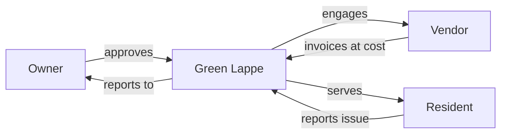

# Green-lappe-brand-style-guide

> Prototype v0.1. Decisions are placeholders, not commitments. Every section is meant to be argued with.

Assumption (stated once): the brand serves two distinct audiences (renters and owners) under one identity, operating in King and Snohomish counties, Washington. The "Green" naming wedge is leaned into literally (color, language, sustainability framing) and figuratively (financial growth, calm, ease). Megan Green is the public face; Kevin Lappe is the operations partner.

---

## 1. Strategic Foundation

### 1.1 Brand Idea (one line)

> The property company that actually answers the phone, and tells you the truth when they do.

### 1.2 Positioning Statement

For owners in King and Snohomish counties who are tired of property managers that disappear after the contract is signed, and for renters who are tired of being treated as a problem to be managed, Green Lappe Properties is a small, owner-operated firm that runs each property like it is the only one we have, because every one of them is someone's home and someone else's retirement.

### 1.3 Why "Green"

Three reinforcing meanings, in priority order:

1. **The founder.** Megan Green is the lead. The name is hers first, the brand second.
2. **Financial growth.** Owners are buying yield, appreciation, and a portfolio that compounds. Green is the universal signal for "the number went up."
3. **Place and stewardship.** The Pacific Northwest is green by default. Leaning into evergreen, mossy, mature-tree palettes ties the brand to the geography without falling into the "leaf-in-a-logo" sustainability cliche.

### 1.4 Brand Pillars

| Pillar | What it means | What it rules out |
|---|---|---|
| `responsive` | Issues acknowledged inside one business day, every time. | Ghosting. Generic auto-replies. "Submit a ticket." |
| `transparent` | Owners see the books. Renters see the repair queue. | Hidden fees. Markup on vendor invoices without disclosure. |
| `local` | Every property within a 90-minute drive of someone who answers to the partners. | National rollups. Out-of-state call centers. |
| `professional` | Licensed, insured, papered, on-time. | Handshake-deal vibes. Cash under the table. |
| `human` | A real name answers, and the same name answers next time. | Rotating account managers. Outsourced support queues. |

---

## 2. Audience Pain Points (the Brand Exists to Solve these)

### 2.1 Renter Pain Points

Drawn from direct experience as a renter, as an owner navigating tenant relationships, and from observed market patterns in the King and Snohomish county rental stock.

| # | Pain point | Brand response |
|---|---|---|
| `R1` | Repair requests vanish into a portal and nothing happens for weeks. | Published response SLAs. Public ticket status. Named technician assigned. |
| `R2` | Habitability issues (no hot water, no heat, mold, leaks) treated as routine. | Emergency tier with a 24-hour fix-or-explain commitment. Cure or credit if missed. |
| `R3` | Move-out deductions feel arbitrary; deposits return slow or short. | Move-in condition photos shared at lease signing. Itemized deductions with receipts, returned inside the statutory window with interest where required. |
| `R4` | Rent increases land by surprise with no rationale. | Annual renewal letter with comparable market data, sent 90 days out. |
| `R5` | "Junk" fees: convenience fees on rent payments, mandatory renter benefits packages, pet rent on top of pet deposits. | One rent number. One pet number. ACH is free. Anything else is itemized and optional. |
| `R6` | No relationship with the actual owner or manager; only with a faceless company. | Each property has a named point of contact with a real phone number and email. |
| `R7` | Lease language is hostile and one-sided. | Plain-language lease addendum that summarizes obligations in both directions. |
| `R8` | Showings and inspections happen with minimum legal notice and zero flexibility. | Scheduled, not surprise. Two-window options. |
| `R9` | Application fees stack up across properties with no transparency on rejection. | One reusable screening report (TransUnion SmartMove or equivalent). Written reason on denial, where lawful. |
| `R10` | Vendors sent to fix things are unvetted, late, or cause more damage. | Approved vendor list, insured, background-checked, scored after every job. |

### 2.2 Owner Pain Points

Drawn directly from the experience of managing the Bothell rental property through a third-party manager, the disputes that arose, and patterns documented in fee statements and management communications.

| # | Pain point | Brand response |
|---|---|---|
| `O1` | Manager makes unilateral decisions (lease renewals, repair authorizations, vendor selection) without owner consent. | Authority matrix in the management agreement. Anything over a defined dollar threshold or term length requires written owner approval. |
| `O2` | Slow or evasive responses when the owner asks hard questions. | Same-business-day acknowledgement standard for owners. Escalation path to a named partner. |
| `O3` | Opaque fee statements; markups on maintenance invoices; "administrative" charges that show up without warning. | Pass-through pricing on all vendor work. Fee schedule fixed at contract signing. Monthly statement reconciled to the dollar. |
| `O4` | Long renewal terms locked in by the manager that the owner did not authorize. | Renewal recommendations go to the owner with a market comp; owner signs off in writing before any offer goes to the tenant. |
| `O5` | Difficulty exiting the management relationship; punitive termination clauses. | 60-day no-fault termination on either side. Clean handoff package guaranteed (keys, documents, deposits, tenant contacts) inside 14 days. |
| `O6` | Manager does not maintain records the owner needs for taxes, depreciation, insurance, or eventual sale. | Year-end owner packet: income statement, expense register categorized to Schedule E lines, capital improvement schedule, depreciation-relevant items flagged. |
| `O7` | No proactive view of the asset; manager is reactive only. | Annual property review: condition, market position, recommended capex, rent benchmark, retention vs turnover call. |
| `O8` | Tenant placement is rushed and unscreened, creating worse problems downstream. | Documented screening criteria. Owner sees the application package before approval. |
| `O9` | Manager carries inadequate E&O or general liability; owner is exposed. | Insurance certificates published to owner annually. Named-additional-insured on relevant policies. |
| `O10` | No clear answer on whether unusual property uses (e.g., licensed family child care) are permitted, insurable, or financially sound. | Specialty in mixed-use residential strategy, including FCC and licensed daycare conversions. This is the company's defensible edge. |

### 2.3 Where the Two Audiences Converge

The same answer serves both: **a small portfolio of properties, each one known by name, managed by people who are reachable and accountable.** The brand should never feel like it has to translate between audiences. The same values, voice, and standards apply.

---

## 3. Verbal Identity

### 3.1 Name

- **Legal / brand name**: Green Lappe Properties
- **Pronunciation**: "Green LAP-ee" (rhymes with `happy`)
- **Short form**: Green Lappe
- **Never**: Green Lapi, Green Lap, GLP in customer-facing copy (internal acronym is fine)

### 3.2 Tagline Candidates

Ranked, top is the working pick.

1. *Your property. Our problem.*
2. *Homes managed like they're ours.*
3. *Property management that answers.*
4. *Small portfolio. Personal service.*
5. *King and Snohomish, done right.*

### 3.3 Voice

| Trait | Do | Do not |
|---|---|---|
| Direct | "Your roof needs replacing in the next two years. Here is the bid." | "We wanted to gently raise a longer-term consideration regarding the roof." |
| Plain | "Rent is due on the first. Late fee on the sixth." | "Pursuant to Section 4.2 of the lease agreement, rent shall be tendered…" |
| Warm | "Welcome home. Here is what to expect in the first 30 days." | "Tenant is hereby provided the following onboarding materials." |
| Calm | "Hot water out? Call this number. We have a plumber on standby." | "We regret the inconvenience and appreciate your patience as we work to resolve…" |
| Honest | "We do not manage commercial buildings. Try X or Y." | "Let us see what we can do!" (when the answer is no) |

### 3.4 Words to Use and Avoid

**Use**: home, owner, resident, neighbor, repair, response, your, ours, fixed, paid, signed, returned.

**Avoid**: stakeholder, leverage, solutions, synergies, family (in marketing copy; reserved for actual families), unbeatable, premier, luxury, world-class, value-add.

---

## 4. Visual Identity

### 4.1 Color System

The "Green" wedge gets executed as a Pacific Northwest evergreen palette, not a startup-mint or corporate-finance green. Palette is built for accessibility (WCAG AA at body text sizes) and for looking correct against the gray sky that defines the region eight months a year.

| Token | Hex | Use |
|---|---|---|
| `moss` | `#2F4A3A` | Primary brand color. Logo, headings, primary buttons. |
| `evergreen` | `#1B2E25` | Body text, deep accents, footers. |
| `lichen` | `#A8B89E` | Secondary surfaces, dividers, muted UI. |
| `fog` | `#E8E6E1` | Page background warm-neutral. |
| `bark` | `#5C4A3A` | Owner-facing accents (financial documents, statements). |
| `rain` | `#5C6B73` | Renter-facing accents (portal, repair status). |
| `signal` | `#C44536` | Reserved for warnings and overdue states. Used sparingly. |
| `paper` | `#FAFAF7` | Document and form background. |

**Rule**: never use pure black (`#000000`) or pure white (`#FFFFFF`) in brand surfaces. Use `evergreen` and `paper` instead. Pure black against a green logo looks like a hospital sign.

### 4.2 Typography

| Role | Typeface | Notes |
|---|---|---|
| Display / headlines | `Fraunces` | Serif with optical sizes, slight warmth, good at large sizes. |
| Body / UI | `Inter` | Workhorse. Reads cleanly at small sizes. |
| Monospace / data | `JetBrains Mono` | Statements, fee tables, code-like data. |

Type scale, base `16px`:

```mermaid
display     48 / 56
h1          32 / 40
h2          24 / 32
h3          20 / 28
body        16 / 24
small       14 / 20
caption     12 / 16
```

### 4.3 Logo Direction (concept, Not artwork)

The logo wordmark sets `Green Lappe` in `Fraunces` semi-bold, with the two words on a single line, slightly tightened tracking. The mark is the wordmark. No separate icon at launch.

If a secondary mark is needed (favicon, social avatar, lapel pin), the mark is a stylized capital `G` whose interior counter is shaped to evoke a Douglas fir silhouette. The shape must read at `16px`. Avoid: house icons, key icons, roof icons, leaf icons, sunbursts, anything resembling a real estate yard sign cliche.

### 4.4 Imagery

- Photography over illustration.
- Real properties, real exteriors, real PNW weather. Overcast is on-brand. Do not retouch out the gray sky.
- People appear in photos at human scale, not heroic. Megan in front of a porch, not Megan crossing arms on a brand wall.
- No stock photos of skylines, handshakes, or keys-in-palms.

### 4.5 Diagrammatic Language

Process and authority flows use the diagrammatic style below for owner-facing documents.



---

## 5. Application: how This Shows up in Practice

### 5.1 Owner-facing Documents

- Monthly statement: `paper` background, `bark` accent strip, JetBrains Mono for numeric columns, plain-English line items, every fee tied to a contract clause.
- Annual review packet: bound or single-PDF, includes income statement, expense detail, capital improvement log, rent benchmark, retention recommendation, photos of property condition.
- Management agreement: max 12 pages. Authority matrix on page 2. No surprises.

### 5.2 Resident-facing Documents

- Welcome packet: how to pay rent, how to report repairs, who to call, what to expect, lease in plain language.
- Repair confirmation: timestamped acknowledgement, named technician, SLA tier, ETA.
- Move-out statement: itemized, photographs attached, receipts attached, returned inside the WA statutory window (`21 days` for the residential portion).

### 5.3 Digital Presence

- Single domain at launch. Recommendation: `greenlappe.com` (verify availability before committing).
- One-page site at launch. Sections: what we do, who we serve, how we are different, who we are, get in touch.
- No live chat bot. A phone number and an email, both monitored.
- Social presence is optional and limited. LinkedIn for Megan. Nothing else until there is a reason.

### 5.4 Operational Signals (the Brand Made tangible)

The brand promise must be enforceable at the policy layer, not the marketing layer. The following are commitments the brand makes that competitors typically do not:

- 24-hour fix-or-explain on habitability issues.
- Same-business-day acknowledgement for owner inquiries.
- Pass-through vendor pricing with original invoices attached.
- 60-day no-fault termination either direction.
- Deposit returned with photo-documented itemization inside statutory window.
- Annual property review for every owner, every year, no extra fee.

---

## 6. Differentiation: what This Brand is Not

To stay sharp, name the alternatives the brand is consciously rejecting.

| Competitor archetype | What they do | Why Green Lappe is different |
|---|---|---|
| National rollup (e.g., Mynd, Evernest acquirees) | Standardized platform, call center support, opaque fee stacks. | Local, named contacts, transparent fees. |
| Generic local PM | Owner-operated but inconsistent, paper-based, ghosts both sides. | Same local presence, plus modern systems and published SLAs. |
| Realtor-side PM | Treats management as a loss leader to win listings. | Management is the product, not a funnel. |
| DIY landlord using a platform (Avail, TurboTenant) | Owner does the work themselves. | Useful tier for owners who outgrow DIY and want a partner, not a vendor. |

---

## 7. The Daycare Wedge (strategic differentiator)

Green Lappe is, to the partners' knowledge, the only small property management firm in King and Snohomish counties actively building competence in licensed family child care conversions. This is the long-term competitive edge.

- **For owners**: a property type with materially higher revenue per square foot than standard residential, with a structure that survives mortgage covenants, insurance carriers, and zoning.
- **For renters**: not a primary audience for this wedge. The "renter" in this case is a licensed provider, treated as a small business tenant.
- **Brand implication**: do not put this on the homepage. It is the offering that closes the second meeting with a sophisticated owner. The brand should signal range and competence, not lead with a niche.

---

## 8. Open Questions (not decided)

These are flagged as decisions the partners need to make before this guide moves from prototype to v1.0.

1. Legal entity structure (PropCo / OpCo split, or single LLC). Affects how the brand is signed on contracts.
2. Whether to operate under `Green Lappe Properties` only, or under a parent brand with a `Green Lappe Childcare` sister brand for the daycare wedge.
3. Service area scope at launch: King and Snohomish counties as stated, or tighter (e.g., Bothell / Mill Creek / Kirkland corridor) for the first 12 months.
4. Pricing model: flat fee per property per month, percent of rent, or hybrid.
5. Whether Megan or Kevin signs management agreements. Brand consistency favors Megan as the named principal.
6. Domain selection and trademark search on the wordmark.
7. Whether to commission a logo designer or hold at wordmark-only through year one.

---

## 9. Versioning

| Version | Date | Author | Notes |
|---|---|---|---|
| `0.1` | 2026-05-17 | Kevin | Initial prototype. Built from pain points documented in prior owner experience and from market observation. |
