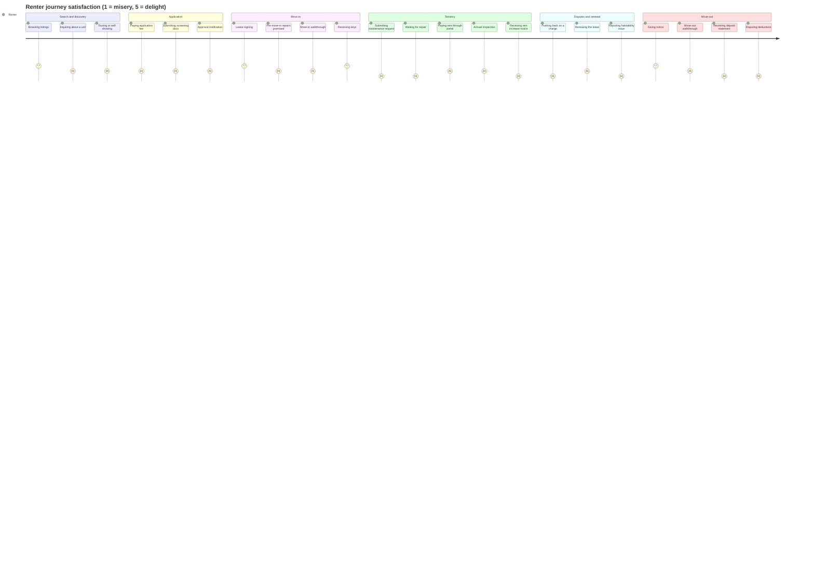
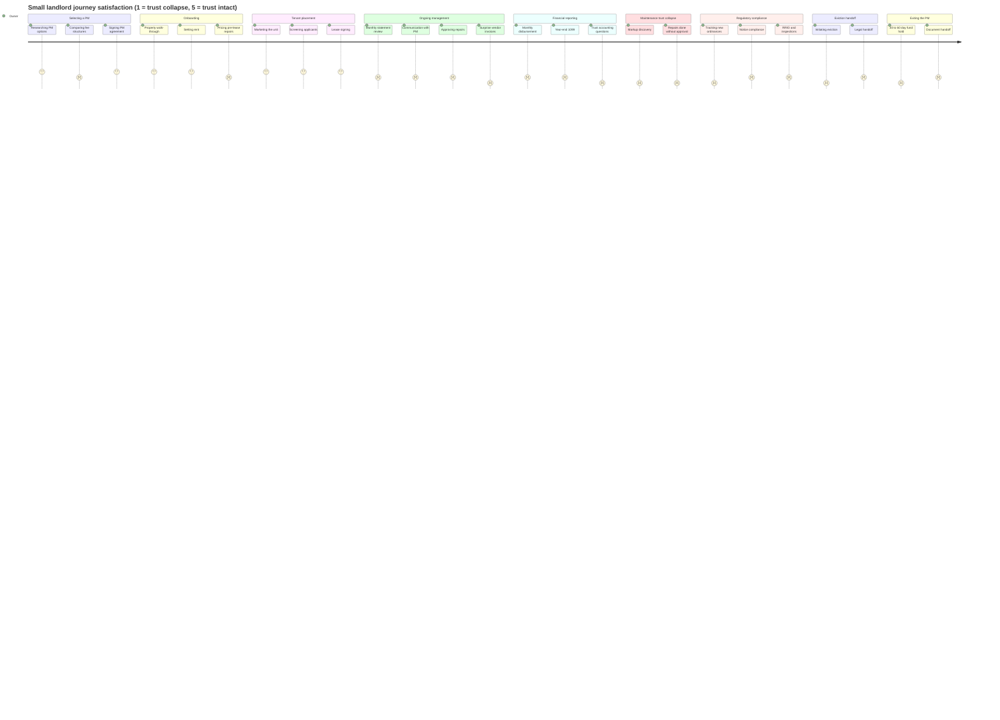
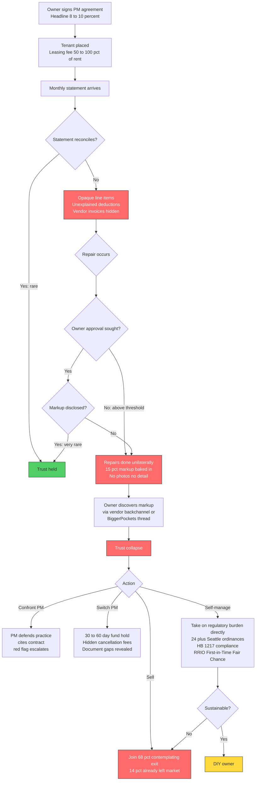
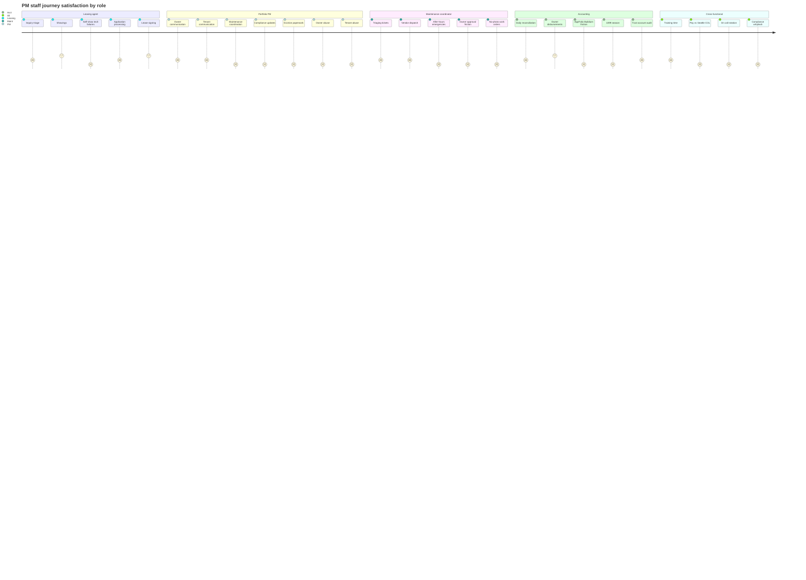
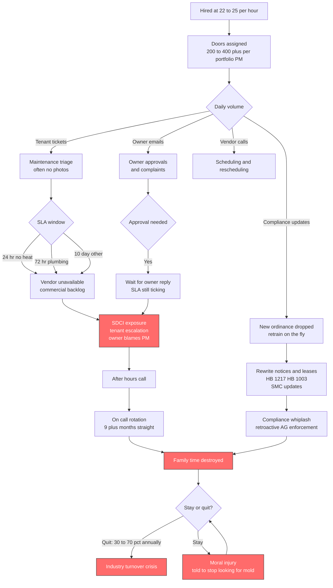
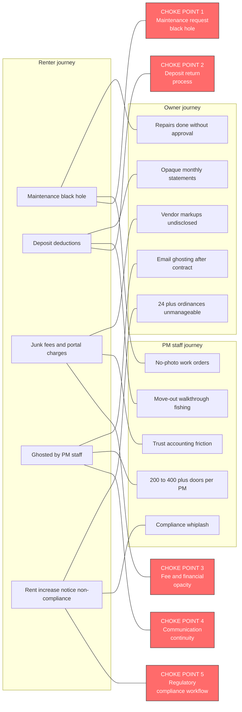
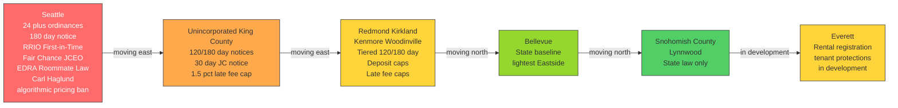
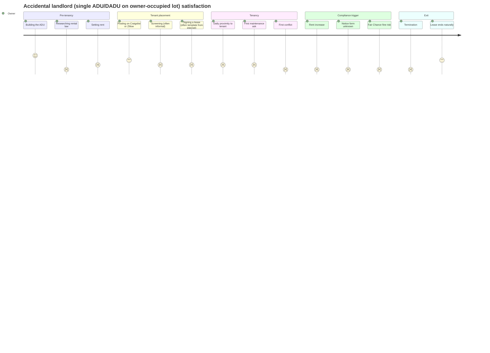

# User Journey Map V1

## Executive Summary

Three personas, one broken middle. Renters, small landlords (1 to 20 doors), and property management staff in King and Snohomish County each describe being failed by the same operating model. The same three structural failures keep surfacing: communication black holes, fee and financial opacity, and a regulatory environment that mutates faster than anyone's playbook.

The Seattle Auditor reported a 14% net loss of 1 to 20 unit RRIO-registered rentals between 2018 and 2022, and RHAWA's 2024 survey found 68% of small housing providers have sold or are contemplating selling. PM staff in the middle absorb both sides at sub-$25/hr leasing wages, 200 to 400+ doors per portfolio manager, and on-call rotations running nine months straight. The persona-defining quote across roles is "nobody's looking out for us."

The five highest-leverage workshop priorities are the maintenance request black hole, the deposit return process, fee and statement transparency, communication continuity, and the regulatory compliance workflow.

---

## How to Read This Document

Each persona has four sections in this order:

1. A Mermaid journey chart scoring satisfaction by stage (1 to 5).
2. A Mermaid flowchart of the pain cascade for that persona.
3. A detailed stage table with actions, touchpoints, pains, emotions, anonymized verbatims, and design opportunities.
4. A "what good looks like" section drawn from positive reviews and competitor models.

After the three personas, three cross-cutting diagrams visualize where the journeys collide, how the regulatory burden grades across PNW jurisdictions, and how the accidental landlord sub-persona diverges from the multi-property owner.

The appendix carries pain severity x frequency matrices, "how might we" prompts, design principles, and a scan of alternative PM operating models (Belong, Mynd, Doorstead, Ziprent, Latchel, Property Meld, Lessen, Poplar).

---

## Persona 1: Renter

### Persona Snapshot

A King or Snohomish County renter signing a 12-month lease on a single-family home, townhouse, condo, or small multifamily unit through a property management company. Median household paying $2,200 to $3,800 monthly rent against an income required to clear 2.5x to 5x that figure. Often relocating from out of state, often a tech worker, often a family with kids, often a household with limited English proficiency or recent US credit history. Universally entering the relationship already braced for harm.

### Renter Satisfaction by Stage

### Renter Pain Cascade

```mermaid
flowchart TD
    A[Renter signs lease] --> B{Move-in condition matches listing?}
    B -->|No| C[Listed defects ignored<br/>Mold painted over<br/>Yard overgrown]
    B -->|Yes| D[Daily tenancy begins]
    C --> D
    D --> E{Maintenance issue arises}
    E --> F[Submit ticket via portal]
    F --> G{Response within SLA?}
    G -->|No: most common| H[Maintenance black hole<br/>Ghosted for weeks]
    G -->|Yes: rare| I[Vendor dispatched]
    H --> J[Habitability degrades<br/>Mold spreads<br/>Heat fails]
    I --> K{Issue actually fixed?}
    K -->|No| H
    K -->|Yes| L[Tenant pays rent on time]
    J --> M[Tenant complains in writing]
    M --> N{PM response}
    N -->|Retaliation| O[Surprise rent increase<br/>Lease non-renewal<br/>Inspection fishing expedition]
    N -->|Cosmetic fix| J
    N -->|Real fix: rare| L
    L --> P{Annual rent increase}
    P --> Q[10% statewide cap<br/>180 day notice in Seattle<br/>Notice often non-compliant]
    Q --> R{Renew or leave?}
    R -->|Leave| S[Move-out walkthrough]
    R -->|Renew| L
    O --> S
    S --> T[30 day deposit return per RCW 59.18.280]
    T --> U{Deposit returned?}
    U -->|Withheld with vague itemization| V[Trust collapse<br/>Small claims threat<br/>Bill sent to collections]
    U -->|Returned: rare| W[Relationship ends cleanly]
    V --> X[Credit damage<br/>Future rentability harmed]

    style H fill:#ff6b6b,stroke:#333,color:#fff
    style J fill:#ff6b6b,stroke:#333,color:#fff
    style O fill:#ff6b6b,stroke:#333,color:#fff
    style V fill:#ff6b6b,stroke:#333,color:#fff
    style X fill:#ff6b6b,stroke:#333,color:#fff
    style L fill:#51cf66,stroke:#333
    style W fill:#51cf66,stroke:#333
```

### Renter Stage-by-stage Detail

#### Stage 1: Search and Discovery

| Dimension | Detail |
| --- | --- |
| Actions | Browses Zillow, Apartments.com, Craigslist, Trulia, Redfin Rentals. Sends inquiries. Books tours or self-showings. |
| Touchpoints | Listing photos, PM agent email, Tenant Turner/ShowMojo lockboxes, drive-by visits. |
| Top pains | Photo-vs-reality gap. Defects hidden under fresh paint. Ghost listings impersonating real addresses. Inquiry response broken: agents disclose receiving "25 to 50 inquiries a day" and treating individual prospects as fungible. First-in-Time rule structurally favors applicants with cars, flexible work hours, no language barrier. |
| Emotions | Anxious, suspicious, time-pressured. |
| Verbatim | "Most of the issues we had were from the photos not being accurate of the property's condition. Yard overgrown, fireplace not functional, slick moss on the driveway." |
| Verbatim | "My son and I would have no idea of the mold and moisture painstakingly hidden beneath new coats of paint." |
| Design opportunity | Verified listing photos with timestamp metadata. Pre-tour disclosure of known defects. Inquiry triage that responds to every prospect with a status, not silence. |

#### Stage 2: Application

| Dimension | Detail |
| --- | --- |
| Actions | Pays $40 to $75 application fee. Submits ID, paystubs, references, background consent. Waits for decision. |
| Touchpoints | PM screening portal (TransUnion SmartMove, RentPrep, Buildium tenant screening), email, automated approval/denial notices. |
| Top pains | Application fee stacking against First-in-Time odds. Bait-and-switch where advertised rent rises at signing. Income multipliers exceeding RCW 59.18.257. Portable screening reports refused despite state authorization. Approval notices arriving with no human follow-up; some applicants miss the acceptance window entirely. |
| Emotions | Powerless, transactional, "treated as inventory." |
| Verbatim | "When they finally accepted our application they tried to get us to quickly sign the lease with an increase in the rent by 15% more than the advertised price. When I called to dispute the rent hike I was told 'that's the game.'" |
| Verbatim | "Finally approved but have not received any contact from property management. Only automated email saying I was approved." |
| Design opportunity | Honor portable screening reports by default. Quote the all-in monthly cost (rent + portal fee + utility billing + mandatory amenities) at inquiry, not at signing. Human-confirmed approval with a clear 48 hour acceptance window. |

#### Stage 3: Move-in

| Dimension | Detail |
| --- | --- |
| Actions | Signs lease, pays deposit + first/last + move-in fee, schedules movers, walks the unit with PM or alone. |
| Touchpoints | DocuSign lease, AppFolio/Buildium portal setup, RCW 59.18.260 move-in checklist, key handoff. |
| Top pains | Promised pre-move-in repairs uncompleted. Move-in checklist skipped (despite the legal consequence: no checklist, no deposit retention). Active hazards present at handover (rat nests in heat vents, broken HVAC, mold). |
| Emotions | Disappointed, second-guessing the decision, already documenting defensively. |
| Verbatim | "We've been living for almost a year in our house and still most of the maintenance stuff that was noted on the original walk-through inspection still hasn't been completed." |
| Verbatim | "All heat vents broken and filled up with rat nests. Heat insulators were dismantled. We had got diseases because of rats." |
| Design opportunity | Mandatory video walkthrough at move-in, tenant-controlled, timestamped, stored to a shared ledger neither party can unilaterally edit. Pre-move-in repair commitments with enforceable completion dates. |

#### Stage 4: Tenancy (the Daily Life pain)

This is where the highest density of pain lives and where design has the most leverage. Five sub-pains, each persistent.

**Sub-pain 4a: The maintenance request black hole**

| Dimension | Detail |
| --- | --- |
| Actions | Submits ticket via portal, email, or phone. Waits. Submits again. Calls. Emails. Eventually escalates. |
| Touchpoints | AppFolio/Buildium/RentRedi maintenance modules, vendor dispatch, follow-up surveys (rarely). |
| SLA reality | RCW 59.18.070 requires 24 hour response for no heat or no water, 72 hours for plumbing, 10 days for other repairs. Tenant reports of 4 weeks with no power and "over a month" for ordinary repairs are common. |
| Verbatim | "I have not had power to my apartment for going on 4 weeks now. Cornell and associates have not provided adequate support to me or my family as tenants." |
| Verbatim | "They don't respond to maintenance requests or make needed repairs in a timely fashion (usually takes over a month)." |
| Design opportunity | Latchel-style 60-second response guarantee with video troubleshooting. SLA timer visible to the tenant. Automatic escalation to the portfolio PM at the 72-hour mark. Status push notifications, not silence. |

**Sub-pain 4b: Mold, moisture, and the PNW signature failure**

| Dimension | Detail |
| --- | --- |
| Legal context | RCW 59.18.060(13) requires landlords to provide a mold pamphlet; no state law requires remediation, only repair of the underlying water source. Tenants Union of Washington: "Other than a requirement to provide written information, there are no state laws governing landlords' responsibilities regarding mold removal." |
| Verbatim | "We had a leak from outside, got moldy in our apartment and they still made excuses. We moved out 2 to 3 weeks after that, we had water ants, mold was affecting our health with respiratory and rash issues." |
| Verbatim (PM insider) | "Overhearing the owners ask if they can just make it look fixed so it can be the next person's problem was disheartening. If we could stop 'looking for the mold.'" |
| Design opportunity | A PM that adopts mold remediation as a default service rather than a contested line item creates strong differentiation, especially in pre-1940 SFR housing stock dominant in Seattle. |

**Sub-pain 4c: Heat and AC, the climate-tipping issue**

| Dimension | Detail |
| --- | --- |
| Context | Pre-2021, only 30% of Seattle-area rentals had AC. The 2021 heat dome killed an estimated 441 Washingtonians (UW). Oregon banned landlord restrictions on portable AC. Washington has not. |
| Verbatim | "Park 52 has left me without hot water 2 times for 3 days. They refuse to complete or hire a plumber that is not their own." |
| SDCI position | Space heaters as a "permanent" fix to a boiler failure constitute "essentially a pseudo-eviction." |
| Design opportunity | Climate-adapted habitability standard: a PM committing to repair boilers within 72 hours and to permit tenant-installed portable AC by default takes a position the law has not yet caught up to. |

**Sub-pain 4d: Junk fees, portal fees, and payment friction**

| Dimension | Detail |
| --- | --- |
| Pattern | $20/month portal fees disclosed only after move-in. Check-payment surcharges of 8 to 10%. Tenants forced to drive to a physical office to pay rent when the portal rejects payment, then charged late fees when the office is closed. |
| Verbatim | "I have to beg to pay them and it is starting to compile and cost additional fees." |
| External research | Urban Institute and NCLC research show rental junk fees can add 10 to 30% to monthly cost. |
| Design opportunity | All-in monthly cost disclosed at inquiry. ACH and credit/debit accepted without surcharges. No portal fee. No service charge on routine maintenance requests. |

**Sub-pain 4e: Rent increase notices and Seattle's 180-day rule**

| Dimension | Detail |
| --- | --- |
| Legal context | Seattle requires 180 days written notice before any cost increase (rent or fees). HB 1217 caps 2026 statewide increases at 9.683% with 90-day statewide notice. WA AG took a retroactive enforcement position in August 2025 and fined eight landlords for notice defects. EDRA triggers at 10% (driving documented gaming behavior with raises capped at 9.8 to 9.9%). |
| Verbatim | "Been in our Bellevue unit 3.5 years, Brink new landlords. Raises our rent 10% but only repairs the legalities. And charges us $100 just to process our renewal." |
| Design opportunity | Compliance-by-default notice generator with the exact Commerce-prescribed form for every jurisdiction, dated 180 days back-calculated. Renewal fees eliminated. |

#### Stage 5: Disputes, Retaliation, Language Access, ADA

| Dimension | Detail |
| --- | --- |
| Retaliation pattern | Documented in the SeaSol-organized Beacon Hill case at Thai Columbian Apartments: 25% rent hikes after tenants pushed for repairs; most tenants pushed out within months. |
| Language access | Seattle and King County require translations of city notices into 13+ languages, but private leases and disclosures are typically English-only despite material populations of Vietnamese, Spanish, Amharic, Somali, Oromo, Tigrinya, Khmer, Mandarin, Hindi, Telugu, Russian, and Korean speakers across the region. |
| Verbatim (Rep. Nicole Macri) | "Tenants can try to seek a resolution in small claims court. But very few are successful going that route and many are intimidated going that route." |
| Design opportunity | Lease and habitability disclosures available in the top 10 PNW languages by default. A retaliation-flag system that auto-escalates any rent increase or non-renewal issued within 90 days of a written habitability complaint. |

#### Stage 6: Move-out and Deposit

| Dimension | Detail |
| --- | --- |
| Legal context | RCW 59.18.280 requires deposit return or itemized statement with supporting invoices within 30 days. Solid Ground reports "between a third and half of the calls we get are related to deposits." |
| Verbatim | "They have taken my deposit of $2600 and charged me another $385 on top for a preexisting condition. Sink had paint chip, blinds, and a 'Hotel' standard cleaning of more than $1700." |
| Verbatim | "When I asked for a breakdown of how the cleaning bill was determined, they wouldn't give it and told me to let them know if this matter was going to small claims court." |
| Verbatim | "Good luck ever getting a deposit back because they'll come up with a laundry list of bs to steal it from you, if not send you a bill for more in the mail." |
| Design opportunity | Deposit-return SLA dashboard with mandatory before/after photo pairs for every itemized charge. RentCheck-style side-by-side comparison of move-in and move-out inspections. Default position of "no deduction without comparison photo." |

### What Good Looks like (renter side)

Positive reviews almost never name the company. They name a person. A Park 52 tenant: "This kind soul skipped a Seattle Seahawks Monday game (she was dressed like a diehard fan) to check on me when the upstairs tenant's bathtub leaked into my condo." A North Pacific tenant: "Ten years into my relationship with North Pacific and hiring them is up there with one of the best business decisions I've ever made."

Belong Home explicitly markets to the renter as the customer: "find the perfect home to love, receive exceptional care, and take advantage of financial services geared towards renters." This is rare and is the design pattern that breaks the renter-as-inventory model.

---

## Persona 2: Small Landlord (1 to 20 doors)

### Persona Snapshot

A King or Snohomish County owner with one to twenty doors. Likely an "accidental landlord" who inherited, relocated, or converted, or a small intentional investor with a 1 to 4 unit portfolio. Often out-of-state, sometimes active-duty military. Cash flow sensitive. Sees PMs as a black box that absorbs 10 to 20% of gross rent and a much larger share of repair spend. Watching peers exit the Seattle market and weighing the same decision.

### Owner Satisfaction by Stage

### Owner Trust Collapse Cascade

### Owner Stage-by-stage Detail

#### Stage 1: Selecting a PM

| Dimension | Detail |
| --- | --- |
| Actions | Reads reviews, gets referrals, requests proposals from 2 to 4 PMs. Compares headline fees. |
| Touchpoints | PM websites, BiggerPockets, RHAWA, Zillow PM directory. |
| Top pains | Headline percentage masks all-in cost. Industry guides admit "a company charging 8% with 15% maintenance markup may actually cost more than one charging 10% with no markup." Leasing fees of 50 to 100% of one month's rent recur on every turnover. Renewal fees of $250 to $450 layered on top. Contracts lock in for 1 to 2 years with 30 to 90 day notice windows. |
| Emotions | Skeptical, time-pressured, wary of being upsold. |
| Verbatim | "I hate a model that is by design, counter to the property owners best interest. One that rewards churn and that doesn't hold a manager accountable for bad decisions." |
| Competitor signal | Next Brick ("0% markup"), PPM NW ("Zero Maintenance Markup"), GPS Renting ("no leasing fee"), Doorstead (5% management), Ziprent ($150/mo flat) all market explicitly against the standard model. |
| Design opportunity | All-in cost calculator at inquiry. Flat-fee with no markup. Month-to-month default. No leasing fee on tenant renewal. |

#### Stage 2: Onboarding

| Dimension | Detail |
| --- | --- |
| Top pains | Out-of-state and active-duty military owners get the worst service. T-Square BBB case (deployed servicemember): PM "allowed prior tenants to leave with $6,000 in unaddressed wall damage, falsely reported a punch-list complete, then resulted in 90 days extra vacancy." |
| Design opportunity | Onboarding inspection conducted by an independent inspector, not the PM, with photo evidence delivered to the owner. Pre-lease repair quotes from at least two vendors. |

#### Stage 3: Tenant Placement

| Dimension | Detail |
| --- | --- |
| Top pains | Slow inquiry response loses applicants and extends vacancy. Weak screening places problem tenants; RHAWA's 2024 data shows King County eviction timelines of 12 to 24 months; one reported case ran 16 months arrears plus 2 years to evict. First-in-Time and Fair Chance Housing compliance traps create owner anxiety. |
| Verbatim (PM marketing) | "A bad property manager tries to 'wing it.' They might use outdated leases that don't comply with current Washington State laws. In Seattle, a simple legal misstep can result in massive fines or the inability to evict a non-paying tenant." |
| Design opportunity | Mynd and Doorstead both publish delinquency rates (<2% and 1% respectively); a published, audited delinquency rate would let an owner price-discriminate based on screening quality rather than headline fee. |

#### Stage 4: Ongoing Management

| Dimension | Detail |
| --- | --- |
| Top pains | Email ghosting after the contract is signed. Owners feel they're "managing the manager." Buildium 2026 survey: only 23% of small-portfolio owners say their PM delivers excellent value today; 84% want approval on large-ticket repairs before they're done. |
| Verbatim (PM marketing, again) | "You hired a property manager to take things off your plate, not add more to it. If you constantly feel the need to 'manage the manager,' you're not getting the service you paid for." |
| Verbatim (owner) | "They are very slow in taking care of maintenance and never return your calls." |
| Design opportunity | Named portfolio PM with a single phone number and email that does not change when staff turn over. Weekly summary push to the owner whether or not anything happened (silence has been weaponized). |

#### Stage 5: Financial Reporting

| Dimension | Detail |
| --- | --- |
| Top pains | Late, irregular disbursements signal possible trust accounting problems. Monthly statements are opaque. 1099/year-end tax doc delays and errors. |
| Verbatim (BBB complaint) | "We have over $7,300 that has been deposited with them since November 2023 for repairs that they have yet to complete. Either they don't know this money is there or dissemble." |
| Legal context | Washington WAC 308-124E-105/115 requires designated-broker-supervised trust accounts with monthly three-way reconciliation. |
| Design opportunity | Public-ledger style statements with every dollar in/out timestamped. Same-day ACH on rent collection. Three-way reconciliation report visible to owner monthly. |

#### Stage 6: Maintenance, the Trust Collapse

| Dimension | Detail |
| --- | --- |
| Top pains | Vendor markups of 10 to 15% on every invoice without disclosure. A 2023 PM operator on BiggerPockets admitted: "I charge a standard 15% mark up on 100% of repairs we do for our clients." Repairs done without owner approval above thresholds. Invoices arrive without photos or vendor detail. |
| Verbatim | "He came back and said that discussing price discounts that he's established with vendors wasn't appropriate. This was a huge red flag for me. Fundamentally I'm paying a property manager to protect my investment, not pocket money on the side from construction arrangements with vendors." |
| Verbatim | "They billed my rent money from my tenant for work that was incomplete and not done at all from their vendors and refuse to let me see the vendors invoice or dispute the charges for work they never completed." |
| Design opportunity | Pass-through vendor invoicing with the actual vendor invoice attached and viewable by the owner. Approval thresholds set by the owner at onboarding (e.g., anything over $500). Vendor performance scoring visible to the owner. |

#### Stage 7: Regulatory Compliance

| Dimension | Detail |
| --- | --- |
| The persona-defining pain | 24+ Seattle tenant protection ordinances since 2016. HB 1217 statewide rent stabilization signed May 7, 2025; 9.683% cap for 2026; 90-day statewide notice; retroactive AG enforcement. Seattle's 180-day notice for any cost increase. EDRA triggered at 10%. RRIO registration and inspection every 2 years (2023 Seattle audit: 10% of owners had registration problems, 13% had inspection difficulties). First-in-Time. Fair Chance Housing (9th Circuit "can ask but can't use" paradox). Just Cause Eviction with 18 grounds. Roommate Law. HB 1003 (July 2025) requiring exact calendar dates and certified mail. 30-day deposit return under RCW 59.18.280. $10 late fee cap. Move-In Fee installment mandates. |
| Verbatim | "So much has changed so quickly. There's landmines everywhere. Nobody's looking out for us." (Angie Gerrald, 3-unit Seattle landlord, Post Alley) |
| Verbatim | "Every small landlord that we know in Seattle has an exit strategy to divest and leave the city." (MariLyn Yim, Seattle Grassroots Landlords) |
| Design opportunity | Compliance-as-a-service: every notice generated automatically with the correct jurisdiction-specific form, correct calendar math, correct service method. Audit log per property. Buildium 2026: rental owners hiring PMs primarily for compliance jumped from 21% in 2021 to 33% in 2025; this is a growing willingness-to-pay segment. |

#### Stage 8: Eviction and Legal Handoff

| Dimension | Detail |
| --- | --- |
| Top pains | PMs are often unwilling to push evictions and charge premium hourly rates when they do. $20,000+ on a single eviction with limited PM support. |
| Verbatim | "They use legal jargons to scare you. When you respond back with same legal language, they simply do not respond and ask you to get a lawyer." |
| Design opportunity | Eviction defense partnership with a known landlord-tenant firm with published flat-fee pricing for each step (3-day, 14-day, UD filing, writ, sheriff coordination). |

#### Stage 9: Exiting the PM

| Dimension | Detail |
| --- | --- |
| Top pains | 30 to 60 day fund hold under standard reserve clauses. Document handoff is incomplete. Hidden cancellation fees and missed 30 to 90 day kick-out windows trap owners into another year. |
| Design opportunity | Month-to-month default with documented offboarding SLA: funds released within 7 days of final reconciliation, full document package (lease, ledger, vendor history, inspection reports, compliance audit) delivered within 14 days. |

### What Good Looks like (owner side)

Belong's value proposition is concierge-as-a-product: a named human, 24/7, app-based approval flow on every estimate. Doorstead publishes its 1% delinquency rate as a screening guarantee. Mynd offers a $5,000 rental income guarantee and $5,000 eviction cost coverage. PURE Property Management uses an "owner hub" with photo documentation on every work order.

The consistent positive pattern: a named portfolio PM the owner can name from memory, with multi-year continuity. A North Pacific owner: "Ten years into my relationship with North Pacific and hiring them is up there with one of the best business decisions I've ever made."

---

## Persona 3: Property Management Staff

### Persona Snapshot

The person in the middle. Leasing agent at $22 to $25/hr, portfolio PM with 200 to 400+ doors, maintenance coordinator on a nine-month on-call rotation, accountant reconciling a trust account that has zero margin for error. Working for a PM company that signed both the renter and the owner agreements and is now experiencing both sides' fury simultaneously. Burning out, churning at 30 to 70% annually, and often morally injured by being told to "stop looking for the mold."

### PM Staff Satisfaction by Role

### PM Staff Burnout Cascade

### PM Staff Role-by-role Detail

#### Leasing Agents and Front Desk

| Dimension | Detail |
| --- | --- |
| Workflow | Prospect inquiry triage (25 to 50/day per agent), scheduling, self-show lockbox management, application processing under First-in-Time, lease prep. |
| Top pains | Prospect volume overwhelms manual scheduling. Self-showing lockbox tech failures (Tenant Turner, ShowMojo battery deaths, location-service errors). Fair Chance Housing operationally confusing: 9th Circuit ruled landlords may ask about criminal history but cannot use it; SOCR enforcement carries fines up to $11,000 first offense and $55,000 for repeats. First-in-Time paperwork has 5+ compliance steps that PM software handles awkwardly. |
| Verbatim | "I get between 25 to 50 emails/inquiries a day and that somehow my email must have fallen through the cracks." |
| Design opportunity | Inquiry triage automation that gives every prospect a tracked status. Lockbox tech with battery monitoring and fallback access. Compliance-aware application workflow that hard-blocks Fair Chance violations. |

#### Portfolio Property Managers

| Dimension | Detail |
| --- | --- |
| Workflow | Owner communication, tenant communication, maintenance coordination, compliance, eviction paperwork, renewal cycles. |
| Top pains | Doors-per-PM ratios of 200 to 400+ vs industry sustainability of 150 to 200 for SFR. Cornell & Associates' structure implies ~600 units per named PM. PNW tech-worker owners treat their PM as a 24/7 concierge. Tenants direct rage about rent increases and deposits at the PM, not the absentee owner. |
| Verbatim | "Everything is micromanaged to the point of the asset manager telling people who they can or can't talk to. Constantly told not to get burnt out but had more and more work added. Days off were constantly interrupted with texts and calls. Pay is low for the Seattle area and raises are a battle." |
| Verbatim | "Balancing Stakeholder Interests: Navigating conflicts between tenants, vendors, and property owners can be challenging." |
| Design opportunity | Hard cap on doors-per-PM at 150. Asynchronous owner and tenant communication channels that batch and digest rather than interrupt. Named back-up PM for time off. |

#### Maintenance Coordinators

| Dimension | Detail |
| --- | --- |
| Workflow | Triage incoming work orders, dispatch vendors, coordinate owner approval, follow up on completion, close ticket. |
| Top pains | Vendor shortages: HVAC techs and plumbers prioritize commercial accounts; small PMs wait days. SDCI 24/72-hour rules turn delays into legal exposure. Henderson Properties: "HVAC companies average $150 to $250 per diagnostic visit." Latchel: "average HVAC repair costs have increased by 48.7% year over year." After-hours emergency calls drive on-call rotation. Work orders arrive without photos. Owner approval friction stalls repairs past SDCI deadlines. |
| Design opportunity | Latchel/Property Meld/Lula-style outsourced 24/7 coordination, freeing the in-house coordinator from after-hours work. Mezo-style AI ticket triage that asks the tenant clarifying questions and attaches photos before dispatch. Pre-approved vendor list with auto-approval up to owner-set threshold. |

#### Accounting

| Dimension | Detail |
| --- | --- |
| Workflow | Daily rent reconciliation, vendor payables, owner disbursements, trust account three-way reconciliation, 1099 season. |
| Top pains | Washington WAC 308-124E trust accounting compliance. AppFolio reviewer with 360 units: "almost nothing in the program is live; reports must be generated to view info for most tasks then drilled down." Another: "The accounting system is clunky and needs constant work arounds." Buildium reviewers cite "outrageous cost," removed integrations, 1099 mailing failures. 1099 season inflates income reporting because suppressed-fee handling doesn't reconcile cleanly. Owners want consolidated cross-property statements but AppFolio is property-based. |
| Design opportunity | Same-day owner disbursement (Belong/Doorstead model). Cross-property consolidated statements as default. Automated 1099 generation with mailed-and-emailed delivery. |

#### Compliance, Pay, Burnout

| Dimension | Detail |
| --- | --- |
| Top pains | HB 1217 rollout May 2025 forced overnight rewriting of renewal workflows, lease templates, notice forms. Each city has different notice periods (Seattle 180/120, Eastside cities 120/180 tiered, statewide 90). Pay vs Seattle cost of living is the primary turnover driver. NAA 2022 baseline: 33% turnover. Multifamily: 30 to 50%. Stressed segments: up to 70%. Charlesgate calls property management "in the midst of a full-blown crisis." |
| Verbatim | "Expected to arrive early, carry an enormous amount of responsibility, stay late, and constantly go above and beyond. The hardest part of the job was being on call every night for 9+ months straight = no family time." |
| Verbatim (moral injury) | "I really did not get the support I needed and the pay vs the hours was not great. I enjoyed my team a lot but the company bent to the will of the ownership of the property, it was very frustrating walking into it and being told time and time again that there was no money to fix the major issues, IE plumbing, mold etc and if we could stop 'looking for the mold.'" |
| Design opportunity | Wages indexed to Seattle self-sufficiency standard (~$80K individual). Doors-per-PM cap. On-call rotation outsourced to Latchel-style overflow. Compliance team separate from portfolio PMs. |

### What Good Looks like (PM Staff side)

PM staff praise in reviews almost always names a team culture and a manageable workload. The pattern matches the renter and owner pattern: a named human with continuity and respect. Latchel's value proposition is explicitly to remove the after-hours burden from in-house staff. Mynd and Belong both publish their internal team structures as a differentiator. Property Meld claims "60% drop in time spent on maintenance coordination" for users.

---

## Cross-persona Collision Map

The three journeys collide at five places. These are the highest-leverage design targets.

---

## PNW Regulatory Gradient

A 15-mile drive from Seattle to Lynnwood drops the regulatory burden by an order of magnitude. This gradient is the single most important strategic variable in PNW PM design.

Strategic implication for Green Lappe Properties: Snohomish County is the cleanest proving ground. Without the Seattle ordinance overlay, PM operational quality is the only variable. A PM that wins on operational quality there can absorb Seattle's regulatory complexity as a separate compliance layer later.

---

## Accidental Landlord Sub-persona

HB 1337 (2023, codified at RCW 36.70A.680-.681) and Seattle's CB 120969 (October 2025) have created a wave of new small landlords:

- Two ADUs allowed per residential lot statewide.
- Owner-occupancy requirement eliminated July 2025.
- Seattle NR zones allow up to four units per lot as of October 2025.
- Off-street parking not required near transit.
- DADU size cap of 1,000 sq ft removed in Seattle; constrained only by FAR and lot coverage.

This produces an "accidental landlord" segment with materially different needs from the multi-property investor. Often a single-DADU owner-occupant managing one tenant ~30 feet from their own kitchen. Often misapplies the partial owner-occupied exemptions in HB 1217, JCEO, FCHO, and the Roommate Law.

### Accidental Landlord Journey

| Stage | Top pain | Design opportunity |
| --- | --- | --- |
| Pre-tenancy | Misunderstands which Seattle/Washington tenant protections apply (partial exemptions in HB 1217 for owner-occupied 1 to 4 unit buildings; full exemptions for some single-ADU configurations are narrow and easily misread) | "Which laws apply to me?" wizard based on unit count, owner-occupied status, jurisdiction |
| Tenant placement | Uses internet template lease that fails Seattle FCHO/First-in-Time/lease-form requirements | Free state-and-city-specific lease template, pre-validated |
| Tenancy | Conflict at 30 feet with no buffer | Concierge mediation service, $50/month flat |
| Compliance trigger | Rent increase notice fails the 180-day Seattle rule or 90-day statewide rule | Auto-generated notice with calendar math and certified-mail integration |
| Exit | Wrongful eviction risk; doesn't know about winter eviction ban or 18 grounds | Pre-termination compliance check |

This sub-persona has the highest willingness to pay for compliance-as-a-service relative to total rent collected. They are a viable beachhead segment for a new PM offering.

---

## Pain Severity X Frequency Matrices

Scoring scale: severity 1 (mild annoyance) to 5 (catastrophic harm); frequency 1 (rare) to 5 (every cycle). Top-right quadrant (high-high) is the design priority.

### Renter

| Pain | Severity | Frequency | Score |
| --- | --- | --- | --- |
| Maintenance request black hole | 5 | 5 | 25 |
| Deposit withholding with vague itemization | 5 | 5 | 25 |
| Mold and moisture, no remediation | 5 | 4 | 20 |
| Junk fees and portal surcharges | 3 | 5 | 15 |
| Bait-and-switch rent at signing | 4 | 3 | 12 |
| Rent increase notice non-compliance | 4 | 3 | 12 |
| Photo-vs-reality gap at listing | 3 | 4 | 12 |
| Retaliation after complaint | 5 | 2 | 10 |
| Language access failures | 4 | 2 | 8 |
| Staff turnover, lost continuity | 3 | 4 | 12 |

### Owner

| Pain | Severity | Frequency | Score |
| --- | --- | --- | --- |
| Vendor markups undisclosed | 4 | 5 | 20 |
| Repairs done without approval | 5 | 4 | 20 |
| Email ghosting after contract | 4 | 5 | 20 |
| Regulatory compliance whiplash | 5 | 4 | 20 |
| Opaque monthly statements | 4 | 5 | 20 |
| 30 to 60 day fund hold on exit | 4 | 2 | 8 |
| Eviction unwillingness | 5 | 2 | 10 |
| Headline fee vs all-in cost | 3 | 5 | 15 |
| Leasing fee on every turnover | 3 | 4 | 12 |
| Out-of-state owner neglect | 5 | 3 | 15 |

### PM Staff

| Pain | Severity | Frequency | Score |
| --- | --- | --- | --- |
| Pay vs Seattle cost of living | 5 | 5 | 25 |
| On-call rotation, 9+ months | 5 | 5 | 25 |
| Doors-per-PM ratio 200 to 400+ | 5 | 5 | 25 |
| Compliance whiplash | 4 | 5 | 20 |
| Owner and tenant abuse | 4 | 5 | 20 |
| Moral injury (told to stop looking for mold) | 5 | 3 | 15 |
| AppFolio/Buildium friction | 3 | 5 | 15 |
| Vendor shortages | 3 | 5 | 15 |
| No-photo work orders | 3 | 5 | 15 |
| Eviction documentation minefield | 5 | 2 | 10 |

---

## How Might We Prompts

Grouped by the five workshop priorities from the cross-persona collision map. Use for HMW exercises, "Crazy 8s," or design sprint kickoffs.

### Choke Point 1: Maintenance Request Black Hole

- How might we guarantee a 60-second human response to every tenant maintenance request, 24/7, without adding to in-house staff burden?
- How might we make the SLA timer visible to the tenant, owner, and PM simultaneously so silence has a cost?
- How might we triage maintenance tickets with AI so that photos and clarifying questions are captured before vendor dispatch?
- How might we auto-escalate any 72-hour unresolved ticket to the portfolio PM and the owner together?
- How might we publish per-PM and per-vendor "median speed of repair" as a service quality signal?
- How might we make tenant self-troubleshooting (Property Meld's two-click model, Mezo's AI chat) the default first step rather than an upsell?

### Choke Point 2: Deposit Return Process

- How might we make a tenant-controlled video walkthrough the legal record at move-in and move-out?
- How might we require a before/after photo pair for every itemized deduction, or default to no deduction?
- How might we publish the PM's deposit-return rate (full return, partial, full withholding) as a service quality metric?
- How might we run the move-out walkthrough as a joint live video call with the tenant present, not a fishing expedition?
- How might we eliminate "carpet cleaning" and "professional cleaning" boilerplate deductions where no comparison photo exists?
- How might we cap deposit-deduction disputes with a no-cost ADR step before small claims?

### Choke Point 3: Fee and Financial Opacity

- How might we quote the all-in monthly cost to a renter at inquiry, not at signing?
- How might we publish a flat-fee structure to owners with no vendor markup, like Next Brick, Doorstead, and Ziprent?
- How might we pass through vendor invoices unchanged so the owner sees what was actually charged?
- How might we make trust account three-way reconciliation visible to every owner monthly?
- How might we eliminate renewal fees, late fee surcharges over the legal cap, and portal fees by default?
- How might we replace the percentage-of-rent + markup model with a flat-fee-per-door model that aligns PM incentives with tenant retention?

### Choke Point 4: Communication Continuity

- How might we guarantee a named portfolio PM with multi-year continuity, not a rotating cast?
- How might we make a single contact channel (one phone number, one email) survive staff turnover?
- How might we send a weekly status push to the owner regardless of whether anything happened, so silence is no longer the default?
- How might we offer asynchronous (digest) communication channels to owners and tenants who don't want real-time texts?
- How might we provide concierge-style mediation for the accidental landlord living 30 feet from their tenant?
- How might we translate every habitability disclosure into the top 10 PNW languages by default?

### Choke Point 5: Regulatory Compliance Workflow

- How might we auto-generate every notice (rent increase, lease termination, cure-or-quit) with the correct jurisdiction-specific form, calendar math, and service method?
- How might we hard-block Fair Chance Housing violations at the application step?
- How might we map each property to its applicable ordinance set (Seattle, King County, Eastside city, Snohomish) automatically based on address?
- How might we run an annual compliance audit per property and deliver it to the owner as a value-added deliverable?
- How might we keep up with HB-level changes (HB 1217, HB 1003, future rent stabilization adjustments) without forcing every PM staffer to retrain on the fly?
- How might we package compliance-as-a-service as a standalone offering for the 33% of owners who are now hiring PMs primarily for compliance?

---

## Design Principles Distilled from the Research

1. **A named human, with continuity, beats any portal.** Across every persona, positive reviews name a person. Negative reviews name "the company."
2. **Silence is the enemy.** A weekly digest beats real-time chaos. A status update beats no update. A 60-second acknowledgment beats a 30-day wait.
3. **Transparency by default beats markup-by-default.** Pass-through vendor invoices and flat fees realign PM incentives with both renter and owner outcomes.
4. **The PM business model has structural conflicts.** Percentage-of-rent + leasing fee + vendor markup pays more when rents rise (against tenants) and when invoices grow (against owners). Reward retention, not churn.
5. **Documentation is power and is currently asymmetric.** Tenant-controlled video walkthroughs at move-in and move-out shift the deposit-return power balance.
6. **The PM staff in the middle cannot deliver good outcomes when paid below sustainability wage and worked at 200 to 400+ doors.** Workload caps and outsourced after-hours coverage are not nice-to-haves; they are upstream of every renter and owner outcome.
7. **Regulatory mutation is a feature of the PNW market, not a bug.** A PM that absorbs the compliance burden as a product line (not a passed-through cost) captures the 33% of owners now hiring for that reason.
8. **The regulatory gradient is a strategic asset.** Snohomish County and unincorporated King County are cleaner proving grounds than Seattle proper.
9. **Climate adaptation is ahead of the law.** AC permission, mold remediation, and boiler SLA improvements take a position the regulatory state has not yet caught up to.
10. **The accidental landlord is a new and growing segment.** HB 1337 and CB 120969 have produced a wave of owner-occupant ADU/DADU landlords with high willingness to pay for compliance-as-a-service.

---

## Appendix A: Alternative PM Operating Models

A scan of operators marketing explicitly against the standard PNW PM model. Use as competitive reference, not endorsement.

| Operator | Model | Fee structure | Differentiator | Caveat |
| --- | --- | --- | --- | --- |
| Belong Home | Tenant-as-customer, concierge service, app-based approvals | ~6.95% management + $1,850 placement; minimum monthly fee | Rent guarantee, 24/7 concierge, "property management made loveable" | Year-long commitment; limited review presence; premium pricing |
| Mynd | Tech-forward, portfolio-investor focused | $75 to $199 flat/month/property tiered by portfolio | $5K rental income guarantee + $5K eviction cost coverage; <2% delinquency claim | Optimized for 4+ properties; single-property owners face scale friction |
| Doorstead | Data-driven screening, low-fee | 5% management | Published 1% delinquency rate; opt-in ongoing management after placement | Less concierge depth than Belong |
| Ziprent | Flat-fee, automation-first | $150/month flat ($100 additional) + $1,500 placement + $250 renewal | Month-to-month no lock-in; 15-minute automated vetting | "ZipGuarantee" does not actually guarantee rent payments |
| Poplar Homes | Mid-market full-service | 4 to 15% tiered + 50 to 100% placement | Rent guarantee (3rd biz day payout), $15K eviction coverage | Highly variable fee depending on plan; mixed reviews |
| Evernest | Mid-market full-service, multi-state | Variable | 15,000+ doors across 6,000 owners; SFR and small multifamily focus | Standard model, no notable differentiation |
| Haven Property Management | Local Puget Sound, flat-fee | 75% of one month's rent placement, $1,200 minimum | Clear simple pricing | Limited geography; no guarantees |
| Next Brick / PPM NW / GPS Renting | PNW low-fee, no-markup challengers | Varied | "Zero maintenance markup" or "no leasing fee" marketed explicitly | Smaller operations, less infrastructure |

### Maintenance Tooling Layer

| Operator | Model | Use case |
| --- | --- | --- |
| Latchel | Outsourced 24/7 maintenance coordination, 60-second response | Removes after-hours burden from in-house staff; integrates with AppFolio/Buildium/RentRedi |
| Property Meld | Smart maintenance coordination, scheduling, vendor management | Reduces time-to-completion ~45%; "Owner Hub" for transparency |
| Lula | Maintenance + nationwide vetted vendor network | Best when PM lacks existing vendor relationships |
| Lessen | Tech-enabled platform connecting owners with vetted pros | On-demand repairs and renovations |
| Mezo (Property Meld family) | AI-driven ticket triage with conversational diagnosis | Resolves issues before vendor dispatch; reduces unnecessary truck rolls |
| RentCheck | Resident-completed inspections, side-by-side comparison | Reduces deposit disputes through documented before/after |
| Tenant Turner / ShowMojo / Rently | Self-show scheduling and lockbox tech | Leasing automation; battery and location-service failures common |

---

## Appendix B: PNW Market Context and Operating Constraints

### Housing Stock

- Pre-1940 housing dominates Seattle SFR rental pool; deferred maintenance is endemic.
- Mold and moisture sit in a legal gray zone: RCW 59.18.060(13) requires a mold pamphlet but no state law requires remediation.
- Older URM (unreinforced masonry) multifamily buildings face potential earthquake retrofit mandates.
- Oil-tank decommissioning creates environmental liability on sale.

### Climate

- Pre-2021, 30% of Seattle-area rentals had AC. Post-heat-dome, ~53%.
- 2021 heat dome: estimated 441 excess deaths in Washington (UW).
- Washington (unlike Oregon) still allows landlords to prohibit tenant-installed portable AC.

### Market Conditions (late 2025 / Early 2026)

- Seattle citywide average rent ~$2,195 to $2,515.
- 1BR ~$1,929 to $2,210; 3BR SFR median $3,695 Seattle / $3,800 Bellevue.
- YoY rent growth moderated to 1.5 to 4%.
- Apartment vacancy ~7%; SFR vacancy lower.
- Construction pipeline at 10-year low (15,426 units under construction); 2025 completions projected to fall 50.7%.
- Submarket divergence: Bellevue and Redmond flat; Federal Way, Issaquah, Lynnwood, Edmonds seeing affordability-migration demand.

### Demographics and Language Access

- Bellevue and Redmond: Mandarin, Hindi, Telugu, Russian, Korean populations growing.
- South King County and Snohomish County: significant Vietnamese, Spanish, Amharic, Somali, Oromo, Tigrinya, Khmer, Lao speakers.
- Seattle's official translation list covers 13+ languages.
- Tech-worker tenants (H-1B, L-1, OPT, F-1) have strong income but no US credit history; First-in-Time prevents informal accommodation by PMs.

### Key Statutes and Ordinances Referenced

| Source | Coverage |
| --- | --- |
| RCW 59.18.060(13) | Mold pamphlet requirement; no remediation mandate |
| RCW 59.18.070 | Repair response timelines (24hr no heat/water, 72hr plumbing, 10 day other) |
| RCW 59.18.257 | Portable screening reports |
| RCW 59.18.260 | Move-in checklist as precondition to deposit retention |
| RCW 59.18.280 | 30-day deposit return with itemized statement and supporting invoices |
| RCW 36.70A.680/681/696 | HB 1337 ADU statewide preemption |
| HB 1217 (2025) | Statewide rent stabilization, 7% + CPI or 10% cap, 90-day notice, 12-month new-tenant freeze |
| HB 1003 (2025) | Eviction notice service: exact dates, certified mail, in-state postmark |
| Seattle SMC RRIO | Rental registration and inspection every 10 years (clean) or more often (violations) |
| Seattle SMC First-in-Time | First qualified applicant must be offered the unit |
| Seattle SMC Fair Chance Housing | Criminal history use restrictions; 9th Circuit "may ask, cannot use" |
| Seattle SMC JCEO | 18 grounds for just cause eviction |
| Seattle SMC EDRA | Economic displacement relocation assistance triggered at 10% increase |
| Seattle SMC Roommate Law | Immediate family member addition rights |
| Seattle SMC 180-day notice | Any rent or fee increase |
| Seattle CB 120969 (Oct 2025) | Up to four units per NR lot |
| WAC 308-124E-105/115 | Designated-broker-supervised trust accounting, monthly three-way reconciliation |

---

## Appendix C: Workshop Priorities (recap)

Per the source research, the highest-leverage design priorities for empathy mapping and "how might we" exercises:

1. **The maintenance request black hole** (universal pain, clear SLA design opportunity)
2. **The deposit return process** (one-third to one-half of tenant-rights calls; regulatory framework exists; design problem is documentation and trust)
3. **Fee and statement transparency** (cross-persona; drives new-entrant market positioning)
4. **Communication continuity** (named human, persistent thread, status visibility)
5. **The regulatory compliance workflow** (PMs are charging more for it, owners are paying for it, and it's still done badly)

Snohomish County deserves separate treatment as a clean-slate design context.

The accidental landlord persona is the emerging beachhead segment.

The moral injury of PM staff is the hidden lever: no front-end redesign succeeds if the people in the middle are paid below sustainability wage, on-call nine months straight, and asked to stop looking for the mold.
