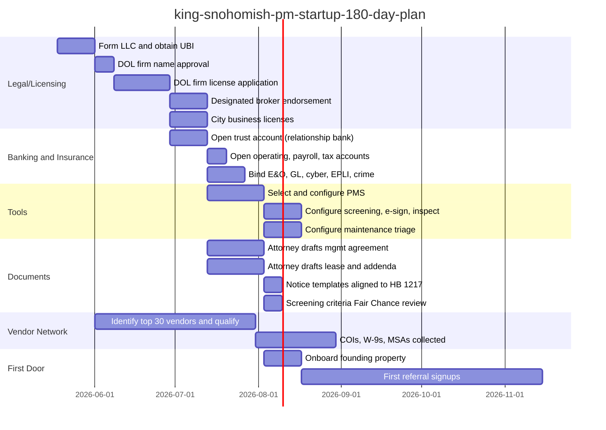

# King-snohomish-pm-startup-operations-plan

Operational stack required to launch a residential property management company in King and Snohomish counties, Washington. Covers licensing, banking, software, insurance, contracts, vendor network, professional services, and the gaps not stated in the prompt. Scope is single-family, condo, townhome, and small multifamily (under 20 units). Commercial, HOA, and large multifamily excluded unless noted.

## 1. Licensing and Entity Structure (the gate)

Nothing else matters if this is wrong. Property management in Washington is real estate brokerage activity under `RCW 18.85`. Collecting rent or security deposits on someone else's property without the structure below is unlicensed practice.

### 1.1 Required Licenses and Registrations

| Item | Source | Notes |
|---|---|---|
| Washington real estate firm license | Washington Department of Licensing (DOL) | $304 application fee. Firm name pre-approval required via `reregulatory@dol.wa.gov`. Firm must have a designated broker with controlling interest. |
| Designated broker endorsement | DOL | Must be a Washington managing broker. Three years as an active broker plus 90 clock hours of approved managing broker education, plus passing the managing broker exam, before the designated broker endorsement attaches. Renews every two years with the managing broker license. |
| Managing broker license (for the DB) | DOL | Plus 30 hours continuing ed every two years, of which 6 hours must be the Required Core. |
| Broker licenses for any rent-collecting staff | DOL | All staff who lease, show, screen, collect rent, or sign leases must be licensed brokers affiliated to the firm. Unlicensed admins can do bookkeeping and clerical work only. |
| Business formation (LLC, PLLC, or corporation) | Washington Secretary of State | File before DOL firm application. |
| UBI and master business license | Washington Department of Revenue | Required for the DOL firm application. |
| City business licenses | Each city where physical office or significant operations sit | Seattle, Bellevue, Kirkland, Redmond, Everett, Lynnwood, Bothell each have their own. |
| Workers' comp account | Washington L&I | Required at first employee. |
| Employment Security Department account | Washington ESD | Required at first employee. Includes PFML and WA Cares Fund payroll items. |
| Federal EIN | IRS | Required for entity, payroll, trust account. |

If the founder does not personally hold a managing broker license with the experience for designated broker endorsement, the firm cannot be licensed. Options: hire a managing broker as designated broker and give them controlling interest (operationally dangerous), partner with one as co-owner, or delay launch until the founder qualifies.

### 1.2 City Rental Program Registrations (per-property, Not firm-wide)

These are property-side obligations the PM administers on behalf of the owner. Knowing them is a competitive credential.

- **Seattle**: Rental Registration and Inspection Ordinance (RRIO). Register every rental unit. Inspect every 5 to 10 years.
- **Bellevue**: rental housing licensing program rolling out; verify current scope at signup.
- **Kenmore, Kirkland, Redmond, Woodinville**: tenant-protection notice requirements layered on top of state HB 1217.
- **Tacoma, Burien, Federal Way, Issaquah, Shoreline**: tenant protection ordinances with city-specific notice periods.
- **Everett, Lynnwood, Marysville, other Snohomish cities**: generally less prescriptive than Seattle; verify at the city clerk.

Build a city-by-city compliance matrix on day one. Maintaining it is part of the service offering and a documented Green Lappe brand asset already.

## 2. Banking (the Trust Account is non-negotiable)

Washington's trust account rules are stricter than most states. Get this wrong and the DOL audit closes the firm.

### 2.1 Required Accounts

| Account | Purpose | Rules |
|---|---|---|
| Real estate trust bank account (property management) | Holds tenant rent, owner reserves, security deposits | Designated in firm name (or licensed assumed name). FDIC or NCUA insured. Must accept service in Washington. Exempt from the interest-bearing requirement of `RCW 18.85.285`. Deposits required by next banking day per `WAC 308-124E-105`. |
| Security deposit trust account (recommended separate sub-account) | Tenant deposits per `RCW 59.18.270` | Can be interest-bearing for a single owner if the management agreement designates the firm as "representative of the landlord" per `RCW 59.18.270`. Cannot be a pooled interest-bearing account with multiple owners unless interest is assigned to firm by all owners. |
| Firm operating account | Management fees, payroll, overhead | All bank charges on the trust account must be billed to this account, not the trust account, per `WAC 308-124E-105(15)(d)`. |
| Payroll account | W-2 staff | Standard. |
| Tax reserve account | Estimated taxes, B&O | Standard. |

### 2.2 Trust Account Operational Rules from `WAC 308-124E-105` and `308-124E-115`

The designated broker is personally responsible for compliance. Items the audit will check:

- All client funds deposited by next banking day. Cash same day.
- Every receipt identified by date, amount, source, purpose in a cash receipts journal or duplicate receipt.
- Every disbursement by check or electronic transfer, identified to specific transaction and client ledger.
- Monthly trial balance of all client ledgers. Reconciled to bank statement and check register. Three-way reconciliation must be in agreement at all times.
- Per-client ledger maintained continuously, never overdrawn.
- No commingling. The firm's own funds may not sit in the trust account beyond a minimal documented operating balance.
- Property management commissions withdrawn at least monthly via single check payable to the firm, supported by a schedule of commissions per client.
- Security deposits cannot be disbursed to the owner or anyone else without written tenant agreement until end of tenancy.
- No preauthorized recurring disbursements (mortgage autopay etc.) on accounts containing tenant deposits or multi-owner funds.
- All records retrievable on demand for DOL audit.

### 2.3 Bank Selection Criteria

Most Washington community banks and credit unions can open a real estate trust account but few understand it. Banks with documented property management trust account products:

- **Banner Bank** (HQ Walla Walla, branches throughout WA): has real estate trust account product.
- **WaFd Bank** (HQ Seattle): supports trust accounts; broad PNW branch network.
- **Heritage Bank** (HQ Olympia): real-estate-focused commercial banking.
- **Columbia Bank / Umpqua** (now combined): well-established trust account capability.
- **First Federal Savings** (Port Angeles, expanding): smaller-firm-friendly.
- **JPMorgan Chase, US Bank, Bank of America**: trust accounts available but with relationship-banking friction at small scale.
- **Mercury, Relay, Bluevine** (digital): NOT acceptable. Real estate trust accounts require state-licensed depository with service of process in Washington.

Selection criteria: native ACH origination, sub-1-day deposit availability, free incoming wires, monthly statement export to AppFolio or Buildium, banker who can speak fluently to monthly three-way reconciliation, ability to open multiple ledger-tracked sub-accounts under one master trust.

### 2.4 Payment Rails for Tenants

The property management software handles this, but the firm must understand what it's signing up for.

| Method | Cost to firm | Cost to tenant | Notes |
|---|---|---|---|
| ACH / eCheck | Free to low | $0 to $2 (AppFolio began charging eCheck fees in 2023; Buildium $0.50 flat) | Default. Push as primary. |
| Credit / debit card | None (passed through) | ~2.95% | Convenience option. Don't make this the path of least resistance. |
| Apple Pay | None | ~2.95% | Same economics as card. |
| Cash via PayNearMe (7-Eleven, CVS) | Per-transaction | Per-transaction | For unbanked tenants. Optional. |
| Money order / check | Free | Free | Slow. Avoid as default. |
| Zelle / Venmo / PayPal | Variable | Free | Do NOT accept. Bypasses trust account, audit failure. |

Tenant payment behavior at incumbent firms: 95% online adoption is the benchmark (Real Property Associates publishes this).

## 3. Property Management Software (the Central Nervous system)

The market is concentrated. Five honest options for a launch-stage firm. AppFolio is the King/Snohomish market default but has known friction.

### 3.1 Platform Comparison

| Platform | Best for | Cost | Trust accounting | Limitations |
|---|---|---|---|---|
| **AppFolio Property Manager** | Mid-size, 50+ units | $1.40 to $3.00 per unit per month, 50-unit minimum | Strong; supports WA three-way reconciliation | Property-based statements; owners with multiple properties get fragmented reporting. Reviews cite reporting friction. |
| **Buildium** | Small to mid-size, no unit minimum | $58 to $479 per month tiered | Adequate | 1099 mailing failures reported; integrations have been pulled. |
| **Rentvine** | Small firm, modern UX | $1.50 per unit, lower minimum | Strong, designed by ex-PM operators | Newer; smaller ecosystem. Chosen by Bell-Anderson for screening. |
| **Rent Manager** | Multi-portfolio, complex needs | Quote-based | Strong | Heavier; longer onboarding. |
| **Rentec Direct** | Sub-50 unit launches | From $45 per month | Adequate | Less feature-rich; works for first 50 doors. |
| **DoorLoop** | Sub-100 unit, modern UX | Tiered | Adequate | Less proven at Washington trust compliance scale. |

**Recommendation for launch**: Rentvine or Rentec Direct under 50 doors. AppFolio at 50 to 100 doors when the minimum stops being a tax. Switching cost is real; pick the one that scales to 200 doors to avoid a migration.

### 3.2 Satellite Tools the PMS Does Not Replace

| Function | Tool | Purpose |
|---|---|---|
| Tenant screening (if PMS-native is weak) | TransUnion SmartMove, Alliance 2020, Intellirent, Experian RentBureau | Credit, criminal (subject to Seattle Fair Chance), eviction history. Application fee passes to applicant, capped to actual cost. |
| Showings (no-cost staffing) | Showdigs, Tenant Turner | On-demand licensed showings without dispatching the PM. King County NARPM affiliate. |
| E-signature | DocuSign or HelloSign (Dropbox Sign) | Lease and addendum execution. PMS-native if available. |
| Inspection / move-in reports | zInspector, Happy Inspector, RentCheck | Photo-stamped, GPS-stamped, deposit-defensible. The single biggest gap incumbent PMs are publicly attacked on (no photos, no proof). |
| Document storage | Google Workspace or Microsoft 365 plus the PMS document module | DOL records retention is 3 years for transaction files. Keep longer. |
| CRM for owner prospecting | HubSpot Starter or Pipedrive | Lead capture from the website. Owners shop for a PM the way they shop for a contractor: slowly, then suddenly. |
| Phone with named routing | Dialpad, OpenPhone, RingCentral | The brand promise (named accountability per Green Lappe brand system) requires real numbers ringing to real people, not queues. |
| Maintenance triage | Latchel, Property Meld, or PMS-native | After-hours triage, vendor dispatch, owner approval workflow. The on-call rotation is the single largest staff burnout vector. |
| Owner statements | PMS-native plus a custom monthly packet | The differentiator. AppFolio statements alone are insufficient per stated brand strategy. |
| HOA documents (if any condo work) | HomeWiseDocs | Document delivery for resale and lender requests. |
| Filter delivery (tenant retention) | Second Nature | Subscription HVAC filter delivery. King County NARPM affiliate. Reduces HVAC service calls. |
| Pet screening | PetScreening.com | Documents service animal claims, manages ESA documentation defensibly. Free to firm, paid by tenant. |
| Utilities billing (if applicable) | Conservice, NWP Services | Sub-metering or RUBS. Skip unless multifamily. |

### 3.3 Accounting and Tax Tools

The PMS is the trust account general ledger. The firm still needs business accounting:

- **QuickBooks Online** for the firm's operating books (separate from trust accounting in the PMS).
- **Gusto** or **Rippling** for payroll, including L&I, ESD, PFML, WA Cares.
- **1099 filing**: PMS-native if reliable, otherwise Track1099 or Tax1099. Buildium reviewers cite 1099 mailing failures; verify in test mode before January.
- **B&O tax**: filed quarterly with Washington Department of Revenue. Service category for management fees.

## 4. Insurance (where Firms Get killed)

Washington does not statutorily require E&O for real estate brokers, but `RCW 18.85` exposure plus market practice make it effectively mandatory. Lenders and institutional owners write it into management agreements.

### 4.1 Firm-side Coverage

| Policy | Recommended limit | Why |
|---|---|---|
| **Errors and Omissions (Professional Liability)** | $1M per claim / $1M aggregate minimum; $2M / $2M preferred | Covers professional negligence: missed deadlines, mishandled deposits, screening errors, notice errors under HB 1217 and HB 1003 where one wrong date dismisses an eviction. Claims-made; buy tail when switching carriers. |
| **General Liability** | $1M per occurrence / $2M aggregate; $2M / $4M for any urban high-traffic property | Trip-and-fall at shown property, visitor injury. Required by most owner agreements. |
| **Commercial property** | Replacement cost on firm office contents | If a physical office exists. |
| **Cyber liability** | $1M minimum | Ransomware on AppFolio-adjacent admin systems, breach of tenant SSNs from screening reports. The PNW research dataset cites real incidents. |
| **Employment Practices Liability (EPLI)** | $1M | Employee claims; relevant once first hire. |
| **Tenant discrimination coverage** | endorsement on E&O or standalone | Source-of-income, Fair Chance, First-in-Time. Seattle is high-risk. |
| **Workers' compensation** | Washington L&I | Statutory. |
| **Commercial auto** | $1M combined single limit | If staff drive to properties in personal vehicles, a hired/non-owned auto endorsement is also required. |
| **Crime / fidelity bond** | At least equal to the largest expected trust account balance | Employee theft from trust. Some carriers require this before binding E&O. |
| **Umbrella** | $2M to $5M | Stacked over GL, auto, employer's liability. Cheap relative to event severity. |

Carriers active in the Washington PM market: CRES, Pearl Insurance, Victor (formerly Schinnerer), Hiscox, The Hartford, Travelers.

### 4.2 Owner-side Insurance the Firm Should Require

The firm protects itself by writing these into the management agreement:

- Owner carries **DP-3 landlord policy** (HO-3 voids when unit is rented more than 30 days). $300K dwelling typical. Bundled DP-3 conversion at onboarding is a real value-add per the Rate-Locked Seattle Landlord research.
- Owner names the firm as **additional insured** on the DP-3.
- Owner carries **loss-of-rents** coverage (typically 12 months gross rent).
- Owner carries **liability** of at least $300K on the DP-3 (most carriers default to $300K).
- Tenant required to carry **renters insurance** with at least $100K liability, firm and owner named as additional interest. Enforced through the lease.

### 4.3 Bond

Washington does NOT require a statutory surety bond for real estate brokers (some states do). The trust account compliance regime substitutes. Some institutional owners contractually require a fidelity bond; the crime policy above covers that.

## 5. Lease and Contract Documents (the Paper that Runs the business)

Off-the-shelf templates are a documented risk. Each Washington and Seattle ordinance change since 2016 has invalidated something in the base RHAWA, NAA, or AAOA lease. The firm needs current, attorney-reviewed templates.

### 5.1 Documents the Firm Must Own

| Document | Source | Annual review |
|---|---|---|
| **Property Management Agreement** (owner contract) | Drafted by Washington landlord-side attorney; reviewed annually | Critical. Authority matrix, fee schedule, termination terms, indemnification, insurance requirements. |
| **Residential Lease Agreement** | RHAWA template as starting point, customized and attorney-reviewed | Updated for HB 1217, Seattle 180-day notice, JCEO, First-in-Time, Fair Chance, RCW 59.18 amendments. |
| **Lease addenda**: pet, smoking, mold disclosure, lead paint (pre-1978), bedbug, parking, storage, satellite | Mix of state-mandated and firm-drafted | Lead paint and mold are statutory. |
| **Application form and screening criteria** | Attorney-reviewed for First-in-Time, Fair Chance compliance | Posted publicly per Seattle rule. |
| **Notice forms**: HB 1217 90-day rent increase, Seattle 180-day, 14-day pay or vacate, 10-day comply or vacate, 20-day no-cause (limited), just-cause notice templates | Washington Department of Commerce publishes prescribed forms for HB 1217 | Always use the Commerce-prescribed form when one exists. |
| **Move-in / move-out condition checklist** | Statutory requirement; firm template | RCW 59.18.260. |
| **Security deposit receipt and accounting** | Statutory under RCW 59.18.280 | 30-day return clock. |
| **Tenant welcome packet** | Firm-drafted | Reduces support volume. |
| **Vendor agreement (independent contractor)** | Firm-drafted, attorney-reviewed | W-9, COI requirements, indemnification, scope of work. |
| **Employment agreements and broker affiliation agreement** | Attorney-drafted | Designated broker delegation per `WAC 308-124C-130`. |
| **Owner offboarding / handoff agreement** | Firm-drafted | The brand promises 14-day clean handoff per Green Lappe. |

### 5.2 Documents with the Highest Litigation Exposure

Two documents fail most often in incumbent PM operations:

1. **Eviction notices**. HB 1003 requires exact calendar dates and certified mail with in-state postmark. HB 1217 requires Commerce-prescribed forms. Seattle JCEO requires one of 18 specific grounds. One wrong date and the eviction is dismissed; the cycle restarts.
2. **Security deposit dispositions**. 30-day return clock under RCW 59.18.280 with itemized statement. Failing to itemize, failing to photograph, charging for normal wear and tear, are the single most common tenant lawsuits.

Both should be drafted by counsel and treated as templated workflows in the PMS with required photo evidence at every step.

## 6. Professional Services Panel (the People Who save the company)

These are the outside experts retained on a relationship basis, not transactional.

### 6.1 Landlord-side Attorney

Required from day one. The firm is going to need a notice reviewed, an eviction filed, a Fair Housing complaint defended, or an ordinance interpreted within the first 90 days.

Washington landlord-side specialists in this market include Williams Kastner (Seattle), Peterson Law PLLC (Seattle/Kirkland), Puckett & Redford PLLC (Seattle), Harper Law Offices (Tacoma), NW Landlord Solutions, Loeffler Law Group, and Demco Law Firm. Pick one for general counsel and lease review; pick one for eviction filings (often the same firm). Flat-fee evictions are the market norm: typically $400 to $800 base plus court costs and sheriff fees, more if the tenant responds.

### 6.2 CPA Familiar with WA Real Estate Trust Accounting

Three skills required: Washington B&O, federal real estate tax (Schedule E mechanics for owner reporting, depreciation, 1099-MISC and 1099-NEC), and trust account audit support. Most general CPAs do not understand the trust ledger interaction with the operating books.

### 6.3 Insurance Broker Specializing in PM

Carriers and limits change quarterly. A broker who places PM accounts (not a generalist) is worth a 10% premium because they will spot the source-of-income discrimination exclusion or the HB 1217 carve-out before the firm signs. Mosaic IA, Pearl Insurance, CRES, and Marsh McLennan Agency have PM practices in the PNW.

### 6.4 Fair Housing Trainer / Consultant

Annual staff training on Fair Housing, First-in-Time, Fair Chance, source-of-income, ESA / service animal handling. Required for some E&O policies and HUD-friendly for any future Section 8 work. Washington State Human Rights Commission has free materials; for paid training, the National Apartment Association and RHAWA both run programs.

### 6.5 Process Server and Skip Tracer

Eviction notices and unlawful detainer service of process. ABC Legal Services, Pacific Northwest Process Service, Northwest Legal Support. Skip tracing through TLO or LexisNexis Accurint when a tenant disappears mid-lease.

### 6.6 Collections Agency

For post-eviction money judgments. Hunter Warfield, Rent Recovery Service, National Credit Systems specialize in tenant collections. Recoveries are typically 20% to 40% on collected, with low collection rates (often under 20% on filed claims). Set expectations accordingly.

### 6.7 Commercial Banker

A real banker, not a 1-800 line. Named relationship at the bank that holds the trust account. They are the person who fixes a same-day issue with a held deposit or a returned check.

## 7. Vendor Network for Property Services (the trades)

This is the single largest unsung operational asset of a PM company. Vendor shortages in the PNW are structural; HVAC and plumbing prioritize commercial accounts. Building this network before doors arrive is the difference between SDCI 24-hour repair compliance and an SDCI fine.

### 7.1 Trade Categories the Firm Must Have on Speed-dial

For each: minimum 2 pre-qualified vendors (primary plus backup), W-9 and COI on file, written rate sheet, after-hours availability defined, geographic coverage map.

| Trade | Frequency of need | Notes |
|---|---|---|
| **Plumbing** | Weekly | Drain Doctors, Zoom Drain Seattle, South West Plumbing, Beacon Plumbing. Need same-day for leaks. |
| **HVAC** | Weekly Nov-Mar, monthly otherwise | Washington Energy Services, Greenwood Heating, MM Comfort Systems. Maintenance contracts on filter changes reduce calls. |
| **Electrical** | Monthly | Mister Sparky, Pacific Electrical Contractors, Eckert Electric. |
| **General handyman** | Daily | The most-used trade. Bonded and insured, licensed for jobs over $500 in WA. Multiple per geography. |
| **Appliance repair** | Weekly | Sears Home Services is unreliable; use local specialty shops. |
| **Roofing** | Quarterly | Three Tree Roofing, Pinnacle Roofing, CRC Roofing. Inspection in fall, repair in spring. |
| **Painting (interior turnover)** | Monthly | Ideal Painting, Masters Touch Painting. Both King County NARPM affiliates. |
| **Carpet cleaning / replacement** | Per turnover | Chem-Dry, COIT, plus a flooring installer for replacement. |
| **Cleaning (turnover)** | Per turnover | Sno-King Quality Cleaning (NARPM affiliate), MaidPro, plus independents. |
| **Junk removal** | Per turnover | Junkluggers of North Puget Sound (NARPM affiliate), 1-800-GOT-JUNK. |
| **Landscaping / yard maintenance** | Weekly to monthly | Local independents per geography. |
| **Snow removal / gutter cleaning** | Seasonal | Heavily seasonal; arrange contracts in September. |
| **Pest control** | Per incident | Cascade Pest Control, Eden Advanced Pest Technologies. |
| **Locksmith** | Per turnover | Pop-A-Lock, Seattle Locksmith. |
| **Garage door** | Quarterly | Precision Garage Door, A1 Garage Door. |
| **Restoration (water, fire, mold)** | Emergency | Fischer Restoration, Restorx DKI, 24RESTECH, Kustom US. All King County NARPM affiliates. |
| **Public adjuster** (insurance claims) | Per claim | Pacific Public Adjusters (NARPM affiliate). |
| **Home inspector / mid-tenancy inspector** | Per onboarding or annual | Lasswell Home Inspection (NARPM affiliate), plus ASHI-certified independents. |
| **Energy / weatherization** | Per project | HH Energy (NARPM affiliate). Useful when owners are upgrading insulation or windows. |
| **General contractor (for capex)** | Per project | For projects over the handyman threshold or requiring permits. Vetted, licensed, bonded under L&I. |

### 7.2 Vendor Qualification Checklist

Every vendor on the panel must produce:

- Washington L&I contractor license number (verify on lni.wa.gov; check bond status and any complaints).
- $1M general liability COI with the firm and the property owner named as additional insured.
- Workers' comp account in good standing or sole-proprietor exemption.
- W-9 on file before first job.
- Master service agreement with hold-harmless, scope of work, payment terms, and lien waiver schedule.
- Written rate card or quote-per-job structure.
- After-hours availability defined in writing.
- Photo documentation requirement on every invoice (the Brink reviewer's "no photos" complaint is the public-record example of how this fails).

### 7.3 Markup Policy

Public-record incumbent practice ranges from zero markup pass-through (Haven Property Management) to roughly 10% (industry typical) to higher. The brand strategy already documented says pass-through pricing with no markup. That is enforceable through the management agreement; charging a coordination fee instead is cleaner than hiding markup. The Green Lappe brand work already commits to this.

## 8. Compliance Calendar and Recurring Obligations

Most regulatory exposure is calendar-driven and miscible. Build this into the PMS or a dedicated compliance tracker on day one.

### 8.1 Firm-level Recurring

| Frequency | Item | Source |
|---|---|---|
| Daily | Trust deposits by next banking day | WAC 308-124E-105 |
| Monthly | Three-way reconciliation of trust account; trial balance of client ledgers | WAC 308-124E-105(11) |
| Monthly | Property management commissions withdrawn from trust | WAC 308-124E-115 |
| Quarterly | Washington B&O tax filing | DOR |
| Quarterly | L&I and ESD reporting | L&I, ESD |
| Annually | E&O renewal | Carrier |
| Annually | GL renewal | Carrier |
| Annually | Fair Housing training, broker continuing education | NAA / RHAWA / DOL |
| Annually | Cyber security review and tenant data audit | Internal |
| Every 2 years | Designated broker and managing broker renewals (30 CE hours including 6 Core) | DOL |
| Every 2-10 years | RRIO inspection (Seattle) for each enrolled property | SDCI |
| Per audit | DOL trust account audit (random, can be triggered by complaint) | DOL Real Estate Program |

### 8.2 Per-property Recurring

| Frequency | Item |
|---|---|
| At onboarding | DP-3 conversion verification, RRIO registration, smoke/CO alarm test, lead-paint disclosure (pre-1978), mold disclosure, move-in checklist |
| Annually | Property condition inspection, rent benchmarking, owner annual review, insurance renewal verification |
| 90 days post-move-in then every 6 months | Tenant-occupancy inspection (firms with documented programs cite this) |
| At lease anniversary | Rent increase notice timing (90-day state minimum, 120 in many cities, 180 in Seattle for any increase) |
| 90 days before lease end | Renewal decision sent to owner |
| 30 days post-move-out | Security deposit accounting and refund (RCW 59.18.280) |

### 8.3 Per-tenant Recurring

- Pay-or-vacate notice timing (14 days standard, RCW 59.18).
- Comply-or-vacate notice (10 days for material lease violations).
- Just-cause grounds documentation for Seattle, Burien, Kirkland, Federal Way, others.
- Roommate Law: tenant can add immediate family members; firm must accommodate without screening them as additional tenants.
- Move-in fee installment compliance per RCW 59.18.

## 9. Marketing and Lead Generation Infrastructure

Out of scope of the immediate prompt but stated as a gap. Listed so it doesn't get forgotten.

- Website on a CMS (WordPress is the incumbent default but heavy; Astro or Next.js are lighter and faster).
- Owner-facing fee schedule published publicly. Haven and SJA publish; most incumbents do not. Transparency is brand-aligned per existing strategy work.
- Google Business Profile claimed and verified in every served city.
- Listing syndication: Zillow Rental Manager, Apartments.com, Rentals.com, Trulia, Hotpads, Realtor.com. PMS typically pushes to syndication network.
- Phone with named routing, not a queue. Per existing brand strategy.
- Owner portal and tenant portal: PMS-native. Branded subdomain (portal.greenlappe.com) preferred over a generic AppFolio URL for brand authority.

## 10. Staffing Model (when Each Role Becomes necessary)

| Role | Triggers hiring at |
|---|---|
| Designated broker | Day 0 |
| Bookkeeper (part-time, then full-time) | 25 doors |
| Maintenance coordinator | 50 doors |
| Leasing agent (licensed broker) | 75 doors |
| Second managing broker | 100 doors |
| Dedicated accountant or outsourced controller | 150 doors |
| Operations manager | 200 doors |
| Second leasing agent | 200 doors |

The PNW Property Management Pain Points research already documents staff burnout patterns: 24/7 on-call expectation, no vacation coverage, poor training, no escalation. The plan should explicitly cap doors-per-coordinator at 100 to 125 to prevent the burnout pattern from reproducing.

## 11. Gaps Not Stated in the Prompt that Bite Later

Items the prompt did not list, surfaced for completeness.

### 11.1 Records Retention

Washington DOL requires 3-year retention of brokerage records, but federal HUD and Fair Housing complaint exposure runs 2 to 5 years, and state collection statutes run up to 6 years. **Retain everything for 7 years minimum.** Bias toward 10. Cloud storage with versioned backups; do not rely on the PMS alone (cited migration losses are real).

### 11.2 Data Privacy

Tenant screening produces SSNs, dates of birth, criminal history (where allowed), and financial information. Washington's My Health My Data Act and federal FCRA both apply. Required:

- Written information security policy.
- Encryption at rest and in transit.
- Vendor due diligence on every SaaS that touches PII.
- Breach notification plan (Washington requires notification within 30 days for breaches over 500 residents).
- Annual tabletop exercise.

### 11.3 Service Animal and ESA Workflow

Different from pet policy. Federal Fair Housing and HUD rules forbid pet rent, pet deposit, breed restrictions, or weight limits for service animals and ESAs. The verification workflow (PetScreening.com) is the audit-defensible standard. Refusing accommodation is one of the most common Fair Housing complaints filed in the PNW.

### 11.4 Source-of-income Compliance

Washington and several King County / Snohomish County cities prohibit refusing Section 8 vouchers or other lawful sources of income (Social Security, child support, SSI/SSDI, alimony, unemployment, certain subsidies). Screening criteria must be written to never use "source of income" as a disqualifier. The Mosaic IA case study cited a $55K legal fee plus $30K settlement for one such claim.

### 11.5 Deposit Alternatives

LeaseLock, Rhino, Jetty, Obligo offer security deposit replacement programs in some markets. These have NOT been confirmed at incumbent King/Snohomish firms. The compliance posture is unsettled under RCW 59.18 because the consumer protection statute treats these as insurance products requiring licensure. Defer until a Washington-licensed product exists and a landlord-side attorney has cleared it.

### 11.6 Rent Reporting to Credit Bureaus

Esusu, RentTrack, Pinata offer to report on-time rent payments to TransUnion, Experian, Equifax to help tenants build credit. None confirmed at incumbent firms; cited as marketing copy only. Worth offering as an optional tenant benefit once the firm has a stable PMS integration. Documented disclosure required because failed payments also report.

### 11.7 Fair Chance Housing (Seattle, Growing elsewhere)

Seattle Municipal Code 14.09 prohibits using criminal history in tenant screening with narrow exceptions. The screening criteria document must be Fair Chance compliant for any Seattle property. Other King County cities are watching this; expect expansion. Standard PMS-native screening reports include criminal history; the firm must redact it from Seattle property applications.

### 11.8 The Move-in Fee Installment Rule

Washington requires that move-in costs (security deposit, last month's rent, nonrefundable fees) be payable in installments over 2 to 6 months, depending on lease length, if the tenant requests it. RCW 59.18. This significantly disrupts cash-on-move-in modeling for owners. Standard practice is to write this into the lease and budget for it.

### 11.9 Winter Eviction Moratorium

Seattle bans most evictions December 1 through March 1. This is calendared and gameable by tenants. Owner expectations must be set at onboarding: if a non-payment situation emerges in November, the realistic resolution window is May.

### 11.10 The Offboarding Promise

The incumbent industry is publicly attacked for 30-60 day held funds and incomplete document handoff at offboarding (T-Square example: $6K in damage surfaced only at next-PM walkthrough). The brand strategy already commits to 14-day clean handoff. Make this a one-page contractual exhibit, audited by the designated broker, with a packing list: keys, deposits, ledgers, vendor contacts, tenant contacts, lease, addenda, insurance certs, capital improvement log.

### 11.11 Emergency On-call

Define the after-hours emergency tree before the first door comes on:

- What counts as an emergency (fire, flood, no-heat, gas, no-water, broken lock, sewage backup).
- Who answers (the maintenance coordinator's phone, not the designated broker's).
- What's reimbursed by the firm vs. the owner.
- The vendor list and triage script.

Latchel and Property Meld both offer outsourced after-hours emergency triage for a per-door fee. Worth evaluating before staff burnout sets in.

### 11.12 NARPM, RHAWA, IREM Membership

Industry membership is table stakes:

- **NARPM** (National Association of Residential Property Managers): King County chapter is active; affiliates are the vendor pipeline.
- **RHAWA** (Rental Housing Association of Washington): forms, lobbying, legislative updates. Critical given HB 1217 / HB 1003 churn.
- **IREM** (Institute of Real Estate Management): more multifamily-oriented; designations (CRMC, AMO) help with institutional credibility.
- **WSCAI** (Washington State Community Association Institute): only if managing HOAs (out of stated scope).

Annual dues totaling roughly $1,500 to $3,000 across all three. The CRMC designation is held by Bell-Anderson and Dave Poletti; it is a real differentiator.

## 12. Startup Capital Floor

A realistic estimate of pre-revenue cash required, before first door produces revenue. Numbers triangulated from project files and market data; verify with the CPA and insurance broker.

| Category | One-time | Year 1 ongoing |
|---|---|---|
| Entity formation, business licenses, name approval | $1,000 | - |
| DOL firm license, designated broker endorsement | $500 | $500 every 2 years |
| Insurance: E&O, GL, cyber, EPLI, umbrella, crime | $1,500 deposit | $8,000 to $15,000 |
| PMS subscription (Rentvine or Rentec at sub-50 doors) | - | $1,500 to $3,500 |
| Bank account setup | $0 | $0 to $500 in monthly fees on operating account |
| Website and brand assets | $5,000 to $15,000 | $1,500 hosting and maintenance |
| Phone system (named lines) | $200 | $1,500 |
| Document storage, e-signature, screening, CRM | - | $3,000 |
| Legal: lease and management agreement drafting | $5,000 to $10,000 | $2,000 retainer |
| Accounting and bookkeeping | - | $6,000 to $15,000 |
| NARPM, RHAWA, IREM dues | $500 | $2,500 |
| Working capital reserve (6 months overhead) | $30,000 to $60,000 | - |
| Owner acquisition (marketing, conference, referrals) | $5,000 | $10,000 to $20,000 |
| **Total** | **~$50,000 to $95,000** | **~$36,000 to $65,000** |

Designated broker compensation is the largest excluded line. If the founder is the DB and draws no salary in year one, the model works. If the firm hires an outside DB, add $80,000 to $150,000 plus benefits.

## 13. Critical Path (first 180 days)

## 14. What to Verify before Signing Anything

Items the founder must personally confirm, not delegate:

- Designated broker's experience qualifies for the endorsement per DOL.
- Bank confirms it can open a real estate trust account (not just a business checking).
- E&O carrier covers Washington property management specifically and includes the source-of-income discrimination endorsement.
- PMS vendor's trust accounting module supports Washington three-way reconciliation natively (request demo with a sample reconciliation).
- The drafting attorney has filed evictions in King and Snohomish counties in the last 12 months.
- The CPA has at least one current real estate brokerage client.
- The insurance broker has at least three current Washington PM accounts.
- City business licenses are in place for every city where the first 10 doors are likely to come from.
- Vendor COIs name the firm AND the property owner as additional insured (the second part is the part most vendors miss).

## 15. Sources

Project knowledge files: `compass_artifact_wf-4a355d66-05ba-4806-b49f-d4e0d3036467` (King County PM landscape, vendor index, tech stack), `PNW_Property_Management_Pain_Points` (operational pain points and burnout patterns), `The_Rate-Locked_Seattle_Landlord_Opportunity` (insurance market data, owner-side context), `green-lappe-brand-system` and `green-lappe-two-sided-marketplace` (existing brand strategy, fee posture, offboarding promise).

External: Washington DOL real estate licensing pages, `WAC 308-124E-105`, `WAC 308-124E-110`, `WAC 308-124E-115`, `WAC 308-124C-130`, `RCW 18.85`, `RCW 59.18`, `RCW 59.18.270`, `RCW 59.18.280`, Mosaic IA Washington property manager insurance guide, King County contract insurance requirements, CRES Insurance state requirements summary, Washington landlord-side attorney directory (Avvo, Williams Kastner, Peterson Law, Puckett & Redford).

## Caveats

- Several specifics shift by city and rapidly: HB 1217 enforcement posture, RRIO inspection cadence, individual city notice rules, Fair Chance scope. Verify each at signup of the first property in that city.
- DOL fees and process timing reflect current public schedules; verify on dol.wa.gov before paying.
- Insurance premium ranges are typical-market estimates; carrier-specific quotes will vary by claims history, doors managed, and chosen limits.
- Vendor selections are starting points, not endorsements. Run each through the qualification checklist before relying on any vendor for billable work.
- The startup capital floor excludes any office lease, founder salary, designated broker hire (if not the founder), and any signing bonuses to acquire portfolios from existing operators.
