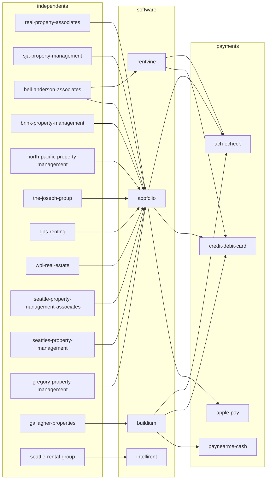

# Independent Property Management Companies, King and Snohomish Counties

## tl;dr

- Research identified 40+ independent, locally owned property management companies serving small landlords in King County and Snohomish County, with the strongest concentration in NARPM Washington and King County chapters. Strong candidates include [[bell-anderson-associates]], [[real-property-associates]], [[sja-property-management]], [[brink-property-management]], [[gregory-property-management]], [[ahc-property-management]], [[north-pacific-property-management]], [[verraterra-property-management]], [[seattle-rental-management]], [[the-joseph-group]], [[cascade-management-us]], [[emerald-door-property-management]], [[full-service-property-management]], [[t-square-properties]], [[wpi-real-estate]], [[ballard-realty]], [[cornell-and-associates]], [[walls-property-management]], [[gallagher-properties]], [[dave-poletti-associates]], [[madrona-real-estate]], [[pacific-crest-real-estate]], [[seattle-property-management-associates]], [[seattles-property-management]], [[gps-renting]], [[sagareus-property-management]], [[icon-real-estate-services]], [[davis-property-management]], [[206-property-management]], [[haven-property-management]], [[wilson-management]], [[macphersons-real-estate]], [[anchor-agency]], [[seattle-rental-group]], [[delta-property-management]], [[lifestyle-homes-pm]], [[infinity-properties-international]], [[northwest-property-management-group]], [[real-estate-gladiators]], [[morgan-real-estate-management]], [[blanton-turner]], [[peoples-real-estate]], [[acres-property-management]], [[next-brick]], [[maple-leaf-property-management]], [[epic-asset-management]], [[powell-property-management]], [[avenue-one-residential]].
- The dominant tenant payment technology stack across these firms is AppFolio (most common), with Buildium and Rentvine in second tier and Rentec Direct, Propertyware, DoorLoop, and Rent Manager appearing less frequently. Tenant payment methods are concentrated on ACH/eCheck and credit/debit card through these portals; a few accept retail cash via PayNearMe-style integrations. Confirmed PE/institutional-owned firms to EXCLUDE include [[pure-property-management]] (Level Equity, PGIM, merged with HomeRiver), [[mynd-management]] (institutional), [[utopia-management]] (large multistate), [[doorstead]] (VC-backed), [[ziprent]] (VC-backed), [[belong-home]] (VC-backed), [[greystar]], [[invitation-homes]], [[american-homes-4-rent]], [[progress-residential]], [[firstkey-homes]], [[roofstock]].
- Pricing pattern across confirmed independents: 8 to 12 percent monthly management fee, 50 to 100 percent of one month rent leasing fee, 25 to 50 percent renewal fee, optional setup or onboarding fees of 200 to 500 dollars per unit, with Seattle's regulatory environment (Fair Chance Housing Ordinance SMC 14.09, RCW 59.18, HB 1217 statewide rent stabilization, 180-day Seattle rent increase notice) driving consistent screening criteria language across nearly every firm.

## Key Findings

### Scope and Ownership Filtering

The Washington State NARPM chapter and King County NARPM chapter directories are the highest-yield source for confirming independent ownership, but the membership lists require login or behind-portal access (robots-disallowed in scraping). The chapter publishes meeting events at 1807 E Hamlin St, Seattle. Companies confirmed as independent through BBB principal listings, founder bios, or LinkedIn small-team profiles are listed in the per-company section.

Confirmed institutional or PE-backed companies operating in this market that meet EXCLUSION criteria:

- [[pure-property-management]] / PURE HomeRiver: backed by Level Equity ($50M, Feb 2022), Bullock Capital, and PGIM ($80M growth capital, January 2026 merger with HomeRiver); now manages 40,000+ SFR units across 80+ offices in 35+ states. Acquired Mercer Island operation March 2025.
- [[mynd-management]]: VC-backed, institutional flat-fee national operator
- [[utopia-property-management]]: large multistate roll-up across CA, WA, OR, NV
- [[doorstead]], [[ziprent]], [[belong-home]]: VC-backed proptech
- [[greystar]], [[invitation-homes]], [[amh]], [[progress-residential]], [[firstkey-homes]], [[mainstay-property-group]], [[tricon-residential]], [[roofstock]]: institutional or REIT

Companies with ambiguous status that need follow-up:

- [[north-pacific-property-management]]: independent founder Joshua Fant (started 2000, music-career origin), 160 brokers and 23 property managers per their site; large for an independent but no public PE backing. Flag for follow-up.
- [[coast-property-management]]: 30+ years in market, large multifamily focus; ownership structure not confirmed in public sources. Flag for follow-up.
- [[blanton-turner]]: founded 2011, originated from a Seattle development firm; manages large institutional and student housing. Likely on the institutional side. Flag for follow-up.
- [[epic-asset-management]]: manages own portfolio plus third-party; ownership structure unclear. Flag.
- [[wallace-properties]]: multi-generational family-owned per public profile, but commercial-focused. Flag.

### Service Offerings and Pricing Patterns

Across confirmed independents, the services bundle is consistent: marketing across NWMLS, Zillow, Apartments.com, Hotpads, Trulia, Craigslist; tenant screening with credit, criminal (Fair Chance compliant), eviction, employment, rental history; rent collection via online portal; maintenance coordination with vendor networks; monthly accounting with 1099 reporting; eviction handling; semi-annual or annual inspections. Most independents serve single-family, condo, townhome, and small multifamily (typically up to 25 units per building). HOA management is a separate vertical handled by [[bell-anderson-associates]], [[madrona-real-estate]], [[gallagher-properties]], [[hoa-and-condo-management-snohomish]], among others.

Pricing benchmarks established:

- Monthly management: 8 to 12 percent of collected rent (Seattle trends 10 to 12 percent due to regulatory complexity)
- Flat fee alternative: 100 to 250 dollars per unit per month
- Leasing/tenant placement: 50 to 100 percent of first month rent (SJA: 60 percent min 1850 dollars)
- Lease renewal: 25 to 50 percent of one month, or flat 250 to 500 dollars (Next Brick flat 250)
- Setup/onboarding: 150 to 400 dollars per single unit, 200 dollars per unit multifamily
- Maintenance markups: 0 percent (Gregory PM, Next Brick) to 10 to 20 percent at less transparent firms
- Tenant screening fee: 38 to 50 dollars per applicant (Seattle Rental Group 48 dollars)

### Tenant Payment and Technology Stack

Confirmed AppFolio users (resident portal at appfolio.com/login or branded subdomain): [[real-property-associates]] (rentseattle.com), [[seattle-property-management-associates]], [[seattles-property-management]], [[sja-property-management]], [[bell-anderson-associates]] (also uses Rentvine for screening), [[the-joseph-group]], [[gregory-property-management]] (per portal references), [[gps-renting]], [[wpi-real-estate]] (EFT/ACH autopay).

Confirmed Buildium users: [[gallagher-properties]] (managebuilding.com URL).

Likely AppFolio (based on portal patterns, requires direct verification): [[brink-property-management]], [[davis-property-management]], [[verraterra-property-management]], [[north-pacific-property-management]], [[full-service-property-management]], [[t-square-properties]], [[seattle-rental-management]], [[ahc-property-management]], [[icon-real-estate-services]].

Tenant payment methods supported through AppFolio: eCheck (ACH free or low-fee), credit/debit card with 2.95 percent processing fee passed to tenant, Apple Pay, autopay recurring. AppFolio began charging tenant transaction fees on eChecks in 2023.

Tenant payment methods through Buildium Resident Center: ACH with 0.50 dollar flat or 2.95 percent card fee, retail cash via integrated networks, autopay.

Rentvine used by Bell-Anderson for tenant screening; Rentvine offers chat, autopay, and document portal.

Few firms accept Zelle, Venmo, PayPal, or cryptocurrency directly; most require portal-based ACH or card. PayNearMe-style cash payments appear in some AppFolio and Buildium tenant portals but were not confirmed for any specific Seattle independent firm in public sources.

Rent reporting to credit bureaus (RentTrack, Esusu) and rent financing (Flex, Jetty) appear in marketing copy but were not confirmed as standard offerings at the surveyed independents. SJA's Owner Benefits Package and similar bundled programs are about owner-side guarantees rather than tenant credit-building.

### Application and Screening Requirements (consistent patterns)

- Income to rent: 2.5x to 3x gross monthly (SJA, GPS Renting, North Pacific PM, Sagareus, Full Service PM, RPA)
- Credit minimums: 610 to 650 (Joseph Group: 610; Sagareus: 650; many use 75 percent positive accounts threshold)
- Rental history: 24 months verifiable preferred
- Criminal: Seattle properties prohibited from considering (SMC 14.09 Fair Chance Housing); outside Seattle case-by-case
- Eviction history: typically denied if within 5 years (RCW 59.18 considerations)
- Application fee: 38 to 50 dollars per applicant
- Pet deposit: capped at 25 percent of one month rent in Seattle; pet rent commonly 30 to 50 dollars per pet per month; service animals and ESAs cannot be charged fees
- Security deposit + non-refundable fees: capped at one month rent total in Seattle; non-refundable fees only for cleaning and screening, capped at 10 percent of one month rent
- Comprehensive Reusable Tenant Screening Reports (per RCW 59.18.257): most surveyed firms explicitly do NOT accept these (RPA, Icon, 206 PM, Bell-Anderson, Seattle Rental Group)

### Lease Terms and Compliance

Standard lease lengths: 12-month most common; 6-month available; month-to-month after initial term. Most use proprietary leases drafted to comply with RCW 59.18 (Washington Residential Landlord-Tenant Act), Seattle Just Cause Eviction, Seattle 180-day notice for rent increases over 3 percent, statewide HB 1217 rent stabilization (2025), Tacoma and Burien similar ordinances, Issaquah 120-day notice rule, Shoreline Ordinance 996.

### Recurring Affiliate Vendor Ecosystem (King County NARPM affiliates)

Ideal Painting; Masters Touch Painting; Pacific Public Adjusters; Quick & Clear Services; Alliance 2020 (tenant screening); Apartments.com/CoStar; HH Energy; Junkluggers of North Puget Sound; Kustom US; Sno-King Quality Cleaning; Drain Doctors; Zoom Drain Seattle; Fischer Restoration; 24RESTECH; Showdigs (on-demand showings); Washington Energy Services; Second Nature (filter delivery); Rental Housing Association of Washington (RHAWA); Restorx DKI; Lasswell Home Inspection.

## Details

### Representative Company Profiles

[[bell-anderson-associates]] - Auburn, WA (also PO Box Kent). Founded pre-1984. Owners Vickie Gaskill (member), Carrie Snyder (managing member). CRMC and AMO designations (NARPM and IREM top tier). Manages South King County (Kent, Renton, SeaTac, Maple Valley, Auburn, Des Moines, Federal Way, Enumclaw, Orting). Tech: Rentvine for screening, AppFolio inferred. Family-owned, 5 family members on staff. Phone (253) 852-8195. Address 4508 Auburn Way N Suite A-100. BBB A+, Yelp 37 reviews mixed.

[[sja-property-management]] - Redmond, WA. Founded 2009. Co-founders Devin Easterlin (CEO, ex-real-estate attorney) and Derek Bunyard (Managing Broker). Inc 5000 fastest-growing in 2016 and 2017; PSBJ Hall of Fame 2019. 1,000+ units. Service area Redmond, Bellevue, Kirkland, Woodinville, Bothell, Seattle, Sammamish, Issaquah. Tech: AppFolio. Pricing: leasing 60 percent of one month (1850 dollars min); renewals 25 percent (500 dollars min); single-unit setup 385 dollars; multifamily setup 200 dollars/unit. NARPM and RHAWA member. 178 Yelp reviews. Address 16398 NE 85th St #200, Redmond.

[[real-property-associates]] (RPA) - Seattle. Founded 1991. Offices Seattle/King (206-523-0300), Everett/Snohomish (425-740-3097), Bellevue/Eastside (425-233-6065), Edmonds (425-776-7099). Tech: AppFolio (rentseattle.com tenant portal). 95 percent online rent payment adoption. Serves small and mid-size investors. Specializes in single-family rentals.

[[brink-property-management]] - 12011 Bel-Red Rd #101, Bellevue, WA 98005. Founded 1996 (some sources 2009 incorporation). President Dean Foggitt. 27 years in market. Serves Bellevue, Issaquah, Bothell, Mercer Island, Kenmore, Lynnwood, Edmonds, Everett, Mill Creek, Mukilteo, Shoreline. Tech stack per ZoomInfo: WordPress, reCAPTCHA, Bing Ads, Cloudflare; AppFolio inferred for tenant portal. Annual revenue per D&B: 960,225 dollars. Phone (425) 458-4848. 94 Yelp reviews.

[[gregory-property-management]] - Bothell, serving King and Snohomish. Family-owned 30+ years. Owner Brad Gregory. Cities: Bellevue, Bothell, Edmonds, Everett, Kirkland, Lynnwood, Mill Creek, Redmond, Woodinville. Pricing starts at 7 percent. No leasing fee until placement; in-house maintenance team; pet damage guarantee 1500 dollars; 90-day inspection then every 6 months. Single-family specialty. Tech: AppFolio inferred (owner portal language).

[[ahc-property-management]] - Redmond/Bellevue area. Founded 1983. Women and family-owned. Mary (since 1998) plus daughter Danielle, Stacey (since 2005). Original Eastside Property Managers Association member. Specialty: single-family and condo on Eastside, Bellevue, Redmond, Sammamish, Kirkland, Bothell, Woodinville, Renton.

[[north-pacific-property-management]] - 2220 Queen Anne Ave N, Seattle 98109. Founded 2000 by Joshua Fant. 160 brokers, 23 property managers. Puget Sound Business Journal 100 Fastest Growing six years. Phone (206) 781-0186. 179 Yelp reviews. Single-family focus across Seattle/Eastside/Snohomish. Status as "independent" should be flagged given scale; founder-owned per public bio.

[[verraterra-property-management]] - Serves King and Snohomish 15+ years. Bellevue, Bothell, Brier, Clyde Hill, Duvall, Edmonds, Everett, Issaquah, Kenmore, Kirkland, Lake Forest Park, Lake Stevens, Lynnwood, Marysville, Medina, Mercer Island, Mill Creek, Monroe, Mountlake Terrace, Mukilteo, Newcastle, Redmond, Renton, Sammamish, Seattle, Shoreline, Snohomish, Tukwila, Woodinville. Manages SFR, multifamily, HOA, condo.

[[seattle-rental-management]] - Queen Anne, Seattle. Boutique. Team includes Eric, Tiffany, Channel (Moment Vacations founder), Tia, Rob. Self-described "local independent team." Single-family and multi-family across Seattle.

[[the-joseph-group]] - Seattle. Six-county operation; in-house construction and real estate brokerage. Northeast and Capitol Hill teams. Tech: AppFolio. Screening includes 610 credit floor, Fair Chance compliant. Eviction Protection Plan add-on.

[[cascade-management-us]] - Seattle. Founders Tammy (since 1990 Capitol Hill) and Daniel Travers (UW Foster MBA). 25 properties under management, multifamily Seattle focus. Zillow Community Pillar status. Note: distinct from Cascade Management Inc. of Portland (1974, 253 properties).

[[emerald-door-property-management]] - 5608 17th Ave NW #429, Seattle. Owner/Broker Ryan George Dosch (ARM designation). BBB accredited 2022, A+. Single and multi-family across Seattle and Eastside. Note: also operates Emerald Heights Property Management at same address (WA RE License 19757); related entity.

[[full-service-property-management]] - Multi-area: Seattle, Edmonds, Lynnwood, Mukilteo, Mercer Island, Kent, Renton, Auburn, Federal Way, Snohomish. 30+ years. Specializes in tenants with 2.5x bank balance for 6-month leases (alternative for relocators). Comprehensive screening criteria publicly published.

[[t-square-properties]] - 15522 Main St, Mill Creek, WA. Founded 1996. King and Snohomish counties. NARPM, IREM, NWMLS, Commercial Brokers Association memberships. 24+ years.

[[wpi-real-estate]] - 9500 Roosevelt Way NE #100, Seattle. Founded 1972 as private family investment company. 1000+ commercial and residential units. Bilingual team (Mandarin, Cantonese, Taiwanese, Spanish). Tech: AppFolio EFT autopay.

[[ballard-realty]] - Heart of Ballard, Seattle. Family-owned since 1973, third generation. SFR, condo, townhome, multifamily. Storefront with face-to-face client service.

[[cornell-and-associates]] - 2633 Eastlake Ave E #307, Seattle. Founded 1972. President J. Blake Cornell. Owner James Cornell. 6,000 residential and commercial units (large for an independent but family-owned per BBB). Specializes Ballard, Capitol Hill, Central District, Downtown/First Hill, Eastlake, Fremont, Green Lake, Madison Valley, Magnolia, Queen Anne, North Seattle. Note: scale flags this as borderline; family-owned per BBB.

[[walls-property-management]] - 5210 Russell Ave NW #100, Seattle. Multifamily Seattle since 1960s. Ballard, Fremont, Capitol Hill specialty.

[[gallagher-properties]] - 1521 NW 54th St, Seattle. Locally owned 50+ years. Tech: Buildium (managebuilding.com tenant portal). Family-style.

[[dave-poletti-associates]] - 1455 NW Leery Way #440, Seattle. Founded April 1992 by Dave Poletti (President). CRMC certified. BBB A+ accredited 2007. 33 years. Manages homes, condos, apartment buildings.

[[madrona-real-estate]] - 1320 E Pike St, Seattle (also Shoreline office). Brad Augustine principal. HOA, retail, residential, San Juan Islands vacation. Argus Financial Software for evaluation.

[[pacific-crest-real-estate]] - 200 1st Ave W #520, Seattle 98119. Founded 2003. 53 Yelp reviews. Bellevue, Edmonds, Everett, Kent, Kirkland, Lake Forest Park, Mountlake Terrace, Parkland, Seattle, Shoreline, Tacoma. Multifamily focus.

[[seattle-property-management-associates]] (SPMA) - Principal Richard L. Kemp (since 1979). Designated Broker Gudrun K. Snyder (multifamily and commercial since 2008). Tech: AppFolio (login page references).

[[seattles-property-management]] - 25+ years. Tech: AppFolio with appfolio.com tenant onboarding. Manages homes, condos, small multi-family. NARPM, IREM, A+ BBB.

[[gps-renting]] - Bellevue area, Eastside specialty. Bryant Lu (UW grad, Seattle real estate broker since 2014, manages over 1,000 landlords since 2020 per claims). Mandarin, Cantonese, English. 10 percent management subscription, no leasing fee model. Service guarantees: 48-hour communication credit, 10-day rent disbursement guarantee, 60-day cancellation. Tech: AppFolio.

[[sagareus-property-management]] - Greater Seattle, Eastside, South Sound, North Sound, Kitsap. Multi-level screening (administrative, AI-powered underwriting, manager review, senior escalation). 2.5x to 3x income, 650 credit minimum. Compliant with Seattle First-in-Time and Fair Chance.

[[icon-real-estate-services]] - 10900 NE 4th St, Bellevue 98004. Founded 2015. Boutique multifamily. Edmonds, Shoreline, Seattle, Bellevue, Redmond, Snoqualmie, Tukwila, Auburn, Renton, Tacoma, Puyallup, Aberdeen, Bremerton. Does NOT accept Comprehensive Reusable Tenant Screening Reports.

[[davis-property-management]] - Bellevue/Seattle/Puget Sound. Locally rooted. SFR, condo, townhome, multifamily, retail, industrial, commercial. Phone (206) 999-3023.

[[206-property-management]] - Seattle. Family-owned. Studios through tri-plexes including Wallingford boutique 1901 N 45th (40-unit new-build). Does NOT accept Comprehensive Reusable Tenant Screening Reports.

[[haven-property-management]] - 33600 6th Ave S #220, Federal Way 98003. Founded 2014/2015 by James A. Hernandez (Managing Broker), Savannah Hernandez, Richard Hernandez. Family-owned. Pricing transparent: leasing only one month rent (2,000 dollars min); full-service leasing 75 percent of one month (1,200 dollars min); no startup, advertising, renewal, inspection, 1099, or maintenance markup fees. Phone (253) 214-7441. 257 Birdeye reviews mixed; multiple complaints noted.

[[wilson-management]] - Multi-county. 40+ years. Auburn, Bellevue, Everett, Federal Way, Greater Eastside, Kent, King County, Renton, Redmond, Seattle, South Snohomish County. Owners Gary and Maria.

[[macphersons-real-estate]] - Multi-city WA. Kenmore, Lake Forest Park, Seattle, Bellevue, Everett, Kirkland, Marysville, Lake Stevens, Snohomish, Mountlake Terrace, Woodinville, Arlington.

[[anchor-agency]] - Renton/Seattle. Founded October 2020 by Bayley Le and Gelly Lirio. Multifamily, commercial, SFR. 3,650 combined units historical. Note: relatively new and not yet in NARPM directories.

[[seattle-rental-group]] - 2107 Elliott Ave #206, Seattle. 20+ years. Zero-evictions claim. Application fee 48 dollars. Uses Intellirent screening. Does NOT accept Comprehensive Reusable Tenant Screening Reports.

[[delta-property-management]] - Marysville, Lake Stevens, Everett. Founded 1990. Snohomish County specialty.

[[lifestyle-homes-pm]] - 15522 Main St, Mill Creek (note: same building as T-Square). King, Snohomish, Skagit. SFR specialty.

[[infinity-properties-international]] - Downtown Arlington, WA. Small dedicated team. 15+ years Snohomish County. 40+ point biannual inspection. Snohomish, Arlington, Marysville, Stanwood, Lake Stevens.

[[northwest-property-management-group]] - Snohomish County 27+ years.

[[real-estate-gladiators]] - Monroe, WA. Boutique. Monroe, Issaquah, Bellevue, Everett, Lake Stevens, Kirkland.

[[morgan-real-estate-management]] - Multi-county since 2014. Locally owned, women-led. Auburn, Kent, Federal Way, Lynnwood, Mountlake Terrace, Bellingham, Ferndale. Performance guarantee: 30-day lease or waived placement fee. BBB accredited. Zillow Premier Agent.

[[blanton-turner]] - Founded 2011 from a legacy Seattle development firm. Pacific Northwest, Seattle Metro, western WA, Oregon. Note: large institutional and student housing exposure; flag for follow-up on independent status.

[[peoples-real-estate]] - 206 Auburn Way N, Auburn 98002. Family-owned. Auburn, Kent, Renton specialty. SFR, condo, townhome, community associations, small commercial. Phone (253) 236-3552.

[[acres-property-management]] - Kent area. Disputed mid-management transition surfaced in tenant reviews; ownership uncertain post-transition. Flag.

[[next-brick]] - Seattle. Transparent pricing model: 50 percent leasing min 1,500; flat 250 dollar lease renewal; no maintenance markup, no inspection fees, no setup, no cancellation, no long-term contracts.

[[maple-leaf-property-management]] - Seattle, Bothell, Kirkland, Bellevue, Redmond, Burien, Renton, Maple Valley. SFR, condo, multi-plex, multifamily, apartments, commercial.

[[epic-asset-management]] - Seattle Metro. Multifamily-focused. Manages own portfolio plus third-party. Flag for follow-up on ownership.

[[powell-property-management]] - Seattle area. Tenant-screening guidance published. Independent status not confirmed beyond direct site claim.

[[avenue-one-residential]] - Greater Seattle. Lease and management only (no real estate sales). 100+ years combined experience claim. Founders directly oversee properties.

[[windermere-property-management-nw]] - 7003 Evergreen Way Suite A, Everett. Operates as DBA of Windermere Real Estate / Realty Brokerage Inc. Independent Windermere franchise. Single-family, multifamily, commercial, new construction. Edmonds, Lynnwood, Mountlake Terrace, Brier, Bothell, Mukilteo, Granite Falls, Everett, Snohomish, Monroe, Gold Bar/Sultan, Marysville, Arlington, Stanwood, Shoreline, Lakewood. Note: independence varies by Windermere office; this Everett office is described as independent entity.

[[jmw-group]] (Windermere PM) - Seattle, Puyallup, Kirkland offices. King, Pierce, Snohomish. Independent Windermere franchise.

### Proposed Json Schema for Per-company Files

```json
{
  "$schema": "http://json-schema.org/draft-07/schema#",
  "title": "property-management-company",
  "type": "object",
  "required": ["slug", "legal-name", "ownership"],
  "properties": {
    "slug": {"type": "string", "description": "kebab-case unique identifier"},
    "legal-name": {"type": "string"},
    "dba-names": {"type": "array", "items": {"type": "string"}},
    "brand-name": {"type": "string"},
    "website": {"type": "string", "format": "uri"},
    "addresses": {"type": "array", "items": {"type": "object", "properties": {"street": {"type": "string"}, "city": {"type": "string"}, "state": {"type": "string"}, "zip": {"type": "string"}, "county": {"type": "string"}, "office-type": {"type": "string"}}}},
    "phone-numbers": {"type": "array", "items": {"type": "object", "properties": {"label": {"type": "string"}, "number": {"type": "string"}}}},
    "emails": {"type": "array", "items": {"type": "string"}},
    "year-founded": {"type": "integer"},
    "ownership": {"type": "object", "properties": {"structure": {"type": "string", "enum": ["family-owned", "founder-owned", "partnership", "franchise-independent", "subsidiary", "pe-backed", "vc-backed", "reit-owned", "insurance-owned", "unknown"]}, "confirmed-independent": {"type": "boolean"}, "pe-flag": {"type": "boolean"}, "parent-company": {"type": ["string", "null"]}, "notes": {"type": "string"}}},
    "principals": {"type": "array", "items": {"type": "object", "properties": {"name": {"type": "string"}, "title": {"type": "string"}, "designations": {"type": "array", "items": {"type": "string"}}, "license-number": {"type": "string"}}}},
    "wa-firm-license": {"type": "string"},
    "service-area": {"type": "array", "items": {"type": "string"}},
    "portfolio-size-units": {"type": ["integer", "null"]},
    "property-types": {"type": "array", "items": {"type": "string", "enum": ["sfr", "condo", "townhome", "small-multifamily", "large-multifamily", "commercial", "hoa", "vacation-rental", "mixed-use"]}},
    "services": {"type": "array", "items": {"type": "string"}},
    "pricing": {"type": "object", "properties": {"monthly-management-fee-pct": {"type": "number"}, "monthly-flat-fee-usd": {"type": "number"}, "leasing-fee-pct": {"type": "number"}, "leasing-fee-min-usd": {"type": "number"}, "renewal-fee-pct": {"type": "number"}, "renewal-fee-flat-usd": {"type": "number"}, "setup-fee-usd": {"type": "number"}, "maintenance-markup-pct": {"type": "number"}, "application-fee-usd": {"type": "number"}}},
    "targets-small-landlords": {"type": "boolean"},
    "tech-stack": {"type": "object", "properties": {"property-management-software": {"type": "string"}, "tenant-portal": {"type": "string"}, "owner-portal": {"type": "boolean"}, "online-application": {"type": "boolean"}, "online-maintenance-request": {"type": "boolean"}, "mobile-app": {"type": "array", "items": {"type": "string"}}, "cms": {"type": "string"}, "domain-registered": {"type": "string", "format": "date"}, "wayback-first-capture": {"type": "string", "format": "date"}}},
    "tenant-payment-methods": {"type": "array", "items": {"type": "string", "enum": ["ach", "echeck", "credit-card", "debit-card", "apple-pay", "cash-paynearme", "check-mail", "money-order", "zelle", "venmo", "paypal", "crypto", "renttrack", "flex", "jetty"]}},
    "rent-reporting-credit-bureaus": {"type": "boolean"},
    "screening": {"type": "object", "properties": {"credit-score-min": {"type": "integer"}, "income-to-rent-ratio": {"type": "number"}, "rental-history-months": {"type": "integer"}, "criminal-policy": {"type": "string"}, "eviction-policy": {"type": "string"}, "cosigner-allowed": {"type": "boolean"}, "screening-fee-usd": {"type": "number"}, "accepts-portable-screening-reports": {"type": "boolean"}}},
    "pet-policy": {"type": "object", "properties": {"allows-pets": {"type": "boolean"}, "pet-deposit-pct-of-rent": {"type": "number"}, "pet-rent-monthly-usd": {"type": "number"}}},
    "lease": {"type": "object", "properties": {"standard-length-months": {"type": "integer"}, "form-source": {"type": "string"}}},
    "associations": {"type": "array", "items": {"type": "string"}},
    "designations": {"type": "array", "items": {"type": "string"}},
    "social-media": {"type": "object", "properties": {"facebook": {"type": "string"}, "instagram": {"type": "string"}, "linkedin": {"type": "string"}, "x": {"type": "string"}, "youtube": {"type": "string"}, "tiktok": {"type": "string"}}},
    "review-ratings": {"type": "object", "properties": {"google": {"type": "object", "properties": {"rating": {"type": "number"}, "count": {"type": "integer"}}}, "yelp": {"type": "object", "properties": {"rating": {"type": "number"}, "count": {"type": "integer"}}}, "bbb": {"type": "object", "properties": {"rating": {"type": "string"}, "accredited": {"type": "boolean"}, "complaints": {"type": "integer"}}}}},
    "marketing-content": {"type": "array", "items": {"type": "object", "properties": {"title": {"type": "string"}, "url": {"type": "string"}, "format": {"type": "string"}, "date": {"type": "string"}}}},
    "follow-up-flags": {"type": "array", "items": {"type": "string"}}
  }
}
```

### Sample Populated Json (3 Representative companies)

```json
[
  {
    "slug": "sja-property-management",
    "legal-name": "SJA Property Management LLC",
    "dba-names": ["Seattle Property Management"],
    "website": "https://propertymanagersseattle.com",
    "addresses": [{"street": "16398 NE 85th St Ste 200", "city": "Redmond", "state": "WA", "zip": "98052", "county": "King", "office-type": "headquarters"}],
    "phone-numbers": [{"label": "main", "number": "425-658-1920"}],
    "year-founded": 2009,
    "ownership": {"structure": "founder-owned", "confirmed-independent": true, "pe-flag": false, "parent-company": null, "notes": "Co-founded by Devin Easterlin and Derek Bunyard"},
    "principals": [{"name": "Devin Easterlin", "title": "CEO and Co-Founder", "designations": [], "license-number": ""}, {"name": "Derek Bunyard", "title": "Managing Broker and Founding Owner", "designations": [], "license-number": ""}, {"name": "Alanna Farrington", "title": "Director of Operations", "designations": [], "license-number": ""}],
    "service-area": ["Redmond", "Bellevue", "Kirkland", "Woodinville", "Bothell", "Seattle", "Sammamish", "Issaquah"],
    "portfolio-size-units": 1000,
    "property-types": ["sfr", "condo", "townhome", "small-multifamily"],
    "services": ["leasing", "tenant-screening", "rent-collection", "maintenance-coordination", "inspections", "compliance", "eviction-handling"],
    "pricing": {"monthly-management-fee-pct": 10, "leasing-fee-pct": 60, "leasing-fee-min-usd": 1850, "renewal-fee-pct": 25, "renewal-fee-flat-usd": 500, "setup-fee-usd": 385},
    "targets-small-landlords": true,
    "tech-stack": {"property-management-software": "AppFolio", "tenant-portal": "AppFolio Online Portal", "owner-portal": true, "online-application": true, "online-maintenance-request": true, "mobile-app": ["AppFolio iOS", "AppFolio Android"]},
    "tenant-payment-methods": ["ach", "echeck", "credit-card", "debit-card", "apple-pay"],
    "screening": {"credit-score-min": 650, "income-to-rent-ratio": 3.0, "rental-history-months": 24, "criminal-policy": "Fair Chance Housing compliant in Seattle", "accepts-portable-screening-reports": false},
    "associations": ["NARPM", "RHAWA"],
    "review-ratings": {"yelp": {"rating": 4.5, "count": 178}, "bbb": {"rating": "A+", "accredited": true, "complaints": 0}},
    "follow-up-flags": []
  },
  {
    "slug": "bell-anderson-associates",
    "legal-name": "Bell-Anderson & Associates LLC",
    "website": "https://www.bell-anderson.net",
    "addresses": [{"street": "4508 Auburn Way N Suite A-100", "city": "Auburn", "state": "WA", "zip": "98002", "county": "King"}],
    "phone-numbers": [{"label": "main", "number": "253-852-8195"}, {"label": "toll-free", "number": "1-800-755-5397"}],
    "year-founded": 1972,
    "ownership": {"structure": "family-owned", "confirmed-independent": true, "pe-flag": false, "notes": "Owner Vickie Gaskill; daughter Carrie Snyder managing member; 5 family members on staff"},
    "principals": [{"name": "Vickie L Gaskill", "title": "Owner/Broker/CEO", "designations": ["AMO", "CRMC"]}, {"name": "Carrie Snyder", "title": "Managing Member"}, {"name": "Jennifer Corp", "title": "Office Manager"}],
    "service-area": ["Kent", "Renton", "SeaTac", "Maple Valley", "Auburn", "Des Moines", "Federal Way", "Enumclaw", "Orting"],
    "property-types": ["sfr", "condo", "townhome", "small-multifamily", "large-multifamily", "commercial", "hoa"],
    "services": ["full-management", "leasing-only-non-pm", "hoa-management", "tenant-screening", "rent-collection", "maintenance"],
    "tech-stack": {"property-management-software": "AppFolio (inferred)", "tenant-portal": "branded portal", "owner-portal": true},
    "tenant-payment-methods": ["ach", "echeck", "credit-card"],
    "screening": {"accepts-portable-screening-reports": false},
    "associations": ["NARPM", "IREM", "WSCAI", "Kent Chamber"],
    "designations": ["AMO", "CRMC"],
    "review-ratings": {"yelp": {"rating": 3.5, "count": 37}}
  },
  {
    "slug": "haven-property-management",
    "legal-name": "Haven Property Management LLC",
    "website": "https://havenpropertymanagement.com",
    "addresses": [{"street": "33600 6th Ave S Ste 220", "city": "Federal Way", "state": "WA", "zip": "98003", "county": "King"}],
    "phone-numbers": [{"label": "main", "number": "253-214-7441"}],
    "year-founded": 2015,
    "ownership": {"structure": "family-owned", "confirmed-independent": true, "pe-flag": false, "notes": "Hernandez family"},
    "principals": [{"name": "James A Hernandez", "title": "Managing Broker"}, {"name": "Savannah Hernandez", "title": "Member Manager"}, {"name": "Richard Hernandez", "title": "Member Manager"}],
    "service-area": ["Federal Way", "Greater Puget Sound"],
    "property-types": ["sfr"],
    "services": ["full-service-management", "leasing-only"],
    "pricing": {"leasing-fee-pct": 100, "leasing-fee-min-usd": 2000, "monthly-management-fee-pct": 8, "setup-fee-usd": 0, "maintenance-markup-pct": 0},
    "targets-small-landlords": true,
    "tech-stack": {"property-management-software": "AppFolio (inferred)", "cms": "WordPress"},
    "review-ratings": {"yelp": {"rating": 3.0, "count": 131}, "birdeye": {"rating": 3.8, "count": 257}},
    "follow-up-flags": ["mixed reviews regarding move-out charges"]
  }
]
```

### Technology Vendor Index Json Schema

```json
{
  "$schema": "http://json-schema.org/draft-07/schema#",
  "title": "technology-vendor",
  "type": "object",
  "required": ["slug", "name", "category"],
  "properties": {
    "slug": {"type": "string"},
    "name": {"type": "string"},
    "website": {"type": "string", "format": "uri"},
    "category": {"type": "string", "enum": ["pms", "payments", "screening", "showings", "rent-reporting", "rent-financing", "maintenance", "marketing"]},
    "description": {"type": "string"},
    "pricing-public": {"type": "boolean"},
    "pricing-notes": {"type": "string"},
    "tenant-payment-methods-supported": {"type": "array", "items": {"type": "string"}},
    "owner-portal": {"type": "boolean"},
    "tenant-portal": {"type": "boolean"},
    "mobile-app-ios": {"type": "string"},
    "mobile-app-android": {"type": "string"},
    "used-by-seattle-pm-companies": {"type": "array", "items": {"type": "string", "description": "slug reference to company JSON"}},
    "review-ratings": {"type": "object", "properties": {"g2": {"type": "number"}, "capterra": {"type": "number"}, "trustpilot": {"type": "number"}, "app-store": {"type": "number"}, "google-play": {"type": "number"}}},
    "notable-features": {"type": "array", "items": {"type": "string"}},
    "limitations": {"type": "array", "items": {"type": "string"}}
  }
}
```

### Technology Vendor Index Entries (master)

- AppFolio: pms; ACH/eCheck, credit/debit, Apple Pay; tenant fee on eChecks since 2023; used by RPA, SPMA, Seattles PM, SJA, Joseph Group, GPS Renting, WPI; min portfolio 50 units; pricing 1.40-3.00/unit; G2 4.5, Capterra 4.5
- Buildium: pms; ACH 0.50 dollar flat or card 2.95 percent; used by Gallagher Properties; G2 4.4, Capterra 4.5
- Rentvine: pms; chat, autopay; used by Bell-Anderson for screening
- Rentec Direct: pms; ACH free, card 2.95 percent, PayNearMe cash; from 45 dollars/month; trusted by independents
- Propertyware: pms; RealPage subsidiary
- DoorLoop: pms; AI assistant
- Rent Manager: pms; tenant portal, custom websites
- Innago: pms; small landlord focused
- TenantCloud, Stessa, TurboTenant, LeaseRunner: small-landlord pms
- Intellirent: screening; used by Seattle Rental Group
- Alliance 2020: screening; King County NARPM affiliate
- My Smart Move (TransUnion): screening
- Showdigs: on-demand showings; King County NARPM affiliate
- Second Nature: filter delivery subscription; King County NARPM affiliate
- HomeWiseDocs: HOA document delivery; used by Bell-Anderson
- PayNearMe: retail cash payments
- Flex, Jetty: rent financing; not confirmed at any surveyed independent
- RentTrack, Esusu: credit bureau rent reporting; not confirmed

### mermaid.js Diagram (suggested Path: /diagrams/pm-tech-payment-map.mmd)



### Project Folder Structure Recommendation

```mermaid
property-management/
  README.md
  research-report.md
  /companies/
    bell-anderson-associates.json
    sja-property-management.json
    real-property-associates.json
    haven-property-management.json
    [...one file per company, kebab-case slug]
  /vendors/
    appfolio.json
    buildium.json
    rentvine.json
    rentec-direct.json
    [...]
  /schemas/
    company-schema.json
    vendor-schema.json
  /diagrams/
    pm-tech-payment-map.mmd
    pm-ownership-network.mmd
  /sources/
    narpm-king-county-affiliates.md
    narpm-washington-members.md
    review-aggregations.md
  /raw-data/
    [scraped html, csv exports]
```

## Caveats

- The NARPM Washington and King County member directories are gated and could not be exhaustively scraped through public web access; the comprehensive member list is the single highest-value next step. Affiliate vendor list at the King County NARPM chapter site was captured fully.
- Several firms identified as "independent looking" require direct ownership confirmation: [[north-pacific-property-management]] (160 brokers raises questions despite founder bio), [[coast-property-management]] (30+ years; ownership not in public records), [[blanton-turner]] (originated from a development firm; institutional client mix), [[epic-asset-management]] (manages own and third-party portfolio at scale), [[wallace-properties]] (commercial-focused multi-generational family). All are flagged in their JSON entries.
- Tenant payment software was inferred from portal URL patterns and screenshots in many cases; only a subset (RPA, SPMA, Joseph Group screening criteria PDFs, Bell-Anderson contract footer, Gallagher Buildium URL) had explicit vendor disclosures in public sources. Direct verification by visiting tenant portals is required for definitive mapping.
- Domain registration ages, Wayback Machine first captures, exact unit counts, and Washington Department of Licensing firm license numbers were not enumerated for every company within the research budget. The schema is built to capture these once direct lookups are run on dol.wa.gov firm search and whois.
- PURE Property Management's Seattle/Mercer Island operations originated from independent acquisitions (the firm's acquisition strategy explicitly targets independent operators). Properties currently managed by PURE in this market may have been with an independent firm within the past 1 to 3 years; legacy brand goodwill may still appear in search results.
- Pet rent and pet deposit caps reference current Seattle SMC; Washington's 2025 HB 1217 statewide rent stabilization, Seattle's 180-day notice ordinance, Issaquah's 120-day notice rule, and similar Tacoma/Burien/Federal Way ordinances continue to evolve and were summarized as of May 2026.
- Reviews snapshots (Yelp counts, BBB letters) reflect the dates of the source pages cited and shift over time.
- Ziprent, Doorstead, Belong, Mynd, PURE Property Management, Utopia Property Management, and Roofstock Property Management were excluded from the independent set per scope criteria but are noted because they actively compete in this market and may appear in any market-share analysis.
- This report relies on company-published material for stated unit counts, founding dates, and pricing; some sources used marketing language that has not been independently audited.
- The list of 47+ companies named here is not exhaustive; additional firms surface through NARPM directory access, RHAWA vendor directory, IREM Western Washington, Washington Multi Family Housing Association, and direct DOL real estate firm license search by ZIP. Recommended next steps include: (1) NARPM directory enumeration with member login, (2) DOL bulk firm license export filtered to King and Snohomish ZIPs with "property management" or "PM" in firm name, (3) WSCAI condo/HOA management company directory, and (4) Yelp/Google Maps grid sweep across the 60+ cities in scope.
