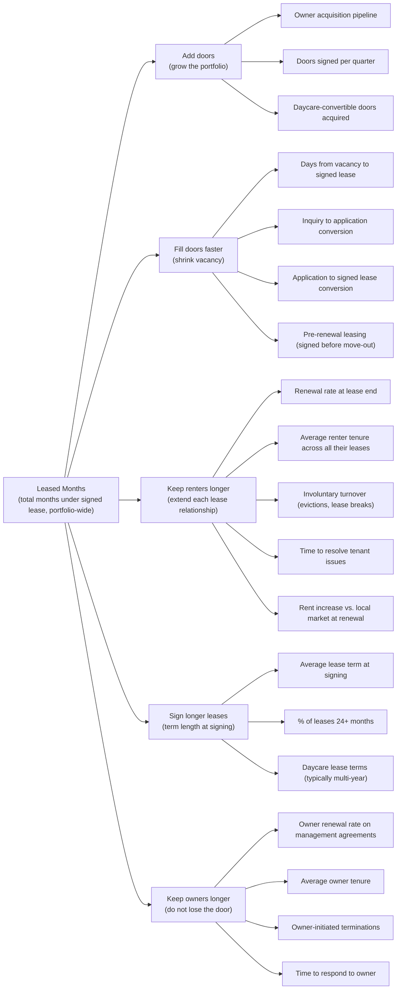

# Northstar-Leased Months

## North Star: Leased Months

**The total number of months under signed lease across the portfolio, summed.**

One door leased for twelve months equals twelve leased months. A hundred doors leased for a year equals 1,200 leased months. A renter who stays four years on one door contributes 48. A vacant month contributes zero. An evicted month contributes zero.

One integer. Counted from lease records.

## Why it Works

It is a **stock metric, not a flow metric.** It accumulates. Every month the business does its job, the number goes up. Every month it fails, the number does not move. There is no resetting, no annual goal, no clever denominator.

It rewards the right things and punishes the right things automatically:

| Behavior | Effect on Leased Months |
|---|---|
| Renter stays another year | +12 |
| Vacancy sits empty a month | 0 |
| Eviction mid-lease | Future months stop accruing |
| New door signed | + lease term |
| Daycare operator signs 5-year lease | +60 |
| Rent gouging triggers non-renewal | Lost future months |
| Deferred maintenance causes lease break | Future months stop accruing |
| Owner pulls property | Future months on that door stop accruing |

Every shortcut that inflates revenue shows up as a leak in leased months. The metric counters itself.

It passes the tests a real north star must pass:

- **Not a financial outcome.** It is a state of the business. Money follows it, but it is not money.
- **Directly controllable.** Every team has a clear contribution: leasing fills doors, ops keeps renters, account management keeps owners, acquisitions adds doors.
- **Resistant to gaming.** Raising rent to inflate revenue costs renewal months. Cutting maintenance to boost margin costs renewal months.
- **Long tenancies are the win.** A ten-year renter at fair rent is 120 leased months. That is the highest-value outcome the business can produce, and the metric says so.
- **Daycare fits cleanly.** Daycare operators sign long leases and do not leave. Conversion shows up as a step-change in average lease term and a drop in turnover, both visible in the tree.
- **Scales with the business.** Adding doors grows it. Keeping doors grows it. No ceiling, no annual reset, no awkward denominator that breaks when portfolio size changes.

## The Levers

## Known Limitations and the Rules that Address Them

The metric has two structural weaknesses. Both are manageable with disciplined reporting and clear accrual rules.

### Limitation 1: Door Count is Not Door Quality

A 100-door portfolio at $1,200/month and a 100-door portfolio at $3,500/month produce identical Leased Months. The metric treats them as equivalent. They are not.

The fastest way to grow Leased Months is to sign cheap, marginal doors: C-class properties in deferred-maintenance condition with price-sensitive renters. They lease quickly and generate months. They also generate disproportionate operational load and lower margin per leased month. The self-correction in the metric (churn, owner exits, evictions) lags 12 to 24 months. A company chasing Leased Months as the sole metric can paper over a quality problem for two full years before the leak appears.

**Guardrail: revenue per leased month.** Tracked alongside Leased Months, not aggregated into it. Reported in the same monthly view. If Leased Months grows while revenue per leased month falls, the portfolio is degrading and acquisition criteria need to tighten.

### Limitation 2: Acquisition Months and Retention Months Are Not the Same Business Event

A new 12-month lease on a newly-signed door contributes +12. A renewal of an existing renter for 12 months also contributes +12. Acquisition costs money and effort (marketing, leasing agent time, turnover costs, vacancy gap). Renewal is nearly free.

A portfolio generating 1,200 Leased Months per year from 100% renewals is dramatically healthier than one generating 1,200 from 50% renewals and 50% new signings.

**Reporting decomposition.** Same north star, but the monthly report breaks the new Leased Months added that month into three sources:

1. Leased Months from renewals
2. Leased Months from new leases on existing doors (turnover re-leases)
3. Leased Months from newly-acquired doors

The aggregate is the score. The ratio is the health signal.

## Accrual Rules

These rules need to be locked before the first dashboard ships. Disputes about how to count are the fastest way to corrupt a north star.

### What Counts as a Leased Month

- A month counts when there is a signed lease in force for that month, regardless of payment status.
- Partial months count as fractional contributions (a lease signed on the 15th contributes 0.5 leased months for that month).
- Pre-leasing (a signed lease with a future start date) does not accrue until the start date.

### Month-to-month Conversions

After the initial signed term expires, a tenancy that continues month-to-month accrues 1 leased month per month it persists, recognized as that month closes. The metric does not project forward on month-to-month tenancies. This avoids overstating committed inventory.

### Evictions

On the eviction effective date, the lease stops accruing. **Do not retroactively subtract** previously accrued months. The signal is "we lost the renter starting now," not "those months never happened."

Retroactive subtraction creates incentive to hide evictions or delay them past lease end, which corrupts both the metric and the operational reality it is supposed to measure.

### Voluntary Lease Breaks

Same rule as evictions. Stop accruing on the termination date. Do not retroactively subtract.

### Owner Terminations

When an owner pulls a property from management, the doors on that property stop accruing on the management agreement termination date. Do not retroactively subtract signed-but-unfulfilled months. The signal is a flat line on that door, not a crater in the metric.

### Sale of a Managed Property

If an owner sells and the new owner retains Green Lappe, treat as continuous (no break in accrual). If the new owner terminates, apply the owner termination rule.

## Reporting Cadence

- **Monthly snapshot.** Cumulative Leased Months at month end, with the decomposition into renewals, re-leases, and new doors for that month.
- **Quarterly headline.** Quarter-over-quarter growth rate in cumulative Leased Months. This is the investor-facing number.
- **Guardrail panel.** Revenue per leased month, trailing 12 months, reported alongside the cumulative total.

## The Pitch

Green Lappe's north star is Leased Months: the total months of signed tenancy across the portfolio. It compounds when doors are added, filled faster, renters retained longer, and owners retained longer. One operating metric every team contributes to.

A full financial picture still requires revenue per door, gross margin, CAC on owner acquisition, and churn assumptions. Leased Months is the operating north star, not a substitute for the financial model.
