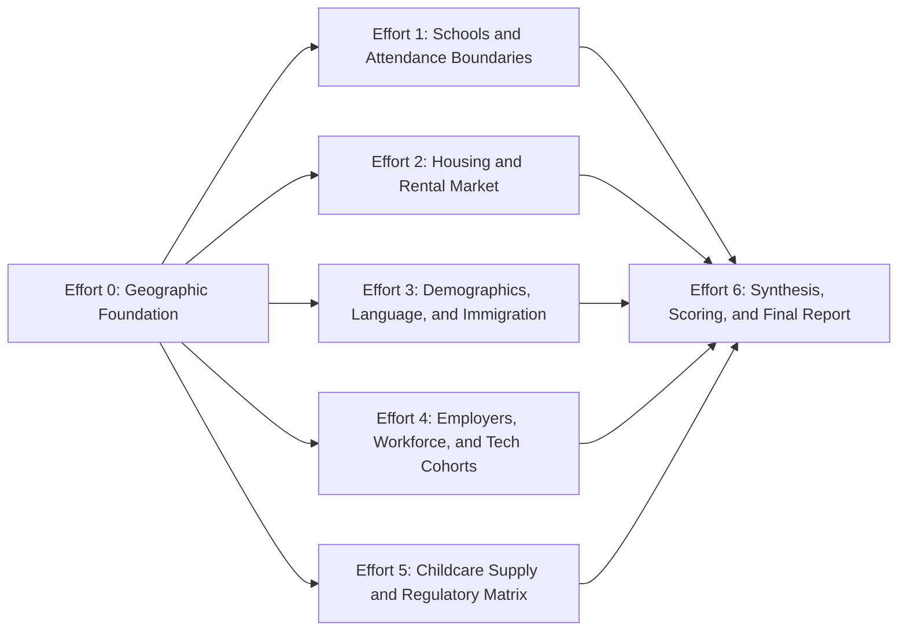

# Demographic Research Plan

## Overall Goal

Produce a ZIP-level decision dataset and accompanying narrative for King County and Snohomish County, Washington that simultaneously supports (a) Green Lappe's property management sub-market sequencing, language-access investments, and tenant-screening service design, and (b) Green Lappe's parcel-level acquisition decisions across the dual-use thesis of long-term rental or licensed daycare conversion. Every downstream decision (where to enter first, which languages to support, which screening flows to build, which properties to underwrite, which use case to lead with per ZIP) must be answerable from this single dataset.

## Overall Scope

- **Geography**: King County and Snohomish County, Washington. ZIP code (ZCTA) as primary unit. Secondary aggregations: school attendance boundary, city, school district, county. Edge ZIPs with under 10% land area inside the two-county footprint are flagged but excluded from primary analysis.
- **Asset focus**: small-portfolio residential properties (1 to 4 units automatic, 5 to 49 units individually-owned) suitable for property management, long-term rental acquisition, or licensed daycare conversion.
- **Time horizon**: current snapshot with 3 to 5 year primary trends; 10-year secondary projection horizon via OFM and PSRC forecasts.
- **Sources**: public and triangulated public-proxy only. No paywalled employer or compensation datasets where a free proxy exists.
- **Out of scope**: Pierce, Kitsap, and Eastern Washington counties. Commercial real estate. Large institutional multifamily (50+ units without small-owner LLC structure). Post-secondary education. Preschool data not tied to licensed childcare. Primary interviews (covered by existing Green Lappe persona research).

## Top-Level Decisions This Research Must Support

1. **PM sub-market sequencing**: which city/ZIP combinations does Green Lappe enter first as a property manager, and in what order through the first 100, 500, and 2,000 doors?
2. **Service-design priorities**: which language-access, screening-accommodation, and compliance capabilities does each priority sub-market reward, and which build first?
3. **Rental acquisition shortlist**: which ZIPs should Green Lappe's own acquisition entity focus on for direct property purchase under a single-family or small-multifamily rental thesis?
4. **Daycare conversion shortlist**: which ZIPs are viable for licensed family childcare or center daycare conversion, and what is the zoning friction by jurisdiction?
5. **Dual-use shortlist**: which ZIPs score in the top tier on both rental and daycare scores, and which use case should lead per shortlisted parcel?
6. **Monitoring layer**: which employer events, regulatory changes, and demographic trend lines must Green Lappe track quarterly to anticipate sub-market shifts?

The math must be granular enough to defend statements like "Lynnwood `98036` before Bellevue `98007`," "Russian-Ukrainian language capability before Telugu," and "lead with daycare conversion in `98052`, lead with rental in `98003`."

## Sequencing Strategy

Effort 0 establishes the geographic foundation everything joins to. Efforts 1 through 5 are independent collection layers running in parallel. Effort 6 is pure synthesis.

---

## Effort 0: Geographic Foundation

### Goal

Establish the canonical ZIP universe and the city, school district, and jurisdiction crosswalks every later dataset joins to.

### Scope

All ZIPs with at least 10% land area inside King or Snohomish County. All incorporated cities, all unincorporated areas, all school districts intersecting the two counties.

### Questions

1. Which ZIPs are in scope, and which are flagged as edge cases?
2. Which cities, school districts, and county jurisdictions does each ZIP intersect?
3. How is each ZIP classified: urban core, urban, suburban, exurban, rural?
4. What is the current population and 10-year population trend per ZIP?
5. Which ZIPs have anomalies (large unincorporated portions, recent annexations, cross-county ZIPs, recent boundary changes)?

### Why The Answers Are Needed

Every downstream metric lives at a finer or different granularity than ZIP. Schools attach to attendance boundaries. Rents attach to listings at the parcel level. Regulations attach to jurisdictions. Without a clean crosswalk and authoritative boundary file, joins produce silent errors and double counting. Urban/suburban/rural classification segments analysis so dense Seattle ZIPs do not get compared against rural Snohomish ZIPs on the same scale.

### Decisions This Informs

- Which ZIPs make the candidate list at all.
- How to segment the final ranking (top-10 per sub-market beats a single list).
- Which jurisdictions the regulatory matrix must cover.
- Which ZIPs to exclude or footnote because of geographic anomalies.

### Geographic Inventory

- **King County cities**: Seattle, Bellevue, Redmond, Kirkland, Sammamish, Issaquah, Renton, Kent, Federal Way, Auburn, SeaTac, Tukwila, Burien, Des Moines, Shoreline, Mercer Island, Bothell (King portion), Woodinville, Newcastle, Kenmore, Lake Forest Park.
- **Snohomish County cities**: Everett, Lynnwood, Edmonds, Mukilteo, Mountlake Terrace, Mill Creek, Bothell (Snohomish portion), Marysville, Arlington, Lake Stevens, Monroe, Snohomish (city), Stanwood, Granite Falls.
- **Eastside ZIPs**: `98052`, `98053`, `98004`, `98005`, `98006`, `98007`, `98008`, `98033`, `98034`, `98074`, `98075`, `98029`, `98027`, `98040`.
- **South Seattle / South King ZIPs**: `98144`, `98118`, `98122`, `98106`, `98108`, `98168`, `98178`, `98030`, `98031`, `98032`, `98042`, `98003`, `98023`, `98188`, `98198`.
- **North King and Seattle urban core ZIPs**: `98109`, `98121`, `98119`, `98103`, `98115`, `98133`, `98155`, `98011`, `98021`, `98028`.
- **Snohomish ZIPs**: `98201`, `98203`, `98204`, `98208`, `98036`, `98037`, `98020`, `98026`, `98275`, `98012`, `98270`, `98271`, `98258`, `98043`, `98087`, `98223`, `98290`, `98272`, `98292`.

---

## Effort 1: Schools and Attendance Boundaries

### Goal

Build a complete picture of K-12 school quality, capacity trends, and attendance geography across both counties.

### Scope

All public schools (including charter and magnet), all private schools (secular and religious), grades K through 12. Attendance boundaries for public schools only. 3 to 5 year enrollment trends and recent boundary changes.

### Questions

1. Where are the highest-rated elementary, middle, and high schools concentrated by ZIP and attendance zone?
2. Which ZIPs sit inside attendance zones for top-rated schools at all three tiers simultaneously?
3. Where is enrollment growing and where is it shrinking?
4. Which districts have redrawn boundaries recently, and which are signaling future changes?
5. How does private school density vary by ZIP, and where do families exit public schools at higher rates?

### Why The Answers Are Needed

School quality is the single strongest non-price driver of single-family rental demand and price stability. Ratings tie to attendance boundaries, not ZIPs: two houses on the same block can have different school assignments and materially different rental values. Enrollment trends signal whether a neighborhood is gaining or losing families. Pending boundary changes are an under-priced risk: a rezoning can move a property from a 9-rated school to a 5-rated school overnight.

### Decisions This Informs

- Which neighborhoods (not ZIPs) to target for family-oriented rentals.
- Which properties to avoid because of pending boundary changes.
- Which ZIPs support the daycare conversion thesis (high-quality school feeders pull families with younger children).
- Whether a specific address claim of "great schools" actually holds at the parcel level.

---

## Effort 2: Housing and Rental Market

### Goal

Quantify per-ZIP housing values, rent levels, yields, velocity, supply dynamics, and small-portfolio building stock.

### Scope

Single-family detached and small multifamily (2 to 4 units) emphasized. ADU and DADU permit data tracked separately. Excludes new-construction luxury condos and 50+ unit complexes that are institutionally owned. 12 and 36 month trend windows.

### Questions

1. What is the median home value and median rent (by bedroom count) per ZIP?
2. Where are rents growing faster than home values (yield expansion, acquisition-friendly)?
3. Where is the opposite happening (yield compression, hold or exit signal)?
4. What is the rent-to-price ratio per ZIP, and which ZIPs clear 0.7% monthly?
5. Where is vacancy elevated, and where is rental absorption fastest?
6. What is the owner-renter mix, single-family share, and new construction pipeline by ZIP?
7. What share of renter households live in 1-4 unit and 5-20 unit buildings per ZIP?
8. What is the ADU and DADU permit growth rate post-HB 1337 (2023) and Seattle's 2019 ADU expansion, by jurisdiction?
9. What is the rate-locked owner share (sub-4% mortgages) by ZIP, as a proxy for accidental-landlord supply?
10. What is the concession-flag rate and days-on-market by ZIP and submarket?

### Why The Answers Are Needed

Rental yield drives whether a property cash-flows. School quality is irrelevant if the price-to-rent math fails. Velocity and vacancy signal whether a submarket is liquid enough to underwrite. Construction pipeline flags supply risk: a ZIP with 500 units delivering in 18 months will compress rents. The small-portfolio building stock count is the denominator for PM-side TAM. ADU/DADU permits and rate-locked owners are the structural supply of accidental landlords (Green Lappe's primary owner persona).

### Decisions This Informs

- Which ZIPs pass the underwriting screen for direct rental acquisition.
- Whether a ZIP is better suited for short-hold appreciation or long-hold cash flow.
- How aggressive to price (slow markets) versus how fast to act (hot markets).
- Which submarkets to avoid because of incoming supply.
- Which ZIPs to prioritize for accidental-landlord PM acquisition (high rate-lock share, high ADU/DADU velocity).

---

## Effort 3: Demographics, Language, and Immigration

### Goal

Profile household composition, language access, country-of-origin demographics, and immigration-tied tenant cohorts at ZIP granularity. Establish renter-household denominators and identify LEP and visa-cohort clusters that incumbent PM screening systematically fails.

### Scope

Census ACS 5-year (2019 to 2023) at ZCTA level, supplemented with ACS 1-year 2024 at county and place level. Foreign-born and language-spoken-at-home detail. H-1B, L-1, OPT, F-1 employer and worksite data. Refugee and asylum arrival data. Commute-time computation from each ZIP centroid to six employment hubs (Seattle CBD, SLU, Bellevue CBD, Redmond, Everett-Boeing, Renton-Boeing).

### Questions

1. How many renter households exist in each target city and ZIP, and what share of total households do they represent?
2. What is the 10-year population growth rate (2014 to 2024) by sub-market, and what does OFM project through 2035?
3. What is the median household income and rent burden (>30%, >50%) by sub-market?
4. Where are households with children under 5 concentrated, and what is the density per square mile?
5. Where are dual-income high-earner households concentrated?
6. What is the educational attainment profile by ZIP?
7. What is the foreign-born share by county, city, and ZIP?
8. What are the top 10 non-English languages spoken at home by county and target city, with speaker counts?
9. Where does Limited English Proficiency (LEP) concentrate at the ZIP level?
10. Which specific language communities cluster in which sub-markets (Mandarin/Cantonese, Hindi/Telugu/Tamil/Punjabi/Gujarati, Russian/Ukrainian, Korean, Vietnamese, Spanish, Amharic/Tigrinya/Oromo, Somali, Khmer/Lao, Tagalog, Marshallese), and how have those clusters shifted 2014 to 2024?
11. How many H-1B, L-1, OPT, and F-1 visa holders are in King and Snohomish Counties, by employer and by year?
12. How many refugees and asylum seekers have been resettled in each county since 2020, by origin country and primary resettlement agency (IRC Seattle, World Relief WW, JFS Seattle, LCS NW)?
13. How does First-in-Time tenant selection (Seattle `SMC 14.08.050`) prevent informal screening accommodation, and how does this vary across King jurisdictions and the Snohomish county line?
14. How has racial and ethnic composition changed 2010, 2020, 2024 by sub-market?
15. What is the magnitude of the Eastside Asian shift in Bellevue, Redmond, Sammamish, Newcastle?
16. What is the magnitude of Black population out-migration from Seattle's Central District to South King and South Snohomish?
17. What is the commute-shed of each major employer hub, and which ZIPs sit inside premium commute zones?

### Why The Answers Are Needed

Renter-household counts are the denominator for every downstream TAM number. LEP density determines where multilingual investment pays back; language capability is expensive (hiring, translation, vendor sourcing) and only earns return where LEP density and rent capacity coexist. Visa-tied and refugee renters are a structural failure mode of incumbent PM screening; First-in-Time prevents informal accommodation in Seattle, which means alternative-screening capability is a real product feature, not a marketing line. Demographic trend lines distinguish sub-markets where the bet is improving from sub-markets that are static or declining; entering ahead of a trend pays more than chasing it. Commute time to Amazon, Microsoft, and Boeing is a stronger rent-premium predictor than ZIP-level averages because employment is concentrated.

### Decisions This Informs

- Which sub-markets pass a minimum renter-household threshold for PM entry.
- Per-door PM-revenue forecasting and marketing-reach calculations.
- Which language(s) Green Lappe builds capability in first (likely two, not ten).
- Where to deploy multilingual leasing agents and maintenance dispatchers.
- Which sub-markets get translated lease packets, deposit-return documentation, and maintenance request flows.
- Whether to build alternative-screening capability (international credit history, employer verification, asset-based screening, refugee-agency co-sign protocols) as a core feature or niche add-on.
- Which CBOs and resettlement agencies to build referral relationships with.
- Whether to offer Seattle-specific First-in-Time compliance tooling.
- Which ZIPs match the family-rental tenant profile vs. the daycare conversion profile (under-5 density, dual-income, tuition capacity).

---

## Effort 4: Employers, Workforce, and Tech Cohorts

### Goal

Identify the employer-driven engines of rental demand, quantify tech-cohort renter behavior through hiring and layoff cycles, and define the early-warning indicators Green Lappe must monitor as a business.

### Scope

Top 20 employers by headcount with deep focus on named tech firms (Microsoft, Amazon, Meta, Google, Apple, T-Mobile, Salesforce, Nvidia, Oracle, F5, Expedia, Zillow, Redfin, DocuSign, Smartsheet, SAP Concur, Adobe, Stripe, OpenAI Seattle, Anthropic, Snowflake, Databricks, ServiceNow, Cisco). Boeing in Snohomish and South King. Non-tech anchors: UW, Fred Hutch, Seattle Children's, Virginia Mason, Providence, MultiCare, Swedish, Premera, Kaiser, Costco HQ, Starbucks HQ, Nordstrom HQ, Weyerhaeuser, PACCAR, Alaska Airlines, Port of Seattle, public sector. Six tenant cohorts defined by tenure and visa status.

### Questions

18. Who are the 20 largest employers in King and Snohomish Counties, with current headcount, year-over-year change, and primary worksite ZIPs?
19. For each named tech employer, what is the regional headcount, the 2019 to 2025 hiring trajectory, and the layoff history (counts, dates)?
20. What is the H-1B and LCA volume by employer and worksite ZIP, FY2019 to FY2024, including new vs. continuing approvals and median wage by occupation?
21. What is Boeing's regional headcount trajectory in Snohomish (Everett, Mukilteo) and King (Renton, Tukwila, Auburn), including the 2024 IAM 751 strike outcome and the wide-body/narrow-body production rate outlook?
22. What is Amazon's Seattle and Bellevue physical-presence trajectory (HQ2-era hiring, RTO mandate, Bellevue tower expansion, 2022 to 2024 layoffs)?
23. What is the next tier of employer-driven renter demand (healthcare, retail HQ, aerospace, public sector)?
24. What share of regional renter demand is driven by tech vs. healthcare vs. aerospace vs. retail HQ vs. public sector?
25. What WARN notices have been filed in King and Snohomish Counties 2022 to 2025, by employer, count, effective date?
26. What is the RTO posture of the top 20 employers as of 2026, and how does it correlate with renter demand by sub-market?
27. What is the household income distribution by city and ZIP, with percentile cuts (25th, 50th, 75th, 90th)?
28. What is the renter income distribution specifically, separated from owner-occupier income?
29. What is the rent-to-income ratio by sub-market, and where do cost-burdened (>30%) and severely cost-burdened (>50%) shares concentrate?
30. What is the median compensation by tech-employer job family (SDE, PM, applied scientist, data engineer, sales) at Microsoft, Amazon, Meta, Google, and the next tier? Sources: levels.fyi, Blind, H-1B LCA, Glassdoor.
31. How does total compensation (base + bonus + RSU) translate to monthly rent capacity at each level (L4/SDE II, L5/Senior, L6/Principal-equivalent)?
32. What share of regional renter households have at least one tech-employer earner, by sub-market?
33. What is the dual-tech-income household share in Bellevue, Redmond, Sammamish, Kirkland, Bothell, and Seattle urban-core ZIPs?
34. What is the savings, asset, and rent-prepayment capacity of H-1B and OPT-cohort renters, and how does it inform deposit and screening accommodations?
35. What is the unemployment rate, labor-force participation, and wage growth rate by county and sub-market over the past 5 years?
36. What is the cost-of-living index by sub-market, and how does it compare to peer metros (Bay Area, NYC, Austin, Boston)?
37. **Cohort A (new-hire tech, 0-2 years)**: inflow rate, median compensation, first housing decision, sub-market clustering, behavior through hiring booms (2019 to 2021), layoffs (2022 to 2023), partial recovery (2024 to 2026).
38. **Cohort B (mid-tenure tech, 3-7 years)**: rent vs. own share, sub-markets, move-out rate when they buy.
39. **Cohort C (senior tech, 8+ years)**: accidental-landlord conversion rate, location of their rental units.
40. **Cohort D (H-1B and OPT visa-tied tech)**: renter share, compensation, screening-friction exposure, sub-market clustering.
41. **Cohort E (laid-off tech)**: median time-to-rehire, region-exit share, housing downshift share.
42. **Cohort F (tech-adjacent contractor and gig workers)**: headcount, earnings, sub-market clustering.
43. For each cohort, what is the elasticity of rental demand to employer hiring and layoff cycles? Specifically, what was the rental vacancy and rent-growth response in Bellevue, Redmond, and SLU to the 2022 to 2023 tech layoffs?
44. What is the time lag between a layoff event (WARN filing or announcement) and observable rental-market response (vacancy, concession growth, rent decline) in affected sub-markets?
45. How does RSU vesting cliff timing (1-year cliff, then quarterly) interact with lease renewal and home purchase timing?
46. What is the home-purchase conversion rate among tech workers by tenure, and how does that drain rental demand from specific sub-markets?
47. What is the rental-demand resilience of non-tech cohorts (healthcare, public sector, education) during tech downturns? Which sub-markets are most insulated?

### Why The Answers Are Needed

Rental demand is downstream of employer headcount and hiring posture. Layoff events and RTO mandates move sub-market vacancy by hundreds of basis points within a quarter. The 2022 to 2023 tech layoffs moved Bellevue and SLU Class A vacancy materially within 60 to 120 days; if small-portfolio Class B/C in South King and Snohomish moved less, that is a real positioning advantage. Without a cohort-level model and employer-monitoring layer, Green Lappe cannot tell owners (or itself) how exposed each sub-market is. Compensation-to-rent translation calibrates screening tolerance and deposit-prepayment policy for asset-rich, credit-thin tenants.

### Decisions This Informs

- Which employers' WARN filings, hiring announcements, and RTO postures Green Lappe tracks as leading indicators.
- Sub-market diversification strategy (avoid concentrating doors in a single-employer sub-market without non-tech diversification).
- Whether to build employer-direct partnerships (relocation packages, preferred-PM lists).
- Boeing-specific exposure planning for Snohomish (production rate, strike risk).
- Rent pricing bands and concession strategy by sub-market.
- Screening thresholds (rent-to-income ratios, deposit and prepayment policies).
- Lease term recommendations to owners (longer in dual-tech sub-markets; shorter or buyout-friendly for Cohort B renters likely to purchase).
- Cohort-specific lease policies (longer terms for H-1B Cohort D in years 1-3).
- Where to position higher-touch service tiers vs. baseline.
- Whether to build a "downshift" service (helping Class A renters move to small-portfolio Class B/C during layoff cycles) as a counter-cyclical channel.
- Pricing posture in tech-heavy vs. tech-insulated sub-markets through a downturn.

---

## Effort 5: Childcare Supply and Regulatory Matrix

### Goal

Identify daycare supply gaps by ZIP, map the regulatory rules governing both rental operations and daycare conversions per jurisdiction, and catalog exogenous regulatory risks that could materially change the TAM.

### Scope

All Washington DCYF-licensed family home and center childcare facilities in both counties. Regulatory matrix covering every incorporated city plus unincorporated King and unincorporated Snohomish. Daycare zoning rules covering residential single-family zones (in-home) and commercial/mixed-use zones (centers). Rental regulatory matrix covering just-cause eviction, rent control, source-of-income protections, Fair Chance Housing, landlord licensing, rental inspection programs, short-term rental restrictions. Federal exogenous risks (immigration policy, AI hiring shift), state risks (HB 1217 rent stabilization), local risks, interest rate environment, climate migration, Boeing production rate risk.

### Questions

48. Where is licensed childcare capacity shortest relative to the under-5 population (children-per-100-slots ratio)?
49. Where have facilities recently opened or closed (market entry and exit signals)?
50. What is the average daycare tuition by ZIP, and how does it correlate with household income?
51. Which jurisdictions allow in-home daycare by right, by conditional use, or not at all?
52. Where is commercial daycare zoning available?
53. Which jurisdictions have just-cause eviction, rent control, source-of-income restrictions, or other landlord-burden rules?
54. Which cities have short-term rental restrictions, landlord licensing, or rental inspection programs?
55. What ordinance changes are pending that could affect the next 12 to 24 months?
56. What is the realistic range of federal immigration policy outcomes affecting H-1B, OPT, and refugee inflows over the next 5 to 10 years?
57. What is the AI-driven hiring shift at Microsoft, Amazon, Google, and the next tier (Anthropic, OpenAI), and how does it change the composition of tech renter demand (more applied scientists, fewer junior SDEs)?
58. How does HB 1217 rent stabilization, source-of-income protections, and Fair Chance Housing shift the small-portfolio owner base?
59. How does the interest rate environment affect accidental landlord supply (rate-locked owners renting out rather than selling)?
60. What is the climate-migration inflow signal for the Pacific Northwest?
61. What is the Boeing production rate risk to Snohomish County renter demand (737 MAX, 777X, 787)?

### Why The Answers Are Needed

The daycare conversion thesis lives or dies on zoning: a perfect demographic match in a ZIP where commercial daycare requires conditional-use approval is high-risk and slow. The rental regulatory matrix defines operating cost and friction; Seattle, Burien, Federal Way, and unincorporated King County have materially different rules and the same property under different jurisdictions has different cash flow profiles. Concentration risk in tech-cohort renters is real (Cohort D especially); a single H-1B policy change or another large layoff wave could move TAM by double digits in specific sub-markets. Owner-side TAM is exposed to rate environment changes (rate-locked owners are a structural supply source only if rates stay elevated relative to their lock-in rate). Without an exogenous-risk catalog, sub-market sequencing cannot be stress-tested.

### Decisions This Informs

- Which ZIPs are viable for daycare conversion (zoning gate first, then demand).
- Which jurisdictions to prefer for straight rental acquisition (lower friction, lower regulatory risk).
- How to structure entity, lease, and screening processes per jurisdiction.
- Which pending ordinances should accelerate or delay acquisition timing.
- Sub-market diversification floor (do not enter a sub-market whose TAM is single-shock-fragile without a hedge).
- Scenario planning for the business plan and any investor materials.
- Which exogenous indicators to track quarterly.

---

## Effort 6: Synthesis, Scoring, and Final Report

### Goal

Join all prior datasets at the ZIP level, compute three composite scores, rank ZIPs, and produce the written market analysis with rationale.

### Scope

No new data collection. Pure synthesis of Efforts 0 through 5. Three independent composite scores (PM business sequencing, rental acquisition, daycare conversion), top-10 ranked lists per use case plus a top-5 dual-use list, deep-dive profiles for top targets, heatmap layers, and sensitivity analysis on scoring weights.

### Questions

62. Which sub-markets rank highest for PM business entry, with rationale?
63. Which ZIPs rank highest for rental acquisition, with rationale?
64. Which ZIPs rank highest for daycare conversion, with rationale?
65. Which ZIPs score in the top tier for both rental and daycare?
66. What is the estimated renter-household TAM in small-portfolio buildings, by sub-market?
67. Which sub-markets reward multilingual capability most (LEP density × renter density × tech-employer concentration)?
68. What is the accidental landlord supply estimate by sub-market (ADU/DADU + relocating tech workers + rate-locked owners)?
69. Which sub-markets have the highest tech-cohort renter density and therefore the highest exposure to layoff-cycle volatility?
70. Where are the mismatches: high-quality schools with below-market rent (buy signal), or low-quality schools with premium rent (avoid)?
71. Which sub-markets carry the highest regulatory or supply risk?
72. How sensitive are the rankings to scoring weight changes?

### Why The Answers Are Needed

Raw data does not drive decisions; ranked recommendations with stated rationale do. Three composite scores compress 60+ variables into one ordering per use case, with the rationale field exposing why each ZIP scored as it did. Mismatch analysis surfaces non-obvious opportunities that the score alone might bury. Sensitivity analysis prevents over-reliance on a single weighting scheme. This is the section the executive summary points to; every prior effort feeds the rank order.

### Decisions This Informs

- The actual entry sequence for Green Lappe PM sub-market launches (first 100, 500, 2,000 doors).
- The service-design priority list (which capabilities to build first, given the sub-markets being entered first).
- The shortlist of ZIPs for active rental acquisition search.
- The shortlist of ZIPs for daycare conversion thesis.
- Which use case to lead with in each shortlisted dual-use ZIP.
- Whether to expand search criteria (top-ranked ZIPs too thin) or narrow them.
- Where to commission the first parcel-level analysis and broker outreach.

### Composite Scoring Methodology

Three independent scores per ZIP, each 0 to 100. Final report documents exact weights and runs sensitivity analysis on the top 20 ZIPs per score.

**PM business sequencing score** weights:

- Renter-household count in small-portfolio buildings
- Accidental landlord supply (ADU/DADU permit velocity, rate-locked owner share, tech-relocation rate)
- LEP density and language clustering (multilingual capability ROI)
- Visa-cohort renter density (alternative-screening capability ROI)
- Regulatory complexity (compliance moat opportunity; Seattle First-in-Time, HB 1217 enforcement)
- Tech-cohort exposure (positive for service-tier upside, negative for volatility)
- Employer commute-shed access

**Rental acquisition score** weights:

- School quality (elementary, middle, high attendance zones intersecting the ZIP)
- Rent level and 12-month rent growth
- Rent-to-price ratio
- Tenant stability proxies: owner-renter mix, demographic stability, household income distribution
- Regulatory friendliness (jurisdiction-level)
- Commute access to top employment hubs

**Daycare conversion score** weights:

- Children under 5 population density
- Licensed-slot gap (children under 5 per 100 licensed slots)
- Zoning permissiveness (in-home by right, conditional, prohibited; commercial daycare zones available)
- Household income (tuition capacity)
- Proximity to high-income employment (commute-shed daycare demand)
- Facility opening and closure trends (market entry signal)

---

## Data Types and Sources

|Data Type|Primary Sources|Granularity|Vintage Target|
|---|---|---|---|
|Population, age, race, ethnicity|US Census 2020, ACS 5-year 2023 (S0101, B03002), ACS 1-year 2024|County, place, ZCTA|2020, 2023, 2024|
|Renter household count, tenure|ACS 5-year (B25003, B25008)|County, place, ZCTA|2023|
|Median household income, rent burden|ACS 5-year (S1901, B25070, B25074)|County, place, ZCTA|2023|
|Income distribution percentiles|ACS 5-year (B19001, B19013)|County, place, ZCTA|2023|
|Renter vs. owner income|ACS 5-year (B25118, B25119)|County, place|2023|
|Population projections|WA OFM Forecast of the State Population|County|2025-2050|
|Language spoken at home|ACS 5-year (B16001, C16002)|County, place, ZCTA|2023|
|LEP population|ACS 5-year (B16005, C16001)|County, place|2023|
|Foreign-born|ACS 5-year (B05002, B05006)|County, place, ZCTA|2023|
|H-1B by employer|USCIS H-1B Employer Data Hub|Employer, MSA|FY2022-FY2024|
|LCA disclosures (wages, worksite)|DOL OFLC LCA Disclosure Data|Employer, worksite ZIP|FY2023-FY2024|
|F-1 / OPT|SEVP SEVIS by the Numbers, IIE Open Doors|School|2023, 2024|
|Refugee arrivals|WA DSHS ORIA, State Dept Refugee Processing Center|County, origin|FY2020-FY2024|
|Resettlement agency placements|IRC Seattle, World Relief WW, JFS Seattle, LCS NW|Agency, county|2022-2024|
|ADU/DADU permits|Seattle DCI, King County DLS, Snohomish County PDS, city dashboards|Jurisdiction|2019-2024|
|Small-portfolio building stock|County Assessor parcel data; CoStar, Zillow public counts|Parcel, place|Current|
|Major employer headcount|PSBJ Largest Employers lists, 10-Ks, LinkedIn workforce signals|Employer, MSA|2022-2025|
|Layoffs and hiring|Layoffs.fyi, WA ESD WARN, company press releases|Employer, date|2022-2025|
|Tech compensation|Levels.fyi, Blind, LCA wages, Glassdoor, Payscale, BLS OEWS|Employer, role, level|2023-2025|
|Unemployment, labor force|BLS LAUS, WA ESD|County, MSA|2024-2025|
|Cost of living|BEA Regional Price Parities, C2ER ACCRA|MSA, place|2024|
|RTO posture|Flex Index, company announcements|Employer|2024-2026|
|Tech employment share|BLS QCEW (NAICS 5112, 5182, 5415, 5417)|County|2024|
|Rental vacancy and rent growth|Apartment List, CoStar (where accessible), Zillow ZORI, Apartment Insights|Sub-market|2022-2025|
|Rate-lock data|FHFA NMDB, Redfin Lock-In Effect|National, MSA|2024-2025|
|Regulatory tracking|RCW, WAC, Seattle SMC, MRSC, King County Code, city codes|Jurisdiction|Current|
|Public school ratings|GreatSchools, Niche, OSPI Report Card|School|Current|
|Public school attendance boundaries|OSPI, district GIS portals (Seattle SPS, Lake Washington, Bellevue, Northshore, Everett, Mukilteo, Edmonds, Kent, Federal Way)|School, boundary|Current|
|Private schools|NCES Private School Universe Survey, WA OSPI private school list|School|2023-2024|
|Licensed childcare facilities|WA DCYF Child Care Search, Child Care Aware of WA|Facility, license|Current|
|Daycare zoning|City municipal codes, county code, MRSC zoning summaries|Jurisdiction|Current|
|Commute time|OpenStreetMap routing or Google Distance Matrix from ZIP centroid to 6 employer hubs|ZIP|Current|
|Median home value|Zillow ZHVI, Redfin, county assessor|ZIP, place|2024-2025|
|Rent by bedroom|HUD SAFMR, Zillow ZORI, Apartment List|ZIP (SAFMR), place|2024-2025|

## Hypotheses To Test

|#|Hypothesis|How It Resolves The Sequencing Question|
|---|---|---|
|H1|Eastside renter TAM in small-portfolio buildings is materially smaller than South King and South Snohomish, because Eastside renter stock is dominated by Class A institutional product.|Small-portfolio TAM is concentrated in South King and South Snohomish despite the Eastside income story.|
|H2|LEP-weighted TAM is highest in Tukwila, SeaTac, Kent, Federal Way, Lynnwood, with secondary cluster in Mountlake Terrace and Mill Creek.|Multilingual capability is a moat in those sub-markets, not on the Eastside.|
|H3|H-1B / OPT renter density per small-portfolio unit is highest in Redmond `98052`, Bellevue `98007`/`98008`, Bothell `98011`/`98021`.|The "no US credit history" screening problem is an Eastside problem first.|
|H4|Ukrainian and Russian-speaking renter share in Snohomish (Lynnwood, Mountlake Terrace, Mill Creek, Mukilteo) grew >25% between 2021 and 2024.|Russian/Ukrainian capability is a Snohomish moat.|
|H5|ADU/DADU permit issuance more than doubled in Seattle and tripled in unincorporated King between 2019 and 2024.|Accidental landlord supply is large and concentrated; dedicated onboarding flow justified.|
|H6|Tech-sector layoffs 2022 to 2025 reduced H-1B-tied renter inflow by less than 15% in net terms, because backfill hiring continued.|H-1B renter TAM is more resilient to layoff cycles than headlines suggest.|
|H7|Black population in Seattle `98118`, `98144`, `98108` declined in absolute terms 2010 to 2020, with corresponding gains in Kent, Renton, Federal Way, Lynnwood.|South King and South Snohomish are where displaced-community service expectations now live.|
|H8|Rate-locked owner share (sub-4% mortgages) in King and Snohomish is high enough that accidental-landlord conversion is structural, not cyclical.|Small-portfolio acquisition strategy is durable through rate environments.|
|H9|Microsoft and Amazon together account for >40% of net new tech renter inflow to King County 2019 to 2024.|Concentration risk is high; track these two as leading indicators.|
|H10|Tech-layoff events (2022 Meta, 2023 MS/Amazon/Google) produced a 60 to 120 day lag, then a measurable bump in Class A vacancy in Bellevue and SLU, but near-zero effect on small-portfolio Class B/C in South King and Snohomish.|Small-portfolio TAM is insulated from tech-layoff volatility; a positioning advantage.|
|H11|Dual-tech-income households concentrate in Bellevue `98004`/`98005`/`98008`, Kirkland `98033`, Sammamish `98074`, Mercer Island `98040`, with median HH income above $400K.|Confirms Eastside ownership/condo-rental sub-segment but not small-portfolio rental TAM.|
|H12|Boeing's IAM 751 workforce in Everett, Mukilteo, Renton generates more small-portfolio renter demand than any single tech employer outside Microsoft and Amazon.|Snohomish small-portfolio TAM is aerospace-anchored, not tech-anchored.|
|H13|RTO mandates 2023 to 2026 reversed remote-era outflows from urban core (SLU, Capitol Hill, Downtown Bellevue, Downtown Redmond) and tightened rental vacancy by Q2 2025.|Urban core is re-pricing upward; small-portfolio owners there have pricing power.|
|H14|Accidental-landlord supply (tech worker buys upgraded home, rents out original) is concentrated in Issaquah, Sammamish, Bothell, Mill Creek, Mukilteo, Redmond, with median rents $2,800-$4,200.|Owner-side acquisition strategy should target these sub-markets specifically.|
|H15|Top-rated school attendance zones in Bellevue (LWSD, BSD) and Issaquah (ISD) correlate with rent premiums of 15% or more over neighboring zones at the same ZIP.|School-zone targeting at the parcel level beats ZIP-level targeting for SFR rental acquisition.|
|H16|Licensed daycare capacity gap (children under 5 per 100 licensed slots) is widest in `98052`, `98074`, `98075`, `98029`, `98011`.|Eastside is the strongest daycare conversion submarket on demand, contingent on zoning.|
|H17|In-home daycare is by-right in single-family zones in most jurisdictions but conditional or prohibited in HOA-controlled subdivisions, which dominate parts of Sammamish and Mill Creek.|Parcel-level HOA check is mandatory before daycare conversion underwriting.|

## Deliverables

|Effort|Primary Output|Format|
|---|---|---|
|0|ZIP master list, boundary files, district and jurisdiction crosswalk|CSV + GeoJSON|
|1|Schools, attendance boundaries, ratings, enrollment trends|CSV + GeoJSON|
|2|Housing values, rents by bedroom, yields, ADU/DADU permits, small-portfolio stock|CSV|
|3|Demographics, language, LEP, foreign-born, visa cohorts, refugee placements, commute matrix|CSV|
|4|Employer headcount, layoffs, RTO posture, tech-cohort estimates, compensation-to-rent translation|CSV + Markdown|
|5|Childcare facilities, gap analysis, daycare zoning matrix, rental regulatory matrix, exogenous risk catalog|CSV + Markdown|
|6|Joined dataset, three composite scores, ranked ZIP lists per use case, dual-use shortlist, final report, sensitivity analysis, heatmaps|CSV + Markdown + GeoJSON|

## Final Report Structure

1. Executive summary (1 page, three top-10 rank orders surfaced first)
2. Geographic foundation
3. Schools and attendance boundaries
4. Housing and rental market
5. Demographics, language, and immigration
6. Employers, workforce, and tech cohorts
7. Childcare supply and regulatory matrix
8. Exogenous risks
9. PM business sequencing score and top-10 sub-markets
10. Rental acquisition score and top-10 ZIPs
11. Daycare conversion score and top-10 ZIPs
12. Dual-use shortlist and use-case lead per parcel
13. Sensitivity analysis
14. Data sources, vintage, and caveats

## Cohort Analysis Methodology

No public dataset reports "tech workers by years of tenure at Puget Sound employer," so each cohort is triangulated:

- **Inflow estimates (Cohort A)**: new-grad and lateral counts from H-1B LCA new approvals, LinkedIn workforce signals, levels.fyi self-reported start dates, company workforce announcements.
- **Tenure mix**: BLS QCEW total tech employment by NAICS × tenure distribution data × known company headcount.
- **Cohort behavior**: Zillow/Redfin first-time buyer reports, Apartment List renter reports, PSRC survey data, Green Lappe's existing landlord interview base.
- **Layoff-cycle response**: WARN timing × levels.fyi layoff threads × Apartment List vacancy and concession data × Zillow ZORI, with 2022 to 2023 as the natural experiment.

Outputs per cohort: estimated count, median compensation, primary sub-markets, rent capacity range, renter share, layoff-cycle elasticity, owner-conversion rate, screening-friction exposure.

## Open Questions Before Launch

1. **Confidence vs. coverage**: prioritize Census/ACS rigor (slower, fewer sub-markets fully covered) or broader coverage with mixed-source estimates flagged? Default: rigor on top 10, broader coverage with caveats elsewhere.
2. **Owner-side TAM**: included in Effort 6 alongside renter-side TAM. Confirm.
3. **Time horizon**: 5-year primary, 10-year secondary. Confirm.
4. **Output format**: Markdown report plus CSV/GeoJSON deliverables. Confirm.
5. **Cohort proprietary data**: free/public proxies only (levels.fyi, Blind, LCA, BLS OEWS). Confirm triangulated estimates with stated confidence intervals are acceptable.
6. **Employer scope**: top 20 plus named tech list. Confirm Anthropic, OpenAI Seattle, smaller AI labs; confirm Boeing deep-dive.
7. **Daycare scope**: licensed family home and licensed center only, or include exempt cooperatives and unlicensed-but-legal in-home care?
8. **School ratings source**: GreatSchools as primary or weighted blend with Niche and OSPI Report Card?

## Risks To The Research Itself

- ACS 5-year ZCTA data has higher margins of error in small ZIPs. Plan: report MOE for ZIP-level claims; aggregate to place level where MOE exceeds 20%.
- H-1B Employer Data Hub reports approvals, not active resident counts. Plan: use MPI/Pew stock estimates where available, flag stock vs. flow distinction.
- Refugee resettlement data has a 12 to 18 month lag. Plan: FY2024 as most recent, note FY2025 partial.
- Rate-lock data is national; MSA-level requires proxy estimates. Plan: triangulate FHFA NMDB + Redfin Lock-In Effect.
- Accidental landlord is not a Census category. Plan: estimate from ADU/DADU permits + IRS Schedule E county-level proxy + relocation data.
- Tech compensation data is self-reported with sample bias toward higher-comp roles. Plan: cross-check against LCA prevailing wage and BLS OEWS, report ranges.
- Layoff impact attribution: rental market changes 2022 to 2023 also reflected rate hikes and post-pandemic re-urbanization. Plan: difference-in-differences (Class A urban core vs. Class B/C suburban small-portfolio), flag confounders.
- LinkedIn workforce signals are noisy and platform-dependent. Plan: triangulation only, not primary.
- School attendance boundaries are updated by districts on uneven cadences; some districts publish GIS, others publish PDFs only. Plan: harvest both, flag PDF-derived boundaries as approximate.
- Daycare licensing data updates weekly but historical snapshots are not always available. Plan: capture a baseline snapshot at research start and a second snapshot at synthesis.

## Approval Checkpoint

Confirm or edit. Once approved, launch Efforts 0 through 5 in parallel after Effort 0 completes, then Effort 6.