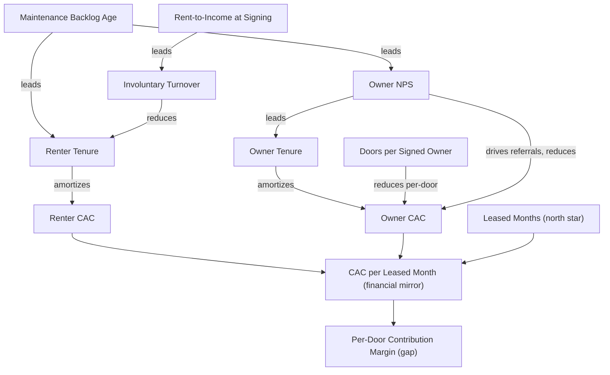

# Green-lappe-metrics-glossary

## Purpose

A single canonical reference for every metric, term, and ratio used in the Green Lappe operating framework. Three categories:

1. **Green Lappe defined.** Metrics specific to this framework, defined here.
2. **Industry standard.** Metrics with consistent meaning across property management; definitions match common usage.
3. **Composite or derived.** Metrics built from other metrics in this glossary.

Every entry contains: definition, formula or source, classification (north star, counter-metric, lever, input, or reference), and connection notes pointing to related metrics in this glossary.

Entries are alphabetical within each category.

---

## Category 1: Green Lappe Defined Metrics

### CAC per Leased Month

**Definition.** Fully-loaded customer acquisition cost (both sides of the marketplace) amortized across leased months delivered in a given period.

**Formula.**

```mermaid
CAC per Leased Month = 
    (Owner CAC amortized over owner tenure
     + Renter CAC amortized over renter tenure)
    / Leased Months in period
```

**Classification.** Composite. The financial mirror of Leased Months.

**Connections.**

- Pairs with **Leased Months** as its financial counterpart on the operating dashboard
- Improves when **renter tenure** or **owner tenure** rise
- Degrades when **days on market** rise (vacancy reduces the denominator without reducing CAC)
- Required input for **per-door contribution margin**

### Doors per Signed Owner

**Definition.** The number of properties (doors) brought into management when a new owner signs an agreement, averaged across signings in a period.

**Formula.**

```mermaid
Doors per Signed Owner = Total new doors signed / New owners signed
```

**Classification.** Input to Owner CAC model.

**Connections.**

- Higher values reduce per-door owner CAC
- Driven by **owner targeting** and **lead quality**
- Inversely related to **meeting-to-signature conversion** (broader targeting raises close rate, lowers doors-per-owner)

### Leased Months

**Definition.** The total number of months under signed lease across the entire portfolio, summed across all doors. A door leased for 12 months contributes 12; a vacant month contributes 0.

**Formula.** Sum across all doors of months under active signed lease in the period.

**Classification.** **North star metric.**

**Connections.**

- Decomposed in reporting into three sources: renewals, re-leases on existing doors, new leases on newly-acquired doors
- Five operating levers feed it: add doors, fill faster, retain renters, sign longer leases, retain owners
- Five counter-metrics guard it: revenue per leased month, involuntary turnover, maintenance backlog age, owner NPS, rent-to-income at signing

### Owner CAC

**Definition.** Fully-loaded cost to sign one new property owner to a management agreement.

**Formula.**

```mermaid
Owner CAC = (Owner-targeted sales and marketing spend) / (New owners signed)
```

**Classification.** Composite metric, financial.

**Connections.**

- Reduced by referrals (lowest-CAC channel) which are driven by **owner NPS**
- Reduced by **doors per signed owner** when measured per-door
- Lagging indicator of **owner NPS** trends from 6 to 12 months prior

### Owner Tenure

**Definition.** Time from management agreement signing to termination, measured per owner.

**Formula.** Termination date minus signing date, in months. For active owners, current date minus signing date.

**Classification.** Lever (L5 in the north-star tree), input to CAC amortization.

**Connections.**

- Drives **owner CAC** amortization across leased months
- Lagging indicator of **owner NPS**
- Doors-weighted owner tenure is the more meaningful version when portfolio is concentrated

### Renter CAC

**Definition.** Fully-loaded cost to fill one vacant door with a signed lease.

**Formula.**

```mermaid
Renter CAC = (Leasing labor + listing costs + showing costs + screening costs) 
             / (Leases signed)
```

**Classification.** Composite metric, financial.

**Connections.**

- Reduced most effectively by **listing quality** (photos, copy, accuracy)
- Paid on every lease turnover, so amortized cost is dominated by **renter tenure**
- Inversely related to **list price** (cutting price cuts CAC and revenue simultaneously)

### Renter Tenure

**Definition.** Total months a renter occupies under one or more sequential signed leases on the same door.

**Formula.** Sum of months across all consecutive leases for one renter on one door.

**Classification.** Lever (L3 in the north-star tree), input to CAC amortization.

**Connections.**

- The single highest-leverage input to **CAC per leased month**
- Tracked separately from **lease term at signing** because tenure compounds across renewals
- Lagging indicator of **maintenance backlog age** and **rent-to-income at signing**

### Revenue per Leased Month

**Definition.** Trailing 12-month gross rental revenue divided by trailing 12-month leased months.

**Formula.**

```mermaid
Revenue per Leased Month = Gross rent collected (TTM) / Leased Months delivered (TTM)
```

**Classification.** **Counter-metric (C1).** Guards against portfolio quality degradation.

**Connections.**

- Falls when marginal doors are acquired faster than premium doors
- Reported indexed to local market rent growth (a fall that tracks the local index is not a quality signal)
- Paired with **per-door contribution margin** as the financial-quality dimension of the framework

---

## Category 2: Industry-standard Metrics

### Days on Market

**Definition.** Days a unit is vacant and listed before a lease is signed.

**Formula.** Lease signing date minus listing date.

**Classification.** Input to renter CAC and vacancy cost.

**Connections.**

- Drives vacancy revenue loss (not technically CAC but inseparable in unit economics)
- Increases **CAC per leased month** when sustained (zero leased months produced during vacancy)
- Reduced by lowering **list price** or improving **listing quality**

### Eviction Rate

**Definition.** Number of evictions filed (or completed, specify) per 100 doors per year.

**Formula.** (Evictions in period / Average doors managed in period) × 100, annualized.

**Classification.** Input to **involuntary turnover rate**.

**Connections.**

- Component of counter-metric C2 (involuntary turnover)
- Tracked separately because eviction filing and eviction completion are operationally distinct
- Leading indicator: **rent-to-income at signing** from 6 to 12 months prior

### Gross Rent

**Definition.** Total rent contractually due across the portfolio in a period, before vacancy, concessions, or non-payment.

**Formula.** Sum of monthly rent on all signed leases.

**Classification.** Reference.

**Connections.**

- Numerator in **revenue per leased month** when adjusted to actual collected
- Distinct from collected rent (which subtracts non-payment)

### Management Fee

**Definition.** Percentage of collected rent (or flat fee per door) charged to owners for property management services.

**Formula.** Either a percentage of collected rent or a fixed monthly amount per door.

**Classification.** Reference (business model input).

**Connections.**

- The primary revenue input to **per-door contribution margin**
- Constant assumed by this framework (changing it triggers a model recalibration)

### Net Operating Income (NOI)

**Definition.** Gross rental revenue minus operating expenses, before debt service and capital expenditures. Calculated at the property level for owners.

**Formula.** Revenue minus operating expenses.

**Classification.** Reference (owner-facing financial metric).

**Connections.**

- Not used as an operating metric for Green Lappe itself
- Relevant in owner conversations and management reporting
- Distinct from Green Lappe's revenue, which is the management fee on collected rent

### Occupancy Rate

**Definition.** Percentage of doors under active lease at a point in time.

**Formula.**

```mermaid
Occupancy Rate = (Doors with active leases) / (Total doors under management)
```

**Classification.** Reference. **Rejected as a counter-metric** (signal already inside Leased Months).

**Connections.**

- Mathematically implied by Leased Months (a fully occupied portfolio produces 12 leased months per door per year)
- Tracked for industry comparability but not used as a steering metric

### Renewal Rate

**Definition.** Percentage of leases reaching their natural end that are renewed by the same renter.

**Formula.**

```mermaid
Renewal Rate = (Leases renewed) / (Leases reaching natural end in period)
```

**Classification.** Lever (L3 in the north-star tree).

**Connections.**

- Primary driver of **renter tenure**
- Inverse of **voluntary turnover at lease end**
- Driven by **rent increase vs. local market at renewal**, **maintenance responsiveness**, and **time to resolve tenant issues**

### Vacancy Rate

**Definition.** Percentage of doors without active leases at a point in time. The complement of occupancy rate.

**Formula.**

```mermaid
Vacancy Rate = 1 - Occupancy Rate
```

**Classification.** Reference.

**Connections.**

- Directly reduces Leased Months (a vacant month contributes zero)
- Driven by **days on market** and timing of lease endings

---

## Category 3: Counter-metrics (defined in the Counter-metrics proposal)

### Involuntary Turnover Rate

**Definition.** Percentage of lease endings caused by eviction, lease break, or owner-initiated non-renewal.

**Formula.**

```mermaid
Involuntary Turnover = (Evictions + Lease Breaks + Owner Non-Renewals) 
                       / (Total lease endings in period)
```

**Classification.** **Counter-metric (C2).** Threshold: below 15% of lease endings.

**Connections.**

- Captures aggressive eviction practice and owner-driven displacement
- Leading indicators: **rent-to-income at signing** and **maintenance backlog age**
- Distinct from **renewal rate** (which measures voluntary continuation, not involuntary ending)

### Maintenance Backlog Age

**Definition.** Median age in days of open maintenance tickets at month end, segmented by severity.

**Formula.** Median of (current date minus ticket open date) across all open tickets, calculated per severity tier.

**Classification.** **Counter-metric (C3).** Thresholds: P1 under 3 days, P2 under 14 days, P3 under 45 days.

**Connections.**

- Leading indicator (by 6 to 18 months) of **renter tenure decline** and **owner NPS decline**
- Captures the highest-margin short-term shortcut (deferred maintenance) before it shows up in retention

### Owner NPS

**Definition.** Standard Net Promoter Score from quarterly owner surveys: percentage of promoters (9 to 10) minus percentage of detractors (0 to 6).

**Formula.** % Promoters minus % Detractors, on a 0 to 10 scale.

**Classification.** **Counter-metric (C4).** Threshold: above 40, no quarterly drop over 10 points.

**Connections.**

- Leading indicator (by 6 to 18 months) of **owner-initiated terminations**
- Leading indicator (by 3 to 9 months) of **referral velocity** in owner acquisition
- Requires minimum 40% response rate to be valid

### Rent-to-income Ratio at Signing

**Definition.** Median ratio of signed monthly rent to documented gross monthly renter income across new leases in a period.

**Formula.**

```mermaid
Median across new leases of: Signed Rent / Documented Gross Income
```

**Classification.** **Counter-metric (C5).** Threshold: median below 33%.

**Connections.**

- Leading indicator (by 6 to 12 months) of **involuntary turnover rate**
- Connects directly to **renter CAC** (looser screening lowers immediate CAC, raises future CAC through turnover)

---

## Category 4: Composite and Derived Metrics

### CAC Payback Period

**Definition.** Number of months required for the revenue generated by an acquired customer to equal the CAC spent acquiring them.

**Formula.**

```mermaid
CAC Payback = Owner CAC / (Monthly management fee revenue per owner)
```

**Classification.** Composite. Derived from owner CAC and average revenue per owner.

**Connections.**

- Falls when **doors per signed owner** rises
- Rises when owner CAC rises
- Compare to **owner tenure** for unit economics validation (payback period must be substantially shorter than tenure)

### Lifetime Value (LTV)

**Definition.** Expected total gross profit contribution from a customer relationship over its full duration.

**Formula (owner side).**

```mermaid
Owner LTV = (Average revenue per owner per month) 
            × (Average owner tenure in months) 
            × (Gross margin %)
```

**Classification.** Composite.

**Connections.**

- LTV to CAC ratio is the headline unit-economics number for investors
- Driven by **owner tenure** more than by any other single input

### LTV to CAC Ratio

**Definition.** Ratio of customer lifetime value to customer acquisition cost.

**Formula.**

```mermaid
LTV to CAC = Owner LTV / Owner CAC
```

**Classification.** Composite, financial.

**Connections.**

- Industry healthy threshold: above 3.0 for sustainable growth
- Composite of all owner-side metrics in this glossary

### Per-door Contribution Margin

**Definition.** Annual gross revenue from a single door minus the fully-loaded cost to manage that door, including allocated CAC.

**Formula.**

```mermaid
Per-Door Contribution Margin = 
    (Annual management fee revenue from door)
    - (Annual labor and operations cost allocated to door)
    - (Amortized CAC allocated to door)
```

**Classification.** Composite, financial. **Currently a gap in the operating framework; defined here as a target metric.**

**Connections.**

- Requires door-level cost attribution (the operational dependency flagged in the CAC model)
- Identifies doors that should be re-priced or non-renewed
- Aggregates to portfolio-level **per-door margin distribution**, which is more revealing than per-door margin average

---

## Metric Ownership Map

| Metric | Suggested Owner |
|---|---|
| Leased Months | CEO (north star, no functional owner) |
| Revenue per Leased Month | CFO or finance lead |
| Involuntary Turnover Rate | Head of operations |
| Maintenance Backlog Age | Head of operations |
| Owner NPS | Head of account management |
| Rent-to-Income at Signing | Head of leasing |
| Owner CAC | Head of sales or growth |
| Renter CAC | Head of leasing |
| CAC per Leased Month | CFO or finance lead |
| Per-Door Contribution Margin | CFO or finance lead |

A single person owning both the lever and the counter-metric guarding that lever produces drift over time. Where possible, separate.

---

## Connection Summary

The connections that matter most across the framework, called out explicitly because they are easy to miss when reading metrics in isolation:



The four lasting takeaways from this connection map:

1. **Tenure dominates.** Every CAC efficiency outcome traces back to either renter or owner tenure. Retention work is the highest-leverage thing in the financial model.
2. **NPS is the earliest signal.** Owner NPS leads owner CAC, owner tenure, and referral velocity. It is the cheapest leading indicator in the framework.
3. **Maintenance is the load-bearing operational metric.** It leads both renter tenure and owner NPS. Deferring it is the most expensive cost-cutting move available.
4. **Per-door contribution margin requires the CAC model to exist first.** It cannot be built independently. The CAC model needs door-level attribution from day one or per-door economics is retrofit-impossible.
