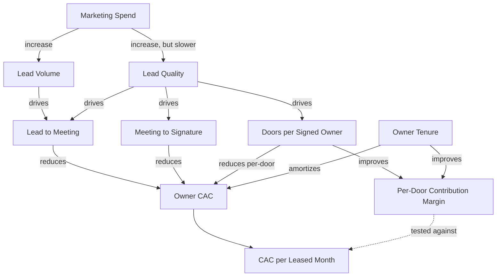
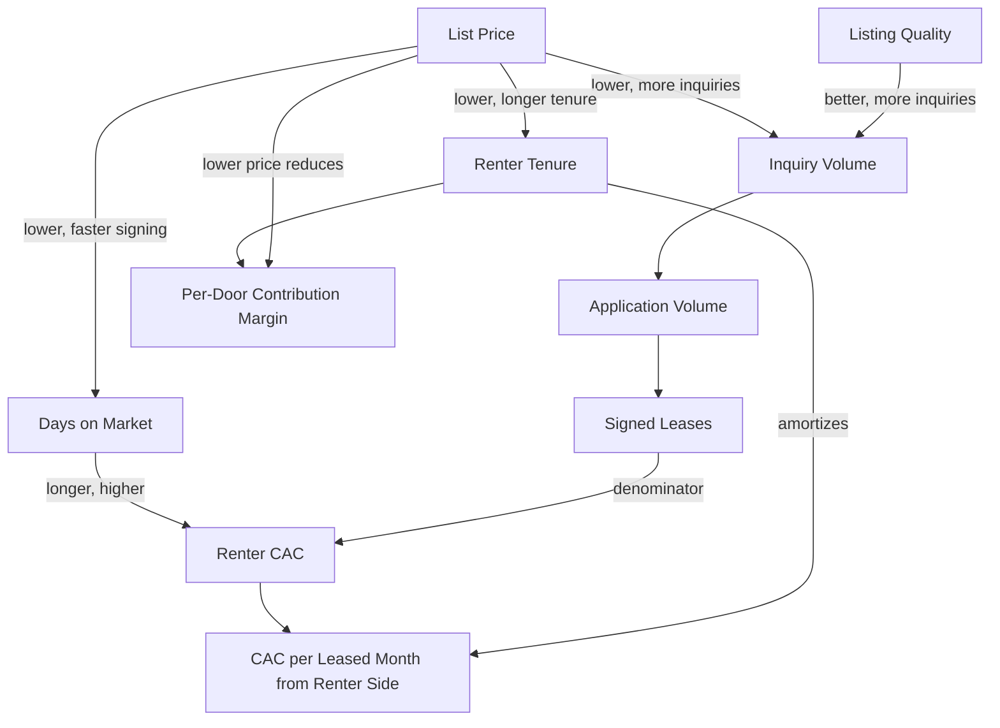

domain:
category:
sub-category:
date-created:
date-revised:
doc-type:
version:
doc-status: draft
llm-provider: Claude
llm-model:Opus 4.7
llm-session:
llm-session-data:
aliases:
tags:

# Customer Acquisition Costs (CAC) Model

## Scope and Assumptions

This model is built for a **phase 3 to 4 business**: the model has been validated with paying customers, the question is how to grow efficiently. Pre-launch and pre-product-market-fit considerations are deliberately excluded.

Operating assumptions:

- **Revenue per door is consistent year over year.** Rent escalations track local market; management fee percentage is stable. The model does not attempt to forecast rent growth or fee compression.
- **Two CACs exist, one for each side of the marketplace.** Owners are the paying customer; renters are the served customer who generates the revenue stream. They are acquired differently, cost different amounts, and contribute differently to Leased Months.
- **Unit economics are the lens every decision passes through.** Every input in this model is evaluated against its effect on per-door contribution margin and CAC per leased month. Decisions that improve a single metric while degrading the unit economics are explicitly rejected.

The model is **decision-driving, not reporting-driving.** Every input is a lever an operator can pull this quarter.

---

## Part 1: Unit Economics as the Decision Lens

Before naming any input, the model establishes the two equations every CAC decision is evaluated against.

### The Per-door Equation

Each managed door generates a defined contribution margin per year, calculated under the consistent-revenue assumption:

```mermaid
Per-Door Annual Contribution Margin = 
    (Annual management fee revenue from door)
    - (Annual labor and operations cost allocated to door)
    - (Amortized acquisition cost allocated to door)
```

Where:

- **Annual management fee revenue from door** = monthly rent × management fee % × 12 (under consistent revenue: same value year over year)
- **Annual labor and operations cost allocated to door** = direct cost to manage that specific door (maintenance coordination time, accounting time, communication time, vendor management time)
- **Amortized acquisition cost allocated to door** = (Owner CAC / owner tenure in years / doors per owner) + (Renter CAC / renter tenure in years)

This is the unit. Every CAC decision is evaluated against its effect on this number.

### The Portfolio Equation

The aggregate version, expressed in the framework's preferred denominator:

```mermaid
CAC per Leased Month = 
    (Owner CAC amortized over owner tenure
     + Renter CAC amortized over renter tenure)
    / Leased Months in period
```

This is the financial mirror of Leased Months. The two equations are connected: per-door contribution margin × doors × occupancy = portfolio contribution, and CAC per leased month is the cost side of that same contribution.

### The Decision Rule

Every input lever, every channel choice, every pricing decision is evaluated by asking:

1. What does this do to per-door contribution margin?
2. What does this do to CAC per leased month?
3. Are the two answers consistent in direction?

A decision that improves CAC per leased month at the portfolio level while degrading per-door contribution margin at the door level is acquiring the wrong doors. A decision that improves both is a real efficiency gain. This is the test.

---

## Part 2: Owner CAC

### The Formula

```mermaid
Owner CAC = (Sales and marketing spend targeted at owners over period) 
            / (New owners signed in period)
```

### The Inputs

| Input | What It Is | Lever Type | Effect on Unit Economics |
|---|---|---|---|
| Marketing spend, owner-targeted | Paid advertising, content, referral incentives, event sponsorships, SEO | Direct | Direct cost in numerator |
| Sales labor cost | Loaded cost of any role converting owner leads to signed agreements | Direct | Direct cost in numerator |
| Owner lead volume | Inbound leads from all sources | Indirect | Higher volume reduces CAC if quality holds |
| Lead-to-meeting conversion | Percentage of leads taking discovery calls | Indirect | Higher rate reduces CAC |
| Meeting-to-signature conversion | Percentage of discovery calls producing signed agreements | Indirect | Higher rate reduces CAC, but watch the trade with doors per owner |
| **Doors per signed owner** | Portfolio size each new owner brings | Indirect | **Highest-leverage input for per-door unit economics** |
| Sales cycle length | Days from first contact to signed agreement | Indirect | Longer cycle raises labor cost per signing |
| Owner tenure | Months from signing to termination | Outcome | **Determines amortization period; doubles unit economics when it doubles** |

### The Lever Interactions



### The Non-obvious Dynamics

**Lead volume up, lead quality down.** Doubling marketing spend rarely doubles lead quality. It typically doubles volume while quality declines, because the first dollar of marketing reaches the most receptive audience. Net effect on CAC is ambiguous: more leads but worse conversion. **Net effect on per-door contribution margin is usually negative**, because lower-quality leads correlate with smaller portfolios per owner and shorter tenures.

**Conversion rates up, doors per owner down.** A sales team can hit higher close rates by qualifying broadly: anyone with a door becomes a potential customer. This raises Meeting-to-Signature and lowers Doors per Signed Owner. **Per-owner CAC falls; per-door CAC rises.** Under the unit-economics lens, this is a degradation, even though the headline CAC number improves. This is the most common owner-acquisition mistake in PM.

**Sales cycle length up, conversion rate up.** Longer cycles allow more qualification, better-fit signings, higher doors per owner. They also tie up sales labor longer per signing. The right cycle length is a function of average deal size: a 4-door owner deserves a 60-day cycle; a 1-door owner deserves a 14-day cycle. Mismatching the two destroys unit economics from both directions.

**Referral incentives reduce CAC but cap volume.** Owner-to-owner referrals have the lowest CAC per signing (often under 30% of paid acquisition CAC) but cannot be scaled by spending money on them. They scale with existing portfolio size and Owner NPS. Under unit economics, referred owners typically have longer tenure (warmer entry, better fit), so referrals improve per-door contribution margin more than the CAC number alone suggests.

**Owner tenure is the multiplier on everything.** Doubling tenure halves amortized CAC per leased month. This single input dwarfs almost every other lever in the model. Investments in owner retention (account management responsiveness, owner NPS work, proactive reporting) have larger unit-economics impact than equivalent investments in owner acquisition.

### The Operator Levers

Three real levers, ordered by speed:

1. **Reallocate spend across channels.** Quarterly. Adjusts the mix of paid, content, referral, and event marketing.
2. **Change qualification criteria.** Monthly. Tightens or loosens what counts as a sales-qualified lead. Under unit-economics evaluation: tightening usually wins.
3. **Change sales process or pricing structure.** Annually. Structural changes that require deliberation.

---

## Part 3: Renter CAC

### The Formula

```mermaid
Renter CAC = (Leasing labor cost + listing costs + showing costs + screening costs over period) 
             / (Leases signed in period)
```

Renter CAC is structurally smaller per event than owner CAC (typical range: $200 to $800 per signed lease versus $1,500 to $5,000 per signed owner) but paid far more often. In a stable portfolio, total renter CAC dollars annually typically exceed owner CAC dollars.

### The Inputs

| Input | What It Is | Lever Type | Effect on Unit Economics |
|---|---|---|---|
| Listing costs | Photography, syndication fees, virtual tours | Direct | Direct cost in numerator |
| Leasing labor cost | Loaded cost of leasing agents | Direct | Direct cost in numerator |
| Inquiry volume per listing | Inquiries received per listing per day on market | Indirect | Higher reduces CAC |
| Inquiry-to-application conversion | Percentage of inquiries becoming applications | Indirect | Higher reduces CAC |
| Application-to-signature conversion | Percentage of applications becoming signed leases | Indirect | Higher reduces CAC; mostly driven by response time |
| Days on market | Days from listing to signed lease | Indirect | Each vacant day reduces leased months without reducing CAC |
| **Renter tenure** | Months a renter stays | Outcome | **The single most powerful input in the entire model** |
| List price relative to market | Where the listing prices vs. comparables | Indirect | Lowering price reduces CAC and revenue simultaneously |

### The Lever Interactions



### The Non-obvious Dynamics

**Price down, CAC down, revenue down.** Cutting list price by 5% can cut days on market by 30% and renter CAC by a similar amount. It also cuts revenue per leased month by 5%. **Under the unit-economics lens, the net effect on per-door contribution margin is usually negative unless vacancy was severe.** Operators reach for price cuts because they improve CAC fast; the revenue side is on a different report. The unit-economics test catches this.

**Listing quality is the highest-leverage input.** Professional photos and accurate copy can double inquiry volume at fixed price. At constant conversion rates, that halves CAC. Listing quality affects no other variable negatively. **This is the single best place to spend marginal dollars on the renter side.** It is also under-invested in by most PM companies because it is a one-time cost rather than ongoing spend.

**Tenure is everything, again.** A 36-month tenancy amortizes CAC across 36 leased months. A 9-month tenancy amortizes the same CAC across 9. The per-leased-month CAC differs by 4x. **Improvements to retention compound with every other input in the model.** Reducing CAC by 10% and extending tenure by 10% does not improve CAC per leased month by 20%; it improves it by approximately 21% because the effects multiply.

**Application-to-signature is mostly about response time.** In residential leasing, the fastest-responding landlord wins. A 24-hour delay converts 30% to 50% lower than same-day response. This is a labor-allocation decision (weekend coverage, after-hours protocol), not a marketing decision. Under unit economics: response-time improvements often pay for themselves in two months.

### The Operator Levers

1. **Adjust list price.** Within hours. The most powerful and most overused lever. Under unit economics: justified only when vacancy duration exceeds a threshold set by per-door contribution margin math.
2. **Reshoot listings, rewrite copy.** Per listing. Quarterly review of lowest-performing listings.
3. **Change response-time SLA.** Monthly. Has labor implications.
4. **Tighten or loosen screening criteria.** Quarterly. Direct connection to the rent-to-income counter-metric.

---

## Part 4: the Unified Picture under Consistent Revenue

Under the assumption of consistent year-over-year revenue, the model simplifies. Every input in this model affects exactly one of three things:

1. **Acquisition cost (the numerator).** Marketing spend, sales labor, leasing labor, listing costs.
2. **Acquisition efficiency (the conversion ratios).** Lead quality, listing quality, response time, screening criteria.
3. **Amortization period (the multiplier on everything).** Owner tenure, renter tenure.

The multipliers dominate. A 20% improvement in tenure produces larger unit-economics impact than a 20% improvement in any acquisition cost line. **This is why every counter-metric in the framework points at tenure protection.** Maintenance backlog, owner NPS, rent-to-income at signing, involuntary turnover: all of them are tenure-protection mechanisms. The CAC model and the counter-metrics framework are the same framework viewed from two sides.

### Inverse Relationships, Named

The relationships an operator needs to internalize before pulling any lever:

- **Lead volume up, lead quality typically down.** Net unit-economics effect uncertain.
- **Close rate up, doors per owner often down.** Per-door unit economics usually degraded.
- **Sales cycle short, deal size small.** Mismatch destroys unit economics.
- **List price down, days on market down, revenue down.** Net effect on per-door margin usually negative.
- **Screening loose, days on market down, tenure down.** Renter CAC efficiency degraded over 12 months despite short-term improvement.
- **Maintenance spend down, margin up short-term, tenure down.** Largest 18-month unit-economics destroyer in the entire framework.

Every one of these is an input where the obvious move (improve the visible metric) degrades the unit economics. The discipline is testing every decision against the per-door equation before pulling the lever.

---

## Part 5: Connection Points to the Broader Framework

The model connects to the rest of the operating system at five specific points:

- **Leased Months has a financial mirror in CAC per leased month.** Both should appear on the same dashboard. Growth in Leased Months without improvement (or maintenance) of CAC per leased month is unhealthy growth.
- **Owner NPS leads owner CAC by 6 to 12 months.** Owner referrals are the lowest-CAC channel; referral velocity is driven by Owner NPS. Counter-metric C4 is a leading indicator for the owner CAC line in this model.
- **Renter retention is the highest-leverage lever in the entire business.** The L3 lever in the north-star tree (keep renters longer) compounds with every input on the renter CAC side. This is why the counter-metrics emphasize tenure protection: it is unit-economics protection by another name.
- **Rent-to-income at signing leads renter CAC efficiency.** Counter-metric C5 protects against the temptation to loosen screening for short-term CAC improvement that destroys 12-month tenure.
- **Per-door contribution margin is calculable directly from this model.** Every input feeds into the per-door equation in part 1. The data requirement: every CAC dollar must be attributable to either a specific door (renter CAC) or a specific owner relationship (owner CAC) at the time it is spent. This is an architecture decision, not a metrics decision. **The data model needs to track CAC at this granularity from day one or per-door economics becomes retrofit-impossible.**

---

## Reporting

Monthly:

- Owner CAC, with channel breakdown
- Renter CAC, portfolio-wide and segmented by submarket
- CAC per leased month, trailing 12 months, with owner-side and renter-side decomposition
- Per-door contribution margin distribution: not just average, the distribution shape (how many doors are profitable, how many are marginal, how many are losing money)

Quarterly:

- Lever-level review: which input moved, what was the downstream effect on per-door margin and CAC per leased month, which assumption needs revising
- Channel mix review for owner acquisition spend allocation
- Per-door margin tail review: which doors are in the bottom decile, what is the action plan

Annually:

- Full model recalibration based on observed tenure data
- Decision review on doors flagged as structurally unprofitable
