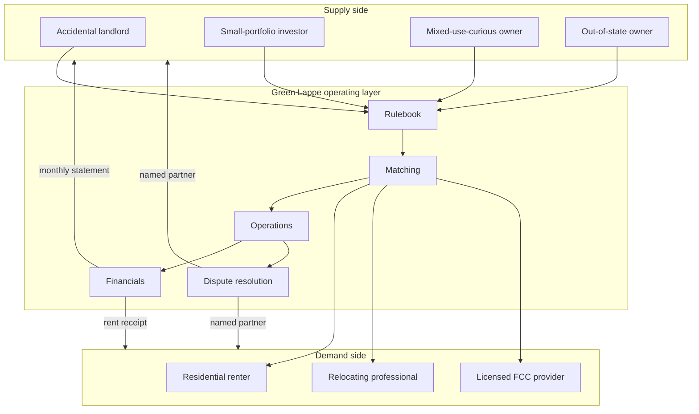

# Two Sided Marketplace

> Prototype v0.1 is a companion document to [[Brand Style Guide|Green Lappe Brand Style Guide]].

## Assumption
Green Lappe Properties is not a pure property management firm and not a pure rental listing site. It is a two-sided marketplace in which the company owns the relationship on both sides, sets the rules, and earns on the transaction. Owners list supply, residents (or licensed operators) consume it, and the company is the operating layer in between. The marketplace covers both standard residential rentals and licensed family child care conversions, with the latter as a higher-margin specialty wedge.

## 1. Why a Marketplace, Not a Service Company

A traditional property manager is a single-sided service vendor: the owner is the customer, the resident is the inventory. That framing is the source of most of the renter pain points cataloged in the brand style guide. The brand promise (responsive, transparent, human on both sides) is not compatible with a single-sided business model. The model has to value both sides or the operations will drift back to whichever side pays the invoice.

A marketplace framing changes three things:

1. **Both sides are customers.** Owners pay for service. Residents pay rent. The company is paid by both, and is accountable to both.
2. **Liquidity is the asset.** The defensible position is not the brand or the software; it is having enough vetted owners and enough vetted residents in the same geography that match-time and vacancy-time collapse.
3. **Rules of the market are the product.** Screening standards, SLAs, fee transparency, dispute resolution: these are the goods being sold. Owners and residents both buy access to a market with rules they trust.

---

## 2. The Two Sides

### 2.1 Supply Side: Property Owners

| Segment | Description | Why they enter the marketplace |
|---|---|---|
| `accidental-landlord` | Owner of one or two homes, often inherited or held after moving. Not a professional investor. | Wants the property managed without becoming an operator. Wants out of DIY without the national-rollup tax. |
| `small-portfolio-investor` | 2–10 doors in King or Snohomish county. Treats real estate as a meaningful slice of net worth. | Wants better data, lower fee load, and an exit from a manager that has gone bad. |
| `mixed-use-curious` | Owners with single-family homes in zoning-permissive areas considering licensed family child care or other higher-yield conversions. | Wants a partner that knows the specialty, not a generalist who will say "we don't do that." |
| `out-of-state-owner` | Lives elsewhere, owns one or more PNW properties. | Wants a named local contact who actually visits the property. |

### 2.2 Demand Side: Residents and Operators

| Segment | Description | Why they enter the marketplace |
|---|---|---|
| `residential-renter` | Household renting a single-family home, townhouse, or condo. | Wants a landlord that answers, fixes things, and does not invent fees. |
| `relocating-professional` | Tech, healthcare, biotech worker moving into the region, often sight-unseen. | Wants verified listings, real photos, and a human to talk to during the move. |
| `licensed-fcc-provider` | Existing or aspiring WA DCYF Licensed Family Home provider. | Wants a property pre-configured for licensing, with the regulatory friction reduced. |
| `daycare-parent` | End-customer of the licensed operators, not a direct counterparty but a demand signal that affects operator viability. | Wants quality care nearby. The marketplace surfaces this demand to operators choosing locations. |

Note that `daycare-parent` is a third-order participant: not a direct counterparty to the marketplace, but a critical demand signal that affects which properties get matched to which operators.

---

## 3. The Matching Layer

### 3.1 What the Marketplace Actually Matches

| Owner offers | Resident or operator needs | Match output |
|---|---|---|
| Single-family rental, standard configuration | Household looking for a long-term home | Tenancy at market rent, multi-year term |
| Property in FCC-permissive zoning, suitable layout | Licensed provider seeking a home to live in and operate from | Specialty lease with daycare addendum, longer term, higher rent |
| Property suitable for conversion, owner willing to fund capex | Provider with license and operating capacity but no facility | Capex-and-lease structure with revenue share or premium rent |
| Property with HOA, mortgage, or insurance constraints | Resident or operator whose use fits inside those constraints | Pre-cleared match with constraints documented in the listing |

### 3.2 What Makes a Match High Quality

Match quality is the marketplace's measurable output. Crude proxies:

- Time from listing to signed lease.
- Time from lease signing to first rent paid.
- Tenancy length (longer is better, up to a sensible cap).
- Repair-ticket resolution time during tenancy.
- Renewal rate at lease end.
- Owner retention rate at contract anniversary.
- Deposit-returned-clean rate at move-out.

A marketplace that optimizes only for fill speed produces bad tenancies. A marketplace that optimizes only for tenant happiness underprices owner risk. The brand pillar `transparent` requires that both sides see the metrics that matter to them.

---

## 4. The Rulebook (the Actual product)

The marketplace's defensible asset is the set of enforced rules. These are not policies on a website; they are contractual terms backed by company commitment.

### 4.1 Rules that Bind Owners

1. Property meets habitability standards at listing and is re-verified at every turnover.
2. Repair authorization thresholds are set in the management agreement and enforced.
3. Rent increases follow the brand standard: market comp, 90-day notice, plain-language rationale.
4. No discrimination beyond lawful screening criteria. Fair housing training completed by all owners on the platform.
5. Owner accepts the company's vendor list and pass-through invoicing, or contributes their own vendors to it under the same standards.
6. Deposits held in compliance with WA RCW 59.18, returned on the company's standard timeline, not the owner's preference.

### 4.2 Rules that Bind Residents

1. Application is honest. Misrepresentation is grounds for denial or, post-tenancy, for non-renewal where lawful.
2. Rent paid on the first, late on the sixth, ACH free.
3. Repair issues reported through the official channel; emergency line for habitability.
4. Property treated with reasonable care. Photo-documented condition at move-in is the baseline.
5. Notice given per lease and per WA RCW 59.18.

### 4.3 Rules that Bind the Company

1. Both sides see the same fee schedule, posted publicly.
2. Vendor invoices passed through at cost, originals attached.
3. Habitability tickets acknowledged within one hour during business hours, four hours overnight.
4. Owner inquiries acknowledged same business day.
5. Disputes between sides handled by a named partner, not an anonymous queue.
6. No side payments. No referral kickbacks from vendors that are not disclosed to the affected owner.

The rules that bind the company are the ones that matter most. The first two sides will sign up because of these.

---

## 5. The Unit Economics

### 5.1 Revenue Streams

| Stream | Paid by | Basis | Notes |
|---|---|---|---|
| `management-fee` | Owner | Percent of collected rent, or flat per door per month | Primary recurring revenue. Flat preferred for transparency. |
| `placement-fee` | Owner | One-time, capped at a defined dollar amount | Charged at lease signing. Covers screening, marketing, showings. |
| `renewal-fee` | Owner | Flat, lower than placement | Charged at renewal if the company negotiates new terms. |
| `application-fee` | Resident | At cost, capped at WA statutory limit | Pass-through to screening provider. No margin. |
| `late-fee` | Resident | Per lease, per WA RCW 59.18 | Split or fully retained per management agreement, disclosed to owner. |
| `daycare-services-fee` | Operator or owner | Percent of gross tuition, or flat services fee | Only on FCC-converted properties. Documented separately. |
| `capex-coordination-fee` | Owner | Percent of project budget, capped | Only when the company manages an FCC conversion or major capex. |

### 5.2 Where the Margin is

- **Residential management**: thin. The fee is the price of admission. Brand and retention matter more than per-door margin.
- **FCC conversions**: thick. The combination of premium rent, services fee, and capex coordination fee produces materially higher revenue per property than standard residential management.
- **Network effects**: the more vetted owners and vetted residents in the same geography, the lower the marketing and screening cost per match.

The strategic implication: residential management is the volume product. FCC conversions are the margin product. The brand has to support both without confusing either audience.

---

## 6. Liquidity Strategy

The hardest problem in any two-sided marketplace is the cold start. Both sides ask the same question: "Who else is here?"

### 6.1 Asymmetric Start

Start with supply. Owners are easier to recruit one at a time, sign longer-term contracts, and are willing to wait for the first match. Residents arrive when listings appear.

Initial supply target: 5–10 properties under management inside the first 12 months, all within a tight geographic radius (Bothell, Mill Creek, Kirkland, Kenmore, Lynnwood). The Bothell property already in the portfolio is the founding listing.

### 6.2 Geographic Concentration

Marketplaces fail when they spread thin. The first year is one corridor, not two counties. Every property is within a 30-minute drive of every other property. This is enforceable as policy and visible to both sides as a quality signal.

### 6.3 Quality over Scale

The brand cannot tolerate a bad first-year listing. A single eviction, a single deposit dispute, a single uncovered habitability failure poisons the well in a small market. The marketplace grows by referral, and referrals require zero-defect first cohorts. Turn away properties that do not meet the standard.

### 6.4 The FCC Wedge as a Liquidity Unlock

Licensed FCC providers are scarce. Properties suitable for licensed family child care are even scarcer, especially properties whose owners understand the model. The company can build a small list of pre-qualified providers and a small list of pre-qualified properties, and the match itself becomes the value proposition. This is a market that does not exist in any organized form in King or Snohomish counties today.

---

## 7. The Marketplace Operating Model

The diagram is intentionally symmetric. Owners and residents enter the same operating layer and receive the same caliber of response.

---

## 8. Technology Posture

The marketplace runs on third-party software, not custom-built tooling, at least through the first three years.

| Function | Tool category | Posture |
|---|---|---|
| Listings and applications | Off-the-shelf PM software (Buildium, AppFolio, or Rentvine) | Buy, do not build. |
| Screening | TransUnion SmartMove or equivalent | Buy. Capped pass-through to applicant. |
| Payments | ACH via PM software | Free to resident, owner pays nothing. |
| Maintenance ticketing | PM software's module | Configured to brand SLAs. |
| Owner reporting | PM software plus a custom monthly packet | The packet is the differentiator, not the software. |
| Communications | Phone, email, SMS, all routed through named partner identities | No anonymous queues. |
| Records | PM software plus a clean filesystem layout in the company drive | Year-end packets are generated, not improvised. |

The differentiator is operational discipline, not technology. The brand promise is enforceable through process, not platform.

---

## 9. What the Marketplace Explicitly is Not

- Not a rental listing site competing with Zillow or Apartments.com. Listings are a feature, not the product.
- Not a national rollup. The geography is bounded by the partners' ability to be physically present.
- Not a SaaS company. The product is operated service, not software.
- Not a brokerage. The company does not sell properties as its primary line.
- Not an HOA management firm. Residential and small mixed-use only.
- Not a commercial property manager. Single-family and small multifamily only at launch.

---

## 10. Risks Specific to the Marketplace Model

| Risk | Mitigation |
|---|---|
| Single-side optimization drift (favoring owners because they pay more) | Published rules that bind the company. Resident-side metrics tracked and reviewed. |
| Liquidity death spiral (not enough supply, demand leaves, supply leaves) | Geographic concentration, asymmetric start, refuse to over-promise inventory. |
| Bad-actor owner damages brand | Onboarding screening for owners is real. Decline properties and owners that do not meet the standard. |
| Bad-actor resident damages owner trust | Documented screening standards, owner sees the application, owner approves before lease offer. |
| FCC wedge fails to scale | Treat as optional upside. Residential management must be viable on its own economics. |
| Regulatory shift in WA tenant law | Maintain counsel relationship. Lease templates reviewed annually. |
| Insurance carrier non-renewal due to mixed-use exposure | Carrier-shopped at policy level before any FCC property is signed. |
| Partner bandwidth | Hard cap on doors per partner. Hire before exceeding the cap, not after. |

---

## 11. What to Test in the First 12 Months

Concrete experiments, each with a measurable outcome.

1. Onboard the founding property (Bothell) under the new brand and the new contract terms. Measure time-to-tenant, repair SLA adherence, owner satisfaction (self).
2. Sign two additional residential properties from referral. Measure time-to-list and time-to-tenant.
3. Build a pre-qualified list of three licensed FCC providers willing to consider a Green Lappe property. Measure time-to-list and conversion to lease.
4. Publish the fee schedule on the public site. Measure inbound owner inquiries citing the fee transparency as a reason for contact.
5. Run one full year-end owner packet for the founding property. Capture the cost in hours, refine the template, measure how long it takes to produce the second one.
6. Handle one move-out cycle end-to-end. Measure deposit-return timing, resident satisfaction at move-out, condition delta from move-in photos.

Each experiment has a binary success criterion. Failures are interesting; they inform whether the marketplace framing holds or whether the company drifts back to a single-sided service model.

---

## 12. Open Questions (not decided)

1. Whether to surface listings publicly on the brand site or keep them gated to the company's owner relationships.
2. Whether the FCC wedge gets its own sub-brand or stays under Green Lappe Properties.
3. Whether to accept third-party-managed owners (owners using another PM who want to switch to Green Lappe) at a discount during year one to build supply faster.
4. Whether to publish anonymized marketplace metrics (vacancy time, SLA adherence, dispute counts) as a trust signal.
5. Whether to offer a tier for DIY owners who want screening, lease docs, and a help line but not full management.
6. How to handle owners who want to remain on their existing PM software (Buildium account, etc.) rather than migrate.
7. Whether the company carries any inventory itself (owns properties) or remains purely an operating layer.

---

## 13. Versioning

| Version | Date | Author | Notes |
|---|---|---|---|
| `0.1` | 2026-05-17 | Kevin | Initial prototype. Companion to brand style guide v0.1. |
