# User Flow And Experience Diagrams

This standalone Mermaid.js diagram set translates the existing persona, pain-point, and journey research into service-design flows for Green Lappe Properties. It is a design artifact, not legal, licensing, insurance, tax, privacy, cybersecurity, records-retention, or trust-accounting advice.

Use these diagrams to align discovery calls, prototype scope, operating runbooks, and UX requirements without closing launch gates or inventing outside approvals.

## Diagram Map

| Diagram | Purpose |
| --- | --- |
| Service operating model | Shows the three-sided experience across renter, owner, PM staff, vendors, and compliance checkpoints. |
| Renter lifecycle | Maps the renter journey from listing discovery through deposit closeout. |
| Owner lifecycle | Maps small-landlord onboarding, management, reporting, and exit risk. |
| Staff operations loop | Shows the day-to-day internal workflow that must protect staff from unmanaged load. |
| Maintenance recovery | Details the highest-priority trust-repair flow. |
| Multilingual screening | Frames the language-access and portable-screening opportunity. |
| Deposit closeout | Creates a transparent move-out evidence and reconciliation flow. |
| Owner statement transparency | Shows monthly reporting and repair-approval trust points. |
| Compliance-gated notice workflow | Keeps notice work behind jurisdiction and review gates. |
| UX state model | Defines user-facing system states and recovery paths. |
| Metrics loop | Connects journey moments to operating measures. |
| Prototype scope | Separates launchable experience concepts from blocked business approvals. |

## Service Operating Model

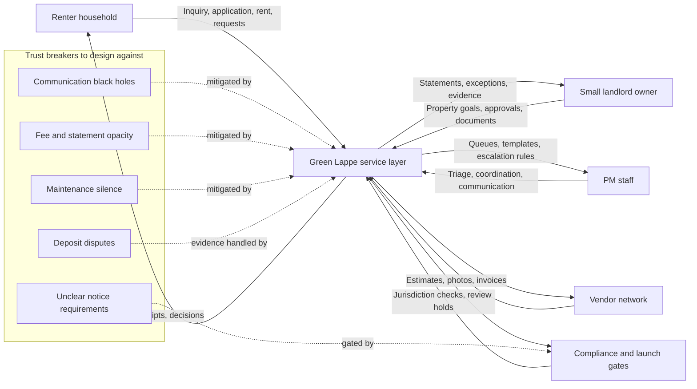

## Renter Lifecycle

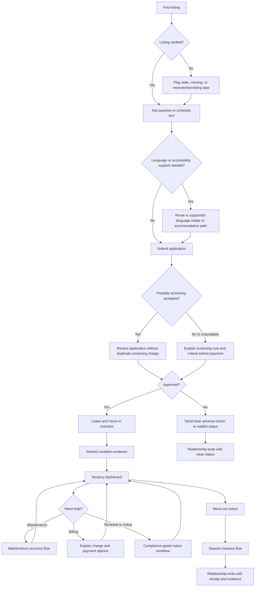

## Owner Lifecycle

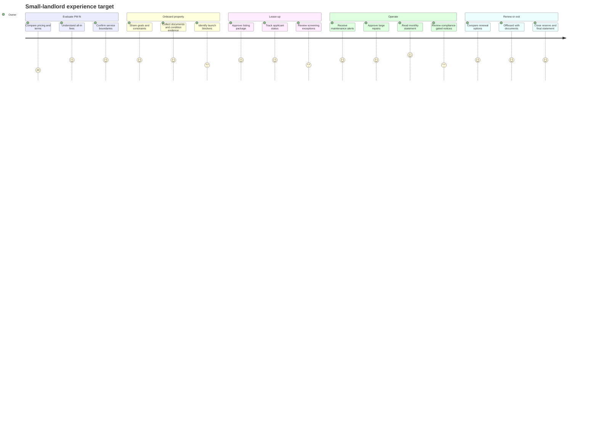

## Staff Operations Loop

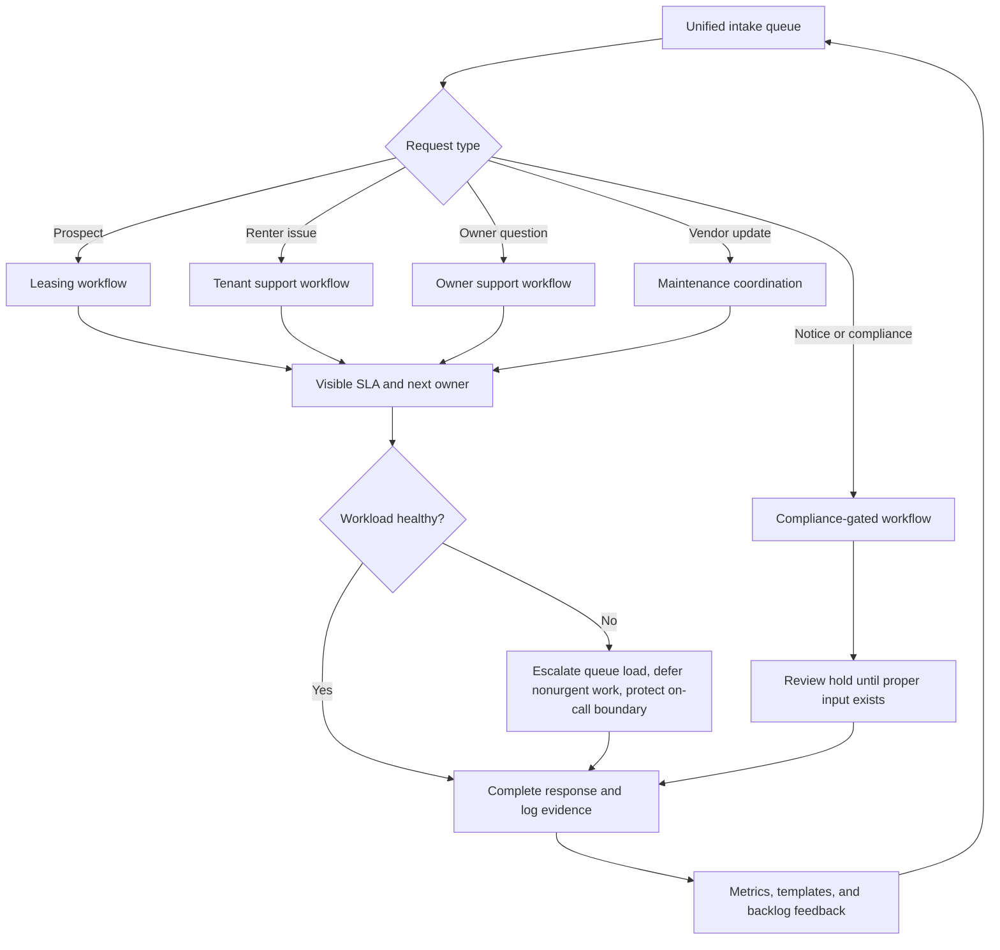

## Maintenance Recovery Flow

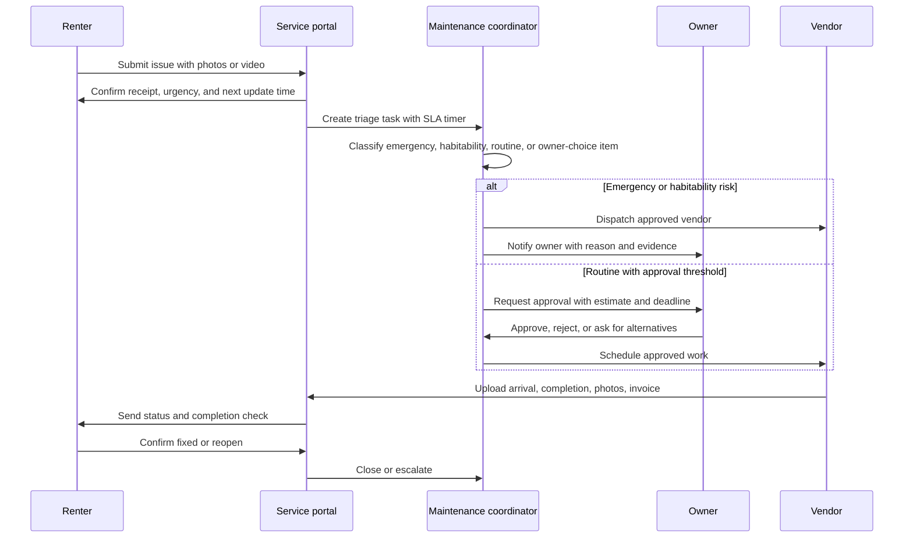

## Multilingual Screening Flow

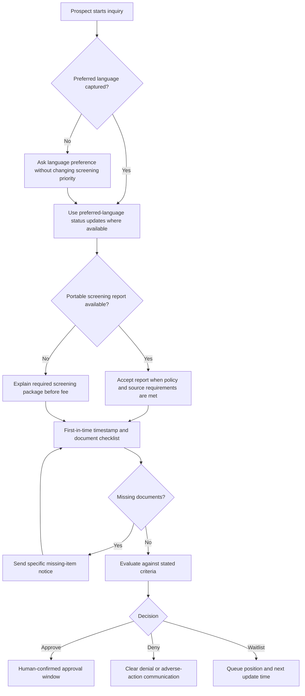

## Deposit Closeout Flow

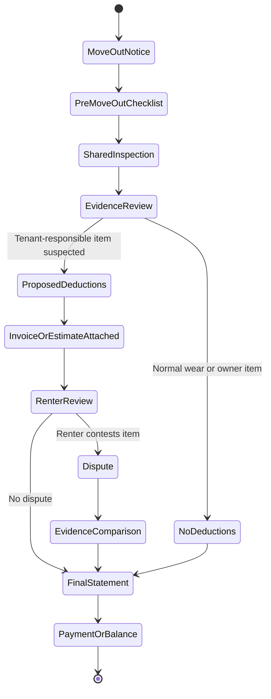

## Owner Statement Transparency

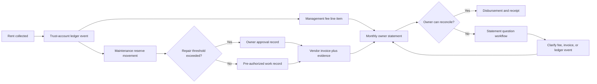

## Compliance-Gated Notice Workflow

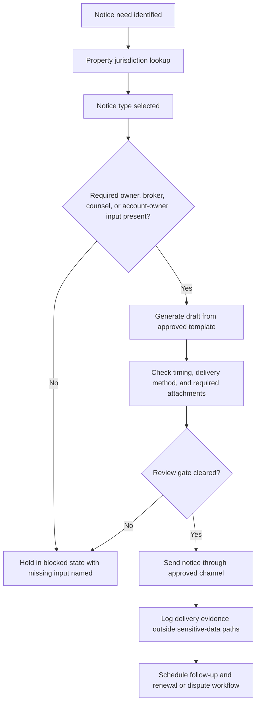

## UX State Model

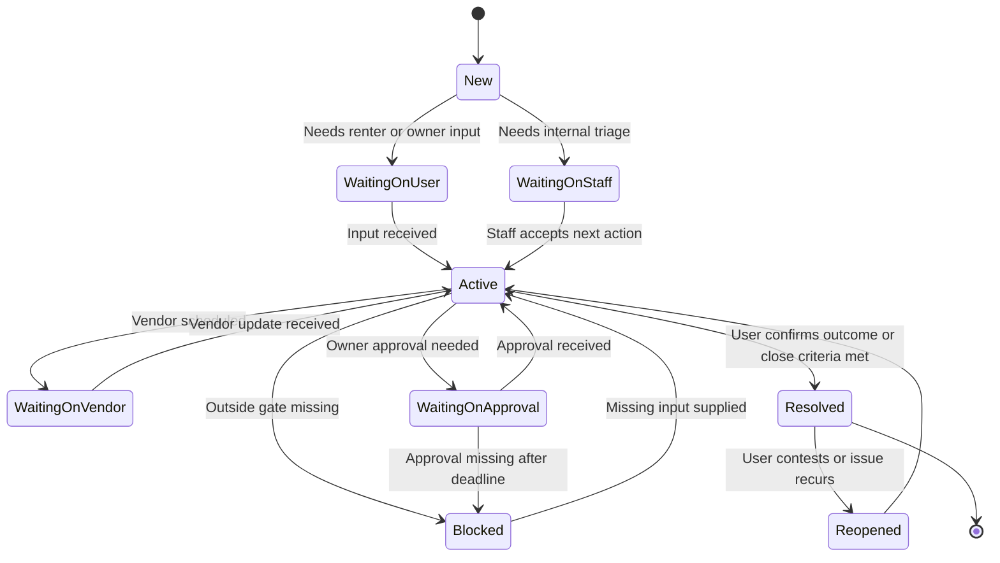

## Metrics Loop

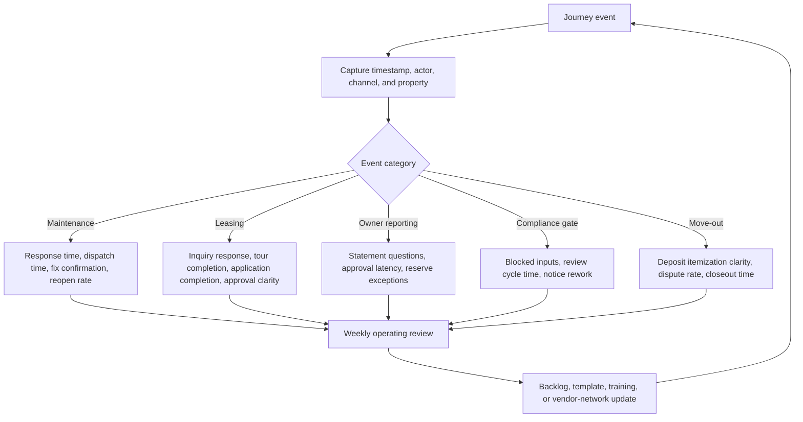

## Prototype Scope

```mermaid
flowchart LR
    subgraph Prototype_Now[Prototype now]
      A[Verified listing checklist]
      B[Inquiry status and language preference]
      C[Maintenance SLA dashboard]
      D[Owner statement explainer]
      E[Deposit evidence packet]
    end

    subgraph Needs_Input[Needs outside input before launch]
      F[Broker operating approvals]
      G[Counsel-reviewed notice templates]
      H[Trust-accounting workflow approval]
      I[Vendor service commitments]
      J[Public launch copy approval]
    end

    subgraph Do_Not_Assume[Do not assume]
      K[Legal conclusions]
      L[Insurance requirements]
      M[Licensing clearance]
      N[Domain, DNS, or hosting readiness]
      O[Market discovery findings]
    end

    Prototype_Now --> Needs_Input
    Needs_Input --> Do_Not_Assume
```
