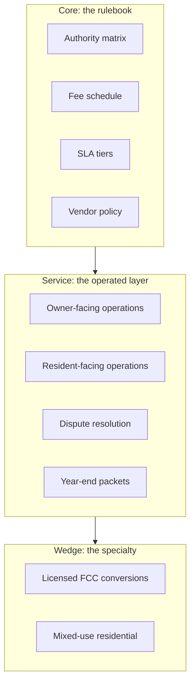

# 2026-05-17 Meta-Analysis

> Framework document. Synthesizes the project corpus into one orientation map. Points to deep dives, does not contain them. Companion to [[green-lappe-brand-style-guide]], [[green-lappe-two-sided-marketplace]], [[green-lappe-brand-system]].

This document organizes the existing research, brand work, and strategy artifacts into a single view of the company being designed. The purpose is orientation, not synthesis. Every section flags the source documents that contain the underlying detail and the open questions that need closing before that section can be operationalized.

---

## 1. What is Being Built

A small, owner-operated residential property management company serving King and Snohomish counties, Washington. The legal name is Green Lappe Properties. Megan Green is the named principal. Kevin Lappe is the operations partner. The company is being designed from the inside-out: brand and operating standards first, doors second.

The framing across the corpus is consistent on three points:

1. The product is not software, not a brokerage, not a national rollup. It is operated service with a published rulebook.
2. The model is positioned as a two-sided marketplace where owners and residents are both customers, even though the legal structure is a standard third-party PM contract.
3. The geography is bounded by the partners' ability to drive to every property.

Source: [[green-lappe-brand-style-guide]] sections 1 and 9, [[green-lappe-two-sided-marketplace]] sections 1 and 9.

---

## 2. The Vision in One Paragraph

The rate-locked Seattle landlord is the central economic fact of the next decade. Two hundred and fifty thousand King and Snohomish county owners are sitting on sub-four-percent mortgages that they cannot economically refinance and will not sell at current rates. A large share of them will convert their homes to rentals rather than crystallize the loss of their rate. The existing property management industry in the two counties is fragmented, mid-quality, and structurally conflicted: no operator exceeds seven percent of the addressable market, the top five hold eleven percent combined, and the dominant business model rewards churn and vendor markup. Green Lappe enters as a small, named, transparent operator and earns the right to manage a few hundred doors over five years by being the company that actually answers the phone, tells the truth, and is reachable by name.

Source: [[the-rate-locked-seattle-landlord-opportunity]], [[king-county-pm-fact-checked-report]], [[green-lappe-brand-system]] section 1.

---

## 3. The Market

### 3.1 Market Sizing, Reconciled

The corpus contains four independent market-sizing exercises. They are framed differently and produce different headline numbers. The reconciliation is below.

|Source document|Universe|Headline TAM|Notes|
|---|---|---|---|
|[[king-county-pm-fact-checked-report]]|King County, in-scope individual + small LLC, 1 to 5 properties|TAM 188,000 doors / $724M. SAM 56,000 doors / $216M. SOM Y5 1,800 to 3,500 doors / $7 to 13.5M.|The operationally relevant set. Reconciles prior reports and corrects two material errors.|
|[[compass-artifact-tam-full-stock]] (file `wf-453c0466`)|King + Snohomish, all rental units, all owner types|$1.55B at 10% fee tier on $15.5B rent roll|Full-stock framing including large multifamily; not the relevant universe for this company.|
|[[compass-artifact-small-owner-tam]] (file `wf-4d925937`)|King + Snohomish, small-owner only|$740M to $790M at 10% fee on 298,000 to 310,000 units|Closer scope filter, larger universe than the fact-checked report because it counts more 5-to-49-unit properties.|
|[[compass-artifact-listings-dataset]] (file `wf-ce635f6d`)|King + Snohomish, small-owner listings cohort|180,000 doors, $4.6 to $4.9B rent roll|Listings-side view; useful for supply dynamics, not TAM.|

The working number to plan against is the fact-checked report: roughly **56,000 SAM doors and $216M annual SAM revenue across the two counties**. The other documents inform supporting analysis on rent levels, listings dynamics, and forward forecasts.

Deep dive needed: a single reconciled market-sizing memo that closes out the discrepancies between the four documents and freezes a number for planning use.

### 3.2 Competitive Landscape

Forty-plus independent property management companies operate in the two counties. The top five hold roughly eleven percent of SAM. No single operator exceeds seven percent. The market is fragmented in classic services-business conditions for new entry. Several founder-led shops are aging (Cornell 1972, Bell-Anderson 1972, Walls 1960s, Pacific Crest 2003), opening tuck-in M&A optionality.

Institutional and private equity backed operators are explicitly excluded from the competitive set. The relevant peers are the independent, locally owned shops listed in [[compass-artifact-pm-companies]] (file `wf-4a355d66`).

Source: [[king-county-pm-fact-checked-report]] competitive landscape table; [[compass-artifact-pm-companies]] for the operator inventory and ownership filtering.

Deep dive needed: a comparable-company file per top-twenty operator with pricing, services, technology stack, owner-side reviews, and tenant-side reviews. Partial work exists in the compass artifact; needs to be normalized into a structured dataset.

### 3.3 Customer Segments

The corpus identifies four owner segments and four resident or operator segments.

Owners:

|Segment|Source|Why they hire Green Lappe|
|---|---|---|
|`accidental-landlord`|Two-sided marketplace doc; rate-locked report|Rate-locked, holding rather than selling, no operator experience.|
|`small-portfolio-investor`|Pain points report persona 2|1 to 20 doors, fed up with the incumbent PM's opacity and ghosting.|
|`mixed-use-curious`|Brand style guide section 7|Considering licensed family child care or other higher-yield conversions.|
|`out-of-state-owner`|Pain points report; marketplace doc|Needs a named local who actually visits the property.|

Residents and operators:

|Segment|Source|Why they enter the market through Green Lappe|
|---|---|---|
|`residential-renter`|Pain points report persona 1|Wants a landlord that answers, fixes things, returns deposits cleanly.|
|`relocating-professional`|Marketplace doc section 2.2|Tech, healthcare, biotech worker moving in sight-unseen.|
|`licensed-fcc-provider`|Brand style guide section 7; marketplace doc|Scarce; high-margin specialty wedge.|
|`daycare-parent`|Marketplace doc section 2.2|Third-order demand signal, not a direct counterparty.|

Deep dive needed: a persona-level value proposition canvas for each segment that maps the documented pain points to specific Green Lappe service commitments.

### 3.4 Market Timing

Three forces converge in the 2026 to 2028 window:

1. The rate-lock effect is persistent. No major forecaster places thirty-year rates back below five percent in the forecast horizon. The accidental-landlord inflow is structural, not cyclical.
2. HB 1217 statewide rent stabilization landed in May 2025 with retroactive enforcement. Compliance burden on small landlords is rising and the SFR-not-owned-by-corporation exemption (now confirmed in final law) creates a clean classifier for targeting.
3. Roll-up activity is moving toward King County (PURE/HomeRiver merger, ProperXPM). New independent entrants have a 24-to-48-month window before institutional saturation tightens.

Source: [[the-rate-locked-seattle-landlord-opportunity]] sections 1 through 10; [[king-county-pm-fact-checked-report]] correction 1 and strategic implication 5.

---

## 4. The Problems Being Solved

Three structural failures in the existing PM model surface in every research document. They are the design targets for Green Lappe.

### 4.1 The Communication Black Hole

Renters, owners, and PM staff all describe the same pattern: emails into a void, no consistent point of contact, VOIP numbers that change with turnover. The Pain Points report names this as "the single most designable pain point" across the industry. Green Lappe's named-partner model and published SLAs are direct responses.

Source: [[pnw-pm-pain-points-three-persona-research]] cross-cutting theme 1; [[green-lappe-brand-style-guide]] section 2; [[green-lappe-two-sided-marketplace]] section 4.

### 4.2 Fee and Financial Opacity

Renters experience it as junk fees (portal charges, mandatory benefits packages, surprise cleaning bills). Owners experience it as undisclosed vendor markups (industry-standard 10 to 15 percent), opaque monthly statements, and leasing fees that double the headline percentage rate. Green Lappe's pass-through vendor pricing and published fee schedule are direct responses.

Source: [[pnw-pm-pain-points-three-persona-research]] cross-cutting theme 2 and persona 2 stage 6; [[green-lappe-brand-style-guide]] sections 2.2 and 5.4.

### 4.3 Regulatory Whiplash

Twenty-four-plus Seattle tenant protection ordinances since 2016, HB 1217 with retroactive AG enforcement, HB 1003 on eviction notice service, the Fair Chance "can ask but cannot use" paradox. Owners describe feeling landmined. The fact-checked report and the listings dataset both flag compliance-as-product as a viable wedge.

Source: [[pnw-pm-pain-points-three-persona-research]] cross-cutting theme 3 and persona 2 stage 7; [[king-county-pm-fact-checked-report]] strategic implication 2; [[compass-artifact-listings-dataset]] section 4.

### 4.4 Documentation Power Asymmetry and the PM Staff Sandwich

Two secondary problems surface across documents but have not yet been operationalized in the brand or marketplace work. The same documents (move-in photos, vendor invoices, inspection reports) are used as weapons by one persona and shields by another. PM staff in the middle absorb both sides' fury at 200-to-400-door portfolio ratios and on-call rotations that run nine months straight.

Source: [[pnw-pm-pain-points-three-persona-research]] cross-cutting themes 5 and 6, persona 3.

Deep dive needed: a documentation policy that resolves the asymmetry (e.g., move-in photos shared with the resident at lease signing); a staffing policy that caps doors per partner before hiring is forced.

---

## 5. Who the Players Are

### 5.1 Inside the Company

|Role|Person|Documented scope|
|---|---|---|
|Named principal, public face|Megan Green|Sales, owner relationships, public brand identity.|
|Operations partner|Kevin Lappe|Systems, contracts, reporting, internal operations.|
|Founding property|Bothell SFR|First property under management, also the test bed for the rebuilt service model.|

Source: [[green-lappe-brand-style-guide]] sections 1, 8 question 5; [[green-lappe-brand-system]] section 1.

### 5.2 Outside the Company, near Term

|Category|Identified players|Source|
|---|---|---|
|Vendors (maintenance, screening, insurance)|Approved vendor list to be assembled; DP-3 insurance carriers identified in rate-lock report|Style guide section 4.5; rate-lock report section 7|
|Software|Buildium, AppFolio, or Rentvine (third-party, buy not build)|Marketplace doc section 8|
|Counsel|To be retained; reviews lease templates annually|Marketplace doc section 10|
|Trade orgs and certifications|NARPM Washington and King County chapters; RHAWA|PM companies report|

Deep dive needed: a vendor and counterparty inventory with onboarding standards. Currently distributed across documents; needs consolidation.

### 5.3 Outside the Company, Competitive

The forty-plus independent operators in [[compass-artifact-pm-companies]]. The five top operators by SAM share: Real Property Associates (~3,500 doors), Lori Gill / Windermere PM NW (~1,200), SJA Property Management (~700), Brink Property Management (~400), Bell-Anderson (~380).

Excluded: PURE/HomeRiver, Mynd, Utopia, Doorstead, Ziprent, Belong, Greystar, Invitation Homes, AH4R, Progress Residential, FirstKey, Roofstock.

---

## 6. The Product Framework

Three concentric layers, ordered from inside-out:

| Layer                   | What it is                                                                                                                                               | Source                                          |
| ----------------------- | -------------------------------------------------------------------------------------------------------------------------------------------------------- | ----------------------------------------------- |
| Core: rulebook          | The contractual terms and operating standards that bind owners, residents, and the company. The defensible asset.                                        | [[green-lappe-two-sided-marketplace]] section 4 |
| Service: operated layer | The day-to-day work: leasing, maintenance, accounting, reporting, compliance. Done on third-party software, differentiated by discipline not technology. | [[green-lappe-two-sided-marketplace]] section 8 |
| Wedge: specialty        | Licensed family child care conversions. Higher revenue per square foot, defensible specialty, second-meeting offering not a homepage offering.           | [[green-lappe-brand-style-guide]] section 7     |

Deep dive needed: each of the four core rulebook items needs a v0 specification. Each is currently described in prose; none is implementable as written.

---

## 7. Unit Economics, Working Assumptions

The corpus contains three sets of revenue assumptions. Reconciled to the planning case:

|Stream|Working assumption|Source|
|---|---|---|
|Management fee|8 to 10% of collected rent, or flat $99 to $199 per door per month under consideration|Fact-checked report; marketplace doc section 5|
|Placement fee|50 to 100% of one month's rent (industry); Green Lappe targeting a capped flat amount|PM companies report; marketplace doc section 5|
|Renewal fee|$250 flat (Next Brick benchmark)|PM companies report|
|Maintenance markup|0% (pass-through)|Brand style guide section 5.4; marketplace doc section 4.3|
|Application fee|At cost, capped at WA statutory limit|Marketplace doc section 5|
|Late fee|Per lease, per RCW 59.18, split disclosed to owner|Marketplace doc section 5|
|FCC services fee|Percent of gross tuition or flat services fee on converted properties|Marketplace doc section 5|
|Capex coordination|Capped percent of project budget on managed conversions|Marketplace doc section 5|

Per-door annual revenue working assumption: roughly $3,850 in King County, $3,400 in Snohomish (fact-checked report SAM math).

Deep dive needed: a pro forma model with three scenarios (bootstrapped, funded boutique, funded with M&A) tied to the SOM bands in the fact-checked report (Y3 700 to 1,400 doors, Y5 1,800 to 3,500 doors).

---

## 8. Geographic and Segment Strategy

The rate-lock analysis and the fact-checked report converge on the same geographic conclusion through different paths.

| Submarket                                                                                                                   | Why it matters                                                                                               | Source                                                           |
| --------------------------------------------------------------------------------------------------------------------------- | ------------------------------------------------------------------------------------------------------------ | ---------------------------------------------------------------- |
| Southern Snohomish (Bothell, Mill Creek, Lynnwood, Mountlake Terrace, Edmonds, Mukilteo, Marysville, Lake Stevens, Everett) | Strongest rent-versus-PITI spreads for rate-locked owners; lowest regulatory complexity in the two counties. | Rate-lock report section 6                                       |
| Middle King County (Renton, Kent, Federal Way, Shoreline, Lake Forest Park, Kenmore)                                        | Most doors in SAM, lowest fee per door, least competitive density.                                           | Fact-checked report SAM by submarket                             |
| Eastside (Bellevue, Redmond, Kirkland, Sammamish, Issaquah)                                                                 | Highest fee per door but stickiest incumbents and worst rent-versus-PITI math.                               | Fact-checked report SAM by submarket; rate-lock report section 6 |
| Seattle proper                                                                                                              | Highest regulatory complexity; best fit for a compliance-led positioning.                                    | Fact-checked report strategic implication 4                      |

The brand style guide flags a tighter year-one footprint (Bothell / Mill Creek / Kirkland corridor) as an open question. The marketplace doc explicitly recommends a single corridor in year one rather than the full two counties.

Segment strategy by vintage:

|Vintage|Rate band|Strategic posture|Pricing|
|---|---|---|---|
|2020 to 2021|Sub-3.5%|Deepest pool, strongest hold incentive, highest LTV. Full-service relationship.|9 to 10% management fee absorbed comfortably given spread.|
|2022|4.5 to 5.5%|Conflicted; less rate-lock incentive but limited sale upside. Bridge segment.|8 to 9%.|
|2023 to 2026|6%+|Most rate-sensitive; thinnest cash flow margins; paradoxically most in need of professional PM.|Tighter 7 to 8%, with leasing fees structured to share yield upside.|

Source: [[the-rate-locked-seattle-landlord-opportunity]] strategic synthesis.

Deep dive needed: a target-account list for the first thirty owners and first one hundred owners, scored against submarket, vintage, mortgage status, and conversion likelihood.

---

## 9. The Decisions Stack

The corpus is largely a description of where the company is heading, not where it currently is. The open questions across the brand, marketplace, and brand-system documents are the actual decision queue.

|Decision|Source|Status|
|---|---|---|
|Legal entity structure (PropCo / OpCo or single LLC)|Brand style guide 8.1|Open|
|Parent brand vs sister brand for the FCC wedge|Brand style guide 8.2; marketplace doc 12.2|Open|
|Service area scope at launch (two counties vs one corridor)|Brand style guide 8.3; marketplace doc 6.2|Open|
|Pricing model (percent of rent vs flat vs hybrid)|Brand style guide 8.4|Open|
|Who signs management agreements (Megan or Kevin)|Brand style guide 8.5|Open, leaning Megan|
|Domain and trademark search|Brand style guide 8.6|Open|
|Logo direction (wordmark only vs commissioned mark)|Brand style guide 8.7|Open|
|Public listings on brand site vs gated|Marketplace doc 12.1|Open|
|Third-party-managed owner acquisition discount in year one|Marketplace doc 12.3|Open|
|DIY tier for owners who want screening and docs but not full management|Marketplace doc 12.5|Open|
|Owning inventory directly vs purely operating|Marketplace doc 12.7|Open|

Deep dive needed: a decision-log file with owner, decision criteria, recommendation, and target date for each item.

---

## 10. The Data Layer

The corpus includes a structured dataset (`pmmarketresearchdatasets.xlsx`) and a small-owner listings dataset. The fact-checked report references `pm-market-db/` with source CSV tables, schema, validation, and queries.

Deep dive needed: an inventory of every dataset, the schema, the freshness, and the queries that the planning work actually depends on. Specifically:

- Listings dataset structure (Cohort A 2025 full-year, Cohort B 2026 YTD)
- Spreadsheet workbook tabs (21 tabs per the fact-checked report)
- Hypothesis table (`fact-hypothesis.csv`) and its current status
- Source tier registry

---

## 11. Risks and Watchlist

Drawn from the marketplace doc, the rate-lock report, and the pain points research.

|Risk|Severity|Source|
|---|---|---|
|Single-side optimization drift (favoring owners because they pay more)|High|Marketplace doc 10|
|Liquidity death spiral in early-stage two-sided market|Medium|Marketplace doc 10|
|Regulatory shift in WA tenant law beyond HB 1217|Medium|Marketplace doc 10; pain points report cross-cutting 3|
|Insurance carrier non-renewal on FCC-converted properties|Medium|Marketplace doc 10|
|Partner bandwidth without disciplined door cap|High|Marketplace doc 10; pain points report persona 3|
|Rent growth deceleration eroding rate-lock spread|Medium|Rate-lock report strategic synthesis|
|Insurance premium inflation (WA forecast +4.4% in 2026)|Low to medium|Rate-lock report section 7|
|Tech-sector employment shock in Seattle metro|Tail risk|Compass TAM caveat 10|
|Roll-up saturation in 24 to 48 months|Medium|Fact-checked report strategic implication 5|

Deep dive needed: a risk register with quantified triggers and named mitigations for each high-severity item.

---

## 12. Where the Deep Dives Go next

In recommended order, given that each successive item depends on the prior:

1. **Reconciled market sizing memo.** Closes the discrepancies between the four sizing documents; freezes a working SAM and SOM for planning.
2. **Pro forma model (three scenarios).** Bootstrapped, funded boutique, funded with M&A. Drives capital plan and hiring plan.
3. **Decision log.** All open questions across the three strategy documents, owner-assigned with target dates.
4. **Target-account list, first 100 owners.** Scored against submarket, vintage, mortgage status, conversion likelihood.
5. **Rulebook v0 specifications.** Authority matrix, fee schedule, SLA tiers, vendor policy. Each is currently prose; each needs to be implementable.
6. **Persona-level value-prop canvases.** One per documented owner and resident segment, mapped to specific service commitments.
7. **Competitive comparable database.** Top twenty independents, structured fields, refreshed quarterly.
8. **Vendor and counterparty inventory.** Insurance, screening, software, counsel, trades, certifications. Onboarding standards for each.
9. **Risk register.** Quantified triggers and named mitigations for each high-severity risk.
10. **Data layer inventory.** Spreadsheet tabs, CSV schemas, hypothesis table status, source tier registry.

This is the framework. Every line above points to either an existing document or a deep dive that does not yet exist. The next move is to pick the first item and produce it.

---

## 13. Document Map

|Document|Role in the framework|
|---|---|
|[[green-lappe-brand-style-guide]]|Brand strategy v0.1. Voice, positioning, pillars, audience pain points, FCC wedge.|
|[[green-lappe-two-sided-marketplace]]|Marketplace framing v0.1. The two sides, the rulebook, unit economics, what the marketplace is not.|
|[[green-lappe-brand-system]]|Design system v0. Tokens, voice, content strategy.|
|[[green-lappe-tokens-css]]|Machine-readable token export.|
|[[the-rate-locked-seattle-landlord-opportunity]]|Market timing analysis. Rate-lock, vintages, geographic spread analysis.|
|[[king-county-pm-fact-checked-report]]|Single source of truth on market sizing and competitive landscape. Reconciles prior reports.|
|[[pnw-pm-pain-points-three-persona-research]]|Pain points research across renter, owner, and PM staff personas.|
|[[compass-artifact-tam-full-stock]] (`wf-453c0466`)|Full-stock TAM at $1.55B; broader scope than relevant.|
|[[compass-artifact-small-owner-tam]] (`wf-4d925937`)|Small-owner TAM with 20-year forecast scenarios.|
|[[compass-artifact-listings-dataset]] (`wf-ce635f6d`)|Listings cohort dataset 2025 plus 2026 YTD.|
|[[compass-artifact-pm-companies]] (`wf-4a355d66`)|Inventory of 40+ independent operators with pricing and technology.|
|`pmmarketresearchdatasets.xlsx`|Structured workbook, 21 tabs of datasets.|
|`King_County_and_Snohomish_County_Small-Owner_Rental_Listings_Dataset`|Listings dataset companion.|

---

## 14. Versioning

|Version|Date|Author|Notes|
|---|---|---|---|
|`0.1`|2026-05-17|Kevin|Initial framework. Built from the project corpus to orient subsequent deep dives.|
